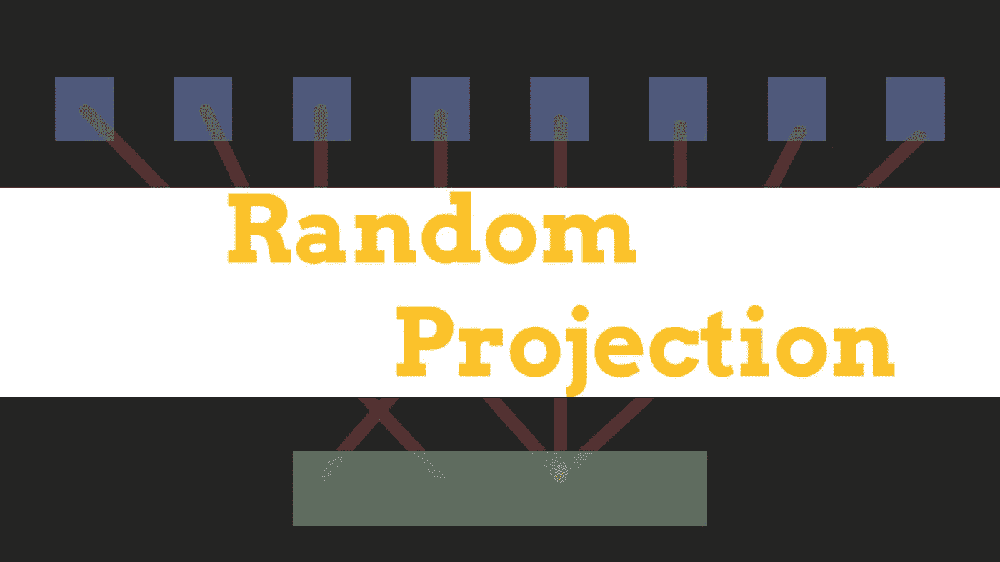

# 随机投影及其在数据科学中的作用

> 原文：<https://towardsdatascience.com/random-projection-and-its-role-in-data-science-f253dd66485b?source=collection_archive---------25----------------------->

## 随机投影概述及其在现代数据科学实践中通常扮演的角色



(图片由作者提供)

# 介绍

在数据科学中，通常很难处理非常高维的特征。这是因为计算机或人类无法分析高维数据，因为它太复杂了，无法从中得出结论。也就是说，在数据科学的奇妙世界中，有一系列技术可以用来降低数据的维度。

降低高维数据维数的最流行方法无疑是奇异值分解。奇异值分解很流行，因为它既高效又能为大多数数据科学应用产生相对合适的结果。然而，还有许多鲜为人知的分解方法。这种技术的一个例子是称为随机投影的技术。

随机投影是另一种用于降低高维数据维数的分解方法。这些技术因其强大、简单和惊人的低出错率而备受推崇。这是与许多其他分解方法相比较的，例如我们前面讨论的奇异值分解。这项技术的起源及其大多数实现的基础是一个叫做约翰逊-林登施特劳斯引理的东西。

# 约翰逊-林登施特劳斯引理

约翰逊-林登施特劳斯引理是数学家威廉·约翰逊和乔拉姆·林登施特劳斯首创的结果。该引理基本上迭代了高维数据可以被嵌入到低维数据中而几乎没有失真。这是通过在嵌入高维值的同时保留点之间的欧几里德距离来实现的。

这实际上是一个非常酷的数学公式，让它更有趣的是这个系统对于从数据中非常精确地减少维度是多么有效。此外，该引理相当简单，允许它非常容易地嵌入到一系列不同的应用程序中，同时由于利用 Johnson-Lindenstrauss 引理执行的操作的性质，仍然保持非常高的性能。

不用说，这种对高维数据进行分解的技术非常有用。随机投影有一定的优势和使用案例，它将显著优于奇异值分解等其他技术，我认为只要科学家想处理这些类型的高维特征，熟悉这项技术可能是非常重要的。如果您碰巧使用 Python 编程语言处理数据，您可能会很高兴地了解到，SkLearn 模块有一个非常古老的实现，您可以利用它。以下是如何导入它:

```
**from** **sklearn.random_projection** **import** johnson_lindenstrauss_min_dim
```

# 随机投影技术

虽然构成随机投影基础的引理非常棒，但更棒的是我们实际上可以对数据执行的技术。几乎可以肯定，这样的例子不止两个，但现在我们只关注以下两种技术:

*   高斯的
*   稀少的

## 高斯的

高斯随机投影通过将原始输入的维度空间投影到随机生成的矩阵上来降低高维数据的维度。这种方法非常有用，因为它是实现 Johnson-Lindenstrauss 引理的一种相对基本的方法，仍然非常有效。如果您使用 Python 语言，这在 SkLearn 中也是可用的，所以让我们来看看如何使用它:

```
**from** **sklearn** **import** random_projection
transformer = random_projection.GaussianRandomProjection()
X_ld = transformer.fit_transform(X)
```

## 稀少的

通过使用稀疏随机矩阵投影原始输入空间来降低维数。这可以用来代替高斯方法，以便节省一些内存并提高性能。这是因为稀疏矩阵中的值通常更分散，根据 Johnson-Lindenstrauss 引理，将这些数据随机投影到具有合理欧几里德距离的矩阵上总是会给我们低维数据。由于 SkLearn 模块的实现，这种技术也可以在 Python 编程语言中使用:

```
**from** **sklearn** **import** random_projection
transformer = random_projection.SparseRandomProjection()
X_ld = transformer.fit_transform(X)
```

# 结论

总之，我认为随机投影是一个非常重要但有时被完全忽略的概念，它对数学分析和机器学习都非常有价值。这当然是一个有趣的替代技术，将产生惊人的结果，同时仍然保持非常快。数学背后的思想是相对基础的，只包括将随机维度投影到矩阵中，同时保持一致的欧几里德距离，这可能是机器学习模型理解数据最重要的事情之一。