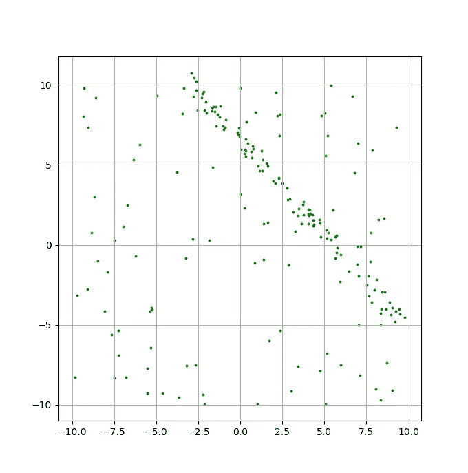
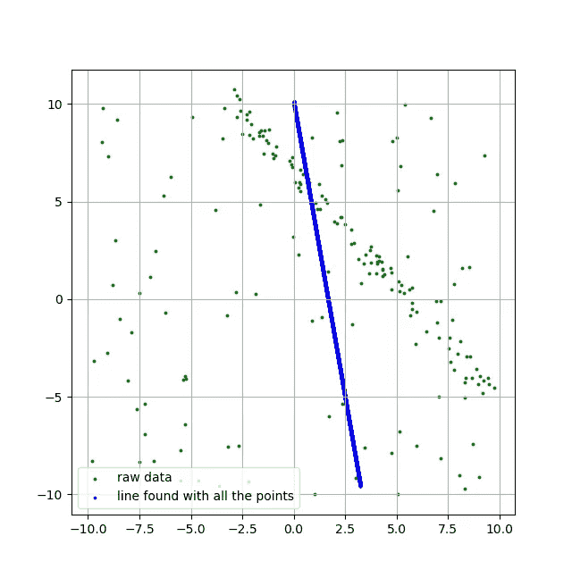
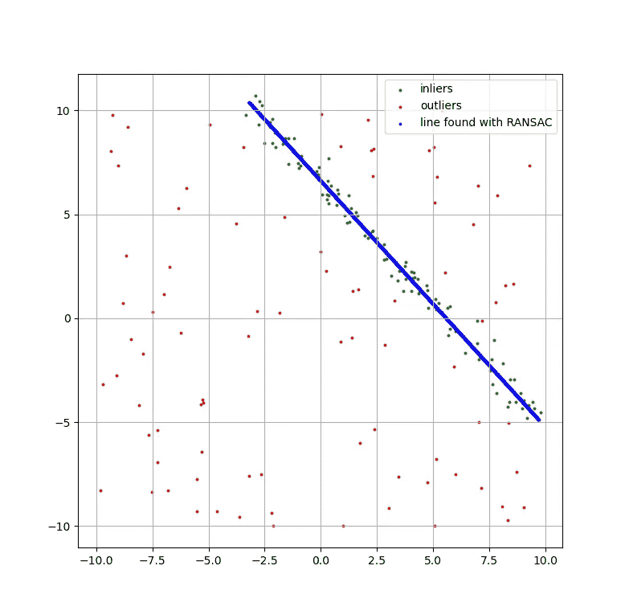
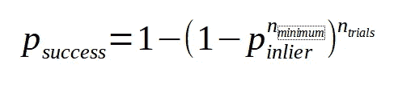
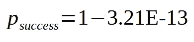
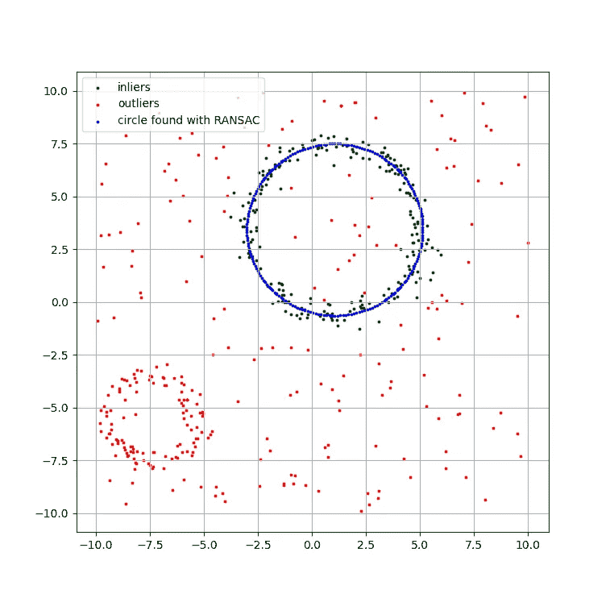

# 随机样本共识帮助你过滤那些讨厌的离群值

> 原文：<https://towardsdatascience.com/random-sample-consensus-helps-you-filter-those-pesky-outliers-9dbfbb8b668f?source=collection_archive---------21----------------------->

## [实践教程](https://towardsdatascience.com/tagged/hands-on-tutorials)

## 让观察决定哪些是一致的。

我们都应该感谢古希腊人给了我们民主。尽管存在缺陷，但在有人提出更好的想法之前，它仍然是最大化公共利益或最小化公共不满的最佳制度，这取决于你选择如何看待它。

来自 [Unsplash](https://unsplash.com/photos/TXWbwRlIdnY) 的[阿米尔·汉纳](https://unsplash.com/@amirhanna)的帕台农神庙图片

这种政治体系的核心思想是，越多的人将他们的重量放在天平上，大多数人错的可能性就越低。这是一种只适用于大多数时间的启发式方法。我相信你能想出几个大部分选民误入歧途的例子。尽管如此，大多数情况下，询问人们想要什么——比如通过全民公决——会产生不错的结果。

## 公投对于政策选择的意义，就像 RANSAC [(随机抽样共识)](https://en.wikipedia.org/wiki/Random_sample_consensus)对于模型拟合的意义一样。

用噪声数据自动拟合模型(直线、圆、平面、抛物线……)是计算机视觉中的常见问题。假设您有一个描述数据分布的参数化模型，并且希望使用一些数据来优化模型参数值，RANSAC 将提供一种自动方式来过滤掉数据中的异常值。RANSAC 算法的伟大见解是将这个问题作为一个公投，其中多个模型参数集为最大数量的观察值的一致而竞争。个人观察就是投票者。他们给候选参数集分配一个投票分数，作为候选模型参数与它们匹配程度的函数。主要思想是这样的事实，即*内联者将同意相同的参数集*，而*外联者将被隔离*在他们同意被破坏的参数集的情况下。内联者的一致性将允许一组参数来建立大量的投票，并作为获胜者出现。

**在本文中，我们将通过代码** **来检查 RANSAC 算法和** [**看看它的运行情况。**](https://github.com/sebastiengilbert73/ransac_tutorial)

[让我们考虑一个简单的例子](https://github.com/sebastiengilbert73/ransac_tutorial/blob/main/noisy_line.py)。你收集了二维数据，并在平面上绘制了点云。这是你得到的:

2D 点云的分布

在一瞬间，你的内部模式匹配机制发现了一条对角线上的点的集中。你的数据有一个有趣的趋势！这不正是你所希望的吗？让我们用线性回归来描述我们模型的(ρ，θ)参数，使用我们所有的观测值。

存在异常值的线性回归给出了令人困惑的结果

进展不太顺利。您可能知道，最小二乘法(比如这里使用的方法)对异常值很敏感，在这个云中有很多异常值(就我们只对高密度的对角线区域感兴趣而言)。当然，您可以手动循环观察，决定它们是否是感兴趣区域的一部分，并仅对内联者运行线性回归。这将是乏味的，但在这种情况下是可行的。然而，在有些情况下，模型拟合是自动设计的算法中的*步骤*。过滤离群值必须自动化，这就是 RANSAC 的工作。

RANSAC [由 Fischler 和 Bolles 于 1981 年](http://www.cs.ait.ac.th/~mdailey/cvreadings/Fischler-RANSAC.pdf)首次推出。他们的激励应用类似于我们刚刚描述的问题。该算法的基本思想是从多个随机选择的观察元组(在我们的情况下是观察对)中生成候选模型(在我们的情况下是候选线)。元组包含唯一确定模型参数所需的最小数量的观察值。然后，对于每个候选参数集，每个观察值必须通过将一些距离测量值与阈值进行比较来检查它们是否与候选模型一致。如果给定的观察结果与候选模型一致，它将为候选参数集贡献一个投票分数。如果距离低于阈值，投票分数可以是 1，否则是 0(二进制投票)，或者随着距离从 0 到阈值，投票分数可以是连续单调递减的值。一个观察可以为一个以上的候选参数集贡献一个正的投票分数。在候选人创建试验结束时，累积最高投票分数总和的候选人模型是获胜者。另外，RANSAC 还可以输出内部和外部观察值的划分。有了这些信息，就可以使用所有的内嵌器计算出最终的模型。

让我们将 RANSAC 算法应用于我们的点云，拟合一个线模型。除了我们可以在这个点云中拟合线模型的假设之外，我们还需要两个参数:试验次数(即将要生成的候选参数集的数量)和可接受的误差(即候选线和给定观察值之间的阈值距离)。

建模者通过共识创建线条模型。作者代码。

如果我们绘制共识模型以及内点和外点之间的划分，我们会得到一个好得多的结果:

RANSAC 发现的线性回归

> 多少个候选参数集足够了？

由于 RANSAC 是基于随机抽样的观察，我们不能保证我们会找到满足最大数量的观察的参数集。如果我们假设每当我们采样至少一次 nₘᵢₙᵢₘᵤₘ内联时，找到足够好的候选模型，并且选择内联的概率是 pᵢₙₗᵢₑᵣ，则成功的概率将是:

…其中 nₘᵢₙᵢₘᵤₘ是一个常数，由我们拟合的模型类别决定。它是定义模型参数所需的最小数量的观察值。

对于我们的例子，pᵢₙₗᵢₑᵣ = 0.5，nₘᵢₙᵢₘᵤₘ = 2(我们需要两个点来定义一条线)，nₜᵣᵢₐₗₛ = 100，我们得到

我们是安全的。我们也可以使用上面的等式来分离 nₜᵣᵢₐₗₛ，作为期望的成功概率和估计的内联体比例的函数。

> RANSAC 仅限于线性模型吗？

一点也不！例如，你可以有一个[点云，它应该被建模为一个圆](https://github.com/sebastiengilbert73/ransac_tutorial/blob/main/noisy_circle.py)。甚至可能在点云中隐藏不止一个圆，RANSAC 将返回满足最大数量观察的圆模型。

RANSAC 在噪声点云中找到的圆

如果您也对识别较小圆的参数感兴趣，您可以移除第一个找到的模型所满足的观察值(换句话说，您只保留异常值)并再次运行 RANSAC 算法。

RANSAC 算法已经有 40 年历史了。与古希腊的民主相比，这算不了什么，但它已经被证明非常有用，尤其是在计算机视觉领域。例如，边缘检测器可以产生一个对象的边缘像素的掩模，假设是一个线性段。由于不能期望掩模没有假阳性，RANSAC 将通过仅保留对齐的像素来帮助我们拟合对象边缘。

请随意使用代码进行[实验。我很高兴听到你心目中 RANSAC 可以投入使用的应用，无论是在计算机视觉领域之内还是之外。](https://github.com/sebastiengilbert73/ransac_tutorial)

忽略了这样一个事实，即我们在选择一个观察值后不会替换它