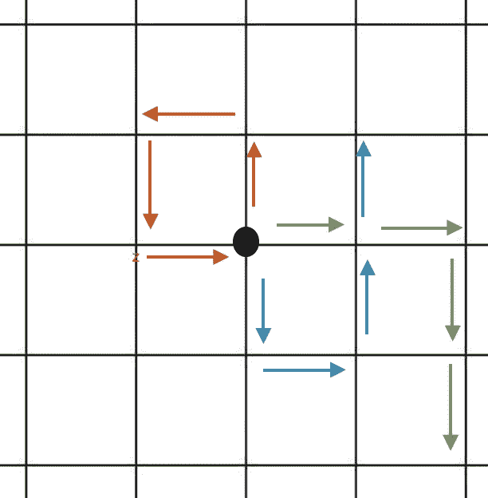

# 带重启的随机漫步解释

> 原文：<https://towardsdatascience.com/random-walks-with-restart-explained-77c3fe216bca?source=collection_archive---------12----------------------->

## 理解带重启的随机游走算法及其 Python 实现


来自[的图像未绘制](https://unsplash.com/photos/AsKq0a1kVh8)

本文的范围是解释并着重于带重启的随机游走算法背后的概念理解。这里不会提供很强的数学理解，但是我留下了一些资源链接，感兴趣的人可以在那里进一步研究这个算法背后的数学。在文章的最后，我还将提供一个与该算法的实现相关的 Python 脚本文档。

## 目录

*   介绍
*   什么是随机漫步？
*   重启随机漫步
*   优势
*   不足之处
*   Python 实现
*   资源

# 介绍

这种算法在研究和工业中有很高的应用价值。如果您正在处理时间序列数据，或者能够将数据结构化为网络，那么可以对其实施随机行走/带重置的随机行走。在金融领域，人们通常认为股票价格的变化遵循随机游走规律。这种算法与其他随机过程如[马尔可夫链](https://vatsal12-p.medium.com/markov-chain-explained-210581d7a4a9)和[蒙特卡洛模拟](https://vatsal12-p.medium.com/monte-carlo-method-explained-8635edf2cf58)配合得很好。这种简单易懂的算法最初是由数学家卡尔·皮尔逊正式提出的，他毕生致力于围绕数理统计建立一个坚实的基础。

在下面的例子中，我们将对以下任何一个事物进行随机漫步。
1)具有顶点 V 和边 E 的连通图 G 将多个节点相互连接
或
2)n×n 矩阵
**注:**矩阵可以转换成图，反之亦然

应用该算法的常见问题有:

*   推荐系统
*   社区检测
*   使聚集
*   图象分割法

# 什么是随机漫步？

随机漫步是一种随机过程。对随机漫步最简单的解释就是漫步。想象你走的每一步都是由概率决定的。这意味着在每一个时间指数上，你已经基于一个概率结果朝着一个确定的方向前进。该算法探索了您将要采取的每一步的关系以及它与初始起点的距离。



图 1 : 2D 随机漫步图(图片由作者提供)

如果你从原点(上图中的大黑圈)开始，在每个时间步向任意方向移动的概率相等。上图描绘了 4 个时间步后的 3 种可能的行走，每一步都有一个不同的起点。如果这个过程用足够大的时间步长模拟了很多次，那么您可以创建一个与在特定位置结束的每个随机行走的结果相关联的概率分布。

在这个二维的例子中，经过多次随机行走的迭代后，分布将看起来像一个 3D 钟形曲线(如图 2 所示)。这可以在 N 维中复制。


图 2:2D 平面上随机游走的概率分布(图片由作者提供)

给定这个概率分布，它可以表示为一对位置之间的接近程度。

# 重启随机漫步

重启随机漫步与随机漫步完全一样，只是多了一个组件。这个分量可以表示为重启概率。本质上表明，对于在任何方向上迈出的每一步，都有可能回到最初的起始位置，即原点。在我们上面的任意方向随机移动的例子中，现在想象有一个机会，你会在每一步后基于这个重新开始的概率瞬间传送回原点。

[这篇](https://medium.com/@chaitanya_bhatia/random-walk-with-restart-and-its-applications-f53d7c98cb9)文章很好地解释了重启随机漫步算法背后的数学原理。

# 优势

*   在加权和未加权图中提供两个节点之间相似性的强表示
*   具有多种应用，并且可以与其他随机模型(如马尔可夫链)结合使用

# **劣势**

*   对每个节点使用相同的重启概率
*   没有系统的方法来选择每个应用程序的重启概率

# 履行

在这里，我在一个给定的网络 g 上实现了带重启的随机漫步算法。注意，这个算法有很多变体，可以根据你要解决的问题进行实质性的改进。该脚本的结果输出可用于其他 ML 算法和模型，如 kNN 和 k means。

这个算法的一个非常简单的 1 行实现可以通过一个名为 n [etworkX](https://networkx.org/) 的库来实现。他们有一个名为 PageRank 的内置函数，本质上是一个带重启的随机漫步。下面我在 networkX 文档中为 [PageRank](https://networkx.org/documentation/networkx-1.10/reference/generated/networkx.algorithms.link_analysis.pagerank_alg.pagerank.html) 添加了一个简单的例子。

```
import networkx as nxG **=** nx**.**DiGraph(nx**.**path_graph(4))  # create the network
pr **=** nx**.**pagerank(G, alpha**=**0.9)    # apply PageRank 
```

# 资源

*   [http://www.cs.cmu.edu/~christos/PUBLICATIONS/icdm06-rwr.pdf](http://www.cs.cmu.edu/~christos/PUBLICATIONS/icdm06-rwr.pdf)
*   【https://journals.plos.org/plosone/article? id = 10.1371/journal . pone . 0213857 #:~:text =然而% 2C % 20RWR %遭受% 20 来自% 20 两个，每个% 20 应用% 20 没有% 20 理论% 20 理由。
*   [https://medium . com/@ chai Tanya _ bhat ia/random-walk-with-restart-and-its-applications-f 53d 7c 98 CB 9](https://medium.com/@chaitanya_bhatia/random-walk-with-restart-and-its-applications-f53d7c98cb9)
*   [https://www.youtube.com/watch?v=6wUD_gp5WeE&t = 85s](https://www.youtube.com/watch?v=6wUD_gp5WeE&t=85s)
*   [https://en.wikipedia.org/wiki/Random_walk](https://en.wikipedia.org/wiki/Random_walk)
*   [https://networkx . org/documentation/networkx-1.10/reference/generated/networkx . algorithms . link _ analysis . page rank _ alg . page rank . html](https://networkx.org/documentation/networkx-1.10/reference/generated/networkx.algorithms.link_analysis.pagerank_alg.pagerank.html)
*   [https://github.com/jinhongjung/pyrwr](https://github.com/jinhongjung/pyrwr)

如果您喜欢这篇文章，那么您可能也会喜欢我的其他文章，在这些文章中，我解释了蒙特卡罗方法和马尔可夫链之类的东西。

</node2vec-explained-db86a319e9ab>  </link-prediction-recommendation-engines-with-node2vec-c97c429351a8>  </mining-modelling-character-networks-part-ii-a3d77de89638>  </bayesian-a-b-testing-explained-344a6df88c1a> [## 贝叶斯 A/B 测试解释

towardsdatascience.com](/bayesian-a-b-testing-explained-344a6df88c1a) </markov-chain-explained-210581d7a4a9>  </monte-carlo-method-explained-8635edf2cf58> 