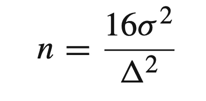

# 随机化、分块和重新随机化

> 原文：<https://towardsdatascience.com/randomization-blocking-and-re-randomization-f0e3ab4d79ca?source=collection_archive---------13----------------------->

## 实验和因果推理

## 在线实验的三个基本支柱

照片由[盒装水更好](https://unsplash.com/@boxedwater?utm_source=unsplash&utm_medium=referral&utm_content=creditCopyText)上 [Unsplash](https://unsplash.com/s/photos/nature?utm_source=unsplash&utm_medium=referral&utm_content=creditCopyText)

# 介绍

A/B 测试在业内越来越受欢迎。几乎所有的顶级科技公司都会分配大量资源，开发支持数百甚至数千个并行 A/B 测试的内部实验平台(ExP)。

> 每当有疑问时，A/B 就测试它。

在很大程度上，主动测试策略非常有效，因为它帮助公司减轻任何潜在的风险，并随着时间的推移产生稳定的收入。A/B 测试的美妙之处在于它能够以可扩展的方式客观地评估想法。

任何测试策略的成功都来自多个组成部分，因为存在避免的[常见陷阱，遵循](/online-controlled-experiment-8-common-pitfalls-and-solutions-ea4488e5a82e?sk=736ba64dc8481993cd98e043256c4bf4)的[最佳实践，确保](/a-practical-guide-to-a-b-tests-in-python-66666f5c3b02?sk=069c502acb69d326a3ea559273c7a04f)的[数据质量，以及防止](/an-a-b-test-loses-its-luster-if-a-a-tests-fail-2dd11fa6d241?sk=8d4cebf2d3362704a4121b4518364c36)[用户干扰](/how-user-interference-may-mess-up-your-a-b-tests-f29abfcfccf8?sk=9ff3bbae01ff9951e6eca33e1c75cff4)。

影响大规模实验成功的各种因素不胜枚举。在今天的博文中，让我们来讨论促成在线实验高度有效性的三个基本统计概念:随机化、分块和再随机化。

# 玩具的例子

让我们探索一个典型的 A/B 测试用例:我们想检验一个新产品特性将如何影响由每日活跃用户(DAU)测量的用户参与度。现有的用户体验研究表明，一小部分人(例如，<2%) of heavy users who engage with the product differently from the rest of the population.

> How would you design a study that assesses the new product performance?

The remainder of the post aims to answer this question from the sampling perspective. *第 1 部分解释了为什么简单的随机化过程会导致任务失败；第 2 部分介绍了作为尝试性解决方案的阻塞及其局限性；第 3 部分说明为什么再随机化是首选。*

亚当·库尔在 [Unsplash](https://unsplash.com/s/photos/nature?utm_source=unsplash&utm_medium=referral&utm_content=creditCopyText) 上的照片

# 第一部分:为什么我们不把它随机化呢？

在数据科学社区内外，人们对随机化及其功能有着广泛的误解。我经常看到产品经理、数据工程师，甚至数据科学家天真地假设随机化总是导致协变量平衡，不幸的是这是不正确的。

这里有一个详细的演练，为什么这是一个弱假设。对于在线实验，数据科学家收集代表整个客户群(即总体)的随机样本。因此，我们不必担心研究结果的泛化，也就是外部效度。

收集样本后，我们将数据随机分为两组，并对一组(治疗组)进行处理，而不对另一组(对照组)进行处理。由于其随机性，我们预计治疗组和对照组之间的协变量没有统计学差异，平均**。这是 A/B 测试的秘密力量，因为它能够实现除治疗条件外的协变量平衡，这使得治疗效果可以识别。**

**相反，如果我们没有随机化，一些用户可能会自行选择进入治疗组或对照组，导致选择偏差。如果出现这种情况，我们不能天真地将两组的差异归因于干预，而应该求助于准实验来寻找可行的替代方案。查看这个中间列表([链接](https://leihua-ye.medium.com/list/quasiexperimentation-in-the-industry-241b8b26cd5a))来全面回顾主要的准实验设计。**

**回到最初的问题:**

> **我们能依靠随机化来保证治疗组和对照组之间的协变量平衡吗？**

**可惜，答案是否定的！随机化平衡协变量**在** **平均值**上，但不能保证每个实现都有平衡的协变量。这是一个快速的数学演练。让我们假设在一个协变量中有 5%的机会观察到统计上显著的差异，并且在 10 个协变量中至少有一个协变量不平衡的概率(即，家庭误差率)是 1—(1–0.05)⁰= 0.4 或 40%。换句话说，如果需要调整 10 个协变量，我们将在 40%的时间里观察到至少一个不平衡的协变量。这是一个相当高的数字。**

**假设我们的业务场景中有一小部分重度用户，简单的随机化过程很可能无法将重度用户平均分配到实验组中。**

> **最后一次，随机化旨在平均平衡协变量**，但不保证任何特定样本的平衡。****

****为什么简单随机化是次优选择的另一个密切相关的原因。重度使用者的不平等分布将扩大方差，使中小规模的治疗效果不被注意。 ***之所以如此，是因为方差与样本量的平方根成正比，其他因素保持不变。*** 例如，如果方差增加 10 倍，我们将需要多 100 倍的用户。如果方差增加，而样本大小保持不变或者跟不上变化的速度，那么测试就会力不从心，无法检测出任何差异。****

********

****我自己的截图****

****其中:****

*   *****σ:样本方差。*****
*   *****𝛿:治疗组和对照组的区别*****

****如果我们将α设为 0.05，β设为 0.2(或幂设为 0.8)，则上述公式是最小样本量的近似值。关于以上公式的更多信息，请参考[这篇文章](/a-practical-guide-to-a-b-tests-in-python-66666f5c3b02?sk=069c502acb69d326a3ea559273c7a04f)。****

****下一节将介绍阻塞以及它为什么对我们有利。****

********

****照片由 [v2osk](https://unsplash.com/@v2osk?utm_source=unsplash&utm_medium=referral&utm_content=creditCopyText) 在 [Unsplash](https://unsplash.com/s/photos/nature?utm_source=unsplash&utm_medium=referral&utm_content=creditCopyText) 上拍摄****

# ****第 2 部分:为什么阻塞更好？****

****如上所述，简单的随机化过程可能会导致协变量不平衡。幸运的是，实验设计的统计理论提出了一种称为分块的解决方案，即，将实验单元分成块(例如，设备类型、年龄、性别等)。)是彼此同质的。****

****在我们的例子中，我们的主要兴趣是新产品特性的效果。因此，消除使用频率等其他变量的影响(例如，重度用户与轻度用户)将会非常有用。在实践中，我们可以设置一个切割阈值，并根据使用频率创建三个等级:低、中和高。然后，我们在每一层将用户随机分为治疗组和对照组。****

****与单独随机化相比，分组随机化策略更有可能达到协变量平衡。此外，阻塞减少甚至消除了阻塞变量的估计误差。从方差减少的观点来看，分块可以减少块之间的方差，从而增加测试灵敏度。****

****然而，这里有一个例子:阻塞会遭受维数灾难。也就是说，当有多个具有多个级别的协变量时，阻塞会失败。让我们再次使用前面的例子，假设有 10 个变量，分为 4 个级别。要完全部署阻塞，我们需要至少 4 个⁰，或者至少 100 万个可能的地层，这是一个令人生畏的数字。****

> ****你有足够的数据/用户来填充每个阶层吗？****

****数量随维度呈指数级增长，这限制了阻塞的使用情况。****

****实际上，我们封锁了最重要的变量(例如，2-3)，并依靠随机化来处理剩余的有害变量。实验设计中的名言来了:****

> ****能挡就挡；****
> 
> ****随机化你不能随机化的。****
> 
> ****—乔治·博克斯****

****有了阻塞，我们就可以回答开头问的问题。如果我们事先知道访问者是重度或轻度用户(例如，通过登录信息)，我们可以创建块(层)并将它们放入不同的层。这样可以减少方差，让实验更灵敏有力。****

****但是，对于登录信息不可用或数据以实时流方式到达的其他情况，我们无法阻止；或者在其他情况下，我们只知道事后的协变量，不可能事先创建块。例如，在电话营销活动中，我们不知道随机回答者的性别。总的来说，一个好的经验法则是屏蔽掉最重要的因素，把剩下的因素随机化。****

****在最后一节中，我们讨论了另一个叫做再随机化的概念。****

********

****戴维·马尔库在 [Unsplash](https://unsplash.com/s/photos/nature?utm_source=unsplash&utm_medium=referral&utm_content=creditCopyText) 上的照片****

# ****第 3 部分:重新随机化****

****阻断和随机化都不能总是保证协变量平衡，更不用说当阻断不可用时。如上所述，实验的高内部效度在于其严格控制混杂变量和避免选择偏差的能力。如果随机化不能实现协变量之间的平衡，它的高有效性将受到损害。****

> ****倒霉随机化后怎么办？****
> 
> ****重新随机化。****

****从字面上看，这意味着我们应该为任何不幸的实现重新运行随机化过程。关键是在我们运行实验之前，设置一个阈值来衡量协变量(im)平衡的水平。一种典型的度量选择被称为治疗组和对照组的协变量平均向量之间的**马氏距离**。****

*****关于再随机化和* ***【马哈拉诺比斯距离】*** *杨等，2021，**[*调查实验中拒绝抽样、再随机化和回归调整*](https://arxiv.org/pdf/2109.09930.pdf) *的更多信息，请查阅本文******

******Medium 最近进化出了自己的* [*作家伙伴计划*](https://blog.medium.com/evolving-the-partner-program-2613708f9f3c) *，支持像我这样的普通作家。如果你还不是订户，通过下面的链接注册，我会收到一部分会员费。******

*****<https://leihua-ye.medium.com/membership> ***** 

# *****结论*****

*****数据科学家对在线实验非常有信心，希望测试每一个产品决策，而不质疑其有效性。总的来说，这是一个很有前途的努力，有很高的投资回报率。然而，我们应该记住随机化并不能自动保证协变量的平衡。例如，实验团队@ [Bing](https://www.researchgate.net/profile/Aleksander-Fabijan/publication/324889185_The_Anatomy_of_a_Large-Scale_Online_Experimentation_Platform/links/5ae96411a6fdcc03cd8fa431/The-Anatomy-of-a-Large-Scale-Online-Experimentation-Platform.pdf) 报告称，随机化后，四个实验中有一个存在协变量失衡。在这种情况下，我们需要应用辅助工具，如分块和重新随机化，以确保协变量平衡。*****

# *****喜欢读这本书吗？*****

> *****请在 [LinkedIn](https://www.linkedin.com/in/leihuaye/) 和 [Youtube](https://www.youtube.com/channel/UCBBu2nqs6iZPyNSgMjXUGPg) 上找到我。*****
> 
> *****还有，看看我其他关于人工智能和机器学习的帖子。*****