# 随机化加速奇异值分解

> 原文：<https://towardsdatascience.com/randomized-svd-with-power-iterations-for-large-data-matrices-264e470bb2b4?source=collection_archive---------26----------------------->

## [思想和理论](https://towardsdatascience.com/tagged/thoughts-and-theory)

## Twitter 的 WTF 和谷歌的 PageRank 的秘密调料之一

几天前，我在一个论坛上偶然发现了一个问题。有人在寻求帮助，关于如何对一个非常大的矩阵进行奇异值分解(SVD)。总而言之，这个问题大致如下

> “我有一个大小为 271520*225 的矩阵。我想从中提取奇异矩阵和奇异值，但我的编译器说这需要半兆字节的内存……”

半兆字节的内存。这里不开玩笑。然而，这个特殊的问题正变得日益重要，因为我们现在正经历着大量的数据。例如，我们智能手机摄像头中改进的传感器或 YouTube 中的流媒体高清视频。在有限的计算资源或严格的延迟要求下，我们越来越多地面临需要实时处理数百万次测量甚至更多数据点的情况。除此之外，还有两个问题。第一个问题是:通过这些测量获得的固有等级或信息是否也随着测量次数的增加而以同样的速度增加？答案通常是否定的。那么下一个问题是:如果固有秩很小，我们能以一种计算高效的方式进行奇异值分解吗？

SVD 被誉为线性代数的瑞士军刀。我个人认为这是一种错误的宣传方式。它经常使人们不知道它所需要的开销，并导致如上的情况。在数值上，SVD 是通过求解一个计算量很大的底层优化问题来计算的。在这篇博客中，我们将研究在超大数据集上应用 SVD 的瓶颈。然后我们将会看到，来自随机矩阵理论的优雅定理如何为我们提供有效处理这些瓶颈的工具，并引导我们获得高度精确但计算效率高的数据矩阵近似值。

让我们考虑一个高大的矩形数据矩阵

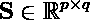

其中*p<q*。这实质上意味着我们有了 *p* 特征的 *q* 数据点。SVD 将这个可能庞大的矩阵分解成三个矩阵，其中两个分别包含左和右奇异向量，另一个包含奇异值，以降序对角排列。

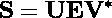

其中， **U** 是 *p* 左奇异向量的矩阵， **V** 是 *q* 右奇异向量的矩阵， **E** 是奇异值按降序排列的对角矩阵。上标代表转置。如果 **S** 是满列秩矩阵，那么它只有 *q* 非零奇异值，其余 *p-q* 奇异值全为零。如果*是*的情况，那么计算所有左奇异向量的确切意义是什么，因为它们无论如何都要乘以零？答案是——*没有意义。*

现在，我们有两条路可走。首先，我们计算整个 SVD。然后把 *p-q* 左奇异向量扔掉。这可能是最没有价值的路线，因为我们正在毫无理由地进行所有这些计算负担。为了追求第二条道路，我们可以更新我们的目标如下

> "我们如何能够只计算 q 个左奇异向量而不计算整个奇异值分解？"

我们求助于随机矩阵理论来寻找这个问题的答案。它告诉我们——如果我们通过随机投影对原始数据矩阵 **S** 的列空间进行随机采样，投影极不可能丢弃数据矩阵所讲述的故事的任何重要部分。随机投影的想法很大程度上是基于著名的[约翰逊-林登斯特劳斯引理](https://en.wikipedia.org/wiki/Johnson%E2%80%93Lindenstrauss_lemma)。如果我们固定一个目标秩 *r ≤ q* ，那么我们可以对我们的数据矩阵进行随机投影:

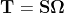

在哪里

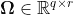

是一个随机投影矩阵。例如，它可以是高斯随机矩阵。随机矩阵的选择本身是一个不同的研究，因此我在这里省略了细节。现在，投影矩阵 **T** 几乎可以肯定地逼近原始数据矩阵 **S** 的列空间(感谢 Johnson-Lindenstrauss 引理)。所以，如果我们想找到一组 **S** 的正交基，对 **T** 而不是 **S** 进行 QR 分解就足够了！

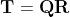

注意，现在我们有了 *r-* 秩近似的**S** *的标准正交基。*现在我们取 **S** 的另一个投影，但是这次是在正交矩阵 **Q** 所跨越的子空间上。

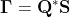

SVD 提供的一个重要优势是，它可以推广到任何维度的数据矩阵，不像特征分解只适用于方阵。这还不是故事的结尾。以下也成立。

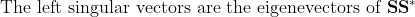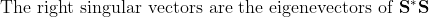

因为 Q 是正交的，所以我们可以写

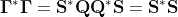

这意味着，如果我们取**γ，**的奇异值，那么相应的奇异值和右奇异向量将分别与 **E** 和 **V** 提供的相同！

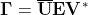

现在，我们都准备好寻找我们的近似 **U，**，而不需要对海量数据矩阵 **S** 进行任何基于 SVD 的重型优化。这可以通过下面简单的矩阵向量乘法来实现。

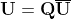

这是一个很好的例子，说明随机化提供了计算上更简单的方法来解决数值上复杂的问题。

**幂迭代的作用**

对于那些熟悉推荐系统如何工作的人来说，Power Iterations 是一个非常著名的框架。像随机化 SVD 一样，幂迭代也源于随机矩阵理论。在用单位范数随机向量初始化时，它迭代地计算方阵的主特征值。它在谷歌的 PageRank 算法中起着至关重要的作用。此外，Twitter 的 WTF(跟随谁)算法也与幂迭代有着显著的联系。

然而，在我们的冒险中，我们对计算主要特征值不感兴趣。还记得上一节中我们的目标等级 *r* 吗？我没有具体说明任何关于选择目标等级的策略，因为这取决于环境。如果我们选择的目标秩 *r* 小于固有秩，并且我们最终放弃了大量的方差，该怎么办？描述这种现象的另一种方式是——如果我们的数据矩阵 **S** 的奇异值衰减非常慢会怎么样？

在这种情况下，我们可以使用幂迭代对数据矩阵进行预处理。幂迭代是一种将方差压缩为前几个奇异值的方法。让我们定义如下

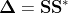

根据特征分解的定义，我们知道

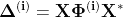

上标 **(i)** 表示相应矩阵的幂已经被提升到 **i** 。现在，如果我们做以下事情

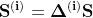

那么很容易证明以下成立

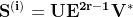

上面处理过的数据矩阵现在有了更快的衰减奇异值谱。然而，它可以在近似传统 SVD 方面给我们带来巨大的改进，代价是一些额外的计算。实际上，通过矩阵乘以自身的幂来进行幂迭代绝对是自杀(也是无意义的)，就像这样-

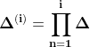

提高矩阵幂的主要方法之一是首先执行特征分解，然后简单地提高其特征值的幂。但是如果你看上面等式的左手边，你会意识到这些就是我们要找的特征向量！避免这种令人困惑的场景的一个聪明的方法是首先采用随机投影，然后交替地用 **S*** 和 **S** 乘以它。

随机化 SVD 最美妙的事情之一是存在逼近误差的闭合形式下界，它是目标秩 *r* 和幂迭代次数 **i.** 的函数。因此，您可以轻松地在逼近性能和计算要求之间进行权衡。关于这个话题的更多内容可以在[这篇惊人的论文](https://arxiv.org/abs/0909.4061)中找到。

**示例**

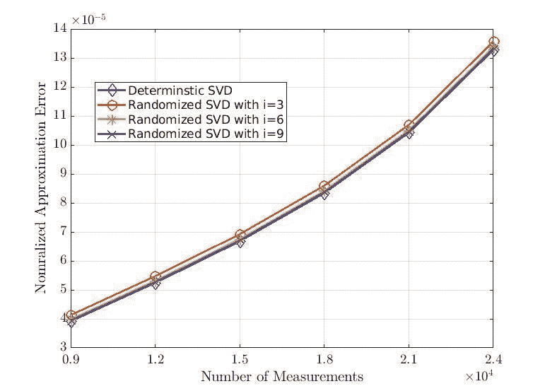

在该图中，我们可以看到，对于给定数量的数据点，随着测量值(或特征)数量的增加，随机化 SVD 可以逼近我们的数据矩阵。这里，我们将数据点的数量固定为 3000，测量的数量从 9000 到 24000 不等。我们还将目标等级设置为测量数量的 10%。而且，在这个例子中， **i** 是幂迭代的次数。显然，随机化 SVD 几乎可以达到传统确定性 SVD 的低秩逼近性能。

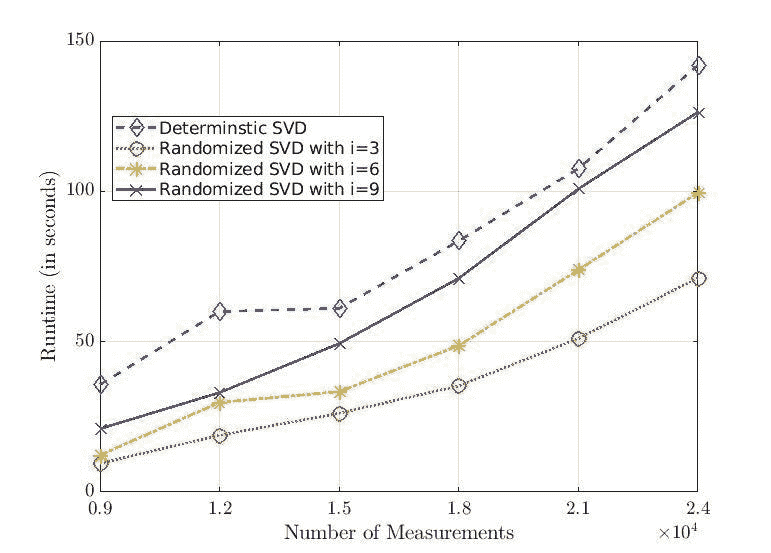

接下来，我们有上面图中显示的算法运行时。仅使用 3 次幂迭代，我们就可以使用确定性 SVD 所需计算资源的一半来获得数据矩阵的真正良好的近似！

我在 github 中创建了一个 gist 来分享这个例子中使用的可复制代码。

SVD 无疑是使用最广泛的分解之一。虽然它不早于主成分分析(PCA)，但它实际上推广了它。在本文中，我们看到了如何将 SVD 和随机化结合起来，以及它如何导致 SVD 的超快速计算，而不是炸毁您的计算机。享受随机和实验目标等级的乐趣吧！