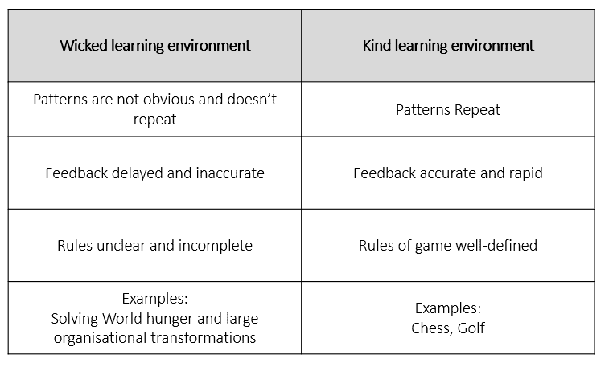
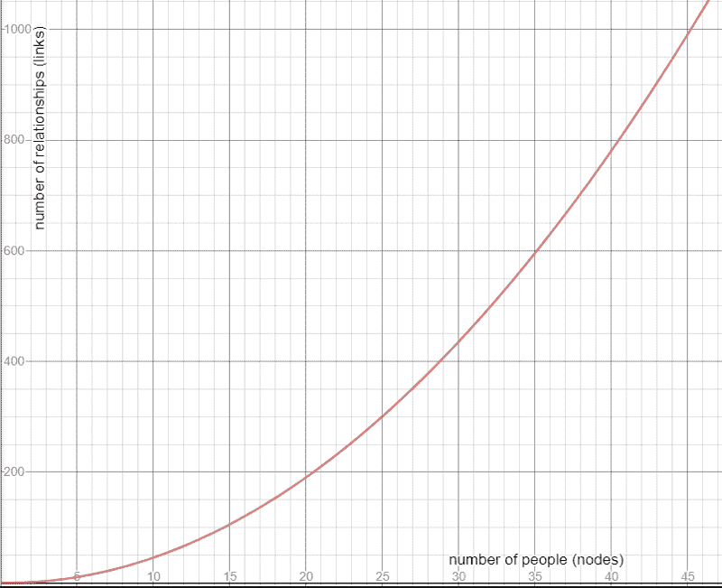

# 深度范围

> 原文：<https://towardsdatascience.com/range-over-depth-the-value-of-a-generalist-in-your-data-team-174d4650869d?source=collection_archive---------34----------------------->

## 通才在您的数据团队中的价值


帕斯卡尔·斯威尔在 [Unsplash](https://unsplash.com?utm_source=medium&utm_medium=referral) 上的照片

不要被一个充满专家的团队抓住，当事情不如预期时感到惊讶。

人们不能毫无保留地简单宣布这一点。让我们看看我是如何得出这个结论的…

在谷歌上搜索这些术语，通才和专家，会导致相互矛盾的观点，所以为了讨论起见，谨慎的做法是给出我的定义。

**数据通才**是数据专业人士，他们的工作范围涵盖任何数据管道的不同方面。从收购到 AI。他们注重广度。典型的技能包括对数据集(跨行业)的特别分析，以回答一些业务问题。他们确实主动报告——“我们有这个问题——发生了什么？”。他们在预测建模和识别趋势方面也有一定程度的能力。他们可以用前端工具一起破解一个可视化工具，但也可以在整个数据生命周期中发现问题。例如，在数据质量、数据仓库技术或性能下降方面，我每天都会遇到一些重复的问题。听起来像独角兽？不尽然——他们可能在这些领域都没有足够的深度，但是他们有足够的广度。我认为这些人可能有很多名字或头衔，但关键是他们学习速度很快，不会特别局限于某个特定的领域。他们可以快速解读数据并讲述故事。他们是有大局观的人。

**专业的数据专家，**相反，他们对这些领域中的一个或几个领域有深入的了解。当问题已经被很好地定义时，他们通常表现得最佳，但是当问题仍然需要在更大的画面中被发现时，他们就会挣扎。

当然，我强调的是技能或角色，而不是头衔。你可以找到我认为的拥有数据工程师、数据分析师、业务分析师、数据建模师或数据科学家头衔的通才。基本上任何数据专业人士。

现在，让我支持我的主张。

#1 —接受我们在**恶劣的学习环境中工作**

在书 [Range](https://www.amazon.co.uk/Range-Generalists-Triumph-Specialized-World/dp/1509843493) 中，大卫·爱泼斯坦详细阐述了坏的与好的学习环境的概念，但是我将不得不给你速成版的，为了在这句话之后不失去你。

下表给出了这两种对立的学习环境的含义。



当我第一次读到这个定义时，我把它和简单的问题和困难的问题混淆了，并做出了反应:“你怎么敢说国际象棋是一个简单的问题！”(我听说你们这些最近的象棋爱好者都是看了《女王的策略》之后才开始下象棋的)。然而，它让我明白了一件困扰我很久的事情。为什么世界上有这么多天才，我们却不能解决最紧迫的问题？

我现在的结论，简单来说，就是因为我们的世界不是一个善良的学习环境。生活比我们能控制的闭环更复杂。我们首先面临的挑战是定义问题，更不用说解决问题了。我们可以共同解决*难以*定义的问题，但在一个黑天鹅往往会随机出现的环境中，解决一个没有很好定义的问题要困难得多。我们真的只能选择更好的而不是更差的——让明天比昨天好一点的渐进变化。

现在想象一下你的工作环境。你们使用的技术，现有的平台，新的平台，你们无畏的领导者想要进入的雄心勃勃的新方向。我是从数据专业人员的角度来写这篇文章的，但是这个概念肯定适用于更广泛的专业社区。

在定义的数据集上创建机器学习算法可能是 ***硬*** ，但 ***类*** 。

从源中获取数据，可能是 ***容易*** 和 ***种***

构建一个数据管道，组合不同的数据集，并在粒度和语义上一致，开始变得*，并潜在地变得不那么*。**

**看到我是如何用几个大词来说服你我的结案陈词了吗？**

**现在再加上时间、人们的个性、自我、职业道路、组织的复杂性，你肯定会看到一个糟糕的学习环境。**

**#2 —由于信息如此容易获得，对高度专业化的需求减少了。**

**注意，需求减少了，而不是消除了。有了现成的信息，通才就可以为了分析而拼凑一些东西。有了像 stackoverflow 这样的网站，如果你精通谷歌搜索的艺术，任何人以前尝试过的东西通常不到 10 分钟就能找到。**

**#3 —协调努力是真正的杀手**

**协调工作是指协调任何工作产品交付的工作。有些人可能知道它的街名——“赶猫”。**

**杰夫·贝索斯为他的理想规模团队创造了著名的“两个披萨团队”规则。随着团队规模的扩大，需要维护的关系开始变得重要。理查德·哈克曼有很好的关于团队和团队绩效的文献，详细介绍了团队动力以及为什么应该避免大型团队。⁴**

**努力与完成任何事情需要维持的关系数量有关。作为人数(n)的函数，关系的数量增加 n(n-1)/2。**

**简单的数学方法是，你有越多的节点(即你需要咨询的人)来做决定，你的协调努力就会增加，如下图所示:**

****

**按作者分类的图表**

*   **4 人左右的小团队只需要维护 6 种关系**
*   **一个更大的组织程序，比如说 40 个人，将有 780 个链接需要管理**

**当然，并不是每个人都需要和其他人互动，但是增加的程度是一样的。我还认为 **n** 可能不仅代表人数，还代表抽象节点，如论坛，即有权做出决策的人群。当一些人需要在团队中与一对一的情况下做决定时，他们也会有不同的反应。所以曲线图的曲线部分可能比图示的更陡。因此，如果您在各种大型决策论坛上有大型团队，您的协调工作将随之而来。**

**团队内专家和跨团队通才的绝对必要数量将显著降低这种复杂性。**

**#4 —企业不想要花哨的算法，他们希望自己的问题得到解决**

**我们可能处于人工智能能力增强的时代，但重要的是要注意，问题陈述并没有改变太多。我如何增加收入？我如何向现有客户追加销售，我如何…尝试和解决这些问题的方法已经变得更加复杂，但是核心问题陈述仍然存在。**

**基于坏数据的算法不会解决任何问题。我已经看到对数据科学家和人工智能专家的需求大幅增加，但我担心，如果业务问题得不到解决，这种热情将会落空。很快，高管们将开始透过表象看到真相。**

**那么我为什么提倡数据通才呢？**

*   **在**恶劣的学习环境**中，他们会定义问题的范围(也就是找出真正的问题是什么)并在友好的环境中将其交给专家，这样他们就可以更快更有效地解决问题。太多的工作时间花在解决错误的问题上。**多面手能更快地找到正确的问题，如果有困难，专家会解决。多面手倾向于从相似的情况和方法中获得更多的类比，以帮助更快地解决问题，这在恶劣的学习环境中是关键。****
*   **随着大量信息的出现，外行人更容易找到一个新问题的足够背景。通才无需花费太多时间深入研究就能迅速拓宽视野，这是**的促成因素。****
*   **通才通过从本质上消除不必要的关系来减少**协调工作**，因为它们跨越了所有的关系。他们需要被授权做决定，从而减少对附加关系的管理。**

**你在一艘船上，当你的引擎发生故障时，你几乎回到岸上，你想，我希望我有一个船机械师在附近，但实际上你不需要机械师，你只需要有人告诉你，湖是 3 英尺深，所以你可以爬出来，推最后一段。**

**如果我们继续不解决或过度解决业务问题，我们将被更高效的问题解决者所取代。简单的解决方案，而不是背离最终目标的庞然大物。在瞬息万变的环境中，我们需要更快地确定问题，更快地决定前进的方向。我们需要大局通才。**

```
**1\. Epstein D. *RANGE Why Generalists Triumph In A Specialized World*. 1st ed. MACMILLAN; 2020.
2\. Two-Pizza Teams: The Science Behind Jeff Bezos' Rule | Inside Nuclino. Blog.nuclino.com. https://blog.nuclino.com/two-pizza-teams-the-science-behind-jeff-bezos-rule. Published 2019.
3\. J. Richard Hackman. *Leading Teams: Setting The Stage For Great Performances*. Harvard Business Review; 2002.
4\. Coutu D. Why Teams Don’t Work. Harvard Business Review. https://hbr.org/2009/05/why-teams-dont-work. Published 2009\.** 
```