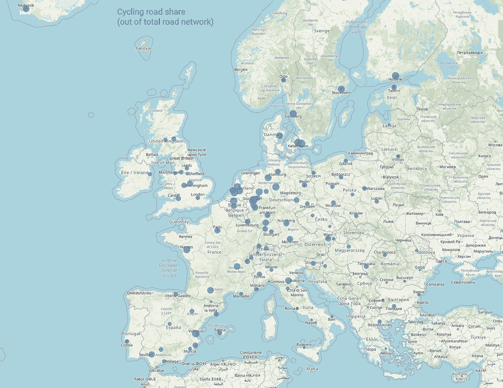
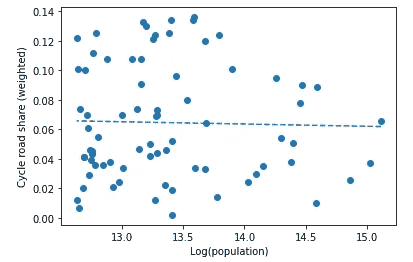
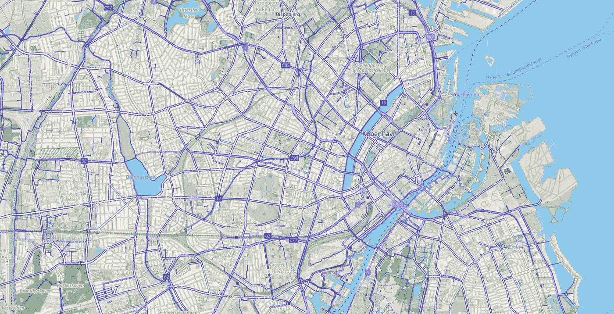
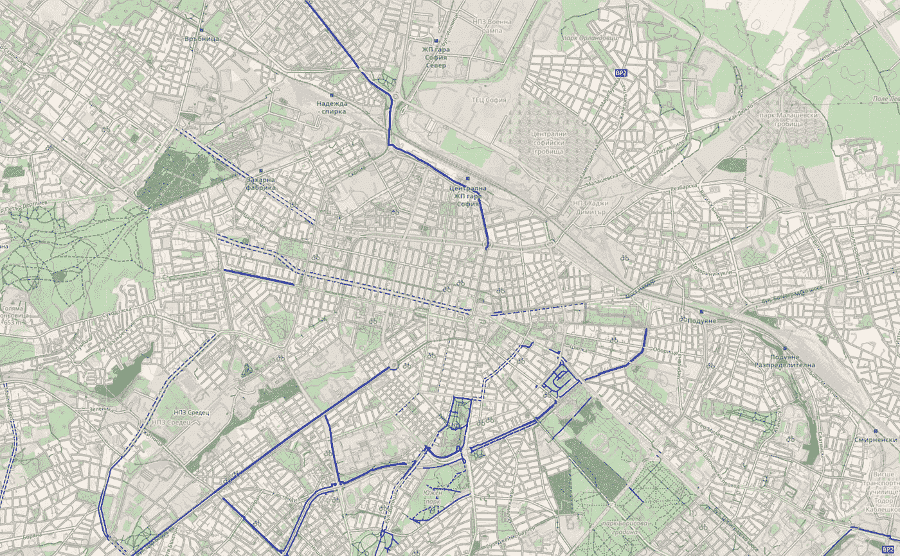
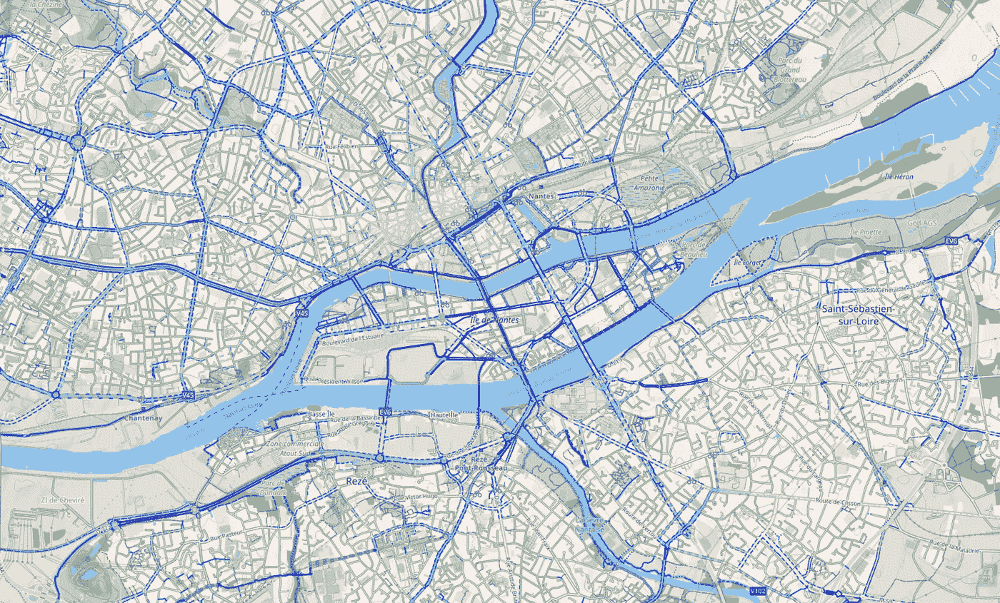
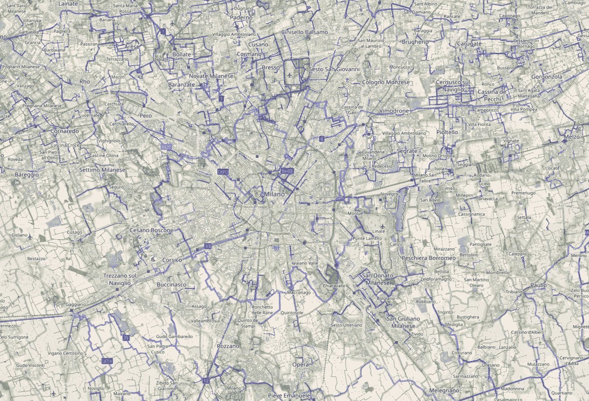
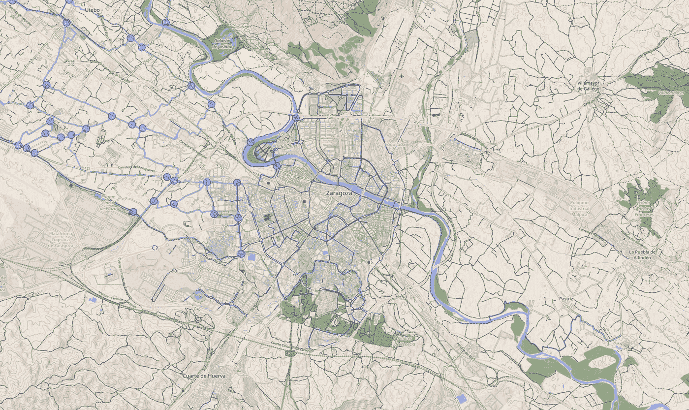

# 用 OpenStreetMap 对欧洲的可循环性进行排名

> 原文：<https://towardsdatascience.com/ranking-cyclability-in-europe-with-openstreetmap-198d3b17463c?source=collection_archive---------19----------------------->

*斯德哥尔摩的尖峰时刻，* [*杰玛·埃文斯，昂斯佩什*](https://unsplash.com/@stayandroam)

我使用 OpenStreetMap 的众包数据对欧洲城市的自行车基础设施进行了衡量和排名。这些城市要么人口超过 40 万，要么是欧盟的首都。

[源代码](https://github.com/skandium/cyclorank)

# 动机

今年，我一直在坚持一项个人挑战，将自行车作为我在市内的主要交通方式。这与整个欧洲自行车运动的大规模复苏相吻合，因为像巴黎或柏林这样的城市在禁行后已经进行了大量投资来提高自行车的模式份额。甚至在我的家乡塔林市，据说只有 1%的出行是骑自行车的，但这却成了今年地方选举的主要话题。正如在任何政治化的辩论中，都有从事实回归到合适的叙述的趋势，我开始想知道是否有一种基于数据的客观观点，可以帮助评估和排列不同城市在使其环境更适合自行车方面的努力。毕竟，在这方面，每个城市都可能向哥本哈根或阿姆斯特丹看齐，但其他城市做得如何呢？世界上最大的开源地理数据库 OpenStreetMap 可能会提供一些答案。

# 类似项目

我可以找到一些类似的排名。例如，[哥本哈根指数](https://copenhagenizeindex.eu/)对街景、文化和抱负等多个领域进行主观评分。城市列表包括全球 600 个城市，拥有 60 万居民。另一个是数字保险公司 Coya 的[自行车城市指数](https://www.coya.com/bike/index-2019)。城市列表的选择是任意的，但测量是根据互联网上的一些客观指标进行的，如道路基础设施、自行车使用率、死亡人数等。

开发另一个的原因是:

*   哥本哈根指数和自行车城市指数上次更新是在 2019 年
*   我们希望公平对待城市选择(基于人口规模)和指标测量，避免主观的专家打分或从不同来源手动查找数据
*   使用基于 OpenStreetMap 的标准化方法将允许在不同的时间重复实验，并将其扩展到任意数量的城市，几乎不需要额外的人工努力

# 方法学

为了衡量城市的可循环性，我计算了在 [OpenStreetMap](https://wiki.openstreetmap.org/wiki/Bicycle) (OSM)上明确标记为自行车友好的道路基础设施(自行车道或自行车道)的比例。考虑整个通航长度，因此单行道的长度是双行道的一半。OSM 被认为是一个相当可靠的数据来源，无论是 T2 总体数据还是 T4 自行车数据。

测量自行车道长度背后的动机有两个:首先，已经证明[与自行车运动的普及程度](https://www.sciencedirect.com/science/article/pii/S2214140519301033)相关；其次，专用自行车道的存在与安全性的提高相关，这将进一步增强自行车运动的普及程度。虽然仅仅建造许多自行车道还不足以促进向广泛自行车运动的过渡，但这可能是一个必要条件。

要成为自行车道，开放街道地图[道路](https://wiki.openstreetmap.org/wiki/Way)必须:

*   有自行车专用车道或公共汽车共用车道(算作车道)
*   有明确允许骑自行车的人行道(算作车道)
*   为骑自行车的人开辟一条单独的道路，一条自行车道(主要是比利时/荷兰)或一条自行车道(主要是德国)
*   是由[标志](https://wiki.openstreetmap.org/wiki/Tag:bicycle%3Ddesignated#:~:text=bicycle%20%3D%20designated%20is%20applied%20where,as%20cycleway%3Aboth%20%3D%20lane%20.)指定给骑车人的道路或人行道

值得注意的是，这种自行车道的定义比 OSRM T2 或谷歌地图等路由器要严格得多。这是因为，为了实现高连通性，并实际计算任意点 A 和 B 之间的合理路线，路由器通常会穿过普通的、潜在不安全的街道。事实上，本研究中考虑的道路网络部分仅占 OSRM 所有可循环道路的大约 10%。

# 警告

由于自行车道和自行车道(包括隔离车道)之间的分离是我们从 OpenStreetMap 数据中做出的唯一区分，因此不可能量化这些道路的所有细微差别。例如，自行车道可以设计得很好:附近有更窄的车道，使用限速或其他减速方法，禁止在车道上停车等。但也可能只是人行道上的一些红色油漆碰到了电线杆和公交车站。即使这些细粒度的细节中的一些可以从 OSM 捕获，也很难说它们会在整个欧洲以类似的质量被记录下来。此外，OSM 数据模型中未包含的文化因素可能会影响道路网络和骑行便利性。

# 空间加权

上述方法的一个可能的警告是城市的拓扑结构。从理论上讲，在空间充裕的城市郊区可能会有许多休闲自行车道，但在市中心却没有。这不利于将自行车作为一种可行的交通方式。为此，我将指数衰减权重应用于道路长度，其中权重是道路与市中心距离的函数。更准确地说，加权公式是:

`exp(decay_coef * min(max(distance_from_centre - t_min), t_max))`

其中，t_min =距中心道路距离的第 10 个百分点，t_max = max(距中心距离的第 90 个百分点，15km)。我校准了衰减系数，因此上述公式在 t_max 时等于 0.1，在 t_min 时等于 1.0。这保证了两件事:

*   市中心的道路的权重是距离市中心第 90 百分位的道路的 10 倍。
*   如果城市多边形非常大，在 15 公里处审查 t_max 可以确保我们不会在远处的道路上增加重量。

下面以塔林为例，展示了一些带权重的自行车道示例，其中半径为 8km(第 90 个百分位数)的质心周围的圆表示一条道路的权重比市中心的一条道路小 10 倍的距离。

作者提供的塔林道路权重示例

# 其他指标

虽然主要排名是基于上述内容，但我也计算了一些辅助指标:

*   隔离自行车道的份额(所有自行车道的子集)。这应该是自行车道的黄金标准。
*   自行车道的份额(相对于赛道)。
*   每平方公里停车点的数量。

虽然这些出现在[完整结果](https://mlumiste.com/cyclorank)中，但由于两个原因，它们被排除在排名计算之外:

*   在如何构建 bike infra 并将其记录到 OpenStreetMap 之间存在一些区域性的特质。虽然整体可导航自行车道份额似乎是一个相当普遍的指标，但其他指标产生的城市排名并不直观。
*   我没有资格衡量不同类型的道路——自行车道和隔离车道的价值是什么？

# 使用的软件

*   [OpenStreetMap](https://www.openstreetmap.org) 从 [Geofabrik](https://www.geofabrik.de/) 下载国家地图
*   [锇工具](https://osmcode.org/osmium-tool/)从国家文件中提取城市地图并解析地图元素
*   [polygons . openstreetmap . fr](http://polygons.openstreetmap.fr/)获取城市的 GeoJSON 边界
*   [提名](https://nominatim.openstreetmap.org/ui/search.html)查找城市边界 id
*   [烙画](https://pyrosm.readthedocs.io/en/latest/)和[小册子](https://github.com/jwass/mplleaflet)将 osm 元素可视化在笔记本上
*   [CyclOSM](https://www.cyclosm.org/) 被用作健全性检查可视化工具

底图文件下载于 2021 年 9 月 19 日至 10 月 5 日之间。

# 结果

哥本哈根的邻居马尔默这次拔得头筹，整个可通航道路网络的 17.3%(加权 16.2%)明确用于自行车。名单上的大多数其他城市——来自荷兰、比利时和斯堪的纳维亚——也不令人惊讶。我对德国的自行车运动并不熟悉，但是汉诺威的这个消息来源声称汉诺威、不来梅和慕尼黑是自行车运动模式比例最高的城市，它们都名列前茅。在较大的城市中，上面已经提到了巴黎。因此，这个排名似乎抓住了我们所期望的。

# 30 强

按作者排名的前 30 个城市

完整的结果可以在这里找到[，包括辅助指标。](https://mlumiste.com/cyclorank)

# 讨论

按城市、作者划分的自行车道份额

这里点的大小与自行车道的比例成正比。地图显示，至少恶劣天气似乎与骑行基础设施几乎没有(甚至是反向)关联:)

对于与人口规模的关系，可以提出一个更有说服力的理由。事实上，大多数顶级自行车城市似乎都是较小的城市。使用来自维基百科的欧洲城市的人口，并对照我们的指标绘图，显示出超过 12%(加权)份额的最大城市的人口只有 13.8 = 100 万。然而，在整个数据集上，人口和自行车道份额之间似乎没有关系(虚线是最佳线性拟合)。即使有一些自然比例因素降低了少数几个非常大的城市的自行车道比例，但显然有许多自行车道很少的较小城市仍然可以更好地实现其潜力。

按作者分列的人口与自行车道份额

为了查看排名是否抓住了预期的概念，在地图上可视化自行车基础设施并将其与我们的定量测量进行比较是非常有用的。我用的是 [CyclOSM](https://www.cyclosm.org/#map=12/47.1842/-1.5288/cyclosm) ，这似乎是最好的工具。

# 哥本哈根 vs 索非亚

首先，将排名靠前的城市与排名靠后的城市(在 CyclOSM 地图中，蓝色越多越好)进行比较可以看出，基础设施的总体水平确实得到了体现:

哥本哈根，作者截图

作者 Sofia，CyclOSM 截图

# 南特和里昂 vs 巴塞罗那

南特是一个有趣的例外——它整体排名第一，但其中近一半来自自行车道。事实上，它明显有占主导地位的自行车道(用虚线标出)，而不是在 CyclOSM 中也有单独的自行车道。

南特，CyclOSM 作者截图

里昂似乎也采用了同样的城市规划模式。

里昂，CyclOSM 作者截图

与南特形成鲜明对比的是巴塞罗那——任何骑自行车去那里的人都知道他们指定的自行车道的便利，这些自行车道与汽车交通几乎没有重叠。虽然巴塞罗那在总排名中表现不太好，但以隔离自行车道衡量，它名列前茅。

巴塞罗那，CyclOSM 作者截图

# 米兰 vs 萨拉戈萨

最后，为了形象化道路空间加权的好处，我们可以看看如果我们不进行任何加权，在排名中获得或失去最多的城市的例子。例如，米兰将获得 29 个名次(从 86 位上升到 57 位)，这显然是因为米兰市中心几乎没有自行车道。

米兰，CyclOSM 作者截图

与此同时，萨拉戈萨*只有*在正中心有自行车道，如果没有加权，它将失去 35 个位置(从 57 位到 92 位)。

萨拉戈萨，作者截图

*原载于 2021 年 11 月 6 日*[*【https://mlumiste.com】*](https://mlumiste.com/projects/cyclorank/)*。*