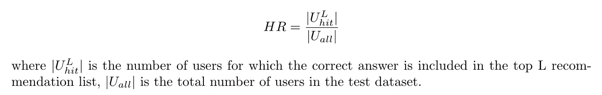
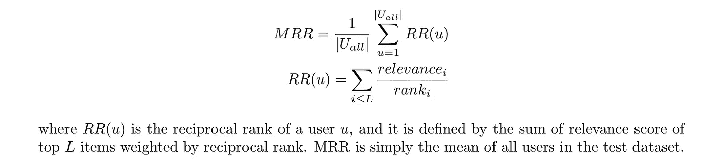
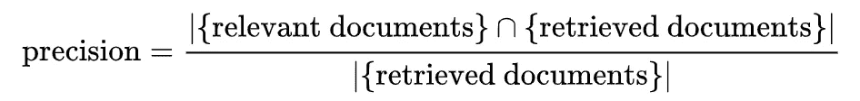
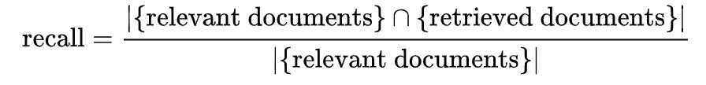
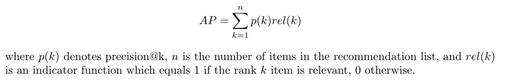
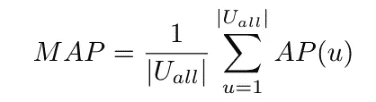
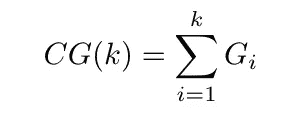
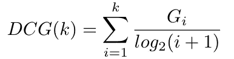
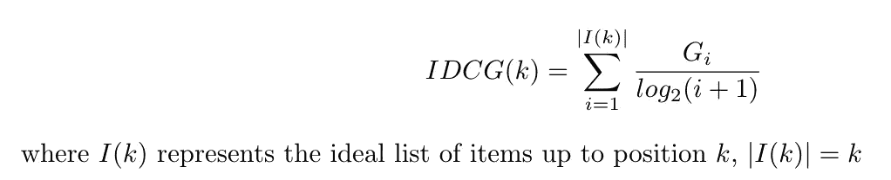
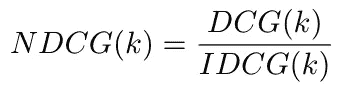

# 推荐系统的排序评价指标

> 原文：<https://towardsdatascience.com/ranking-evaluation-metrics-for-recommender-systems-263d0a66ef54?source=collection_archive---------4----------------------->

## 各种评估度量用于评估推荐器的有效性。我们将主要关注排名相关的指标，包括 HR(命中率)、MRR(平均倒数排名)、MAP(平均精度)、NDCG(归一化折扣累积收益)。

推荐系统最终输出项目的排序列表，而不管不同的建模选择。因此，重要的是研究如何直接评估排名质量，而不是像均方差等其他代理指标。

# 命中率

在推荐器设置中，命中率只是正确答案包含在长度为 *L.* 的推荐列表中的用户比例

可以看出， *L* 越大，命中率就越高，因为正确答案被包括在推荐列表中的可能性就越大。因此，为 *L.* 选择一个合理的值很重要

# MRR(平均倒数排名)

MRR 是*的缩写，意思是倒数排名。*又称*平均互反命中率(ARHR)。*

注意，计算 *RR(u)* 有不同的变化或简化。**对于隐式数据集，对于未购买或已购买(未点击或已点击等)的项目，相关性得分为 0 或 1。).**

另一种简化是只看推荐列表中**一个最相关的**项，而不是对所有的进行汇总。在隐式数据集的情况下，相关性本身没有排序，只考虑列表顶部的任何一个相关项目就足够了。

**有人可能会认为命中率实际上是 MRR 的一个特例，当 *RR(u)* 是二进制时，因为如果列表中有相关项，它就变成 1，否则就变成 0。**

# 平均精度

让我们首先在精确度和召回率上刷新我们的记忆，特别是在信息检索方面。

**什么是精准和召回？**

简而言之，精度是所有被检索项目中相关项目的分数。它用于回答所有推荐中有多少项是正确的。

而回忆是相关条目在所有相关条目中所占的分数。这是为了回答覆盖率问题，在所有那些被认为相关的项目中，有多少是在推荐中捕获的。

精度来自[维基百科](https://en.wikipedia.org/w/index.php?title=Information_retrieval&oldid=793358396#Average_precision)

回忆来自[维基百科](https://en.wikipedia.org/w/index.php?title=Information_retrieval&oldid=793358396#Average_precision)

**什么是 precision@k？**

在此基础上，我们同样可以定义**precision @ k**和 **recall@k** 。Precision@k 是前 k 个推荐中相关项目的分数，recall@k 是前 k 个推荐中相关时间的覆盖范围

**什么是平均精度？**

现在回到地图。

**MAP 是*平均精度的平均值。*** **如果我们有每个用户的 AP，只需对所有用户进行平均就可以计算出 MAP。**

通过计算文档排序序列中每个位置的精度和召回率，可以绘制精度-召回率曲线，绘制精度 *p(r)* 作为召回率 *r* 的函数。平均精度计算从 0 到 1 的区间内 *p(r)* 的平均值。

这是精确回忆曲线下的重要区域。以离散的方式，它可以计算如下

我们最终可以计算 MAP，它只是 AP 对所有用户的平均值。

# NDCG (N *归一化贴现累计收益*

NDCG 代表*归一化贴现累计收益。*我们将通过逆向回答以下问题来建立这个概念:

*   什么是增益？
*   什么是累积收益？
*   怎么打折？
*   如何正常化？

**条目的增益**本质上与相关性分数相同，相关性分数可以是数字评级，如谷歌中的搜索结果，可以从 1 到 5 进行评级，或者在隐式数据的情况下是二元的，其中我们只知道用户是否消费了某个条目。

自然地，累积增益被定义为直到推荐列表中位置 *k* 的增益总和

CG 的一个明显缺点是它没有考虑到**排序**。通过交换任意两个项目的相对顺序，CG 将不受影响。当排列顺序很重要时，这是有问题的。例如，在谷歌搜索结果上，你显然不喜欢把最相关的网页放在底部。

为了惩罚放置在底部的高度相关的项目，我们引入了 **DCG**

通过按等级划分收益，我们可以推动算法将高度相关的项目放在最上面，以获得最好的 DCG 分数。

DCG 分数仍然有一个缺点。DCG 分数与推荐表长度之和。因此，我们不能一致地比较推荐前 5 和前 10 项的系统的 DCG 分数，因为后者将具有更高的分数，不是因为其推荐质量，而是纯粹的长度。

我们通过引入 **IDCG(理想 DCG)来解决这个问题。** IDCG 是最理想排名的 DCG 分数，即根据项目的相关性自上而下排列，直到位置 *k* 。

而 NDCG 只是通过 IDCG 对 DCG 分数进行归一化，使得它的值总是在 0 和 1 之间，而不管长度如何。

# 笔记

1.  维基百科上的 https://en.wikipedia.org/wiki/Discounted_cumulative_gain 很不错:
2.  维基百科有一个很好的信息检索评估指标列表:【https://en.wikipedia.org/w/index.php? title =信息检索&oldid = 793358396 #平均精度
3.  这篇文章在红外和目标检测两方面都很好的解释了 MAP:[https://towards data science . com/breaking-down-mean-average-precision-MAP-AE 462 f 623 a 52](/breaking-down-mean-average-precision-map-ae462f623a52)