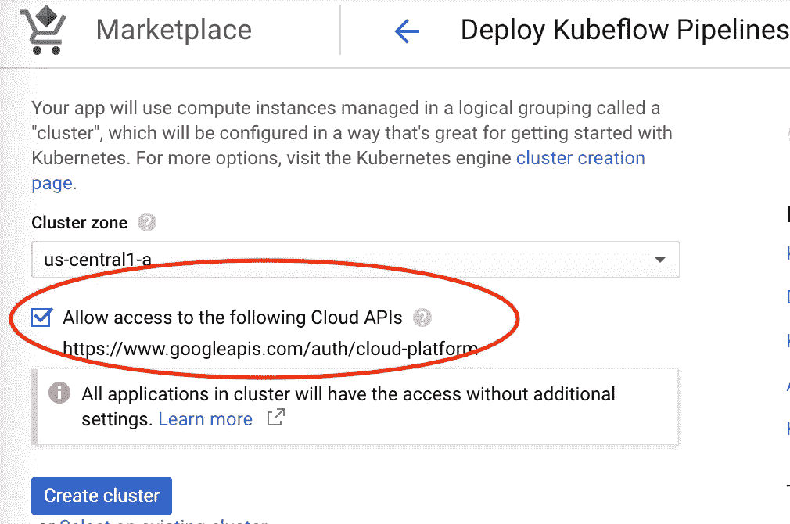
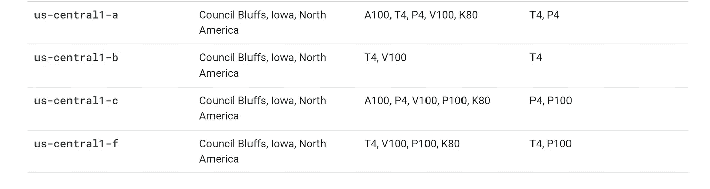
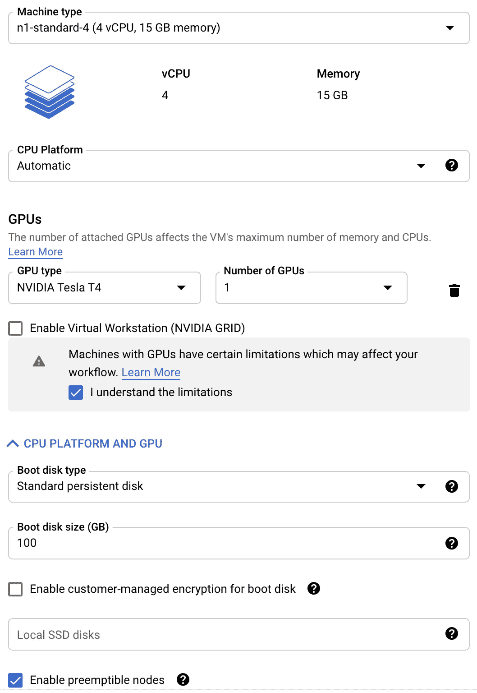
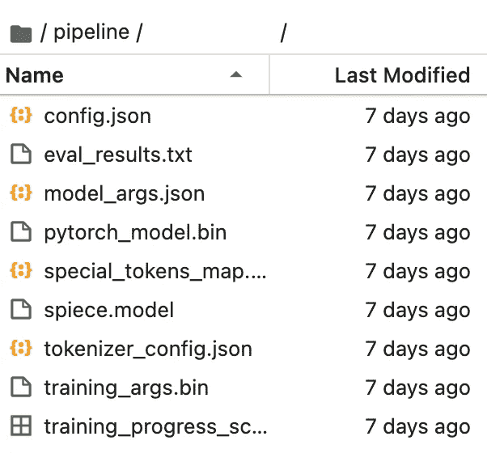

# 谷歌云平台中的大规模快速变压器推理

> 原文：<https://towardsdatascience.com/rapid-transformer-inference-at-scale-in-the-google-cloud-platform-95f39fa332c6?source=collection_archive---------21----------------------->

## 使用转换器以最少的基础设施设置对数百万个字符串进行并行推理


照片由 [Guillaume Jaillet](https://unsplash.com/@i_am_g?utm_source=medium&utm_medium=referral) 在 [Unsplash](https://unsplash.com?utm_source=medium&utm_medium=referral)

变形金刚席卷了 NLP 这个词。每一个与文本相关的任务都受益于变形金刚。使用变形金刚最好的库是 [HuggingFace](https://github.com/huggingface/transformers) 库，而开始使用 HuggingFace 最简单的方法是通过[简单变形金刚](https://simpletransformers.ai/)。网上有无数的教程会教你如何为分类、翻译、命名实体识别等微调 transformer 模型。

最近，在我的雇主 [Truebill](https://www.truebill.com/) 主办的内部黑客马拉松上，我不得不使用简单的转换器对数百万个字符串进行快速推理。事实证明，这个过程并不完全直观，所以这篇文章描述了如何使用谷歌云平台，使用简单的变压器(只需进行最小的调整，就可以与拥抱脸一起工作)快速建立大规模的推理。它假设您已经有了一个模型，现在正在寻找一种方法来快速大规模使用它。它还假设您拥有一个 GCP 帐户，并对该平台有一些基本的了解。这可能不是在生产中运行东西的最便宜或最有效的方式，但是如果您需要在紧要关头处理一批数百万个字符串，本指南将帮助您以最少的设置时间完成这项工作。

## 资源供应

首先，您需要提供一些资源:一个笔记本实例来控制管道集群，一个集群来完成繁重的工作。两人都住在 GCP 的人工智能平台区。

首先创建一个笔记本实例。如果您不使用它来训练模型，类型并不重要，但如果您要在笔记本实例中训练模型，您将需要带有 GPU 的 PyTorch one。如果您选择 GPU 选项，请确保选中安装 NVIDIA GPU 驱动程序框。

然后，调配群集。进入 AI 平台->管道，点击新建实例。然后单击 Configure，并为管道创建一个新的集群。

**选中允许访问云 API 复选框！**



作者图片

单击 create cluster 按钮，完成管道创建过程，然后转到 Kubernetes Engine->Clusters。选择新创建的集群，然后单击顶部的 Add Node Pool 按钮。选中启用自动缩放按钮，以便机器在不使用时关闭。将最小节点数设置为 0，将最大节点数设置为您需要同时运行的机器数。如果您有一个模型推理需要多长时间的基准，这真的很有帮助——将帮助您分配正确数量的节点，以便在您拥有的时间内完成工作。

请注意，GCP 有一个默认限制，允许在单个区域中使用 8 个单一类型的 GPU，因此如果您需要使用 8 个以上的 GPU，您必须选择多个区域或请求为您的项目提高该限制。请注意，并非所有地区都有所有类型的 GPU，因此请查看哪个区域有您需要的类型[此处](https://cloud.google.com/compute/docs/gpus/gpu-regions-zones)。



以下是截至 2021 年 1 月美国中央区域提供的 GPU。作者图片

打开左侧菜单中的“节点”选项卡。您将需要 N1 节点(它们支持 GPU)。选择你的项目需要的 CPU/内存，然后点击“CPU 平台和 GPU”按钮，选择你需要的 GPU。选中“我了解限制”复选框。

您很可能还需要选中“启用可抢占节点”复选框。它极大地降低了计算成本，但不能保证正常运行时间，并且在每个节点上设置了 24 小时的限制。节点设置如下所示:



作者图片

之后，打开左边的安全选项卡，选择**允许完全访问所有云 API**(除非你想手动管理访问，这总是很痛苦)。创建节点池。

回到你的集群。如果它有如下图所示的可用升级选项，请单击它，并更新到最新选项。集群完成升级后，转到“节点”选项卡，升级节点。**如果你的 GPU 节点版本低于 1.18，变形金刚就不会在上面工作，因为驱动不兼容**。

更新完节点后，单击集群页面顶部的 connect 按钮。在云壳中点击运行，在壳加载后按回车键运行连接命令。根据需要授权。运行以下命令在您的节点上安装 NVIDIA 驱动程序:

```
kubectl apply -f https://raw.githubusercontent.com/GoogleCloudPlatform/container-engine-accelerators/master/nvidia-driver-installer/cos/daemonset-preloaded.yaml
```

瞧啊。您已经完成了资源调配。现在到了有趣的部分。

## 设置 Docker

去 AI 平台-> GCP 管道。打开管线的管线操控板。复制它带你到的网址的开头，以*googleusercontent.com/结尾

现在转到您在最开始创建的 Notebook 实例，并打开 JupyterLab。粘贴您刚才复制的 URL，并将其分配给一个变量。然后将 GCP 项目的 ID 赋给另一个变量，并导入一些与管道相关的东西。您的第一个单元格将如下所示:

```
PROJECT_ID=’YOUR-GCP-PROJECT-ID'
HOST = ‘[https://YOUR-PIPELINES-URL-LOOKS-LIKE.pipelines.googleusercontent.com/](https://1be8db11da5d2e5d-dot-us-central2.pipelines.googleusercontent.com/)'import kfp.gcp as gcp
import kfp.dsl as dsl
import kfp.compiler as compiler
import kfp.components as comp
import kubernetes as k8s
import kfpclient = kfp.Client(host=HOST)
client.list_pipelines()
```

最后两行不是必需的，但是运行它们会检查您的笔记本是否能够连接到您的集群。如果成功的话，你会得到一堆关于集群的信息。如果没有，可能是某个地方缺少权限。

运行手机。

现在，您需要在笔记本电脑中训练您的模型，或者将您现有的模型上传到笔记本电脑。将其放置在管道文件夹内的文件夹中。



记住模型文件夹的名称。作者图片

利用这一时刻检查您的 model_args.json(右键单击，用编辑器打开)。确保*使用 _ 多重处理*和*使用 _ 多重处理 _ 解码*都设置为假。PyTorch 使用了大量的共享内存，这与 Kubeflow 管道不兼容。可能有一种方法可以在集群中使用多处理，但是我还没有找到(如果你找到了，请在评论中发布！)确保 *n_gpu* 匹配你为你创建的节点选择的任何东西。

下一个单元格为您的节点创建一个 Docker 文件。它看起来是这样的(下面的例子有导入来处理 BQ 和 GCS 桶中托管的数据):

```
%%bash
mkdir -p pipeline
cat > ./pipeline/Dockerfile <<EOF
FROM nvidia/cuda:10.2-runtime-ubuntu18.04
RUN apt-get update && apt-get install -y \
python3 \
python3-pip
RUN pip3 install --upgrade pip
RUN pip3 install numpy
RUN pip3 install pandas
RUN pip3 install torch==1.6.0 torchvision==0.7.0
RUN pip3 install simpletransformers
RUN pip3 install pandas-gbq
RUN pip3 install google
RUN pip3 install google-cloud
RUN pip3 install google-cloud-bigquery
RUN pip3 install google-cloud-storage
RUN pip3 install gcsfs
WORKDIR /app
COPY . /app
EOF
```

随意改变一些东西(特别是——确保你有你的模型需要的所有 python 库)。但是，您可能希望保持相同的基础映像。NVIDIA 的设置是与 Kubeflow 管道一起工作，如果你选择不同的图像，你的设置可能会变得更加复杂。运行这个单元。

您的下一个单元使用 Google Cloud Build 来构建您的 Docker 映像。这里您可能想要更改的唯一内容是图像名称(它不需要匹配任何内容)，以及 *' — timeout'* 之后的数值。它设置了云构建需要多长时间来构建您的映像的限制；如果你的图像非常复杂，可能需要的时间会超过这里指定的 20 分钟。

```
IMAGE_NAME=”YOUR_IMAGE_NAME”
TAG=”latest”GCR_IMAGE=”[gcr.io/{PROJECT_ID}/{IMAGE_NAME}:{TAG}](http://gcr.io/%7BPROJECT_ID%7D/%7BIMAGE_NAME%7D:%7BTAG%7D)”.format(
 PROJECT_ID=PROJECT_ID,
 IMAGE_NAME=IMAGE_NAME,
 TAG=TAG
)APP_FOLDER=’./pipeline/’import subprocess
# ! gcloud builds submit — tag ${IMAGE_NAME} ${APP_FOLDER}
cmd = [‘gcloud’, ‘builds’, ‘submit’, ‘ — tag’, GCR_IMAGE, APP_FOLDER, ‘ — timeout’, ‘1200’]
build_log = (subprocess.run(cmd, stdout=subprocess.PIPE).stdout[:-1].decode(‘utf-8’))
print(build_log)
```

运行手机。这可能需要一段时间，这个过程应该会产生一个很长的输出，并以成功结束。

## 创建和运行管道

我们现在到了有趣的部分。下一个单元将具有每个节点实际运行的功能。该功能有 4 个部分:

1.  进口
2.  读取数据
3.  运行推理
4.  存储数据

确切的代码将取决于您的数据存储在哪里，您的模型是什么，您是否需要做任何预处理，等等。这是我的最后的样子:

```
def predict(file_number,model_folder='YOUR_MODEL_FOLDER'):
  #Imports
  import pandas as pd
  import re
  from simpletransformers.t5 import T5Model
  #Read Data
  GCS_BUCKET='gs://MY-BUCKET'
  file='{}/input/batch_{}.csv'.format(GCS_BUCKET,file_number)
  df=pd.read_csv(file)
  #Run Inference
  model = T5Model("t5",model_folder)
  predictions = model.predict(df["text"].tolist())
  df['output']=pd.Series(predictions)
  #Filter out special characters (application logic)
  df['output'] = df['output'].apply(lambda x:re.sub("[^A-Za-z0–9 '-]+",'', str(x)))
  #Store the results
  df.to_csv('{}/output/batch_{}.csv'.format(GCS_BUCKET,file_number))#This line is not a part of the function and is needed for the pipeline.
predict_container=comp.func_to_container_op(func=predict, base_image=GCR_IMAGE)
```

你的会有所不同，所以要记住几件事。首先， *model_folder* 应该匹配您的模型在笔记本实例中所在的文件夹的名称(只有模型文件夹名称，没有“pipeline/”)。其次，应该有一些参数来定义要处理的数据块。在我的例子中，它是 *file_number* ，因为输入数据被分成许多文件。你的可能是 BQ 查询中的一个参数，或者其他什么。

正如你在上面看到的，谷歌云存储得到了很好的支持——你不需要做任何认证。大查询也是如此: *pd.read_gbq* 将开箱即用(如果您使用它，我强烈推荐将 *use_bqstorage_api* 设置为 *True* ，这样会快得多)。

您的模型代码最终会有所不同，这取决于您所使用的转换器，您可能也有自己的定制应用程序逻辑。不要忘记存储结果！单元格的最后一行将您的函数添加为管道中的一个步骤。实现完逻辑后，运行单元。

下一个单元格定义了管道。我的看起来像这样:

```
[@dsl](http://twitter.com/dsl).pipeline(
    name='My Pipeline',
    description='What it does'
)
def my_pipeline():  
  predict_memory = '12G'
  for i in range(0,10):

    predict_task1 = predict_container(file_number="00"+str(i))\
    .set_memory_request(predict_memory).set_gpu_limit(1).apply(gcp.use_preemptible_nodepool())

    predict_task2 = predict_container(file_number="01"+str(i))\
    .set_memory_request(predict_memory).set_gpu_limit(1).apply(gcp.use_preemptible_nodepool())
    predict_task2.after(predict_task1)

    predict_task3 = predict_container(file_number="02"+str(i))\
    .set_memory_request(predict_memory).set_gpu_limit(1).apply(gcp.use_preemptible_nodepool())
    predict_task3.after(predict_task2)my_pipeline_name = my_pipeline.__name__ + '.zip'
compiler.Compiler().compile(my_pipeline, my_pipeline_name)
```

注意一些事情。有一个内存请求—它应该略低于您之前选择的节点内存。有一个 GPU 限制，它应该等于你在一个节点中使用的 GPU 数量。*。如果您在集群设置中选择了可抢占的节点，那么 apply(GCP . use _ preemptable _ node pool())*位应该存在。

还要注意，这里有一个循环，在这个循环中有几个任务。循环的每一次迭代都是一个启动节点的请求(循环中的迭代次数比您提供的节点数多没关系，集群会在节点完成早期任务时让它们开始工作)。在我的例子中，我已经分配了 0–10 个节点，所以当我启动这个管道时，集群将一次启动 10 个节点。然后，每个节点将按顺序执行循环迭代中的任务。因此，在我的例子中，10 个节点中的每一个都将依次执行 3 项任务，然后关闭。没有必要有多个任务，你可以只有一个。我最喜欢每个节点有多个任务，这样我可以直观地监控作业的进度。

下一个单元格是最后一个，它在您的管道中创建和启动了一个作业！看起来是这样的:

```
client = kfp.Client(host=HOST)
arguments = {}
experiment = client.create_experiment(“experiment name”)run_name = “test run”
run_result = client.run_pipeline([experiment.id](http://experiment.id/), run_name, my_pipeline_name, arguments)
```

你不需要在这里改变任何东西，除非你想命名你的实验并运行。就是这样！当您运行单元时，笔记本将在集群中运行您的作业，并为您提供监控作业的链接。


成功！作者图片

在监视作业时要记住一点:随着集群节点的增加，它会显示类似“资源不可用”的内容，作为管道任务的状态。没问题，随着节点旋转，状态应该会在几分钟内改变。

一如既往，不要忘记在使用完云资源后取消对它们的配置！你可以在 GCP 的 Kubernetes 引擎->集群和人工智能平台->笔记本部分完成。