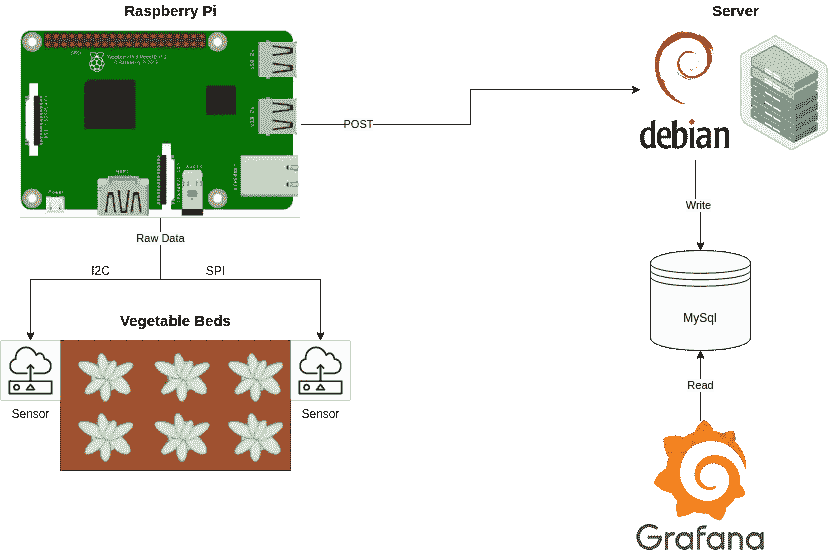
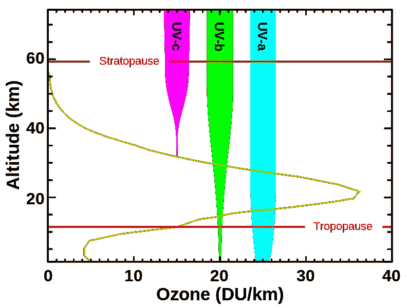
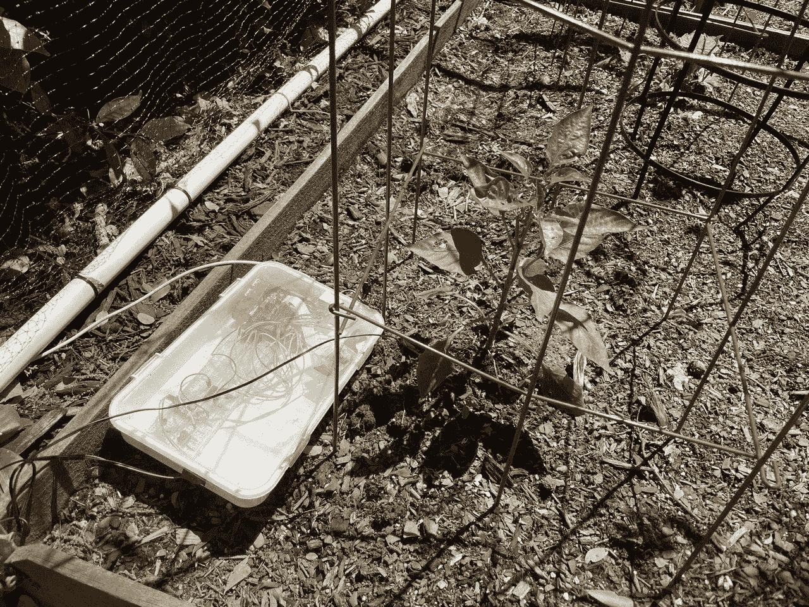

# 树莓派园艺:使用树莓派监控菜园—第 1 部分

> 原文：<https://towardsdatascience.com/raspberry-pi-gardening-monitoring-a-vegetable-garden-using-a-raspberry-pi-part-1-fd231c7c6275?source=collection_archive---------29----------------------->

## [实践教程](https://towardsdatascience.com/tagged/hands-on-tutorials)

# 介绍


*项目之旅；*CC BY-SA 3.0/【chollinger.com/blog 

在 2020/2021 年左右的某个时期，像许多其他人一样(如果你在 3000 年你的“古代美国历史”课上，在北极的一个拱顶上读到这封全息磁带，我说的是新冠肺炎)，我和我的 SO 都在园艺和种植蔬菜中找到了乐趣。

虽然种植植物的爱好在理论上可能是一种快乐，但我认为我听到的对园艺的最佳描述是“80%的痛苦，15%的担忧，5%的胜利和满足，以及 100%的等待”。你需要考虑很多事情——阳光照射、土壤的 pH 值、土壤中的养分、害虫、真菌、松鼠、鹿、鸟(以及各种各样的动物)——当然，每种植物的所有这些都是不同的。

因为这种内在的复杂性，已经有了很多与成长事物的斗争。萝卜，我没有适当地薄，产生悲伤的小棍子，而不是性感的球茎；黄瓜，西红柿和南瓜被枯萎病吃掉，松鼠攻击并挖出种子，蚜虫像圣经中的瘟疫一样降临到所有多叶和绿色的东西上，霜冻损害了原本不应该对可怜的芦荟造成任何损害的地方，猴草(短葶山麦冬)占据了凸起的床，植物生长成奇怪的形状，最终由于缺乏阳光而死去。


悲伤的灯泡(作者[作者](https://chollinger.com/blog/2021/04/raspberry-pi-gardening-monitoring-a-vegetable-garden-using-a-raspberry-pi-part-1/)

对于其中的许多问题，我们已经找到了模拟解决方案:在 PVC 管框架上用扎带、阿兰·杰克逊歌曲和廉价啤酒建造一个鸟笼(信不信由你，它实际上是有效的，你可以在上面的“悲伤灯泡”图片中看到)。螳螂卵对抗蚜虫。针对山麦冬和其他杂草的杂草屏障。抗真菌铜杀真菌剂。

然而，有些事情仍然困扰着我，让我夜不能寐。自然，对此只有一个解决方案:在不该使用技术的地方使用技术，在不需要收集数据的地方使用技术，当然，尽可能以最过度设计的方式完成所有这些工作。

# 范围

那我们要做什么？

# 总体思路

我抓住了这个半真实需求的机会，最终在物理电子和微控制器的世界里把手弄脏了。**这对我来说是一个全新的话题**，鉴于我是你能想到的最糟糕的“边做边学”型的人，没有比这更好的机会来随意地将一些电路焊接在一起以收集数据。

因此，如果你在阅读这篇文章时，至少在电子、微控制器或园艺领域有一点经验，就此而言——我的投诉邮件可以在我的网站上找到。

不过，如果你更像我一样，根本没有涉足过电子学的*现实世界*，你可能会觉得这很有趣。

# 体系结构

无论如何，数据是我在这里追求的——关于阳光照射、土壤湿度和温度的数据。这实际上是一个有点有趣的问题，因为这些指标是高度本地化的，可能在几英尺之外就完全不同。

因此，我们将收集土壤湿度、阳光照射紫外线等指标，以及设备 ID 和时间戳等元数据，使用 REST API ( [bigiron.local](https://chollinger.com/blog/2019/04/building-a-home-server/) ，当然)将其发送到网络上的服务器，将其存储在 MariaDB 中，并使用 Grafana 进行分析。



建筑(作者)

# 数据点

以下是我们总共 6 张加高床中的 3 张的布局(完全不按比例):


真实世界布局(作者)

这些床在南边，但也位于两辆车、一个甲板和一个工具棚之间，两侧是树木。虽然从理论上讲，这些床应该得到充足的阳光，但很难估计它们实际得到了多少阳光。去年，我们在那里种植了“半日照”的草本植物，比如薰衣草，它们很快就死掉了。不过，你可以种植甜椒——就像辣椒中的辣椒一样，它们实际上也需要相当多的阳光。

土壤湿度也令人惊讶地难以测量:你可能会把手指伸进土壤，但这并不一定意味着它实际上是“年轻的胡萝卜”——湿的。可能只是“柑橘树不在乎”——湿了。量化这一点将是一个额外的收获。

温度和湿度是非常明显的——实际上，我在 iPhone 上用“快捷方式”应用程序做了一个小东西来提醒我们冷锋的到来:


iOS 快捷方式(按作者)

但是当然，这种*方式太简单了*。

# 成分

这个想法非常简单:一个 Raspberry Pi 驱动的(仅仅因为我有几个)机器可以捕获这些指标并将其发送到服务器，这样我们就可以使用良好的 ole 数据工程工具箱来了解关于遥远的真实世界的所有信息。

为此，我选择了以下组件:

*   **温度** : [MCP9808 高精度 I2C 温度传感器](https://www.adafruit.com/product/1782)——4.95 美元
*   **紫外线** : [SI1145 数字紫外线指数/红外/可见光传感器](https://www.adafruit.com/product/1777)——9.95 美元
*   或者 [Adafruit VEML6070 紫外线指数传感器插座](https://www.adafruit.com/product/2899)——5.95 美元
*   **灯** : [阿达果 VEML7700](https://www.adafruit.com/product/4162) (最高 120k 勒克斯)——4.95 美元
*   或者 [Adafruit TSL2591](https://www.adafruit.com/product/1980) (最高 88k lux)——6.95 美元
*   或者是[NOYITO max 44009](https://smile.amazon.com/NOYITO-MAX44009-Intensity-Interface-Development/dp/B07HFRS8XX)——5.99 美元
*   **湿度** : [任何电阻式湿度传感器](https://smile.amazon.com/gp/product/B076DDWDJK/ref=ppx_yo_dt_b_asin_image_o01_s00?ie=UTF8&psc=1)——4.99 美元——8 美元
*   你身边的任何一款树莓派，比如[树莓 Zero](https://www.microcenter.com/product/486498/zero-v13-development-board---camera-ready?storeid=041) 或者花哨的[树莓 PI 4 Model B](https://www.microcenter.com/product/609038/raspberry-pi-4-model-b-4gb-ddr4)——或者小巧的[Pico](https://www.raspberrypi.org/products/raspberry-pi-pico/)——4.99 美元到 54.99 美元
*   烙铁、跳线、发光二极管、分线板等。

当然，这里有大量的选择——但通过最少的设置，我们可以以大约 25 美元一个的价格(当然，如果批量订购，价格会更低)制造一个这样的传感器。我将在下面介绍不同类型的传感器。

我个人并不太关心这一迭代的成本——尽管一直部署一个会很有趣，但这也需要有线电源连接(或锂电池)、互联网连接和防水外壳。所有这些事情可能使我值得购买一台 3D 打印机(并从中挤出另一篇文章)，但就本文的范围而言，我将专注于实际构建它。

# 模拟电路

但是在我们做这些之前:我个人从中学开始就没有涉足过电子，所以已经有一段时间了。

很自然地，我“回归基础”，开始构建一个非常简单的电路:给 LED 供电。


一个简单的 LED 电路(作者)

这是一个记住一些基本原则的好练习。标准 LED 电路如下所示:


简单的 LED 电路图([https://en.wikipedia.org/wiki/LED_circuit](https://en.wikipedia.org/wiki/LED_circuit))

因为我们需要用一个电阻来限制到达 LED 的电流，以防止它烧毁。

为了找到正确的阻力，我们可以使用:

`R = (V_power - V_led) / I_led`

其中`R`是以欧姆为单位的电阻，`V_power`是以伏特为单位的电源电压，`V_led`是以伏特为单位的 LED 正向压降，`I_led`是以安培为单位的 LED 期望电流。

对于红色 LED，我们将在 20mA 电流下观察 2–2.2V，即在 5V 电源下(如上所示)，一个 93ω电阻就可以了(我最接近的电阻是一个 100ω电阻)。对于蓝色 LED，我们会看到 3.2–3.4V，因此电阻为 54ω(以此类推)。

玩这个很有趣——但为了记录，我对你将看到的大多数图片都使用了 330ω。

此外，你在图片上看到的小电源非常漂亮(一个 [HW-131](https://www.cafago.com/en/p-e8575.html) 售价 2 美元)，因为它可以通过 PSU、电池或 USB 获得 3.3V 和 5V 的电源。


万用表(作者)

# 使用树莓和 GPIO

一旦我们开始通过树莓控制这个东西，真正的乐趣就开始了。然而，在“控制”部分开始之前，我们可以简单地将 a 3.3 或 5V 引脚连接到同一电路。

# 引脚布局

对于这个 [pinout.xyz](https://pinout.xyz/) 是一个方便的资源:它显示了你各自的覆盆子的布局。一般来说，看起来是这样的:


从[引脚排列 xyz](https://pinout.xyz/)

Adafruit 看到了一个非常方便的小连接器， [T-Cobbler](https://www.adafruit.com/product/2028) ，它可以扩展这些引脚，并将它们标记在试验板上使用。

有了这方面的知识，我们可以连接第 1、2、4 或 17 针以及我们选择的地线，获得漂亮的灯光:


数字输入/输出(按作者)

然而，这仍然是模拟的，只是从计算机中获取电源。为了通过软件控制它，我们将使用 GPIO，或“通用输入/输出”。这个名副其实的库可以寻址所有的 GPIO 引脚。

解决这些问题的最简单方法是给出两个输入之一:`GPIO.HIGH` (3.3V)或`GPIO.LOW` (0V)。

# 练习:莫尔斯电码

我用这些知识做过一个有趣的小练习，就是用 GPIO 和下面的电路写一个莫尔斯电码发送器:


莫尔斯电码电路(作者)

这与 LED 显示器几乎相同，只是增加了一个扬声器和一个 UV LED，用于指示完整的“发送”。下面 gif 中的版本还包括一个毫无意义的“发送完毕”信号 LED。

结果是这样的:


莫尔斯电码在行动(作者)

垃圾代码在这里，如果你关心的话:

这真的没有意义，但看到它的运行很有趣——它只是将莫尔斯字母表翻译成定义的长度和中断，并发送一个`GPIO.HIGH`信号，然后是一个睡眠定时器，和一个`GPIO.LOW`信号来关闭它。

现在，我们从给 LED 供电发展到通过代码控制 LED 和扬声器——非常简单！

# 分线板和 I2C

有了这些基础知识，我们终于可以看看分线板了——带有数字或模拟输出的小电路，我们可以通过软件与之对话(而不仅仅是说“通电”/“断电”)。从软件的角度来看，事情变得更有趣了。

我们将看看这一系列传感器中最简单的传感器，`MCP9808`温度传感器。

# 焊接

无论您选择哪种电路板，第一步都应该将电路板焊接到(通常提供的)插头连接器上，否则就不可能获得稳定的连接。


焊料#1(作者)


焊料#1(显然是作者写的)

我对此没有任何建议——我得到的最好的建议是使用比你需要的更多的焊丝，并确保工件放在稳定的底座上(如试验板)。这符合“PVC 管和防松鼠的鸟网”式的生活方式，但它确实有效。

然而，Adafruit 上面有一个很棒的[指南](https://learn.adafruit.com/adafruit-guide-excellent-soldering)。

# I2C

从那里，我们实际上可以开始使用`I2C`:

> **(****Inter-Integrated Circuit****)，读作 I-squared-C，是飞利浦半导体(现为恩智浦半导体)于 1982 年发明的同步、多主、多从、分组交换、单端、串行通信总线。它广泛用于在短距离板内通信中将低速外设 IC 连接到处理器和微控制器。或者，I2C 有时被拼写为 I2C(发音为 I-two-C)或 IIC(发音为 I-I-C)。**
> 
> *[*https://en.wikipedia.org/wiki/I%C2%B2C*](https://en.wikipedia.org/wiki/I%C2%B2C)*

*简单地说，I2C 能做的不仅仅是告诉我们的电路“通电”和“断电”。这是一个低级的消息总线。*

*I2C 使用 2 条线— `SCL`和`SDA`。`SCL`同步数据，而`SDA`发送和接收数据。除此之外，另外 2 根导线承载电源和接地。作为一条消息总线，I2C 也遵循主从模式:我们可以使用许多连接到一条消息总线的设备。设备可以使用寄存器，这些寄存器可以是用户可寻址的。*

# *从头开始实施 MCP9808 通信*

*物理通信由各个芯片的供应商概述。例如，小的 [MCP9808](https://www.microchip.com/wwwproducts/en/MCP9808) 在其[规范](https://ww1.microchip.com/downloads/en/DeviceDoc/MCP9808-0.5C-Maximum-Accuracy-Digital-Temperature-Sensor-Data-Sheet-DS20005095B.pdf)中精确地解释了它是如何工作的。*

*我们需要先连接它:*

**

*[资料来源](https://learn.adafruit.com/assets/58808)，Kattni Rembor，CC BY-SA 3.0*

*或者身体上:*

**

*意大利面(作者)*

*使用`i2cdetect`，我们可以观察连接的 i2c 设备:*

```
*pi @ 4g-raspberrypi ➜  ~  sudo i2cdetect -y 1

     0  1  2  3  4  5  6  7  8  9  a  b  c  d  e  f
00:          -- -- -- -- -- -- -- -- -- -- -- -- -- 
10: -- -- -- -- -- -- -- -- 18 -- -- -- -- -- -- -- 
20: -- -- -- -- -- -- -- -- -- -- -- -- -- -- -- -- 
30: -- -- -- -- -- -- -- -- -- -- -- -- -- -- -- -- 
40: -- -- -- -- -- -- -- -- -- -- -- -- -- -- -- -- 
50: -- -- -- -- -- -- -- -- -- -- -- -- -- -- -- -- 
60: -- -- -- -- -- -- -- -- -- -- -- -- -- -- -- -- 
70: -- -- -- -- -- -- -- --*
```

*如果我们现在想从获取温度，我们知道默认的*地址*是`0x18`，寄存器映射如下:*

**

*引出线(按作者)*

*其中`TA`或`0x05`是当前温度的寄存器(该寄存器是只读的)。*

*电路物理连接后，我们可以通过软件检查状态:*

*如果我们只是使用 [smbus2 库](https://pypi.org/project/smbus2/)在`Python`中读取它们:*

```
*from smbus2 import SMBus
import time

registers = {
    'CONFIG': 0x01,
    'TUPPER': 0x02,
    'TLOWERL': 0x03,
    'TCRIT': 0x04,
    'TA': 0x05,
    'MANUFACTURER_ID': 0x06,
    'DEVICE_ID': 0x07,
    'RESOLUTION': 0x08,
}

bus = SMBus(1)
address = 0x18

for k in registers:
    dat = bus.read_word_data(0x18, registers[k])
    print('{} -> {}'.format(k, dat))*
```

*我们会看到:*

```
*CONFIG -> 0
TUPPER -> 0
TLOWERL -> 0
TCRIT -> 0
TA -> 26817
MANUFACTURER_ID -> 21504
DEVICE_ID -> 4
RESOLUTION -> 259*
```

*这显然还不是有用的值。*

*现在，自然地，我们需要解析这些数据来理解它。*

> **数字字载入 16 位只读环境温度寄存器(TA ),该寄存器包含 13 位二进制补码格式的温度数据**
> 
> **……**
> 
> **要将 TA 位转换为十进制温度，必须输出高三位边界位(TA < 15:13 >)。然后，确定符号位(位 12)以检查正或负温度，相应地移位这些位，并合并 16 位寄存器的高字节和低字节。**
> 
> **高位字节包含温度高于+32°C 的数据，而低位字节包含温度低于+32°C 的数据，包括分数数据。**
> 
> **组合高位和低位字节时，高位字节必须右移 4 位(或乘以 2⁴),低位字节必须左移 4 位(或乘以 2⁴).**
> 
> **将移位值的结果相加得到十进制格式的温度数据(见等式 5–1)。**
> 
> **(*[*https://ww1 . microchip . com/downloads/en/device doc/MCP 9808-0.5C-Maximum-Accuracy-Digital-Temperature-Sensor-Data-Sheet-ds 20005095 b . pdf*](https://ww1.microchip.com/downloads/en/DeviceDoc/MCP9808-0.5C-Maximum-Accuracy-Digital-Temperature-Sensor-Data-Sheet-DS20005095B.pdf)*)**

*如果我们想保持简单，我们需要做的就是遵循文档:*

```
*# Parse temp
v = bus.read_word_data(0x18, 0x05)
# Split in 2-complements
ub=v & 0xFF
lb=(v >> 8) & 0xFF
# Clear flags / take lower 13
ub = ub & 0x1F
# Check for negative values
if (ub & 0x10) == 0x10:
    ub = ub & 0x0F
    t = 256 - (ub * 16 + lb/16)
else:
    t = ub * 16 + lb / 16
print('Current temp: {}C'.format(t))*
```

*我们得到`22.6875C`，72.8 华氏度，和房间里的其他温度计一致。*

*现在，如果你和我一样，从大学开始你就没有做过很多移位，但这里是我最好的尝试来解释在这里做什么，在哪里做，为什么:*

*   *原始读数是十进制的`27585`，所以是二进制的`110 1011 1100 0001`*
*   *`v & 0xFF`是相对于`1111 1111`的位掩码(`XOR`)，用于获取高 8 位(因为我们得到一个包含整数和小数部分的 16 位寄存器)。`&`是一个逻辑`XOR`(异或)运算，用于位屏蔽(提取位，如果你愿意的话)。*

```
*1	1	0	1	0	1	1	1	1	0	0	0	0	0	1 XOR 1	1	1	1	1	1	1	1 1	1	0	0	0	0	0	11	1	0	1	0	1	1	1	1	0	0	0	0	0	1 >> 8 0	1	1	0	1	0	1	1 XOR 1	1	1	1	1	1	1	1 0	1	1	0	1	0	1	11	1	0	0	0	0	0	1 XOR 1	1	1	1	1 1*
```

*我们现在可以用它乘以 2⁴=16，得到一个浮点结果:`t = ub * 16 + lb / 16`*

*或者使用更多的按位逻辑并将结果作为整数:`(lb >> 4) + (ub << 4)`*

*Tadaa！只用了一个*位*的逐位数学来读取电路板的传感器。当然，我们也可以写入寄存器，但我离题了。*

# *使用图书馆*

*现在，虽然这无疑对我有教育意义，让我了解供应商如何实现这些芯片，如何解决它们的“低级”问题，并自己编写代码，自然，几乎总是有可用的驱动程序和/或库。*

*[这里的](https://github.com/adafruit/Adafruit_MCP9808_Library)是 C++中的一个，这里的[这里的](https://github.com/adafruit/Adafruit_CircuitPython_MCP9808)是 Adafruit 当前的 Python 实现，它简化了很多:*

```
*from board import *
import busio
import adafruit_mcp9808

# Do one reading
with busio.I2C(SCL, SDA) as i2c:
    t = adafruit_mcp9808.MCP9808(i2c)

    # Finally, read the temperature property and print it out
    print(t.temperature)*
```

*这就是我们未来将使用的工具。*

# *光传感器*

*上面的练习涵盖了温度——无论我们自己做数学还是依靠图书馆，我们都可以得到温度。阳光是一个不同的问题。*

# *紫外线指数与光照水平和总日射表*

*因为我们在研究植物维护，所以我们在寻找“阳光照射”这一抽象指标，从家得宝到当地苗圃的每一包种子和每一株植物都提到了这个指标。*

*这个指标的问题在于，它非常主观且不科学，至少对于面向消费者的产品来说是如此。一般来说，我们想看看`W/sqm`的太阳辐照度，但我们马上就会明白为什么这并不简单。*

*我们能不能把紫外线，一种经常被测量和报道的东西(因此可以作为便宜的电路板)作为一种替代物？*

> **紫外线指数是一个与地球表面某一点产生晒伤的紫外线辐射强度成线性关系的数字。**
> 
> **它不能简单地与辐照度(以 W/m2 为单位测量)相关，因为最受关注的紫外线占据了 295 至 325 纳米的波长光谱，当它们到达地球表面时，更短的波长已经被吸收了很多**
> 
> *[*https://en.wikipedia.org/wiki/Ultraviolet_index*](https://en.wikipedia.org/wiki/Ultraviolet_index)*

**

*[*https://en.wikipedia.org/wiki/Ultraviolet_index*](https://en.wikipedia.org/wiki/Ultraviolet_index)*

*我们所知道的是:植物*确实会对紫外线或紫外线辐射做出反应，特别是 UV-B(280-320 纳米)和 UV-A(320-400 纳米)，与人类一样——它会导致细胞损伤，并且有人假设植物可以预测紫外线模式并做出相应的反应。[1] [2] [3]**

*紫外线指数从 0 到 12 不等，实际上是为了让我们了解晒太阳对人类有多大风险。*

*也就是说，紫外线是植物生长所需的*阳光*的副作用(或者子集)——紫外线-A 约占太阳能的 4.9%，而紫外线-B 约占 0.1%，在冬季几乎无法测量。[4]*

*我们真正想知道的是*太阳强度*。为了测量太阳强度，人们使用一种称为*日射强度计*的设备，这是一种(昂贵的)机器，使用硅光电池(想想光伏电池)，补偿太阳角度，并产生一种确定太阳辐照度的确定性方法，通常以 W/sqm 为单位。[5]*

*日射强度计(顺便说一下，它的意思是“天空火测量”，这是一种很好的金属)的问题是它们的超级利基用例，因此成本巨大——即使是业余气象学家最便宜的也要超过 100 美元。我只想种些辣椒。*

*[1][https://www . frontiersin . org/articles/10.3389/fpls . 2014.00474/full](https://www.frontiersin.org/articles/10.3389/fpls.2014.00474/full)【2】[https://www . NCBI . NLM . NIH . gov/PMC/articles/PMC 160223/pdf/041353 . pdf](https://www.ncbi.nlm.nih.gov/pmc/articles/PMC160223/pdf/041353.pdf)【3】[https://www . RS-online . com/design spark/the-importance-of-ultraviolet-of](https://www.rs-online.com/designspark/the-importance-of-ultraviolet-in-horticultural-lighting)*

# *紫外线传感器*

*正如我之前一直回避的那样，对于紫外线传感器，我看了两个选项: [SI1145](https://www.adafruit.com/product/1777) 或 [VEML6070](https://www.adafruit.com/product/2899) ，前者是更贵的选项。*

*`VEML6070`包含一个实际的 UV-A 传感器。*

*另一方面，`SI1145`可以计算紫外线指数，但是*不包含实际的紫外线传感器。根据产品说明，它使用可见光和红外光来计算紫外线指数。**

*让`SI1145`有趣的是，我们可以用它来绕过它的卖点，即紫外读数，获得可见光和红外(IR)光读数。*

*使用[库](https://github.com/THP-JOE/Python_SI1145)，我们可以收集[度量](https://cdn-shop.adafruit.com/datasheets/Si1145-46-47.pdf)如下:*

```
*import SI1145.SI1145 as SI1145

sensor = SI1145.SI1145()
vis = sensor.readVisible()
IR = sensor.readIR()
UV = sensor.readUV()
uvIndex = UV / 100.0
print('Visible:  {}'.format(vis))
print('IR:       {}'.format(IR))
print('UV Index: {}'.format(uvIndex))*
```

*遗憾的是，这些都是相对指标，本身并没有太大意义——但这是收集紫外线指数(主要针对园丁)和某种可见光和红外光指标的开始。*

# *勒克斯传感器*

*对于种植植物来说，W/sqm 的“下一个最好的东西”(至少是我能想到的)是 SI 单位 lux:*

> *它等于每平方米一流明。在光度学中，这被用作人眼所感知的、撞击或穿过表面的光的强度的量度。它类似于辐射单位瓦特每平方米，但每个波长的功率根据光度函数加权，光度函数是人类视觉亮度感知的标准化模型。在英语中，“lux”既有单数形式也有复数形式。*
> 
> *[T3【https://en.wikipedia.org/wiki/Lux】T5](https://en.wikipedia.org/wiki/Lux)*

*虽然这测量的是可见光，而不是用于光合作用的“原始”能量，但除了观察“相对”可见光和紫外线之外，它仍然是一个很好的指标。换句话说，虽然它可能会给我们一个稀释的指标(因为它与可见光的光谱一致)，但它仍然可以与其他指标结合使用。*

*为此，我找到了 3 个传感器: [Adafruit VEML7700](https://www.adafruit.com/product/4162) (最高 120k lux)[Adafruit tsl 2591](https://www.adafruit.com/product/1980)(最高 88k lux)，以及 [NOYITO MAX44009](https://smile.amazon.com/NOYITO-MAX44009-Intensity-Interface-Development/dp/B07HFRS8XX) (最高 188k lux)。当然，还有其他选择。*

*明亮的阳光可以达到 100，000 勒克斯以上，所以列表中的第一个和最后一个传感器可能更好。*

***注意** : *在撰写本文时，两个 lux 传感器都还没有到达。您将在下面读到的大多数内容因此仅支持来自 UV 传感器*的可见光的相对测量。*

# *模拟传感器和土壤湿度*

*我们以前使用的传感器都是带有数字输出的 I2C 传感器。但是模拟呢？*

*嗯，不用担心——我买的电阻式土壤湿度传感器提供数字和模拟输出。然而，亚马逊的评论抱怨说，“手动和数字输出是有限的，模拟工作还好”。那么，如何读取模拟数据呢？*

*当然是用 ADC！对于那些对高保真感兴趣的人来说，你可能拥有一个 DAC(顺便说一下，Schiit 生产的很棒的 DAC 起价为 99 美元)——一个数模转换器。然而，在这个用例中，我们需要一个模数转换器。*

*我使用的是带 SPI 接口的 [MCP3008 8 通道 10 位 ADC。它使用 SPI 或串行外设接口，而不是 I2C。虽然我不是这两方面的专家，但正如本文所证明的，SPI 和 I2C 是相似的，但 SPI 使用更多的引脚:](https://www.adafruit.com/product/856)*

**

*[来源](https://learn.adafruit.com/assets/1222)，迈克尔·斯克拉尔，CC BY-SA 3.0*

*这意味着我们可以这样连接它:*

**

*连接，它看起来像这样，使用这个非常可爱的长颈鹿锅作为主题:*

**

*长颈鹿博士(作者)*

*(请忽略电工胶带，我在高度专业的标准下操作)*

*我们试图读取的是电阻——如果两个探针之间的电阻上升，土壤就更干燥。当然，这种测量有点主观，所以我们必须校准它。*

*对于从板 I/O 引脚 25 上的引脚 0 数字读取原始数据(持续 60 秒)，我们可以使用以下代码片段:*

```
*import busio
import digitalio
import board
import adafruit_mcp3xxx.mcp3008 as MCP
from adafruit_mcp3xxx.analog_in import AnalogIn

# create the spi bus
spi = busio.SPI(clock=board.SCK, MISO=board.MISO, MOSI=board.MOSI)

# create the cs (chip select)
cs = digitalio.DigitalInOut(board.25)

# create the mcp object
mcp = MCP.MCP3008(spi, cs)

# create an analog input channel on pin 0
chan0 = AnalogIn(mcp, MCP.P0)

readings = []
i = 0
for x in range(0,60):
    i += 1
    val = chan0.value
    volt = chan0.voltage
    readings.append(volt)
    if int(val) != 0:
        print('Raw ADC Value: {}'.format(val))
        print('ADC Voltage: {} V'.format(chan0.voltage))
    time.sleep(1)

avg = statistics.mean(readings)
print('Avg voltage: {}'.format(avg))*
```

*这给了我们每秒一个原始读数。*

*在一个相当潮湿的长颈鹿罐子里，我们得到的读数大约是*

```
*Raw ADC Value: 30144
ADC Voltage: 1.5146715495536736 V*
```

*或者平均来说是 1.5144。*

*现在，请记住，如果你没有连接一个东西，这也会给你读数:*

```
*# Reading on an unconnected channel P2
Raw ADC Value: 448
ADC Voltage: 0.0 V
Raw ADC Value: 512
ADC Voltage: 0.0 V
Avg voltage: 0.004619211108567941*
```

*但是你可以忽略那些读数。我认为这是任何 ADC 的自然产物——电流的自然波动+ Python 固有的`float`不精确性。*

*如果在不同的通道上连接一个电位器(上图可以看到！)，您实际上可以看到这些波动，从技术上讲，电压应该保持不变，但事实并非如此:*

```
*readings = [3.2968276493476765, 3.280714122224765, 3.280714122224765, 3.280714122224765, 3.2839368276493475, 3.280714122224765, 3.280714122224765, 3.2936049439230946, 3.2839368276493475, 3.2839368276493475, 3.277491416800183, 3.280714122224765, 3.280714122224765, 3.277491416800183, 3.2936049439230946, 3.28715953307393, 3.280714122224765, 3.277491416800183, 3.2936049439230946, 3.277491416800183, 3.2839368276493475, 3.28715953307393, 3.280714122224765, 3.280714122224765, 3.2839368276493475, 3.280714122224765, 3.2839368276493475, 3.28715953307393, 3.280714122224765, 3.280714122224765, 3.280714122224765, 3.2839368276493475, 3.280714122224765, 3.277491416800183, 3.2936049439230946, 3.2710460059510185, 3.2839368276493475, 3.280714122224765, 3.290382238498512, 3.280714122224765, 3.277491416800183, 3.280714122224765, 3.28715953307393, 3.2839368276493475, 3.280714122224765, 3.280714122224765, 3.28715953307393, 3.2839368276493475, 3.2839368276493475, 3.2839368276493475, 3.2839368276493475, 3.2839368276493475, 3.2742687113756004, 3.290382238498512, 3.2936049439230946, 3.28715953307393, 3.277491416800183, 3.280714122224765, 3.28715953307393, 3.290382238498512]
statistics.stdev(v)
# 0.0051783580637861605*
```

*stdev 只有 0.005178，但是它在那里。湿度传感器正以 0.002305 的标准偏差引入同样强的波动。*

*在任何情况下，同样的实验在干土罐上产生的平均电压为 2.6。*

*所以我们可以得出结论:*

*   ***干土** : 2.6V*
*   ***潮湿土壤** : 1.5V*
*   ***一杯水**:0.77 伏*

# *把所有的放在一起*

*总装！*

# *最终试验板布局*

*连接所有传感器后，布局如下:*

**

*最终布局(作者)*

# *一个简单的 REST API 就可以做到*

*我们可以通过网络发送收集的数据。有人可能会想出一个奇特的消息队列，但我认为一个简单的本地化 REST API 目前就能解决问题——`AWS Greengrass`、Meme-Microservices、`Kafka`等其他应用程序还需要等待。我们每 10 秒钟发送一个数据包，并将其存储在这样的数据库中:*

```
*CREATE OR REPLACE TABLE `sensors`.`data` (
    `sensorId`	            TEXT,
    `TempC`	                FLOAT,
    `VisLight`	            FLOAT,
    `IrLight`               FLOAT,
    `UvIx`                  FLOAT,
    `RawMoisture`           FLOAT,
    `VoltMoisture`          FLOAT,
    `MeasurementTs`         TIMESTAMP,
    `lastUpdateTimestamp`   TIMESTAMP
);*
```

*REST 端点用`go`编写，并为`x86`而不是`ARM`编译，并部署在远程服务器上，这样我们就可以支持许多只需要偶尔发送数据的小型微控制器。*

*像往常一样，你可以在 [GitHub](https://github.com/chollinger93/raspberry-gardener) 上找到完整的代码，所以我只说一些值得注意的点(这些是通用的`go`主题，但值得一提)。*

*首先，使用[github.com/jmoiron/sqlx](https://github.com/jmoiron/sqlx)和[github.com/Masterminds/squirrel](https://github.com/Masterminds/squirrel)，其设置类似于一个大型`CloudSQL`实例所使用的设置类型，这让我感觉很好- `sqlx`极好地扩展了`go`的常规`sql`接口，并且`squirrel`可以用来自动执行一些数据库 I/O 任务。*

```
*type Sensor struct {
	SensorId     string
	TempC        float32
	VisLight     float32
	IrLight      float32
	UvIx         float32
	RawMoisture  float32
	VoltMoisture float32
    MeasurementTs string
}

func (a *App) storeData(sensors []Sensor) error {
	q := squirrel.Insert("data").Columns("sensorId", "tempC", "visLight", "irLight", "uvIx", "rawMoisture", "voltMoisture", "measurementTs", "lastUpdateTimestamp")
	for _, s := range sensors {
        // RFC 3339
		measurementTs, err := time.Parse(time.RFC3339, s.MeasurementTs)
		if err != nil {
			zap.S().Errorf("Cannot parse TS %v to RFC3339", err)
			continue
		}
		q = q.Values(s.SensorId, s.TempC, s.VisLight, s.IrLight, s.UvIx, s.RawMoisture, s.VoltMoisture, measurementTs, time.Now())
	}
	sql, args, err := q.ToSql()
	if err != nil {
		return err
	}

	res := a.DB.MustExec(sql, args...)
	zap.S().Info(res)
	return nil
}*
```

*我也开始越来越多地使用[go.uber.org/zap](https://github.com/uber-go/zap)，因为`go`的标准日志记录接口让*有很多*需要改进的地方。*

```
*// Logger
logger, _ := zap.NewDevelopment()
defer logger.Sync() // flushes buffer, if any
zap.ReplaceGlobals(logger)*
```

*除此之外，代码是一个非常标准的 REST API——`App`struct 保持一个指向 DB 连接池的指针(跨线程共享),秘密通过环境变量处理，而不是必须实现配置文件和`viper`(可能在将来)。*

```
*type App struct {
	Router *mux.Router
	DB     *sqlx.DB
}

func initTCPConnectionPool() (*sqlx.DB, error) {
	var (
		dbUser    = mustGetenv("DB_USER")
		dbPwd     = mustGetenv("DB_PASS")
		dbTCPHost = mustGetenv("DB_HOST")
		dbPort    = mustGetenv("DB_PORT")
		dbName    = mustGetenv("DB_NAME")
	)

	var dbURI string
	dbURI = fmt.Sprintf("%s:%s@tcp(%s:%s)/%s?parseTime=true", dbUser, dbPwd, dbTCPHost, dbPort, dbName)

	dbPool, err := sqlx.Open("mysql", dbURI)
	if err != nil {
		return nil, fmt.Errorf("sql.Open: %v", err)
	}

	configureConnectionPool(dbPool)
	return dbPool, nil
}*
```

*如此构建:*

```
*# For x86
GOARCH=amd64 GOOS=linux go build -o /tmp/sensor-server *.go 
sudo mkdir -p /opt/raspberry-gardener
sudo cp /tmp/sensor-server /opt/raspberry-gardener
sudo cp ./.env.sh /opt/raspberry-gardener/
sudo sed -i 's/export //g' /opt/raspberry-gardener/.env.sh*
```

*然后我们可以安装一个`systemd`服务:*

```
*[Unit]
After=network.target
Wants=network-online.target

[Service]
Restart=always
EnvironmentFile=/opt/raspberry-gardener/.env.sh
WorkingDirectory=/opt/raspberry-gardener
ExecStart=/opt/raspberry-gardener/sensor-server 

[Install]
WantedBy=multi-user.target*
```

*并部署:*

```
*# Install `systemd` service:
sudo cp raspberry-gardener.service /etc/systemd/system/
sudo systemctl start raspberry-gardener
sudo systemctl enable raspberry-gardener # Autostart*
```

*并检查:*

```
*christian @ bigiron ➜  raspberry-gardener  sudo systemctl status raspberry-gardener
   Loaded: loaded (/etc/systemd/system/raspberry-gardener.service; disabled; vendor preset: enabled)
   Active: active (running) since Sat 2021-04-24 14:12:56 EDT; 17min ago
 Main PID: 12312 (sensor-server)
    Tasks: 7 (limit: 4915)
   Memory: 3.0M*
```

*我们将对下面的传感器客户端做同样的事情——详见 GitHub。*

# *一个脚本来统治他们所有人*

*为了将发送部分放在一起，我们需要做的就是组合每个传感器的所有单独脚本，混合 SPI 和 I2C，然后发送数据。*

*导入和收集数据非常简单:*

```
*from board import *
import busio
import adafruit_mcp9808
import SI1145.SI1145 as SI1145
import os
import time
import busio
import digitalio
import board
import adafruit_mcp3xxx.mcp3008 as MCP
from adafruit_mcp3xxx.analog_in import AnalogIn
import platform
import getmac
import requests
import logging
import json
import argparse

# mcp9808
def read_temp() -> int:
    with busio.I2C(SCL, SDA) as i2c:
        t = adafruit_mcp9808.MCP9808(i2c)
        return t.temperature

# SI1145
def read_uv(sensor: object) -> set:
    vis = sensor.readVisible()
    IR = sensor.readIR()
    UV = sensor.readUV() 
    uvIndex = UV / 100.0
    return (vis, IR, uvIndex)

# HD-38 (Aliexpress/Amazon)
def read_moisture(spi_chan: object) -> tuple:
    val = spi_chan.value
    volt = spi_chan.voltage
    return (val, volt)*
```

*由于我们希望每个传感器都有一个唯一的 ID(如果我们部署了多个传感器)，因此我们将主机名和网络 MAC 地址组合成一个字符串:*

```
*def get_machine_id():
    return '{}-{}'.format(platform.uname().node, getmac.get_mac_address())*
```

*收集循环创建所有访问对象，缓冲数据，过滤无效数据，并将其发送给 REST API:*

```
*def main(rest_endpoint: str, frequency_s=1, buffer_max=10, spi_in=0x0):
    buffer=[]
    ## UV
    uv_sensor = SI1145.SI1145()

    ## SPI
    # create the spi bus
    spi = busio.SPI(clock=board.SCK, MISO=board.MISO, MOSI=board.MOSI)
    # create the cs (chip select)
    cs = digitalio.DigitalInOut(board.CE0)
    # create the mcp object
    mcp = MCP.MCP3008(spi, cs)
    # create an analog input channel on pin 0
    chan0 = AnalogIn(mcp, spi_in)

    while True:
        try:
            # Read
            temp_c = read_temp()
            vis, ir, uv_ix = read_uv(uv_sensor)
            raw_moisture, volt_moisture = read_moisture(chan0)

            # Write
            # temp_c,vis_light,ir_light,uv_ix,raw_moisture,volt_moisture
            reading = {
                'sensorId': get_machine_id(),
                'tempC': temp_c,
                'visLight': vis,
                'irLight': ir,
                'uvIx': uv_ix,
                'rawMoisture': raw_moisture,
                'voltMoisture': volt_moisture,
                'measurementTs': datetime.now(timezone.utc).isoformat() # RFC 333
            }

            # Only send if we have all 
            # UV sensor sometimes doesn't play along
            if int(vis) == 0 or int(ir) == 0 or int(volt_moisture) == 0:
                logger.warning('No measurements: {}'.format(reading))
                continue

            buffer.append(reading)
            logger.debug(reading)
            if len(buffer) >= buffer_max:
                logger.debug('Flushing buffer')
                # Send
                logger.debug('Sending: {}'.format(json.dumps(buffer)))
                response = requests.post(rest_endpoint, json=buffer)
                logger.debug(response)
                # Reset
                buffer = []
        except Exception as e:
            logger.exception(e)
        finally:
            time.sleep(frequency_s)*
```

*尽管有缓冲区，它使用了大约 16MB 的内存，所以我们应该准备好了！*

# *物理部署*

*通常，当我写软件时，它在这里结束:我写了软件。现在运行它。走开。*

*然而，在这个小实验中，还涉及到实际部署它的组件。由于必须在室外，PI 和电路板的外壳至少需要半防水，即使只是来自地面的环境湿气。*

# *愚蠢的问题需要一个 Dremel*

*由于我没有 3D 打印机(甚至没有更小的试验板)，但我有旧的宜家塑料盒和 dremel，所以解决方案很明显:移除 Pi 鹅卵石，直接连接一些杜邦电缆，将它们放在塑料盒中，钻孔，使用电工胶带“密封”它，然后从以太网转换为 WiFi。简单而优雅(需要引用)。我还连接了相机，尽管我还没有对它进行编程。*

**

*雄伟的盒子#1(作者)*

**

*雄伟的盒子#2(作者)*

# *第一项户外测试:甲板*

*然后，在一个阳光明媚的日子里，我把它搬到外面的甲板上(在一场暴风雨后)，迎来了它在野外的第一个大日子(四月！):*

**

*部署#1(按作者)*

**

*紫外线传感器(作者)*

*对于相机拍摄的照片(我是通过 SSH 触发的):*

**

*天空照相机(作者)*

*然后我启动了两个`systemd`服务，等了一会儿。*

# *分析初步数据*

*因为这实际上只运行了很短的时间，所以以下查询就足够了:*

```
*SELECT *, TIMESTAMPDIFF(MINUTE, startTS, endTs) as totalMinMeasured,
CASE WHEN avgVoltMoisture <= 0.90 THEN "wet" 
WHEN avgVoltMoisture > 0.9 AND avgVoltMoisture <= 1.7 THEN "moist"
ELSE "dry"  END AS avgWetness
FROM (
	SELECT AVG(TempC) AS avgTemp, AVG(VisLight) AS avgVisLight, AVG(UvIx) as avgUvIx, AVG(VoltMoisture) as avgVoltMoisture,
	MAX(MeasurementTs) as endTS, MIN(MeasurementTs) as startTs
	FROM `sensors`.`data` as d
	WHERE d.MeasurementTs <= TIMESTAMP('2021-04-25 18:25:00')
) e*
```

*这产生了意料之中的结果:*

**

*部署#1 结果(按作者)*

*下午 2 点左右，甲板上阳光明媚，经过前一天晚上的暴雨，植物是湿的。*

*但这只是为了确保它的工作！*

# *第二项户外测试:花坛*

*一旦确认一切正常，就该上花园床了。*

**

*部署#2(按作者)*

*相机现在也有了一个更有趣的视角:*

**

*天空和一棵树(作者)*

# *分析:第 2 部分(w/ Grafana)*

*公平地说，对这个数据集的分析看起来不会有太大的不同——让它运行得更久一点，让我们能够使用 Grafana 来可视化它:*

**

*Grafana #1(作者)*

*(*14:20 左右*传感器从阳光充足的甲板上移到花园的花坛上)*

*我也曾通过 SSH 手动拍照:*

**

*天空和树#2(作者)*

*这张照片是在格拉夫纳图的尾端拍摄的(大约 1800 小时)，而上面这张照片是在大约 1430 时拍摄的。毫无疑问，你可以在图表上找到这种模式。*

*另一个光线指数和紫外线(以及温度)的峰值可以在 1700 小时左右观测到——这是太阳没有被树木遮挡的时候。*

*另一张拍摄于 19:30 的照片——你可以在照片的左下方看到太阳在植物上的角度发生了变化，但在上面的图表中，其他指标没有太大变化。*

**

*天空和树#3(作者)*

*尽管缺少 Lux 传感器，我们也可以在这里对“部分阴影”与“全日照”进行一些有根据的猜测——在这里比较光线和紫外线指数:*

**

*Grafana #2(作者)*

*知道传感器在 1420 小时左右被移动，我们可以比较明显阳光充足的甲板和床之间的峰值——两者的峰值都在 1.65-1.5k”光单位(“来自传感器的可见光”)。*

*这也与温度相关:*

**

*Grafana #3(作者)*

*在下午晚些时候的“高太阳”期间，您可以看到高达约 29 摄氏度(84.2 华氏度)的峰值，甲板上的峰值可达 40 摄氏度(104 华氏度)。*

*有趣的是，温度与 iPhone 天气应用程序记录的温度不符——那应该是恒定的 72 华氏度(或 22.2 摄氏度)，而在非高强度时期，床徘徊在 18-19 度左右。c(64.4–67F)！*

*我认为可以公平地说:至少这个特殊的花园床可以称得上是“部分遮阴”,不会像房子的其他部分那样受到强烈的阳光照射。*

*当然，理想情况下，你会想在不同的条件下观察几天——但令人惊讶的是，我现在还不太相信我的特百惠电工胶带盒。但这是一个开始！*

# *后续步骤和结论*

*这是第一部分——虽然它对我来说非常有趣(看到最后的图表真是令人愉快)，我甚至不会假装这个项目非常有用、经济，甚至是*必需的*(我的办公室窗户朝向花园……)，但我们仍然有很多事情可以做得更好！*

*   *使用便宜得多的电路板，例如 Raspberry Zero*
*   *焊接连接，构建一个紧凑的封装*
*   *3D 打印出一个真正防水的外壳*
*   *部署其中几个并收集一周左右的数据*
*   *实现摄像机代码*
*   *实施勒克斯传感器(见上文)*
*   *部署更长的时间以收集更多的数据*
*   *微调一些收集参数——目前每小时收集 3600 个数据点，这可能是不必要的*
*   *对来自摄像机的结构化+非结构化数据运行某种形式的 ML 模型*

*所以第二部分可能是合适的——但是我觉得第一部分已经够长了。*

*无论如何，我希望您喜欢这个小小的旅程，从复习中学物理，到 I2C 和 SPI 的基础知识，到无缘无故地手动移位，到编写 REST API 和 SQL 查询，到将一个边上有孔的塑料盒搬到院子里，最后使用一些更普通的数据争论工具集来研究它。我知道我很开心！*

**所有代码在* [*GitHub*](https://github.com/chollinger93/raspberry-gardener) *上都有。* *所有的开发和基准测试都是在 GNU/Linux 下完成的【PopOS！在 2019 System76 Gazelle 笔记本电脑上使用 12 个英特尔 i7–9750h v cores @ 4.5 GHz 和 16GB RAM，以及 Raspberry Pi 4 Model B，使用*[*bigiron . local*](https://chollinger.com/blog/2019/04/building-a-home-server/)*作为端点**

**原载于 2021 年 4 月 25 日 https://chollinger.com**的* [*。*](https://chollinger.com/blog/2021/04/raspberry-pi-gardening-monitoring-a-vegetable-garden-using-a-raspberry-pi-part-1/)*