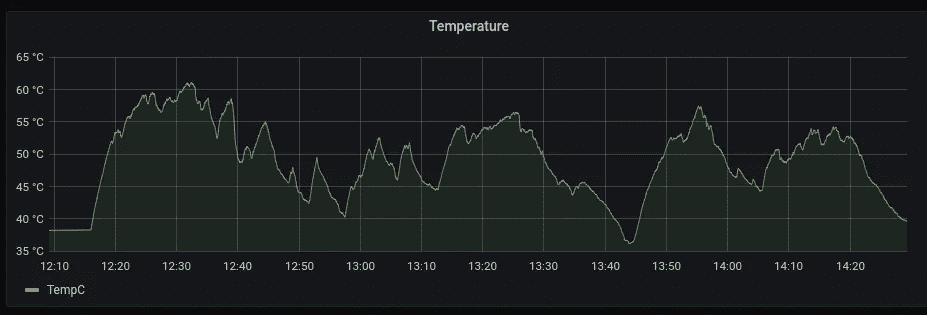

# 树莓派园艺:使用树莓派监测菜园—第 2 部分:3D 打印

> 原文：<https://towardsdatascience.com/raspberry-pi-gardening-monitoring-a-vegetable-garden-using-a-raspberry-pi-part-2-3d-printing-40471bd061dc?source=collection_archive---------12----------------------->

## 向我花园里的胡椒植物扔覆盆子馅饼的第二部分:关于 3D 打印、更多糟糕的焊接工作、I2C、SPI、Python、go、SQL 和 CAD 失败的话题


项目之旅(作者)

# 介绍

在这个项目的最后一次迭代中，我向你们展示了我的旅程，我把一个树莓派扔进了我的花园，以监测阳光和水的暴露。在本文中，我们将对原型进行改进，使之可以在室内和室外使用。

正如上一篇文章一样，第 2 部分将回顾我经历的所有步骤，并记录我的一些学习经历。


你隐藏了什么秘密？(作者)

# 版本 1 的问题

版本 1 很有趣——而且很有效！但是它也不是没有问题。让我们快速回顾一下这里需要改进的地方。

# 费用

一个相当令人望而却步的事情是成本——作为原型，它使用了一个结实的树莓 Pi 4 (4GB)，一台零售价为 55 美元的机器。然而，实际上，我们希望以大约 30 美元(按消费价格计算)的价格制造同样的盒子！)，所以我们可以从里到外部署多个。

这是一个简单的解决办法——[Raspberry Pi Zero W](https://www.raspberrypi.org/products/raspberry-pi-zero-w/)配有 WiFi(这将比[PoE]以太网*【0】*更便宜、更普遍)，只需 10 美元(如果你能找到那个价格的话)。廉价的微型 SD 卡零售价为 3 美元，廉价的微型 usb 电缆和电源插头也是如此，但我认为每个人都有许多电缆和适配器。我们将使用小的试验板，但是如果你想玩短路游戏，你也可以把铜焊接在一起。为可焊接试验板增加大约 2 美元——继续阅读，看看为什么这可能是一个好主意。

回到`Zero W`:这是一个神奇的小棒:1Ghz，一个核心，512MB 内存，40 PIN GPIO 头，摄像头连接器，BLE /蓝牙 4.1 和 802.11 b/g/n WiFi。10 美元。不带 WiFi 5 美元。这大约是我第一台个人电脑的 CPU 能力的 7.7 倍，体积大约是它的 1/1000！

公平地说，它很小，大约是空格键的一半大小(如果这是一个测量单位的话？):


树莓零 W 在鸭子空格键上，在樱桃 MX 蓝调床上(作者)

当然——一些 ESP32 可能会更便宜——但树莓也有明显的优势，它不是一个微控制器，而是一台完全成熟的计算机。对于不完全是嵌入式工程师的人来说，学习曲线没有那么陡峭。小 RasPis 还支持 USB，很利落！

*【0】*[这里的](https://buzzert.net/posts/2021-05-09-doorbell)是一个有趣的阅读，它依赖于 PoE，因此可以使用更简单的设计。

# 功率消耗

使用一个`Raspberry`和一个`ESP32`确实有它的缺点，尽管功耗是其中之一。假设我们想无线收集 48 小时的数据:

以前使用的`Raspberry Pi 4`在怠速时将消耗大约*500-600 毫安*。在 5V 电源下，我们可以看到 48 小时约 3W 或约 144Wh 的电流。

提醒:

> *功率(如****W****att****h****our)=电压(如****V****olts)/电流(如****A****MPs)*
> 
> *W =电压*安培*小时*

WiFi 上的一个`Raspberry Pi Zero W`在 3.3V 上应该在 *150 - 180 mA* 左右，板载稳压器支持 5V PSUs 所以 48 小时大约 0.55W 或 26.64Wh(大约*一个 Pi 4 的功耗*的 18.5%！).

然而，另一方面, [ESP32-WROOM-32](https://www.espressif.com/sites/default/files/documentation/esp32-wroom-32_datasheet_en.pdf) 在主动发送数据时，在 2.2 至 3.6V(48 小时内低至 10.5 瓦时)下的范围约为 *100 毫安*，而在空闲时几乎没有:


[https://www . espressif . com/sites/default/files/documentation/esp32 _ data sheet _ en . pdf](https://www.espressif.com/sites/default/files/documentation/esp32_datasheet_en.pdf)

客观地说，一个 AA 锂电池的时钟大约为*~ 3000ma*，尽管只有 3.7V。当然，电源组配备了电源转换器——根据`Pi Zero W`的估计消耗和 48 小时的最低运行时间，一个 10，000mAh (10A)和 3.7V(这是锂的典型电压)的小型电源组可以为一个 Pi 供电，在没有转换损耗和低效率的理想情况下，大约为**67 小时** (37Wh 假设有 50%的效率，10Ah 可以让我们用大约 1.5 天，这并不惊人。

成本也是一个令人望而却步的因素——即使是廉价的(或多或少)电源组或直接的锂电池也几乎是一个单位成本的两倍，最终几乎没有什么好处。例如， [PiSugar](https://www.pisugar.com/) 项目的 1200 毫安时电池价格为 39.99 美元，预计运行时间为 5-6 小时——这与上面的计算结果相符(`1.2A*3.7V=4.44Wh`、`4.44/0.55Wh*.5=4.3hrs`，效率为 50%)。

因此，尽管这并不理想，我们将采取效率增益，但现在放弃电池的话题。

# 传感器和新零件清单

上一个项目也使用了许多不同的传感器来找出哪些效果最好——这一次，我们已经知道我们需要哪些传感器。

这是更新后的零件清单:

*   **棋盘** : [树莓派零 W](https://www.raspberrypi.org/products/raspberry-pi-zero-w/)——10 美元
*   SD 卡:任何便宜的 8-16GB 的卡都可以——3 美元
*   **湿度** : [任何电阻式湿度传感器](https://smile.amazon.com/gp/product/B076DDWDJK/ref=ppx_yo_dt_b_asin_image_o01_s00?ie=UTF8&psc=1) — $5
*   **温度** : [MCP9808 高精度 I2C 温度传感器](https://www.adafruit.com/product/1782)——4.95 美元
*   **光** : [NOYITO MAX44009](https://smile.amazon.com/NOYITO-MAX44009-Intensity-Interface-Development/dp/B07HFRS8XX) (高达 188k lux)——$ 4.95(*撰写本报告时价格上涨*)
*   **ADC** : [MCP3008 8 通道 10 位 ADC，带 SPI 接口](https://www.adafruit.com/product/856)——3.75 美元

这使得我们的开发板总成本从将近 100 美元增加到大约 31.60 美元。如果你想要一个更坚固的设计，可焊接的试验板大约需要 2 美元，一些跳线可能需要 0.10 美元。

我会称之为成功，因为我可以从全球速卖通以大约一半的价格获得所有零件(不包括 Pi ),比如 1.50 美元的 MCP3008。但即使在国内，从 Adafruit、Microcenter 和 Amazon 这样的地方，每单位的总成本似乎也是合理的。

# 尺寸、外壳和布局

然而，上一次迭代的更大和更明显的限制是尺寸:由于我的天才计划使用 Dremel 在宜家的一个巨大的(尽管很薄)盒子上钻孔，最终的盒子既巨大又不实用。一个经典的双输局面，正是我喜欢的。


原始案例(作者)

它还依赖于一个试验板，大量的杜邦电缆，并且通常没有经过深思熟虑——其中的所有东西都应该适合一个小得多的占地面积。

改善布局应该是一个相对简单的任务:因为我们知道我们需要的传感器，我们可以优化空间。我们将在下一步做这件事。

然而，这是另一个不同的话题。我们现在就来谈这个。

# 简介:3D 打印机

我上次已经提到过了，我正在利用这个机会购买一台 3D 打印机。我选择了 [Creality Ender 3 V2](https://www.creality.com/goods-detail/ender-3-v2-3d-printer) ，这可能是 PLA 和 ABS 最推荐的预算 3D 打印机，价格在 250 美元左右。

这是我的第一台 3D 打印机，至少可以说是一次有趣的学习经历。

*你会发现所有照片的背景都发生了很大变化，因为我们在房子里移动了这个大约 19x19 英寸的东西——我最后为它买了一个大约 22x22 英寸的宜家 Lack 拉克桌子，以防你好奇。*


这座房子以前被称为“漂亮部分”的部分(作者)

# 构建 3D 打印机

Creality 自己的网站(！)提供了以下建议:

> 当然，它远非完美。
> 
> *但在这个较低的价格下，它提供了一个体面的打印量，易于组装和改进，并可以产生高质量的打印。*
> 
> *(*[*)https://www.creality.com/goods-detail/ender-3-v2-3d-printer*](https://www.creality.com/goods-detail/ender-3-v2-3d-printer)*)*

因此，在网上阅读后，我很清楚一个“标准”的 Ender 3 v2 无法满足它——太多关于人们在基本功能上挣扎的报道。所以，我在开始第一次打印之前安装了一些更新。那不是一个非常聪明的举动——我应该先试印一份。

## 铝挤压机、0.4 毫米喷嘴和 Capricorn PTFE 波顿管

第一批更新属于“预防性维护”，即我可能不会注意到的事情，直到我用了一堆打印机，但它似乎是一个很好的更换，因为打印机不是组装好的。我很快意识到那是一个错误。

第一次升级是铝挤出机:与塑料挤出机相比，这是一个更坚固的版本，可以将细丝移动到热端(熔化细丝的部分)，具有更强的弹簧，以在挤出过程中保持更好的张力。这确保了细丝总是均匀地流动。它也不太可能破裂。


升级的挤出机(作者)

然而，我没有意识到的是，这个过程可能会搞乱打印机的校准，其中要求的细丝长度和挤出的细丝长度不同步，导致温床上的汇集和畸形的打印:


印刷错误#1(作者)

多亏了一个真正了解 3D 打印的朋友(因为我只是一个卑微的新手)，我们能够按照这个神奇的网站上的步骤重新校准它。尽管这不是唯一的根本原因，但在许多失败的印刷之后，还是发生了这种情况。无论如何，听从他的建议，把这个网站加入书签吧——这会节省你很多时间。

出于同样的原因，我还安装了更新的管道、喷嘴和连接器——我不相信我会很快遇到问题，但这些升级是最容易做到的，因为其他一切都已经被拆开了。

## 自动调平

3D 打印最重要的事情之一是找平——这是像上面这样的混乱打印的主要问题之一——手动找平一些东西，特别是在 1949 年的房子里(直到 1972 年才发明水平地板，有趣的事实)肯定是痛苦的，如果不是完全不可能的话。

因此，售价约 40 美元的 [Creality BLTouch V3.1](https://smile.amazon.com/Creality-BLTouch-Upgraded-Leveling-Mainboard/dp/B08L9DHP5R) 是一个了不起的小发明:它不是依赖人类手动移动 Z 轴，而是为你探测表面。

安装它相对简单:你用 BLTouch 替换常规的 Z 限制器电缆(这需要你移除主板盖)，沿着管道布线，并用螺栓将其连接到打印头。

此时，建议记下主板版本，因为我们需要在下一步进行固件升级:


v 4.2.2(作者)

安装后，它看起来像这样:


BLTouch(作者)

我安装的另一件东西是一套[更新的弹簧](https://smile.amazon.com/Marketty-Printer-Compression-Actually-Perfectly/dp/B07MTGXYLW)，所以床一旦被调平就能保持水平。

## 新固件

安装完这些更新后，下一步是安装固件——否则，BLTouch 什么也做不了。Ender 3 v2 对此有一个*有趣的*过程——你把一个`.bin`文件放到一个空的 SD 卡上，它就会安装它。

我使用了一个预编译的[马林](https://github.com/mriscoc/Marlin_Ender3v2)固件来完成这个任务。

然而，如果你选择了一个错误的固件，显示器会一直黑屏或者机器会发出可怕的声音。

我想知道它如何验证真实性，如果它只是执行随机代码。我认为是后者。

## 八字印刷

虽然所有这些改进都很棒，但在 Ender 3 上打印任何东西的过程如下:

1.  查找或设计 CAD 模型
2.  使用切片器，如 [Cura](https://ultimaker.com/software/ultimaker-cura) ，将你的 CAD 转换成你的打印机可以理解的 g 代码切片
3.  把它移到 SD 卡上
4.  将 SD 卡插入打印机
5.  打印，每 10 分钟带着打印机跑一趟房间，检查一下不可避免的故障

然而，有一个很棒的软件，叫做 [Octoprint](https://octoprint.org/) ，它可以用来通过树莓 Pi 远程控制你的打印机(或者说，从本地网络)!

首先，我打印了一个树莓派的附件(使用迷人的“彩虹丝”，这解释了，嗯，*有趣的*颜色组合):

*   [安德 3 双轨覆盆子 4 表壳](https://www.thingiverse.com/thing:4192636)
*   [Ender 3 Pi 凸轮动臂带旋转/倾斜](https://www.thingiverse.com/thing:3417079)


附件打印(按作者)

并安装了它:


八字印刷案例(作者)

然后使用`docker-compose`安装 Octoprint，告诉 DHCP 服务器和 Pi 在 WiFi 上保持静态 IP:

```
version: '2.4'

services:
  octoprint:
    image: octoprint/octoprint
    restart: always
    ports:
      - "80:80"
    devices:
      - /dev/ttyUSB0:/dev/ttyACM0
      - /dev/video0:/dev/video0
    volumes:
     - octoprint:/octoprint
    # uncomment the lines below to ensure camera streaming is enabled when
    # you add a video device
    environment:
      - ENABLE_MJPG_STREAMER=true

volumes:
  octoprint:
```

(在这里你真正需要检查的是你的`dev`ices——容器认为它在和一个串口通信，而实际上，它是第一个 USB 设备)。

一旦它开始运行，就可以上传 g 代码并实时监控指纹:


Octoprint 用户界面(按作者)

您还可以实时查看打印机的各个步骤:


Octoprint GCode 查看器(按作者)

## 找平和埃尔默胶水

前面，我提到了调配是需要做的关键事情之一，否则，他们会做出意大利面条:


印刷错误#2(作者)

幸运的是，Octoprint 有一个[插件](https://plugins.octoprint.org/plugins/bedlevelvisualizer/)我们可以用来支持这一点。

我使用了以下 GCODE:

```
G28
M155 S30
@ BEDLEVELVISUALIZER
G29 T
M155 S3G28
M155 S30
@ BEDLEVELVISUALIZER
G29 T
M155 S3
```

这是之前手动调平后的结果:


八行体水平(按作者)

然而，这个过程花了我很长时间——对于你在上面的图片上看到的一些印刷品，我使用了埃尔默胶水来增加附着力，以避免印刷品移动。我并不是说我推荐它——然而，它确实会使没有支撑的印刷品粘在不太平整的床上。

# 测试打印和进度

这是第一张照片:


印刷错误#3(作者)

这是后来的一个模型——你可以看到我试图找出的不完美之处——但它比第一次尝试的混乱要好很多:


巨大的龙猫考验(摘自《龙猫》/ となりのトト) / [Thingverse 4515916](作者)

到目前为止，一切顺利！

# 新的组件布局

现在我们可以打印任何东西，从动漫人物的测试立方体到围栏，让我们再来看看最初原型的布局。


原始布局(作者)

# 设计新布局

这种布局自然浪费了大量空间。使用与之前相同的布线，但使用 20 引脚试验板(因为我不会蚀刻 PCB，所以这是肯定的),而不是 60 引脚试验板，去掉了补钉，我们只剩下这个 9x6.5cm 的小布局:


新布局(按作者)

我承认，在这种外形下保持这种状态并不容易，拼接 5V 通道可能也不太明智，但不要让它过载。许多串联设备可能会有问题(由于同一总线上的电阻)，但最终，我不认为这将是一个问题。这不是超级优雅的，但它应该工作。

在任何情况下，在这个烧结图中，布局是二维的——一旦我们为`Pi Zero W`设计了外壳，我们就可以开始堆叠组件，甚至节省更多空间。我们将在下面看到。


新布局汇编(早期版本)(作者)

# 新组件

我们还用一个新的勒克司传感器，微型`NOYITO MAX44009`取代了紫外线。该传感器照常连接到 I2C(电源、GND、SCL、SDA)，这就是为什么我们在板上重复使用相同的通道。它也确实很小，对于紧凑的设计来说很好。


焊接后的 MAX44009(作者)

# 软件更新

接下来要重访的是软件。

## `MAX44009`和对`0x4B`的追求

自然，我们需要以某种方式集成新的传感器。这个东西的文档可以在[这里](https://www.maximintegrated.com/en/products/interface/sensor-interface/MAX44009.html)得到，但是没有现成的`pip3`依赖。

人们拿到文档，算出了转换数学公式[这里](https://github.com/ControlEverythingCommunity/MAX44009/blob/master/Python/MAX44009.py)和[这里](https://github.com/rcolistete/MicroPython_MAX44009_driver/blob/master/max44009.py)——如果你有兴趣从头开始做，请[看一下第 1 部分](https://chollinger.com/blog/2021/04/raspberry-pi-gardening-monitoring-a-vegetable-garden-using-a-raspberry-pi-part-1/#implementing-mcp9808-communications-from-scratch)。

不过，这款传感器有一个缺点——每份文档都提到它使用 I2C 地址`0x4A`，但在我的例子中，它使用`0x4B`、*但不一致*:

```
sudo i2cdetect -y 1
     0  1  2  3  4  5  6  7  8  9  a  b  c  d  e  f
00:          -- -- -- -- -- -- -- -- -- -- -- -- -- 
10: -- -- -- -- -- -- -- -- 18 -- -- -- -- -- -- -- 
20: -- -- -- -- -- -- -- -- -- -- -- -- -- -- -- -- 
30: -- -- -- -- -- -- -- -- -- -- -- -- -- -- -- -- 
40: -- -- -- -- -- -- -- -- -- -- -- 4b -- -- -- -- 
50: -- -- -- -- -- -- -- -- -- -- -- -- -- -- -- -- 
60: -- -- -- -- -- -- -- -- -- -- -- -- -- -- -- -- 
70: -- -- -- -- -- -- -- --
```

亚马逊评论是这样说的:

> *这些有可选的 I2C 地址 0x4a 或 0x4b。但是请注意，我收到的模块上的地址不是由制造商设置的。*
> 
> *因此，你需要以某种方式将跳线焊盘焊接在电路板上，否则地址将不是确定的，可能会在不同的使用之间改变。(我吃了苦头才发现)。*

官方文档上的 CTRL+F 不会产生`0x4B`的结果，示例代码也默认为 0x4A:

```
class MAX44009 : public i2cSensor
{

    /** ######### Register-Map ################################################################# */

#define MAX_ADDRESS 				0x4a

#define INT_STATUS_REG				0x00
#define INT_ENABLE_REG              0x01
#define CONFIGURATION_REG           0x02
#define   CONFIG_CONT_MASK          (bit(7))  // CONTINOUS MODE
#define     CONFIG_CONT_ON          (1<<7)
#define     CONFIG_CONT_OFF         (0)
#define   CONFIG_MANUAL_MASK        (bit(6))  // MANUAL Set CDR and TIME
```

那不是*好玩*吗？！(╯ □ )╯︵ ┻━┻

无论如何，我只是创建了一个定制版本，它使用了第一次迭代的现有代码库和我奇怪的地址屏蔽:

```
from smbus2 import SMBus
import time

class MAX44009:
    # Thanks to https://github.com/rcolistete/MicroPython_MAX44009_driver/blob/master/max44009.py
    # With slight adjustments by chollinger93 for Python3 etc.
    MAX44009_I2C_DEFAULT_ADDRESS = 0x4A
    MAX44009_I2C_FALLBACK_ADDRESS = 0x4B

    MAX44009_REG_CONFIGURATION = 0x02
    MAX44009_REG_LUX_HIGH_BYTE = 0x03
    MAX44009_REG_LUX_LOW_BYTE  = 0x04

    MAX44009_REG_CONFIG_CONTMODE_DEFAULT     = 0x00    # Default mode, low power, measures only once every 800ms regardless of integration time
    MAX44009_REG_CONFIG_CONTMODE_CONTINUOUS  = 0x80    # Continuous mode, readings are taken every integration time
    MAX44009_REG_CONFIG_MANUAL_OFF           = 0x00    # Automatic mode with CDR and Integration Time are are automatically determined by autoranging
    MAX44009_REG_CONFIG_MANUAL_ON            = 0x40    # Manual mode and range with CDR and Integration Time programmed by the user
    MAX44009_REG_CONFIG_CDR_NODIVIDED        = 0x00    # CDR (Current Division Ratio) not divided, all of the photodiode current goes to the ADC
    MAX44009_REG_CONFIG_CDR_DIVIDED          = 0x08    # CDR (Current Division Ratio) divided by 8, used in high-brightness situations
    MAX44009_REG_CONFIG_INTRTIMER_800        = 0x00    # Integration Time = 800ms, preferred mode for boosting low-light sensitivity
    MAX44009_REG_CONFIG_INTRTIMER_400        = 0x01    # Integration Time = 400ms
    MAX44009_REG_CONFIG_INTRTIMER_200        = 0x02    # Integration Time = 200ms
    MAX44009_REG_CONFIG_INTRTIMER_100        = 0x03    # Integration Time = 100ms, preferred mode for high-brightness applications
    MAX44009_REG_CONFIG_INTRTIMER_50         = 0x04    # Integration Time = 50ms, manual mode only
    MAX44009_REG_CONFIG_INTRTIMER_25         = 0x05    # Integration Time = 25ms, manual mode only
    MAX44009_REG_CONFIG_INTRTIMER_12_5       = 0x06    # Integration Time = 12.5ms, manual mode only
    MAX44009_REG_CONFIG_INTRTIMER_6_25       = 0x07    # Integration Time = 6.25ms, manual mode only

    def __init__(self, bus=None) -> None:
        if not bus:
            bus = SMBus(1)
        self.bus = bus
        self.addr = self.MAX44009_I2C_DEFAULT_ADDRESS
        self.configure()

    def configure(self):
        try:
            self.bus.write_byte_data(self.addr, 
                self.MAX44009_REG_CONFIGURATION, 
                self.MAX44009_REG_CONFIG_MANUAL_ON)
        except Exception as e:
            print(e)

    def _convert_lumen(self, raw) -> float:
        exponent = (raw[0] & 0xF0) >> 4
        mantissa = ((raw[0] & 0x0F) << 4) | (raw[1] & 0x0F)
        return ((2 ** exponent) * mantissa) * 0.045

    def read_lumen(self)-> float:
        data = self.bus.read_i2c_block_data(self.addr,
            self.MAX44009_REG_LUX_HIGH_BYTE, 2)
        return self._convert_lumen(data)

    def _switch_addr(self):
        if self.addr == self.MAX44009_I2C_DEFAULT_ADDRESS:
            self.addr = self.MAX44009_I2C_FALLBACK_ADDRESS
        else:
            self.addr = self.MAX44009_I2C_DEFAULT_ADDRESS

    def read_lumen_with_retry(self):
        # To avoid 121 I/O error
        # Sometimes, the sensor listens on 0x4A,
        # sometimes, on 0x4B (ಠ.ಠ)
        try:
            return self.read_lumen()
        except Exception as e:
            print(f'Error reading lumen on {self.addr}, retrying')
            self._switch_addr()
            self.configure()
            return self.read_lumen_with_retry()

if __name__ == '__main__':
    # Get I2C bus
    bus = SMBus(1)
    # Let I2C settle
    time.sleep(0.5)
    MAX44009 = MAX44009(bus)
    # Convert the data to lux
    luminance = MAX44009.read_lumen_with_retry()

    # Output data to screen
    print(f'Ambient Light luminance : {luminance} lux')
```

# 重写客户端

除此之外，我对主代码进行了一点更新，使其更加灵活，使用了一个类层次结构，允许来自库、自定义代码、SPI 等的各种传感器实现。

这并不完全是工程学上的奇迹——但比以前要好。像往常一样，完整的代码在 [GitHub](https://github.com/chollinger93/raspberry-gardener) 上。

```
from board import *
# ...

class Sensor():
    def __init__(self, sensor: object) -> None:
        self.sensor = sensor

    def read_metric(self) -> dict:
        """Implemented in each sensor

        Returns a `dict` of readings, mapping to the SQL schema.

        Return None if no reading. Equals NULL in DB.

        Returns:
            dict: Column -> Reading
        """
        pass

# Temp
class MCP9808_S(Sensor):
    def read_metric(self):
        with busio.I2C(SCL, SDA) as i2c:
            t = adafruit_mcp9808.MCP9808(i2c)
            return {
                'tempC': t.temperature
            }

# UV
class SI1145_S(Sensor):
    def read_metric(self):
        vis = self.sensor.readVisible()
        IR = self.sensor.readIR()
        UV = self.sensor.readUV() 
        uvIndex = UV / 100.0
        # UV sensor sometimes doesn't play along
        if int(vis) == 0 or int(IR) == 0:
            return None

        return {
            'visLight': vis,
            'irLight': IR,
            'uvIx': uvIndex
        }

# Moisture: HD-38 (Aliexpress/Amazon)
# pass spi_chan
class HD38_S(Sensor):
    def read_metric(self):
        raw_moisture = self.sensor.value
        volt_moisture = self.sensor.voltage
        if int(raw_moisture) == 0:
            return None
        return {
            'rawMoisture': raw_moisture, 
            'voltMoisture': volt_moisture
        }

# Lumen: pass MAX44009
class MAX44009_S(Sensor):
    def read_metric(self):
        return {
            'lumen': self.sensor.read_lumen_with_retry()
            }

__sensor_map__ = {
    'uv': SI1145_S,
    'temp': MCP9808_S,
    'lumen': MAX44009_S,
    'moisture': HD38_S
}

def get_machine_id():
    return '{}-{}'.format(platform.uname().node, getmac.get_mac_address())

def main(rest_endpoint: str, frequency_s=1, buffer_max=10, spi_in=0x0, disable_rest=False, *sensor_keys):
    if disable_rest:
        logger.warning('Rest endpoint disabled')
    buffer=[]

    # Create sensor objects
    sensors =  {}
    for k in sensor_keys:
        if k == 'uv':     
            # UV
            sensor = SI1145.SI1145()
        elif k == 'temp':
            # TODO: library behaves oddly
            sensor = None 
        elif k == 'lumen':
            sensor = m4.MAX44009(SMBus(1))
        elif k == 'moisture':
            ## SPI
            # create the spi bus
            spi = busio.SPI(clock=board.SCK, MISO=board.MISO, MOSI=board.MOSI)
            # create the cs (chip select)
            cs = digitalio.DigitalInOut(board.CE0)
            # create the mcp object
            mcp = MCP.MCP3008(spi, cs)
            # create an analog input channel on pin 0
            sensor = AnalogIn(mcp, spi_in)
        else:
            logger.error(f'Unknown sensor key {k}')
            continue
        # Create
        sensors[k] = __sensor_map__[k](sensor=sensor)

    while True:
        try:
            # Target JSON
            reading = {
                'sensorId': get_machine_id(),
                # Metrics will come from Sensor object
                'tempC': None,
                'visLight': None,
                'irLight': None,
                'uvIx': None,
                'rawMoisture': None,
                'voltMoisture': None,
                'lumen': None,
                'measurementTs': datetime.now(timezone.utc).isoformat() # RFC 3339
            }

            # Read all
            for k in sensors:
                try:
                    sensor = sensors[k]
                    logger.debug(f'Reading {sensor}')
                    metrics = sensor.read_metric()
                    if not metrics:
                        logger.error(f'No data for sensor {k}')
                        continue
                except Exception as e:
                    logger.error(f'Error reading sensor {k}: {e}')
                    continue
                # Combine 
                reading = {**reading, **metrics}

            # Only send if its not disabled       
            if not disable_rest:
                buffer.append(reading)
                logger.debug(reading)
                if len(buffer) >= buffer_max:
                    logger.debug('Flushing buffer')
                    # Send
                    logger.debug('Sending: {}'.format(json.dumps(buffer)))
                    response = requests.post(rest_endpoint, json=buffer)
                    logger.debug(response)
                    # Reset
                    buffer = []
            else:
                logger.info(reading)
        except Exception as e:
            logger.exception(e)
        finally:
            time.sleep(frequency_s)

if __name__ == '__main__':
    # Args
    parser = argparse.ArgumentParser(description='Collect sensor data')
    # ...

    # Start
    logger.warning('Starting')
    main(args.rest_endpoint, args.frequency_s, args.buffer_max, args.spi_in, args.disable_rest, *args.sensors)
```

整个`if` / `else`的切换当然可以避免，例如用一个插件模型，就像我在这里为另一个 RasPi 项目 `[scarecrow-cam](https://github.com/chollinger93/scarecrow/tree/master/scarecrow_core/plugins)`写的[。但这比我现在愿意付出的努力要多一点。](https://github.com/chollinger93/scarecrow/tree/master/scarecrow_core/plugins)

无论如何，我们可以在本地测试:

```
python3 monitor.py --disable_rest --rest_endpoint na --sensors temp lumen moisture
```

并更新`systemd`服务。

# 更新后端

当然，传感器的添加需要模式更新，这在`go`中很容易，因为`go`有`structs`并且不讨厌你:

```
type Sensor struct {
	SensorId      string
	TempC         float32
	VisLight      int32
	IrLight       int32
	UvIx          float32
	RawMoisture   int32
	VoltMoisture  float32
	Lumen         float32
	MeasurementTs string
}

func (a *App) storeData(sensors []Sensor) error {
	q := squirrel.Insert("data").Columns("sensorId", "tempC", "visLight", "irLight", "uvIx", "rawMoisture", "voltMoisture", "lumen", "measurementTs", "lastUpdateTimestamp")
	for _, s := range sensors {
		// RFC 3339
		measurementTs, err := time.Parse(time.RFC3339, s.MeasurementTs)
		if err != nil {
			zap.S().Errorf("Cannot parse TS %v to RFC3339", err)
			continue
		}
		q = q.Values(s.SensorId, s.TempC, s.VisLight, s.IrLight, s.UvIx, s.RawMoisture, s.VoltMoisture, s.Lumen, measurementTs, time.Now())
	}
	sql, args, err := q.ToSql()
	if err != nil {
		return err
	}

	res := a.DB.MustExec(sql, args...)
	zap.S().Info(res)
	return nil
}
```

这同样适用于`SQL`接口/DDL——一个相当标准的练习。

# 添加新功能

除了收集数据，另一个有用的功能是通知园丁任何问题。为此，我在`go`实现了一个简单的通知系统，也就是在服务器上。

实现很简单，我们为阈值定义常数:

```
// Hard coded alert values for now
const MIN_TEMP_C = 5
const MAX_TEMP_C = 40
const LOW_MOISTURE_THRESHOLD_V = 2.2

func (a *App) checkSensorThresholds(sensor *Sensor) bool {
	if sensor.VoltMoisture >= LOW_MOISTURE_THRESHOLD_V || sensor.TempC <= MIN_TEMP_C || sensor.TempC >= MAX_TEMP_C {
		return true
	}
	return false
}
```

*使用阈值作为* `*const*` *的蚂蚁，平心而论，就像重新编译你的内核进行一次* `*ulimit*` *的调整——但我在努力避免* `*config*` *的文件。*

为了不在每次传感器触发时发送通知，我们还实现了一个定时器，为了简单起见，它使用了一个全局`map`和一个`mutex`:

```
// Simple mutex pattern to avoid race conditions
var mu sync.Mutex
var notificationTimeouts = map[string]time.Time{}

const NOTIFICATION_TIMEOUT = time.Duration(12 * time.Hour)

func (a *App) validateSensor(sensor *Sensor) error {
	// Check the values first
	if !a.checkSensorThresholds(sensor) {
		zap.S().Debugf("Values for %s are below thresholds", sensor.SensorId)
		return nil
	}
	// Otherwise, notify
	mu.Lock()
	// If we already have the sensor stored in-memory, check whether its time to notify again
	if lastCheckedTime, ok := notificationTimeouts[sensor.SensorId]; ok {
		if time.Now().Sub(lastCheckedTime) < NOTIFICATION_TIMEOUT {
			// Not time yet
			zap.S().Debug("Timeout not reached")
			return nil
		}
	}
	// Reset the timer
	notificationTimeouts[sensor.SensorId] = time.Now()
	// Otherwise, notify
	err := a.notifyUser(sensor)
	// Release the mutex late
	mu.Unlock()
	return err
}
```

通过`smtp`发送通知，与前面的迭代类似，我们将秘密保存在环境变量中，而不是配置文件中——为了简单起见，再一次:

```
type SmtpConfig struct {
	smtpUser              string
	smtpPassword          string
	smtpAuthHost          string
	smtpSendHost          string
	notificationRecipient string
}

func NewSmtpConfig() *SmtpConfig {
	return &SmtpConfig{
		smtpUser:              mustGetenv("SMTP_USER"),
		smtpPassword:          mustGetenv("SMTP_PASSWORD"),
		smtpAuthHost:          mustGetenv("SMTP_AUTH_HOST"),
		smtpSendHost:          mustGetenv("SMTP_SEND_HOST"),
		notificationRecipient: mustGetenv("SMTP_NOTIFICATION_RECIPIENT"),
	}
}
```

发送部分可以在`go`中本地完成:

```
func (a *App) notifyUser(sensor *Sensor) error {
	header := fmt.Sprintf("To: %s \r\n", a.SmtpCfg.notificationRecipient) +
		fmt.Sprintf("Subject: Sensor %v reached thresholds! \r\n", sensor.SensorId) +
		"\r\n"
	msg := header + fmt.Sprintf(`Sensor %s encountered the following threshold failure at %v:
	Temperature: %v (Thresholds: Min: %v / Max: %v)
	Moisture: %v (Thresholds: Min: %v / Max: N/A)`, sensor.SensorId, sensor.MeasurementTs,
		sensor.TempC, MIN_TEMP_C, MAX_TEMP_C, sensor.VoltMoisture, LOW_MOISTURE_THRESHOLD_V)
	zap.S().Warn(msg)
	// Get config
	// Auth to mail server
	auth := smtp.PlainAuth("", a.SmtpCfg.smtpUser, a.SmtpCfg.smtpPassword, a.SmtpCfg.smtpAuthHost)
	err := smtp.SendMail(a.SmtpCfg.smtpSendHost, auth, a.SmtpCfg.smtpUser,
		[]string{a.SmtpCfg.notificationRecipient}, []byte(msg))
	if err != nil {
		zap.S().Errorf("Error sending notification email: %v", err)
		return err
	}
	return nil
}
```

它会发出这样的信息:

> *传感器单元测试在 2021–07–01t 10:00:00 遇到以下阈值故障:温度:4(阈值:最小值:5 /最大值:40)湿度:1.5(阈值:最小值:2.2 /最大值:不适用)*

有用！正如我们将在下面看到的，40 摄氏度是相当低的，但总是可以调整的。

# 重新部署`Pi Zero W`

现在我们所有的软件都是最新的，是时候设置一个新的`Raspberry Pi Zero W`了。

# 物理装配

这个很简单:我在它上面放了一个铝制散热器(可能没有意义，但我确实有这些——我不知道外面会有多热)，并将 I2C 接头焊接到一些引脚上。

`Pi Zero`如此便宜的部分原因是你需要自己焊接引脚——为了节省最终设计的空间，我将`Pi Zero`倒过来焊接(就像将`Pi`放在试验板上一样)。这里的想法是将试验板拍在板的背面，而不妨碍 APU，因此不会给小 Pi 造成热噩梦。


圆周率为零——我用完了所有的针(作者)

当然，人们可以直接在 Pi 上焊接电缆，但我想为将来可能的调整留有余地。你马上就会看到，这是一个明智的选择。

# 软件部署

当然，现在我正在考虑编写一个实际的部署管道，或者甚至构建 Docker 映像——但是当面临“在湖上钓鱼而无所事事”和“从头配置 CI/CD”之间的冲突时，前者(幸运地)胜出。

首先，使用 [Raspi 成像仪](https://www.raspberrypi.org/blog/raspberry-pi-imager-imaging-utility/)安装一个`Raspbian`操作系统。这将把`boot`和`root`安装到你的电脑上。

`*chroot*` *，如果你不熟悉的话，就像* `*docker*` *，只是不像潮人。:)*

首先，通过在`boot`的挂载点上执行`touch ssh`来启用 ssh。

然后，要启用 WiFi，将您现有的`/etc/wpa_supplicant/wpa_supplicant.conf`复制到同一个分区。如果您没有或使用 macOS/Windows，请对此进行自定义:

```
ctrl_interface=DIR=/var/run/wpa_supplicant GROUP=netdev
update_config=1
country=US

network={
       ssid="YourNetworkSSID"
       psk="Password"
       key_mgmt=WPA-PSK
    }
```

然后，`chroot`主分区:

```
sudo proot -q qemu-arm -S /media/$USER/rootfs
```

并运行以下安装脚本:

```
#!/bin/bash

if [[ $EUID -ne 0 ]]; then 
    echo "This script must be run as root"
    exit 1
fi

if [[ -z "${PI_IP}" || -z ${PI_DNS} || -z ${REST_ENDPOINT} || -z ${PI_ROUTER} ]]; then 
    echo "Usage: PI_IP=192.168.1.2 PI_ROUTER=192.168.1.1 PI_DNS=8.8.8.8 REST_ENDPOINT=http://server.local:7777 ./setup_pi_zero.sh"
fi 

# Install dependencies
apt-get update
apt-get install git python3 python3-pip python3-venv i2c-tools vim ntpdate

# Enable I2C, SPI
echo "Enable I2C and SPI manually by running raspi-config over ssh"
#raspi-config 

# Static IP
echo "interface wlan0" >> /etc/dhcpcd.conf
echo "static ip_address=${PI_IP}/24" >> /etc/dhcpcd.conf
echo "static routers=${PI_ROUTER}" >> /etc/dhcpcd.conf
echo "static domain_name_servers=${PI_DNS} 1.1.1.1 fd51:42f8:caae:d92e::1" >> /etc/dhcpcd.conf
echo "nameserver ${PI_DNS}" >> /etc/resolv.conf 

# Time
timedatectl set-timezone America/New_York
timedatectl set-ntp True

# Clone code 
cd /home/pi
mkdir -p /home/pi/workspace
cd /home/pi/workspace
git clone https://github.com/chollinger93/raspberry-gardener
cd raspberry-gardener/client
SENSORS="temp lumen moisture" # Customize

# Install 
mkdir -p /opt/raspberry-gardener
touch /opt/raspberry-gardener/.env.sensor.sh
echo "REST_ENDPOINT=$REST_ENDPOINT" > /opt/raspberry-gardener/.env.sensor.sh
echo "SENSORS=$SENSORS" >> /opt/raspberry-gardener/.env.sensor.sh
cp monitor.py /opt/raspberry-gardener/
cp -r max44009/ /opt/raspberry-gardener/

# Install packages as sudo if the sensor runs as sudo
pip3 install -r requirements.txt

# Systemd
mkdir -p /var/log/raspberry-gardener/
cp garden-sensor.service /etc/systemd/system/
systemctl start garden-sensor
systemctl enable garden-sensor # Autostart

# logrotate.d
cat > /etc/logrotate.d/raspberry-gardener.conf << EOF
/var/log/raspberry-gardener/* {
    daily
    rotate 1
    size 10M
    compress
    delaycompress
}
EOF
```

并运行:

```
export PI_IP=192.168.1.2 
export PI_DNS=8.8.8.8 
export REST_ENDPOINT=http://server.local:7777 
./setup_pi_zero.sh
```

当然，您也可以通过 SSH 来实现这一点——这样会更容易，但速度会更慢。然而，`raspi-config`必须在实际设备上运行，因为它加载内核模块。


raspi-config(作者)

您可能还想定制`/etc/logrotate.d`中的`logrotate`配置:

```
/var/log/raspberry-gardener/* {
    daily
    rotate 1
    size 10M
    compress
    delaycompress
}
```

我们只需要运行一次，然后将整个 SD 卡`dd`到另一个`Pi`上，或者在每个`Pi`上运行它——这实际上没有什么区别。

如果你想`dd`，我建议你在启动`Pi`并运行`sudo raspi-config`之后再做:

```
sudo umount /media/$USER/rootfs
sudo umount /media/$USER/boot

sudo dd of=$HOME/$(date --iso)_raspberry_rootfs.img if=/dev/mmcblk0p2 bs=4M
sudo dd of=$HOME/$(date --iso)_raspberry_boot.img if=/dev/mmcblk0p1 bs=4M
```

拥有一个图像是很有用的，所以一旦它起作用了，你可能就想这么做了。

# 快速测试

此时，建议测试整个设置，例如查看负载:


Pi 空载(作者)

也许还可以看看 Grafana，因为一旦你通过`raspi-config`启用`I2C`和`SPI`，服务就会开始运行。

# 建造新的围墙

让我们开始建立一个新的案例！

最初，我想“重新组合”(派生)一个现有的 Pi Zero 外壳，就像[这个](https://www.thingiverse.com/thing:2171313)一样，但很快发现我的 CAD 技能太新，无法在实际功能模型上工作。所以我从零开始。

# 测试组件

在做任何事情之前，我们必须在没有外壳的情况下组装整个组件，以了解所有组件是如何组合在一起的:


试验板组件(作者提供)

# 进行测量

接下来，我用一些相当精确的卡尺来测量所有的尺寸，并在纸上画出一些粗略的想法。


测量值(按作者)

我不会让你看到草图的。

# 涉足 CAD

当谈到 CAD 时，有很多选项可用——但我选择了 Autodesk 的免费 [Tinkercad](https://www.tinkercad.com) ，因为它非常简单。Fusion 360 确实有个人使用的免费版本，但是不能在 Linux 上运行。

虽然我不能忍受基于浏览器的工具(电子网络应用程序)的 T4，但它们有时比试图强迫其他软件与 Linux 和谐相处更容易。就像他们说的，事情就是这样。

不管怎么说，Tinkercad 是针对业余爱好者和学生的，它有一个丰富多彩的教程，连我都懂。


Tinkercad(作者)

# 设计(1.0 版)

我的设计非常非常简单——但这可能是因为这是我的第一个 CAD 设计——我通常是那种测量一次，切割两次的类型。

有趣的事实:在我的棚子里有一小块 2x4 的木板，上面用 sharpie 写着尺寸。它们与 2x4 的尺寸完全不匹配。这就是你应该知道的全部——但是，它通常会解决。毕竟，我在这片土地上建造了所有的高架床！

事实证明，计算机辅助设计比圆锯需要更高的精确度。这种设计背后的想法与其他商业保护套没有太大的不同:4 个大头针粘在一起将保护套固定在一起。小切口支持我需要的电缆的准确放置——只是比商业案例的切口更少。此外，该案件有更多的浪费空间比它需要的，以支持杜邦电缆，而不需要焊接的东西直接到头部。

一旦我有了基于这些想法和测量的类似模型的东西，我就导出`.stl`文件，将其加载到 Cura 并开始打印。

很自然地，我弄乱了打印设置，高估了打印机的能力(这最终取决于切片机的设置)——小小的支撑梁变成了意大利面条。


正在打印(按作者)

我还意识到，我测量的公差对于我在 Cura 中设置的打印设置来说有点太详细了，我完全搞乱了其他测量——换句话说，设计不是很好。


那不符合(作者)

# 设计(2.0 版)

第二个设计遵循了一个不同的理念:更大的公差可以在以后填充。

它还避免了脆弱的支撑梁，依靠一个比底部稍小的顶部。它还将湿度传感器的切口移到了顶部，给 fit 更多的空间。

最后但同样重要的是，它为码头本身增加了两个支撑金字塔，所以它可以安全地坐落在围栏的底部。


第二次设计(作者)

# 防水问题

不幸的是，这种设计没有解决一个问题:防水(或防风雨)。

现在，虽然一个专门制造的箱子无疑比任何商业箱子都更合适(如果你能找到适合所有组件的话)，但设计和打印需要密封并且公差很小的东西不在我目前的 CAD 技能范围内。

然而，还有其他选择——也就是指甲油和电工胶带，我上次已经大量使用了。指甲油不导电，能形成良好的密封，但不耐热——据说要到 120 摄氏度(248 华氏度)左右。鉴于这将只适用于 2 个外部传感器，我不太担心这一部分——我不认为我的辣椒是热安全的。

虽然我不打算将整个 Pi 浸在指甲油中，但我们可以在某种程度上防止传感器受天气影响，这些传感器*有*在外壳外面，以进行精确测量。传感器和外壳之间的连接足够精确，可以密封，你猜对了！，电工胶带。

已经进行了许多聪明的实验，将指甲油视为保形涂层的替代物——据我所知，它是有效的，但由于没有标准的指甲油配方(正如我在当地的 Kroger 发现的那样)，一些添加剂可能会干扰 PCB 上的塑料。

当然，如果你预见到再也不用接触 Pi，你也可以把整个东西浸在树脂或硅树脂里——但是我们现在坚持用指甲油。

# 装配

随着第二个设计打印出来，组装相对简单:只需把所有东西都扔进去，暂时接受一些设计缺陷，并使用更多的电工胶带来保持它的位置，并将传感器放入顶部切口。

很自然，试验板上的所有东西都会引起一个问题，这是每个以前做过台式电脑的人都知道的——电缆管理。退一步说，标准长度的电缆很紧:


第一次装配(按作者)

这里的选择包括自己卷曲一些微小的电缆或购买更小的电缆。或者，当然，红脖子工程学院总是有帮助的:解开电缆，用烙铁在末端镀锡，直到它适合试验板的插槽(信不信由你，这是可行的)。一卷 24AWG 电线也可以。

虽然我不想告诉你如何生活，但我也许可以提供一句忠告:不值得花一个小时试图将电缆组装在一起，并在这样做的同时吸入大量有害气体，只是为了节省 10 美元买一把电线。我听说是这样。下面的 3.0 版本注意到了一些建议。

一个相关的问题是湿度传感器——我没有考虑到长杜邦端件在这一点上。所以我做了任何正常人都会做的事情，只是解开一些电缆，直接焊接到 PC 上，而不是再打印 4 个多小时~ 5 毫米。


It works(作者)

# 户外测试

所有这些都解决了，新的后端服务也部署好了(停止`systemd`服务，从`git`重新编译，复制新的二进制文件，重新启动服务——如果你想要电子邮件，调整`.env.sh`文件)，我们已经准备好测试了！

# 寻找一个地方

在这个测试中，我首先把这个小盒子搬到了甲板上，以观察我们的一些辣椒植物，即一种非常快乐的中国辣椒“Habanero”(如果你是一个正常人，也称为“Habanero Pepper”)。

剩下的唯一问题仍然是供电问题——我没有防水的 USB 电源插头。


首次室外测试(作者)

*(忽略胶带—见上面的电缆注释—下一次迭代就不需要了)*

无论如何，我在中午时分把盒子扔了出去，然后去买杀虫剂，试图挽救大约 30 棵花椰菜免受虫害，以及 10 立方英尺的覆盖物，因为显然，花园之旅永远不会停止。

不过，在离开之前，对数据库的快速浏览显示，这个小盒子一通电就开始收集数据，这要归功于`systemd`服务(我称之为“即插即用”)。

大约 2 小时后，我们可以找到光线和温度的良好数据:


甲板上的卢蒙(作者)



甲板上的温度(作者)

我们可以在这里看到一些非常令人印象深刻的峰值——在阳光直射下超过 60 摄氏度(140 华氏度)(远远高于我们在后端配置的 40 摄氏度峰值！).这并不令人惊讶——停在阳光下的汽车可以达到类似的温度(事后看来，这可以解释为什么我的卡车似乎每天都试图煮沸我的太阳镜)。

然而，我们可以看到 ADC 没有收集数据:


破损的湿度传感器(作者)

结果证明，这是`MCP3008`上的无效引脚布线——所以我们得到电压波动读数作为数据。请参见[第 1 部分](https://chollinger.com/blog/2021/04/raspberry-pi-gardening-monitoring-a-vegetable-garden-using-a-raspberry-pi-part-1/#analog-sensors--soil-moisture)深入了解——总结就是，ADC 将始终报告值，即使它们并不真正基于任何东西。

# 微调和故障排除

在修复了这个错误之后，我还将顶部的外壳再加高了 10 毫米，尽管这并没有解决所有问题——外壳仍然非常紧，一些印刷缺陷使得将两部分装配在一起变得不容易。

在组装过程中，一些杜邦线缆脱落的情况也经常发生——只有当整个过程都在发送数据时，你才会意识到这一点。

I2C 和 SPI 在这方面也特别有魅力，因为一旦数据或同步线路上有电流，它们就会显示为连接，尽管传感器上可能没有电源(因为电缆决定脱落)。10-20 厘米电缆的巨大尺寸经常碍事。

这不行。

# 3.0 版和部署

这将是本文的最终版本。

# 装配

我可以用来优化这一点的唯一方法是直接用常规标准 24 AWG 导线将所有东西焊接在一起，并使用大约 50 毫米的杜邦电缆，减少不在试验板本身上的所有连接周围的导线长度和密度(因为这里很容易使用跳线)。


最终装配(由作者完成)

稍后会详细介绍。

# 室内最终测试

最后，这个小盒子已经准备好部署在(文字)领域了。不过，在这之前，我让它连着厨房里的一个弱光设备运行了一夜，以确保最后一次一切正常:


室内测试(作者)

我很高兴我这么做了，因为如果你短了`SDA`和`SCL`，这就是`i2detect`所做的:

```
pi@raspberrypi:/var/log/raspberry-gardener $ sudo i2cdetect -y 1
     0  1  2  3  4  5  6  7  8  9  a  b  c  d  e  f
00:          03 04 05 06 07 08 09 0a 0b 0c 0d 0e 0f 
10: 10 11 12 13 14 15 16 17 18 19 1a 1b 1c 1d 1e 1f 
20: 20 21 22 23 24 25 26 27 28 29 2a 2b 2c 2d 2e 2f 
30: 30 31 32 33 34 35 36 37 38 39 3a 3b 3c 3d 3e 3f 
40: 40 41 42 43 44 45 46 47 48 49 4a 4b 4c 4d 4e 4f 
50: 50 51 52 53 54 55 56 57 58 59 5a 5b 5c 5d 5e 5f 
60: 60 61 62 63 64 65 66 67 68 69 6a 6b 6c 6d 6e 6f 
70: 70 71 72 73 74 75 76 77
```

哦好吧。ヽ( ー` )┌


室内监控(作者)

在室内，尤其是在晚上，唯一有点相关的指标是温度——25C/77F 在晚上关闭空调的情况下似乎是合理的——和土壤湿度，后者不会变化那么快。上一篇文章我们还记得，1.5V 是“湿土”。有用！

然而，流明始终为零——请参见下面中的[试图解释这一点。](https://chollinger.com/blog/2021/07/raspberry-pi-gardening-monitoring-a-vegetable-garden-using-a-raspberry-pi-part-2-3d-printing/#data-analysis--reminders)

# 户外部署和数据收集

第二天早上 8:30 左右，我终于把这个绿色的小盒子放在了我的胡萝卜和黄瓜之间:


室外部署#1(作者)

一路顺风，小家伙！

# 数据分析和提醒

这是多么美好的一天！在和许多神奇的萤火虫度过了一个美妙的夜晚后，我在晚上 10:30 左右关掉了 RasPi:


小派上床睡觉前不久(作者)

因此，让我们来看看全天的所有指标！

## 流明/光

这个真的很有趣——你可以看到峰值在 900 勒克斯左右。


灯光(作者)

现在看维基，900 勒克斯大致是个“阴天”。


[https://en.wikipedia.org/wiki/Lux](https://en.wikipedia.org/wiki/Lux)

整个刻度是对数的，所以看数值<= 0 is a bit of a challenge with Grafana — we can, however, find those values on the database. However, looking at the sensor’s [规格表](https://datasheets.maximintegrated.com/en/ds/MAX44009.pdf)，我不认为数值< = 0 应该被认为是有效的(因为`Pi`上的`python`程序以相当标准的设置运行)。

还有-

> *光源在垂直于光源方向的表面上提供的照度是从该位置感知的光源强度的量度。*
> 
> 例如，一颗视星等为 0 的恒星在地球表面提供 2.08 微勒(μlx)。
> 
> *一颗几乎察觉不到的 6 星等恒星提供 8 纳勒克斯(nlx)。无遮挡的太阳在地球表面提供高达 100 千勒克斯(klx)的照度，确切值取决于一年中的时间和大气条件。*
> 
> *这种直接法向照度与日光照度常数 Esc 相关，等于 128000 勒克斯(见日光和日光常数)*

所以角度——平行于地面——可能起了相当大的作用。由于 I2C 传感器的任何测量本质上都是相对的，所以让我们来看看…

## 温度

….温度，看看我们能否将两者关联起来，以补偿不太理想的校准。iOS 天气应用程序显示白天温度为 84–86 华氏度(29–30 摄氏度)，这在这里是一个相当普通的夏天。

查看传感器的度量，我们会发现高达 50C (122F)的峰值，这与流明中的峰值相关，但远不如它们在甲板上(如果您还记得第 1 部分，甲板就在观察到的凸起床上)时那么强:


温度(作者)

因此，我们可以合理地得出结论:被观察的胡萝卜、黄瓜和甜椒并没有得到每天 6 小时的全日照(通常的“全日照”标准)，而是接近 3 小时，这将被称为“部分日照”。然而，所有的辣椒都要应对 60 摄氏度以上和 1.5 千流明的高温——这可能解释了为什么它们以目前的速度生长，与其他植物只有几英尺的距离。

## 水分

这个很无聊——虽然我在下午 5:30 左右给花坛浇水，但考虑到表土的巨大体积(毕竟它们是凸起的花坛),几加仑 50 平方英尺的水可能不会有什么影响:


水分(按重量)

除非你给叉子所在的特定位置浇水，否则测量结果不会有太大变化，除非整个床都干了，此时你可能不应该看着 Grafana，而是拿着喷壶或水管出去。

然而，它们在小盆上工作得很好——在高架床上，也许一种不同的方法可能是合适的。

# 批评和下一步措施

在所有这些改进之后，让我们再来一次回顾——或者至少是类似的东西。

新的外壳有点像弗兰肯斯坦——我确实有一些可焊接的迷你试验板，但在撰写本文时，我还没有——所以它是焊接电缆、半固定连接和电工胶带的混合。连接丢失并导致问题，很难找出原因，因为一根铜线就可以短路。尤其是车道一直都很松。

但盒子最终关闭，由于缺乏精度(PLA @ 210C 的 0.2/0.4 毫米印刷)，粘在一起非常非常紧(这很好！).不过，很难判断它是否开着——一个状态 LED 将是一个很好的补充。

我这里也只有一个`MCP9808`,所以除了将引脚或焊线拆下来，我不得不在这里使用更多的杜邦线缆。虽然它确实工作得相当好，因为它们将传感器保持在适当的位置，而没有特殊的外壳。

除了电缆的组合之外，新的 Pi 还有点摇晃，需要用胶带固定，因为我的小金字塔间隔器只能从底部施加压力，我的精确测量、设计和打印技能太差，无法完成任何复杂的工作。然而，有更多经验的人已经建立了一些惊人的案例——所以有些事情需要努力。

总的来说，这离完美还很远，但考虑到我的起步位置，还是相当不错的。但是就像许多事情一样，我们总是可以越来越远地优化。

在这种*情况下*(嘿)，我可能会尝试开发一个 4.0 版本，但主要是为了我自己的享受。就功能而言，它已经存在:它适合在一起，它可以工作，它很小，只有 75.8 x 54.7 x 57.5 毫米，在传感器点周围有一点密封剂，我很确定它可以抵御天气。

说到软件，我其实没什么好抱怨的(除了代码质量，这不是这个项目的重点)。我们之前构建的 SD 卡上的基础映像非常好用(我用一个新的 Pi 对焊接版本进行了测试)，Pi 在启动时启动服务，不会热运行，因此不会使用大量资源，只是做它被告知的事情。

所以，总的来说，最终的 4.0 版本应该-

*   有点地位的领导
*   无论在哪里，都不要依赖杜邦连接器
*   使用焊接连接，不使用试验板
*   让`Pi`号安全就位
*   可能会为传感器本身提供更多专用外壳
*   并且整体更加坚固

# 结论

嗯，我必须说，我很喜欢这个项目，可能比以前的项目更喜欢。诚然(我以前说过)，我不会确切地把它描述为*必要的*——但我也敢打赌，种植那么多蔬菜，然后把它们变成泡菜(因为两个人吃不了那么多)，或者乳酸发酵辣椒变成辣酱(出于同样的原因)，或者熏制我自己的培根(因为商店买的培根相当平淡无奇)是*必要的*，特别是如果你在离家 10 分钟的地方有一家杂货店的话。

然而，如果我们忽略花在它上面的时间和金钱，最终的绿色盒子实际上是非常有用的:它确实从园艺工作中去掉了许多猜测。当然，它没有解决许多其他问题，比如可怜的糖豌豆被真菌杀死了——但它确实提供了有趣的数据。

比如，看看这些人:


小胡萝卜(作者)

*在这张照片拍摄前 10-20 天，胡萝卜应该已经成熟，即大约 5 英寸长，1 1/2 英寸宽。胡萝卜享受充足的阳光——而在它们被播种的地方，它们可能得不到充足的阳光。凭借科技的力量，我可能不会再把它们种在那里了，因为我现在知道，它们得不到它们需要的 6 小时的充足阳光。*

然而，从更广泛的层面来看，这也是一次令人惊叹的学习经历。如果你的日常工作是软件工程师(或任何模糊相关的工作)，无论是初级还是高级，你可能会和我一样:你不知道电子、计算机辅助设计、焊接、中学物理、I2C/SPI 或以上任何东西是如何工作的。这根本不是日常工作的一部分，尽管从技术上来说与日常工作密切相关。

然而，正如本文最后几节所展示的，整个过程也非常(我讨厌自己使用这个词)*敏捷*。产品永远不会完成，但是在某一点上(在我的案例中，接近我的居家度假结束时)，一个 MVP 必须被交付——即使我有很多要抱怨的(即，很多要改进的)。至少在我看来，拥有这种特殊的心态是一名优秀工程师的核心特征。

在阅读本文时，你可能会注意到这种迭代方法，因为我在从事这项工作后不久就写了一些章节，而不是在最后提供一个总结——所以如果你愿意，你可以继续这个旅程。

经历这样一个项目，意味着从零开始，随着事情的进展把事情搞清楚，一直到把它与已知的技术集成(从数据工程的角度来看，特别是`go`、`SQL`、`python`)只是……*整洁*。这是一种使用现有技能、增强现有技能并在此过程中学习许多全新事物的有趣方式，比“仅仅”一个软件项目要有趣得多(除非是`TempleOS`，也许)。

无论如何——我希望你也学到了一些东西，或者至少，我发现阅读这段旅程和建造它一样有趣。

如果你想自己构建一个:所有代码都可以在 [GitHub](https://github.com/chollinger93/raspberry-gardener) 获得。你也可以在那里找到所有的 [CAD](https://github.com/chollinger93/raspberry-gardener/tree/master/cad) 文件。

*所有的开发和基准测试都是在 GNU/Linux [PopOS！2019 System76 Gazelle 笔记本电脑上的 12 个英特尔 i7–9750h v cores @ 4.5 GHz 和 16GB RAM，以及一个 Raspberry Pi Zero W，使用*[*bigiron . local*](https://chollinger.com/blog/2019/04/building-a-home-server/)*作为端点*

*原载于 2021 年 7 月 3 日 https://chollinger.com**T21*[。](https://chollinger.com/blog/2021/07/raspberry-pi-gardening-monitoring-a-vegetable-garden-using-a-raspberry-pi-part-2-3d-printing/)