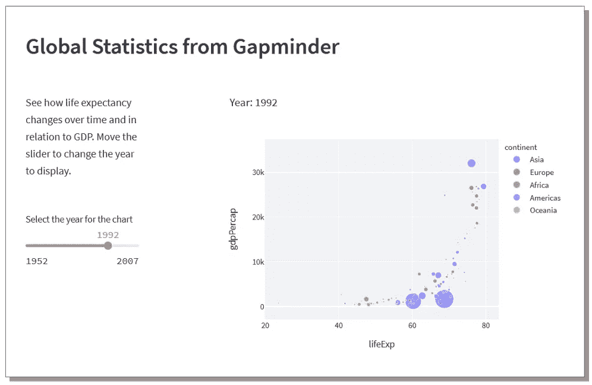
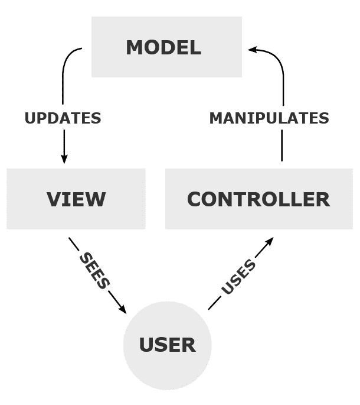
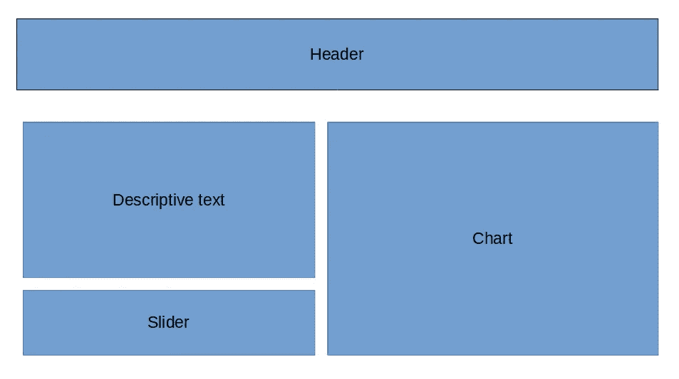
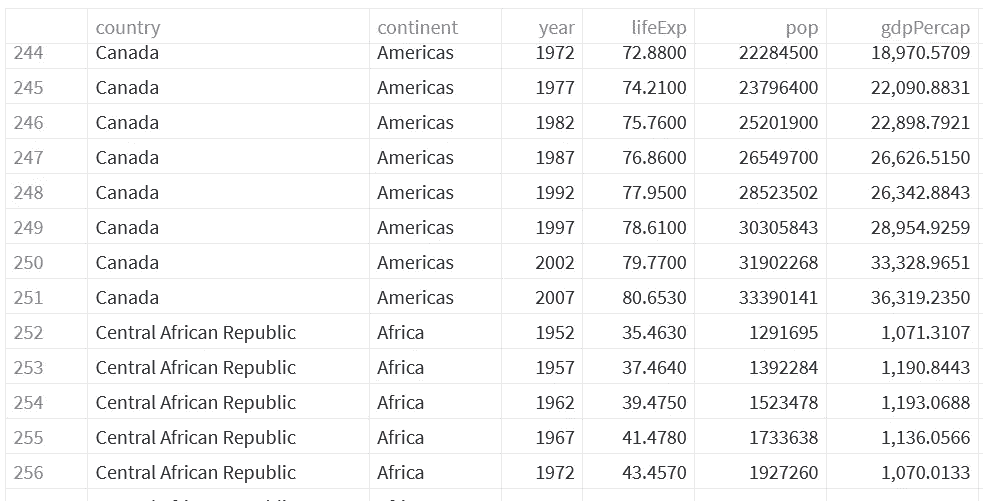

# 使用 Streamlit 的 Rational UI 设计

> 原文：<https://towardsdatascience.com/rational-ui-design-with-streamlit-61619f7a6ea4?source=collection_archive---------13----------------------->

## 数据可视化

## 从一个角度来看，Streamlit 是 web 开发中的一个倒退，因为它让你将应用程序的逻辑与它的呈现方式混合起来。但是从另一个角度来看，它大大简化了网页设计。



演示应用——作者图片

当蒂姆·伯纳斯·李第一次发明网络时，网页只是文本。当像 Mosaic 这样的第一个图形浏览器出现时，网页也有了图片。

后来，它们变成了应用程序，服务器端程序提供数据来构建网页。这通常需要在 HTML 中用 PHP、Java 或 Visual Basic 编写代码，服务器执行这些代码来构造页面。

结果往往是一顿真正的狗餐——分散在整个 HTML 中的代码并不清晰，因为它是支离破碎的，最重要的是，它还模糊了页面布局。

那些深入思考这些事情的人建议，我们应该将应用程序的逻辑与它的呈现方式分开。一个想法是模型、视图、控制器方法(MVC)。这里的模型是应用程序逻辑，通常是服务器上的一些数据和程序代码；视图是网页在浏览器中的外观，HTML 和 CSS 控制器是将模型连接到视图的代码，从 web 页面获取用户输入，将其提供给模型，并将结果返回到视图中显示。

如果这听起来很复杂…嗯，我能说什么呢-是的，有点复杂。

复杂是因为尽管 MVC 的想法足够简单，但是所需的技术和技巧意味着需要一大堆技能。对于视图，HTML 和 CSS 对于模型，像 Python、Java 或 C#这样的语言(可能还有一些 SQL)；对于控制器来说，可能是 Javascript，HTTP 的知识，现在还有 Ajax。

也许你从来没有听说过 MVC，但是许多 web 应用程序框架都是基于这个想法的。



MVC——图片由注册公司提供，公共领域，通过维基共享

因此，Streamlit 将代码和布局混合在一个实体中，这是倒退。但是，虽然这是真的，但它也试图让生活变得更容易，因为我上面提到的所有技术都不再是必要的——您需要的只是 Python 和 Streamlit 库。

那么，我们如何获得简单 Pythonic 方法的好处，而不陷入混合应用程序逻辑和页面设计的复杂性呢？

解决方案是牢记 MVC 方法，将程序逻辑从它的表现方式中分离出来。

Python 和 Streamlit 都可以帮助我们。

我们可以使用 Python 类和函数模块化应用程序，将视图从模型中分离出来，并且我们可以使用 Streamlit 函数构建视图。(Streamlit 最近增加了一个不错的功能:你可以将`with` 语句用于像`st.container`或`st.columns`这样的容器对象，这允许你显示页面的结构。)

MVC 的控制器部分由 Streamlit 负责，并被合并到视图中。

让我告诉你我的意思。

## 一个简单的模板

这是一个简单的模板，我们可以用它在 Streamlit 中构建一个 MVC 风格的应用程序。

```
##############################################
# A simple model/view template for Streamlit #
##############################################import streamlit as st################ Model ################
class Model:
   caption = "This is some text"################ View  ################
def view(model):
   st.write(model.caption)################ Start  ################
view(Model())
```

如你所见，这里有四个部分:导入，一个名为`Model`的类，一个名为`view` 的函数，最后一行调用带有参数`Model` 实例的`view` 函数。

这再简单不过了。`Model` 类只有一个属性`caption`,`view` 函数用它来写屏幕。

为了清楚起见，最后一行相当于创建一个类型为`Model`的对象，并将其传递给`view`函数。大概是这样的:

```
m = Model()
view(m)
```

## 真正的应用程序

现在，让我们假设我们想要设计一个简单的应用程序，看起来像本文顶部的图像。这已经成为人均国内生产总值与预期寿命之间关系的经典例证，并基于 Gapminder 已故汉斯·罗斯林的工作(如果你不知道 Gapminder 或汉斯·罗斯林，一定要关注[链接](https://www.gapminder.org/))。

应用程序的布局如下所示:



应用程序布局—按作者分类的图片

这是我们视图的基础:一个标题，下面是两列；右边的列包含我们想要显示的图表；左边一栏包含一些描述页面的文本，下面是一个滑块，允许用户选择要在图表上显示的年份。

下面是 Streamlit 视图的伪代码

```
# Header
st.header(*caption*)# Two columns: 
#  1\. Commentary and slider
#   2\. Main chart
commentaryCol, chartCol = st.columns(*dimensions*)with commentaryCol:
   # Show commentary text
   # Show year Slider
with chartCol:
   # Display Main Chart
```

你可以看到，我希望代码能够反映布局图——我们只需要填写详细的代码。

在此之前，我们还需要考虑视图需要什么数据。这是四件事:标题的标题，评论文本，滑块需要的参数，最后是要显示的图表。该数据将由模型提供。

让我们开始看代码。

## 进口

进口情况如下:

```
import streamlit as st
import pandas as pd
import plotly.express as px
```

我们需要 Streamlit(当然)，Pandas 来保存 Gapminder 数据，并 Plotly 来绘制图表。

模型应该出现在程序文件的下一个位置，但是我们现在要把它放在这里，看看我们是如何开发视图的。

## 景色

视图是一个名为`view`的函数，它包含创建网页的所有 Streamlit 代码。我们将模型的一个实例传递给它，Streamlit 需要的所有数据都将来自那里。例如，标题标题保存在模型中一个名为`header`的属性中，因此编写标题的 Streamlit 代码将是`st.header(model.header)`。

这是完整的代码，是我们之前看到的伪代码的发展。

```
################ View  ################
def view(model):
   st.set_page_config(layout = 'wide') # Header
   st.header(model.header)

   commentaryCol, spaceCol, chartCol=st.columns((2,1,6)) # Description
   with commentaryCol:
      st.write(model.description) # Year Slider  
   year=st.slider(model.sliderCaption,
      model.yearStart, model.yearEnd,
      model.yearStart, model.yearStep) #Chart
   with chartCol:
      st.plotly_chart(model.chart(year), 
         use_container_width = True)
```

注意，我使用了`with`语句来显示下面的代码是针对哪个 UI 元素的。这是最近发布的 Streamlit 库的一个很好的改进，使代码更容易阅读。

代码中的第一件事是将页面布局设置为*宽*。这不是必要的，但我认为最终结果看起来更好。

接下来是主要内容:

*   页眉:这只是在页面顶部显示`model.header`
*   一组列:有三列，右边的一列保存图表，左边的一列保存描述和滑块，中间的一列在另外两列之间留出一点空间。
*   描述进入`commentaryCol`并写出`model.description`
*   我们将用来选择年份的滑块也放在描述下方的`commentaryCol`中。滑块需要 5 个参数，一个标题，起点和终点，初始值和一个步长。这些由代码中所示的`model`属性提供。
*   图表放在`chartCol`中，是对`st.plotly_chart`的调用。要显示的实际图表是从名为`chart`的`model`中的方法返回的。该方法需要将年份作为参数传递。

最终的代码和我们之前看到的一样:它调用了`view`，并将`Model`的实例化作为参数。

```
################ Start  ################
view(Model())
```

## 模型

在模型中，我们需要提供视图需要的所有数据。大部分工作是在构造函数方法`__init__`中完成的。当从`Model`创建一个对象时，调用该方法。首先要做的是将 Gapminder 数据加载到 Pandas 数据框架中——Gapminder 数据包含在 Plotly 库中，因此我们正在使用它；在真正的应用程序中，这些数据可能是从数据库或 API 中加载的。



作者的 Gapminder 数据图片片段

从 Gapminder 数据中，我们设置了许多属性，一个独特年份的列表(我们将其从原始的 Numpy 类型转换为 Streamlit 似乎更喜欢的普通旧 Python `int`)。

然后，我们设置滑块将使用的开始、结束和步长值。

接下来是`chart`方法，它可以绘制一个散点图。

最后，我们为视图将使用的各种字符串设置属性。

```
################ Model ################
class Model:
   def __init__(self):
      self.df = pd.DataFrame(px.data.gapminder())
      self.ylist = [int(i) for i in self.df['year'].unique()]
      self.yearStart = self.ylist[0]
      self.yearEnd = self.ylist[-1]
      self.yearStep = self.ylist[1]-self.ylist[0] def chart(self,year):
      return px.scatter(self.df[self.df['year'] == year],
         x = 'lifeExp', y = 'gdpPercap', 
         title = f'Year: {year}',
         color='continent',size='pop') header = 'Global Statistics from Gapminder' description ='''
      See how life expectancy changes over time 
      and in relation to GDP.
      Move the slider to change the year to display.
   ''' sliderCaption='Select the year for the chart'
```

如果您现在将这些代码部分按照正确的顺序放在一起，您将拥有一个完整的 Streamlit 应用程序。

## 我们得到了什么

我们现在有了一个具有独立视图和模型的应用程序。如果我们想改变应用程序的外观，那么根本不需要修改模型代码，只需要修改`view`功能。

这使得更新和维护代码更容易，也使得代码更容易阅读和理解。如果出于某种原因，我们决定从其他地方获取数据，那么需要改变的只是模型代码，而不是视图。

这是一个相当小的例子，但是我希望你能看到这个 rational 方法将扩展到更复杂的应用程序，并使它们更容易编写和维护。

对于我给出的例子，我有一个疑问:滑块需要的值应该在视图中计算，还是应该放在哪里？在模型里？我这样做是为了一个更清晰的视图，但有一个论点是，这些值只是因为我们使用滑块的方式而计算的，所以在那里推导它们可能更合适。

我很高兴听到你对这种方法的看法，所以请在下面随意评论。

一如既往地感谢阅读，如果你想知道我什么时候发表新文章，请考虑在这里注册一个电子邮件提醒[。](https://alan-jones.medium.com/subscribe)

这篇文章的代码很容易从这里剪切和粘贴，但也可以在我的 [GitHub 页面](https://alanjones2.github.io/Alan-Jones-article-code/)上找到。这里还有一个演示页面——从下拉菜单中选择 *Rational UI 设计*。

如果你不是一个媒体订阅者，那就注册吧，这样你就可以每月花 5 美元阅读尽可能多的文章。在这里注册我会赚一小笔佣金。

<https://alanjones2.github.io> 