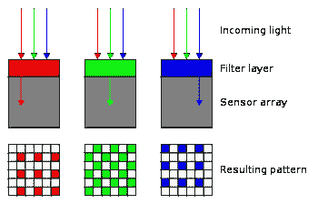
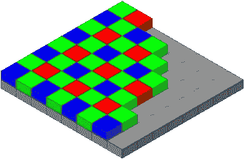

# Python 中的原始图像处理

> 原文：<https://towardsdatascience.com/raw-image-processing-in-python-238e5d582761?source=collection_archive---------14----------------------->

## 机器学习流水线的原始图像预处理

由 [Unsplash](https://unsplash.com?utm_source=medium&utm_medium=referral) 上 [ShareGrid](https://unsplash.com/@sharegrid?utm_source=medium&utm_medium=referral) 拍摄的照片

几乎所有现代相机都捕捉原始格式的图像，并以一种通常称为 sRGB 的格式进行处理，这种格式适合人类观看。然而，有人可能想知道所有的技术是用来转换成 sRGB 格式的原始图像是什么？为什么有必要？此外，人们可能想知道如何使用原始图像或以某种方式处理它们，以在一些机器学习任务中获得更好的性能。除了为每个过程提供一步一步的 python 代码之外，本文还试图回答所有这些问题。

Snapchat、Instagram 等社交媒体 app 上的大部分滤镜。，使用机器学习。这些过滤器背后的机器学习算法使用原始图像来处理过滤器的图像，以给出实时结果。因此，在设计使用原始图像的算法时，了解什么是原始图像以及相机如何处理它变得越来越重要。

# 到底什么是 raw 图像？

原始图像可以被定义为由照相机捕获的最低限度处理的图像。还需要通过软件方法来处理背景噪声、对比度、黑电平等。在大多数情况下，原始图像对人眼来说是不愉快的，并且需要被处理以令人愉快地观看。相机是如何捕捉原始图像的，相机传感器是如何工作的？

# 图像传感器是如何工作的？

图像传感器可以被认为是一个电路，由一个表面组成，用于捕捉相机快门的电磁波或当传感器暴露在光线下时。传感器的表面捕捉电磁波的强度，也称为光，在捕捉时入射到表面上。该表面可以被认为是一个 2D 阵列，其中每个元素存储入射光的强度。**但是，由于只存储光的强度，传感器无法理解光的颜色**。那么，传感器如何检测场景中的颜色呢？

为了检测传感器中的颜色，使用了各种技术；其中最常见和最广泛使用的是**拜耳过滤传感器**并在此讨论。

彩色滤光片的拜耳排列(来源:[https://en.wikipedia.org/wiki/Bayer_filter](https://en.wikipedia.org/wiki/Bayer_filter))

Bayer 滤波器用于通过使用滤波技术将输入的电磁信号映射到 RGB 空间。在光到达传感器之前，使用波长滤波器将入射光过滤成红色、绿色和蓝色。使用这种技术，可以知道特定颜色(在这种情况下，红色、绿色和蓝色)的强度。如图所示，红色、绿色和蓝色强度交替存储在 Bayer 滤波器中。一些相机上还使用了其他滤镜图案，但拜耳滤镜图案是使用最广泛的一种。

# 如何从图像中获取颜色通道

原始图像是 2D 阵列，包含各种波长/颜色的光强度信息。为了获得一个颜色通道，我们需要分离每种颜色的像素，然后将它们组合成一幅图像。然而，很容易看出绿色像素的数量是彩色像素的两倍。在这种情况下，相邻绿色像素的值被平均以获得单个值。因此，对于 H×W 大小的原始图像，获得的最终 RGB 图像是 H/2×W/2×3。

# 原始图像包含什么？

原始图像文件通常包含在从 Bayer 滤波器传递之后记录在图像传感器上的 2D 阵列形式的图像。该文件包含大量关于相机、光圈、照明条件等的元数据。这有助于图像的后处理。一些常见的元数据类型是黑电平、白电平、方向、色彩空间变换等。，这将在本文中讨论。所有这些步骤都需要在图像上完成，以将其转换为所需的格式来保持质量。

# 现在，我们将详细讨论一些步骤以及 python 代码:

## 黑色电平:

黑电平定义为图像最不强烈/最暗部分的强度。有必要在后处理过程中校准图像的黑电平，以获得原始原始图像中不存在的完美黑色像素。各种算法用于校正图像中的黑电平，超出了本文的范围。

## 方向:-

在某些相机中，图像是垂直反转存储的，因此元数据的方向信息有助于在这种情况下校正图像。相机中的镜头将图像以倒置的形式投射到传感器中。有时候，也是左右翻转。镜头的方向效应通常在相机内部进行校正，不需要在后处理过程中进行校正。

## 色彩空间转换:-

这几乎是所有图像处理流程中的最后一步。将处理后的图像转换到所需的颜色空间，如 sRGB、YCrCb、灰度等。，然后存储在磁盘中。最常用的颜色空间是 sRGb 颜色空间。执行色彩空间转换后，图像以形式存储在磁盘上。png，。jpeg 等。，图像存储格式。

相机管道比我们在这里讨论的要复杂得多，但本文讨论的细节足以在机器学习管道中使用原始图像数据。

欢迎在评论区提问。