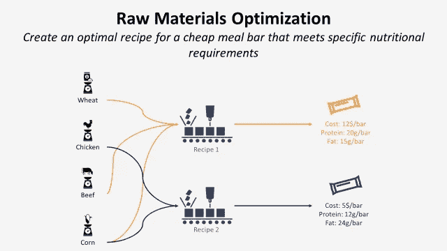
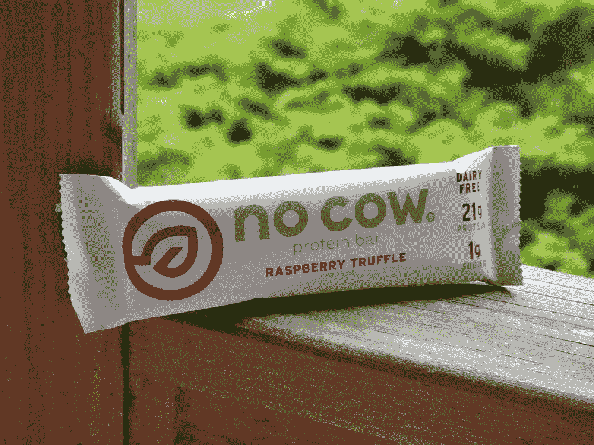
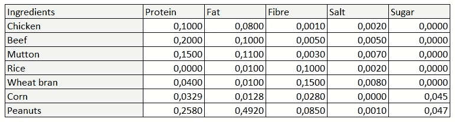
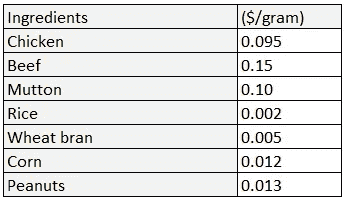

# 基于 Python 的食品生产原料优化

> 原文：<https://towardsdatascience.com/raw-materials-optimization-for-food-manufacturing-with-python-fbf2be4a74?source=collection_archive---------15----------------------->

## 使用线性规划创建一个满足特定营养需求的廉价餐吧的最佳食谱



优化餐吧制造的配方—(图片由作者提供)

# 如何用 Python 优化原材料？

作为一家大型食品制造商的 R&D 经理，你需要设计一家新的**便宜又健康的** *餐吧的食谱。*

餐吧必须起到 T4 餐的作用，而不仅仅是填补空缺的小吃。



照片由 [Unsplash](https://unsplash.com/s/photos/protein-bar?utm_source=unsplash&utm_medium=referral&utm_content=creditCopyText) 上的[sprouted](https://unsplash.com/@sproutified?utm_source=unsplash&utm_medium=referral&utm_content=creditCopyText)拍摄

这是一个带有目标和约束的**线性规划**问题陈述。

在这篇文章中，我们将看到如何建立一个模型来设计这个最佳食谱。

💌新文章直接免费放入你的收件箱:[时事通讯](https://www.samirsaci.com/#/portal/signup)

如果你喜欢看，看看这篇文章的视频版本

# 一.问题陈述

## 方案

7 种配料可供选择

*   **肉类:**鸡肉、牛肉、羊肉
*   **非肉类:**大米、玉米、麦麸、花生

这些成分每克含有不同的营养成分(以克计)



每种成分的营养成分—(图片由作者提供)

它们也有不同的成本(美元/克)



每种成分的每克成本—(图片由作者提供)

**目标**

最小化每根棒**(重量:120 克)**的总成本。

**约束条件**

蛋白质和纤维的最低值

*   **蛋白质:** 20g
*   **纤维:** 6g

脂肪、盐和糖的最大值

*   **脂肪:** 22g
*   **盐:** 3g
*   **糖:** 30g

## 结果

*   **场景 1**

```
**Cost per Bar = 7.91 $**Qty_Beef = 48.56 g
Qty_Chicken = 0.0 g
Qty_Corn = 0.0 g
Qty_Mutton = 0.0 g
Qty_Peanuts = 34.09 g
Qty_Rice = 0.0 g
Qty_Wheat_bran = 37.36 g
```

你只需要放入牛肉、花生和麦麸，总成本为每条 7.91 美元(120 克)。

*   **情景 2:** 将蛋白质水平降至 **12 克**

```
**Cost per Bar = 0.78 $**Status: Optimal
Qty_Beef = 0.0 g
Qty_Chicken = 0.0 g
Qty_Corn = 0.0 g
Qty_Mutton = 0.0 g
Qty_Peanuts = 43.15 g
Qty_Rice = 55.19 g
Qty_Wheat_bran = 21.66 g
```

你的酒吧现在是纯素食，而且相当便宜。

*   **场景 3:** 将糖减少到 20 克

```
**Cost per Bar = 10.32 $**Status: Optimal
Qty_Beef = 65.32 g
Qty_Chicken = 0.0 g
Qty_Corn = 0.0 g
Qty_Mutton = 0.0 g
Qty_Peanuts = 30.96 g
Qty_Rice = 0.0 g
Qty_Wheat_bran = 23.72 g
```

为了保证低糖，你需要多吃肉。因此，你会看到你的成本每酒吧增加。

[](http://samirsaci.com) [## 萨米尔·萨奇

### 数据科学博客，专注于仓储，运输，数据可视化和机器人流程自动化…

samirsaci.com](http://samirsaci.com) 

# 二。构建您的模型

Pulp 是一个线性(lp)和整数规划(IP)问题的建模框架，用 Python 编写，由 COIN-OR Foundation(运筹学计算基础设施)维护。

> *你可以在这个 Github 库中找到完整的代码:* [*链接*](https://github.com/samirsaci/raw-materials) *。
> 我的投资组合与其他项目:* [*小萨奇*](https://samirsaci.com/)

## 1.导入参数

您也可以在我的 GitHub 存储库中找到这些数据集。

**营养知识**

**配料成本**

## 2.声明您的变量、参数和模型

*   你的目标是最小化你的酒吧的成本
*   *下限* =0:配料数量不能为负值

## 3.定义目标并添加约束

## 4.求解模型并分析结果

# 三。后续步骤

*关注我，了解更多与供应链数据科学相关的见解。*

这个解决方案并不完美，你可以很容易地改进它。

*   如果你的顾客想要玉米怎么办？

您可以通过添加玉米最小数量的限制来将玉米添加到此食谱中。

*   我们有无限的可能性吗？

让我们试着把数量从 120 克换成 100 克，结果是什么？

```
Cost per Bar = 11.08 $**Status: Infeasible**
Qty_Beef = 71.27 g
Qty_Chicken = 0.0 g
Qty_Corn = 0.0 g
Qty_Mutton = 0.0 g
Qty_Peanuts = 30.26 g
Qty_Rice = 0.0 g
Qty_Wheat_bran = -1.53 g
```

对于这种约束组合，100 克的杆没有最优解。

要获得最小量，首先列出限制(营养事实)，然后尝试找到可行的最小量。

# 关于我

让我们连接上 [Linkedin](https://www.linkedin.com/in/samir-saci/) 和 [Twitter](https://twitter.com/Samir_Saci_) ，我是一名供应链工程师，正在使用数据分析来改善物流运作和降低成本。

如果你对数据分析和供应链感兴趣，可以看看我的网站

[](https://samirsaci.com) [## Samir Saci |数据科学与生产力

### 专注于数据科学、个人生产力、自动化、运筹学和可持续发展的技术博客

samirsaci.com](https://samirsaci.com) 

# 参考

[1]运筹学计算基础设施，优化与纸浆(文档)，[链接](https://coin-or.github.io/pulp/)