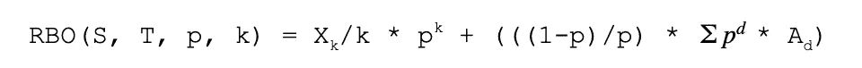

# RBO v/s Kendall Tau 比较项目清单

> 原文：<https://towardsdatascience.com/rbo-v-s-kendall-tau-to-compare-ranked-lists-of-items-8776c5182899?source=collection_archive---------7----------------------->

在解决排名问题(提要排名、搜索排名等)时。)，我经常遇到需要比较不同系统生成的排序列表的情况——例如生产 v/s 和 A/B 测试。比较两个或更多排名列表的需要比你想象的更普遍。让我们考虑一个简单的例子:你和几个朋友决定列出流行电视连续剧《老友记》中你最喜欢的 5 集。每个人都写下他们最喜欢的 5 集标题，第一项表示他们最喜欢的，最后一项表示他们最不喜欢的集。你们每个人现在可能都想知道你的清单与房间里的其他两个朋友有多相似或不同。

图 1 由 3 个不同的人排列的情节

我们如何着手比较这些列表？形式上，这些排名列表被称为不完整的排名，因为它们没有对《老友记》中的所有剧集进行排名，而是只选择了前 5 名。我们将讨论一些在解决这个特殊问题时流行且相当普遍的方法。

# 方法一:肯德尔·陶

肯德尔τ度量也称为肯德尔相关性，是用于检查两个排序列表是否一致的常用方法。

图 2 按人 1 和人 3 排列的情节的并排比较

肯德尔相关性(𝛕)可以通过首先计算一致对的数量(c)和不一致对的数量(d)来计算。如果一对在它们的排序列表中以相同的顺序出现，则称它们是一致的。

M = (C -D)

𝛕 = M / (C + D)

在我们的示例(图 2)中，两个联合排名列表之间不同对的最大数量是= 5 Choose 2 = *(5 *(5–1))= 10。如果所有对都一致，那么 C = 10，D = 0，这意味着 max(𝛕)=(10–0)/(10+0)= 1。如果所有对都不一致，那么 C = 0，D = 10，这意味着 min(𝛕)=(0–10)/(0+10)=-1。

让我们来计算一下𝛕的实际价值

和谐对:

(S6E17，S2E10) (S6E17，S3E24) (S6E17，S3E25) (S6E17，S3E15) (S2E10，S3E24) (S2E10，S3E25) (S2E10，S3E15) (S3E24，S3E25)

不和谐对:

(S3E24，S3E15) (S3E25，S3E15)

𝛕 = (8–2) / (8 + 2) = 0.6

## 解读肯德尔·陶

请注意，𝛕可以采用的最大值和最小值分别是+1 和-1。+1 表示完全同意，-1 表示完全不同意。值为 0 表示排名之间没有相关性。我们为图 2 计算的值 0.6 向我们显示了等级具有中等相关性

另一种解释𝛕的方式是，它的统计量 **M** 是排列一个排序列表使其与另一个相似所需的相邻两两交换的数量。这是否让你想起了一个流行的排序算法？当然是泡泡排序啦！

您还可以测试肯德尔τ指标的统计显著性[8]。

## 履行

修改的 Kendall Tau 可以应用于包含平局的排名——例如，如果一个人非常喜欢一集，以至于他们将同一集列在他们列表中前 3 名的所有 3 个位置中。排名中的联系并不少见。我最近在网飞实现了一个定制的 O(NLogN) Kendall Tau 算法来处理平局。以下是该算法的一些开源实现:

*   [Java] Apache commons [库](https://commons.apache.org/proper/commons-math/javadocs/api-3.6/org/apache/commons/math3/stat/correlation/KendallsCorrelation.html)
*   【Python】SciPy[库](https://docs.scipy.org/doc/scipy-0.15.1/reference/generated/scipy.stats.kendalltau.html)

## 习惯

Kendall Tau 是一种流行的方法，用于信息检索任务，如搜索引擎和推荐系统。像雅虎[1]和微软[3]这样的公司已经在各种用例中使用了这种方法。

## 缺点

尽管 Kendall Tau 是一种流行的等级相关性度量，但它也有缺点:

1.  它要求两个排名列表是相连的(两个列表中的元素相同)
2.  它是不加权的，也就是说，它对列表底部的分歧和顶部的分歧同样重视(在流行的搜索引擎中，“头部”的结果比“尾部”的结果更重要)
3.  单个不和谐对的贡献随着排序深度的增加而减少，即𝛕值与排序列表的深度有内在联系。

为了证明这些缺点，考虑来自图 1 的人 1 对人 2 的排序列表。请注意，两个列表之间只有两集是相同的:S2E10 和 S3E24。Kendall 相关性不能应用于这些列表，因为它们是不相连的(不包含完全相同的项目)。将 Kendall 相关性应用于这两个列表的一个潜在方法是用特殊字符“#”替换两个列表中不存在的项目。然后，人物 1 排名变为“# S2E10 # S3E24 #”，人物 2 排名变为“# S2E10 # # S3E24”。即使 S3E24 在人 1 的列表中位于位置 3，在人 2 的列表中位于位置 4(基于零的索引)，计算这些变换列表的𝛕也将得到值 1.0。这个值 1.0 表示两个列表之间完全一致—显然这里不成立。

# 方法 2:秩偏重叠(RBO)

与 Kendall Tau 距离度量不同，RBO 是一种相似性度量。RBO 通过使用每个等级位置的权重解决了在 Kendall Tau 中观察到的 3 个缺点。权重是从一个收敛的序列中导出的。下面的等式描述了两个无限排名列表 S 和 T 的 RBO:

参数 **p** 是范围(0，1)内的可调参数，其可用于确定顶部 **d** 等级对 RBO 相似性度量的最终值的贡献。注意 SUM( **p** ^( **d** -1))的求和项是收敛的，因为它是一个几何级数。它的和由 1/(1- **p** 给出，由于 0 < **p** < 1，所以和是有限的。

为了得到一个单一的 RBO 分数，我们可以从现有的信息中进行推断，假设深度为 k 的协议在两个列表中无限延续。单一 RBO 分数可以使用以下公式计算:

以下是 Python 3 中外推的单一得分 RBO 测量的简单(未经彻底测试)实现:

## 如何选择‘p’的值？

在 RBO 度量中， **p** 值的选择决定了最终的 RBO 度量所表现出的最高加权度。根据 RBO 论文，以下等式可用于计算最高 d 级对 RBO 计算的总权重:

下面是上述内容的一个简单(未经彻底测试)实现:

对于 p = 0.9 和 d = 10 的值(正在检查前 10 个等级)，WRBO[1:d]是 0.8556，即前 10 个等级对最终的 RBO 度量贡献了 85.56%。因此，根据您希望从顶部 **d** 结果中获得的贡献量，您可以使用上面的 WRBO[1:d]等式相应地选择 **p** 的值。

## 解读 RBO

如上所述，RBO 取范围[0，1]中的值，其中 0 表示不相交，1 表示相同的排序列表。

让我们回到 Kendall Tau 未能识别由人 1 和人 2 生成的明显不相似的排序列表的例子:

人物 1 的排名是“# S2E10 # S3E24 #”

人物 2 的排名是“# S2E10 # # S3E24”

我将选择 p = 0.6，因为我希望前 3 个位置承载最大的权重。在 p = 0.6 的情况下，在最终的 RBO 度量中，前 3 个位置承担 91.26%的权重。代入人 1 和人 2 的值，我们得到 RBO(人 1，人 2，p，k) = 0.24144，即，RBO 值指示两个列表大部分不同，在前 3 个位置有一些轻微的相似性。将 **p** 的值增加到 0.9 导致更高的 RBO 值 0.352655，但是该值能够显示两个列表是不同的。

总之，RBO 是判断不一定相连的不定排名列表的相似性的更健壮的度量，并且它能够被调整用于最高加权。要进一步阅读 RBO 及其背后的理论，请参考 RBO 的论文[2]。

# 进一步阅读

我们通过一些方法来比较两组不同的排名。以下是进一步阅读的一些其他方法:

*   皮尔逊相关[5]
*   Kolmogorov-Smirnov 检验[6]
*   比较前 k 名列表[7]

# 一些值得思考的问题

最后，我想留给你们一些思考的东西:

想象一下，比较列表中的任意两个项目并不那么简单。通过拍摄足球世界杯的照片，说出您对该赛事最喜爱的 5 大赛事的排名。例如，图 3 显示了两幅来自同一事件的图像，当时马里奥·格策打进了决定性的加时赛进球，但它们是相隔几秒钟拍摄的不同图像。如果我们想计算排名表上的 RBO 或肯德尔τ，能够分辨两幅不同的图像是相同的是很重要的。我们如何比较两幅图像并判断它们来自同一事件？

图 3 2014 年德国 V/s 阿根廷世界杯同一赛事两幅图[4]

## 参考

[1]库马尔、拉维和谢尔盖·瓦西维茨基。"排名之间的广义距离."*第 19 届国际万维网会议录*。2010.

[2]威廉·韦伯、阿利斯泰尔·莫法特和贾斯汀·佐贝尔*。* 2010 *。*“不确定排名的相似性度量”。 *ACM Trans。Inf。Syst。28，4，第 20 条(2010 年 11 月)，38 页。*DOI:https://DOI . org/10 . 1145/1852202 . 4666666666

[3] Bachrach，Yoram，Ralf Herbrich 和 Ely Porat。"在协同过滤系统中近似等级相关性的草图算法."*字符串处理与信息检索国际研讨会*。斯普林格，柏林，海德堡，2009。

[4]足球世界杯图片归属:

[左图]Danilo Borges/Portal da Copa copa2014.gov.br licensa Creative Commons a tripbui o 3.0，CC BY 3.0<[https://creativecommons.org/licenses/by/3.0](https://creativecommons.org/licenses/by/3.0)>，通过 Wikimedia Commons

[右图]Danilo Borges/Copa 2014 . gov . BR licensa Creative Commons a tripbui o 3.0 Brasil，CC BY 3.0 BR<[https://creativecommons.org/licenses/by/3.0/br/deed.en](https://creativecommons.org/licenses/by/3.0/br/deed.en)>，通过 Wikimedia Commons

[5] Benesty，Jacob，等.“Pearson 相关系数.”*语音处理中的降噪*。斯普林格，柏林，海德堡，2009。1–4.

[6] Massey Jr，Frank J .“拟合优度的 Kolmogorov-Smirnov 检验”*美国统计协会杂志*46.253(1951):68-78。

[7]费金、罗纳德、拉维·库马尔和达克希纳穆尔西瓦库马尔。"比较排名前 k 的名单." *SIAM 离散数学杂志*17.1(2003):134-160。

[8]肯德尔τ显著性检验[https://en . Wikipedia . org/wiki/Kendall _ rank _ correlation _ coefficient #显著性检验](https://en.wikipedia.org/wiki/Kendall_rank_correlation_coefficient#Significance_tests)