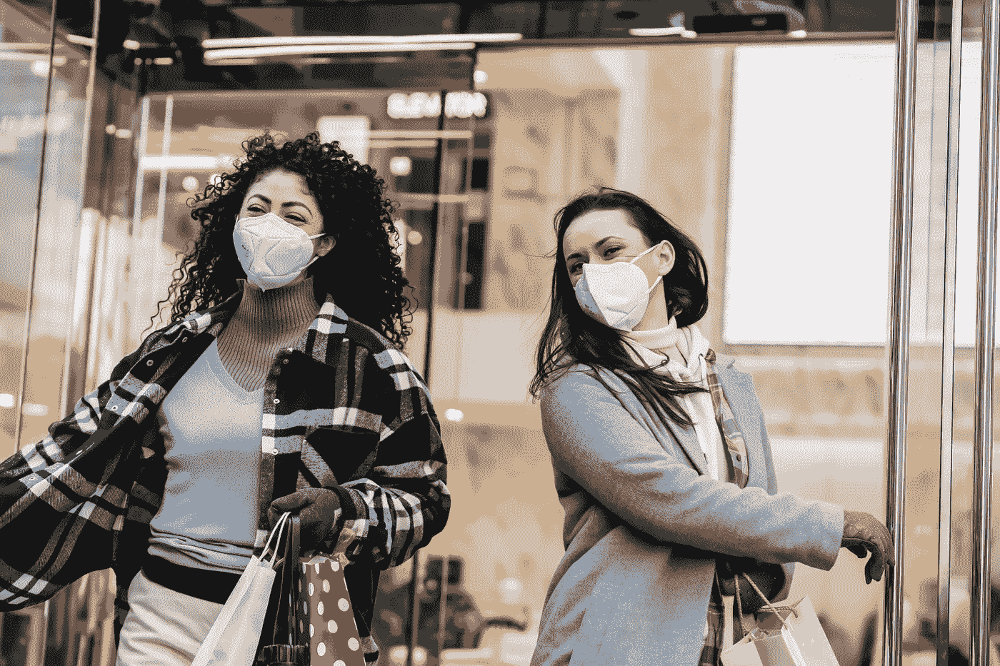
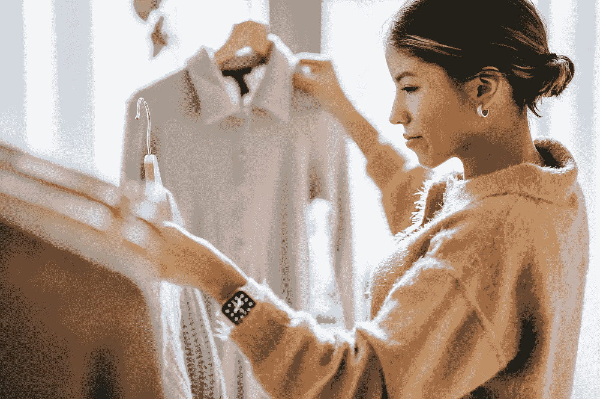
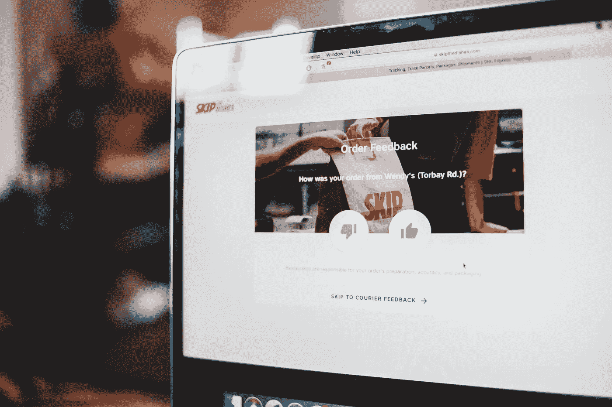

# 重新想象时尚行业-第一部分

> 原文：<https://towardsdatascience.com/re-imagine-the-business-of-fashion-part-1-cc8037cbef6d?source=collection_archive---------23----------------------->

## **时尚品牌和零售商如何通过高级分析重新想象时尚？**

由[安德里亚·皮亚卡迪奥](https://www.pexels.com/@olly)在[像素](https://www.pexels.com/search/shopping/)上拍摄的照片

我对数据分析的兴趣始于 2020 年，当时我偶然发现了一篇关于时尚行业不同分析案例的文章。老实说，这是一篇很长的阅读，总共约 60 页，但我喜欢它的每一点，远远超过我读过的任何其他时尚技术相关的文章。

这激发了我对时尚分析的兴趣，尤其是在非洲时尚行业。

遗憾的是，我在非洲时尚界找到的关于这个主题的信息很少，每次我向人们提到我在探索时尚界的分析时，他们都觉得有点奇怪，但很有趣。

我发现，没有多少时尚专业人士意识到数据分析在时尚业务中的应用。

我没有独自启发身边的人，而是得出结论 ***【非洲的时尚需要被重新想象】*** 并且我开始思考我可以如何为此做出贡献，这就是我创办时尚科技博客的原因。

每篇文章都旨在启发和教育时尚技术爱好者、年轻专业人士、设计师、零售商和学生，让他们了解高级分析和机器学习对时尚行业的破坏。

> 如果你属于上面提到的任何一类，这篇文章肯定适合你！

在深入研究高级分析的应用之前，让我先介绍一下新冠肺炎疫情对时尚零售的影响。

照片由[蒂姆·道格拉斯](https://www.pexels.com/@tim-douglas?utm_content=attributionCopyText&utm_medium=referral&utm_source=pexels)从[派克斯](https://www.pexels.com/photo/female-friends-in-masks-walking-out-of-shopping-center-6567730/?utm_content=attributionCopyText&utm_medium=referral&utm_source=pexels)拍摄

## 新冠肺炎·疫情对时尚界的影响

根据 Fashion United 的数据，时尚产业的价值超过 3000 万亿美元，约占全球国内生产总值(GDP)的 2%。

2019 年，全球服装和鞋类市场约为 2650 亿美元，仅耐克一家就创造了超过 390 亿美元的收入，预计到 2030 年，该市场将达到 3.3 万亿美元。

尽管 covid 19 大流行带来了前所未有的惊喜，时尚专家仍然预测 2021 年在线业务将增长 20%或更多。

***有趣吧？***

不幸的是，并不是所有的企业都能迅速适应疫情带来的变化。虽然一些企业很快接受了分析(*表现更好 68%，来源:麦肯锡&公司*报告)，但其他坚持传统营销或晚于采用技术和创新的企业开始失去市场份额，一些企业倒闭了。

这进一步证明了销售统计预测，即今年拥有数字渠道的品牌将获得至少 20%的收入。

> 尽管有增长预测，数字化转型仍然是时尚产业的悖论。

有趣的是，麦肯锡报告称，144%的行业利润是由领先的 20%的全球时尚品牌产生的。这意味着一个时尚品牌要想获得可观的利润，它需要在这 20%中。

*和我一样，你可能想知道这些时尚品牌是如何保持行业领先地位的* ***。***

***继续阅读……***

描述这种增长的简单概括就是*’****【数字化转型与创新】*** *。*

例如，Zalando 报告 2020 年第二季度商品总量(GMV)增长了 32-34 %, 2021 年第一季度 GMV 增长了 50%。(*资料来源:Zalando 出版物*)。

这是一个很大的增长，尤其是考虑到全球疫情期间的时尚现状。

***你同意吗？***

在新冠肺炎危机之前，已经建立并采用数字化转型的公司包括:

*   高级分析。
*   机器学习模型。
*   人工智能
*   强大的数字/电子商务平台等

已经开始超越没有利用上述任何一种数字化转型的竞争对手。

> 因此，可以肯定地说，数字化转型并非始于 2020 年，相反，新冠肺炎危机加速了转型，也扩大了上述两类公司之间的差距。

就本文而言，我将重点关注高级分析以及顶级时装公司如何在业务中利用它。

## 分析的真正含义是什么？

来自[像素](https://www.pexels.com/photo/people-discuss-about-graphs-and-rates-3184292/?utm_content=attributionCopyText&utm_medium=referral&utm_source=pexels)的[像素](https://www.pexels.com/@fauxels?utm_content=attributionCopyText&utm_medium=referral&utm_source=pexels)的照片

分析是指发现和交流数据中存在的有意义的观察结果和模式的科学方法。它倾向于根据在给定的原始数据中发现的模式来回答问题。

它本身不是一种独立的方法，它依赖于计算机编程、统计、商业智能以及研究的应用，以便从原始数据中创建解释、量化和获得洞察力。

时尚界的分析已经成为品牌和零售商最常用的工具之一，其应用不仅限于销售预测。其他一些领域包括:

*   趋势分析
*   数字分析
*   风险分析
*   网络分析
*   预测建模
*   销售优化
*   营销和广告
*   物流等

根据业务挑战、技术支持和可用资金，在上述任一领域应用分析不仅会增加公司的销售额，还会增加其长期竞争优势。

> **这是一篇很长的阅读，但我很高兴我们已经涵盖了分析的基础。为了更好地理解利用高级分析的好处，强调时尚品牌和零售商面临的一些挑战是很重要的。**

*拿起你的咖啡，让我们开始吧！！*

# 时尚公司有哪些挑战？

来自 [Pexels](https://www.pexels.com/photo/a-woman-shopping-in-a-boutique-5698855/?utm_content=attributionCopyText&utm_medium=referral&utm_source=pexels) 的 [RODNAE Productions](https://www.pexels.com/@rodnae-prod?utm_content=attributionCopyText&utm_medium=referral&utm_source=pexels) 的照片

时尚界是一个相当复杂的行业，时尚消费者的偏好变化非常快。

随着对高级分析和其他技术的更多了解，时尚品牌和零售商正在寻求优化数据分析的方法，以便通过针对目标客户的精确个性化来改善产品供应。反过来，更多的销售，更多的营业额，更多的利润！

**以下是一些时尚商业挑战:**

*   **客户偏好的复杂性和寿命**:业务中采用的高级分析方法需要考虑尺寸、颜色、合身程度、风格、地点、季节、生活方式等。这些属性正在迅速变化，因此，仅仅根据前几年的销售数据或直觉来分析你的业务是不够的。
*   **缺乏数据整合:**将公司不同部门创建的数据隔离开来，阻碍了数据在分析中的有效使用。
*   **减少产品退货的困难**:由于顾客偏好的复杂性，例如尺寸，零售商对退货数量几乎没有控制。回报越多，管理费用就越多。
*   **无法优化可用数据:**虽然**的**一些时尚公司拥有大量数据，但不知道如何使用它们，一些品牌没有数据驱动的文化。
*   **无法准确预测趋势:**由于上述挑战，品牌和零售商无法准确预测设计和销售趋势。这反过来又会导致生产过剩(最终可能会被填埋)、不必要的折扣/清仓销售、商店停业等。

*你期待已久的部分来了……*

***兴奋？***

我也是！！！

## 高级分析如何重塑时尚产业？

照片由 [Liza Summer](https://www.pexels.com/@liza-summer?utm_content=attributionCopyText&utm_medium=referral&utm_source=pexels) 从 [Pexels](https://www.pexels.com/photo/concentrated-woman-with-hangers-and-clothes-6347538/?utm_content=attributionCopyText&utm_medium=referral&utm_source=pexels) 拍摄

1.  **分析消费者行为偏好:**利用时尚行业的高级分析可以帮助公司深入了解客户行为和需求。这反过来又可以指导**回答**的问题，例如:

*   投放什么广告，给谁，在什么时间？
*   谁有可能在获得折扣后转化？
*   有哪些适合的产品推荐？
*   我们如何改善客户体验？等等。

应用**数据驱动的情绪和行为分析**可以帮助公司更好地了解市场趋势，从而提高转化率。

例如，Zara 收集店内数据，将其发送给市场分析师，让他们理解这些数据，并洞察顾客的需求。

因此，这些见解会被发送给设计团队，由他们来生产服装并投放到 Zara 商店。

另一个例子是消费者数据分析在拉夫·劳伦趋势预测中的应用。通过高级分析，拉尔夫·劳伦可以了解顾客的偏好，如颜色、面料、价格等。

从而提高趋势预测的准确性。

**2。预测库存和销售分布:**

借助预测分析，时尚公司可以将他们的价格和库存与竞争对手的数据进行比较，这可以帮助他们更好地改善营销活动，并提高销售和需求预测的准确性。

一些时装零售商还应用自然语言处理(NLP)来更好地理解特定目标市场的行话，以更好地了解消费者的购买力、市场趋势以及为正确的受众制作适当的广告。

> 调整预测分析也有助于通过识别高需求或新兴产品来防止库存过多和库存不足。因此，减少了优化库存所花费的时间和金钱

Zara 是一家成功实施这一技术的时尚零售商，从而优化了供应链规划，确保正确的库存总是在正确的时间被送到正确的商店

**3。帮助顾客找到合适的产品**

寻找合适的衣服是顾客面临的挑战之一，尤其是在网上购物时。通过预测分析(结合增强现实(AR)和图像处理)等高级分析，客户可以通过使用虚拟试衣间轻松找到适合他们的时尚产品。

这三项技术的结合用于分析顾客的身体尺寸，预测哪件衣服最适合他们，并向他们展示他们穿起来的样子。

***听起来很迷人对吧？***

照片由来自 [Pexels](https://www.pexels.com/photo/computer-screen-with-online-shopping-service-4249027/?utm_content=attributionCopyText&utm_medium=referral&utm_source=pexels) 的 [Erik Mclean](https://www.pexels.com/@introspectivedsgn?utm_content=attributionCopyText&utm_medium=referral&utm_source=pexels) 拍摄

Rent The Runway (RTR)的数据团队分析客户对其身体数据和服装合身程度的评论，以便为拥有类似身体的客户提供更多有用的见解。

这些身体数据包括体型、体重、胸围、服装尺寸、身高、体重等，有时还包括衣服出租的活动、利弊。然后，环球旅行利用这些信息为进一步购买创造有价值的见解。

> 高级分析可以帮助客户在更短的时间内找到更合适的产品，从而让他们更开心，减少退货，并增加客户继续购买的可能性。

**4。增加建立可持续时尚企业的可能性:**

高级分析可以帮助时尚品牌和零售商在从设计阶段到库存和交付的价值链的每个步骤中减少浪费。通过提供；

*   对市场趋势的更好理解。
*   更好的价格选择。
*   更好的商品和库存。
*   更好的采购选择。
*   趋势预测的准确性更高。
*   销售分销策略。
*   更符合建议。
*   更好的广告和折扣等。

> 从长远来看，高级分析确实可以让时尚行业变得更加可持续和有利可图。

## 时尚品牌采用数据分析的例子

*   德国零售巨头- Zalando
*   西班牙一品牌
*   海恩斯莫里斯
*   亚马孙
*   租用跑道
*   缝合固定
*   拉尔夫·劳伦
*   net-搬运工

**提供高级分析服务的科技公司示例:**

*   Heuritech
*   WGSN
*   雷塔隆
*   趋势分析
*   净收益

## 结论

由于高级分析仍在发展和进步，它已经展示了许多前景，并为时尚品牌和零售商创造了一条更有利可图的途径，同时具有可持续发展意识。

> 尽管有这些承诺和前景，一些时尚公司仍然没有采用这些技术，或者是由于；

*   资本不足。
*   缺乏强大的数据技术支持团队。
*   难以从现有数据中获得深刻见解。
*   不了解这些技术。
*   或者完全缺乏数字和数据驱动的文化

虽然高级分析的最终结果是改进营销活动、更好的产品推荐、规划优化、改进分销和网络以及减少浪费，**时尚公司需要了解他们的业务挑战，以便选择合适的技术来应用。**

[点击此链接](https://olaoluwakiitan-o-olabiyi.medium.com/re-imagine-the-business-of-fashion-part-3-efcc6d277d8c)了解高级分析如何帮助时尚行业变得更加可持续和有利可图。

我希望你喜欢阅读这篇文章？

**你能想出更多在时尚界采用高级分析的方法吗？**

*让我们在聊天环节讨论这个问题。*

> 请点击下面的链接，为我的时尚研究调查做贡献。
> 👇🏼👇🏼👇🏼👇🏼👇🏼
> [时尚研究调查](https://forms.gle/CHRCNF9R74vxjHic7)
> 谢谢🤗。

**在**[**LinkedIn**](https://www.linkedin.com/in/olaoluwakiitan-olabiyi/)**和**[**Twitter**](https://twitter.com/Kiitan_Olabiyi)**上联系我或者发邮件给 info@data4fashion.org**

干杯，
时尚数据女王(Kiitan)