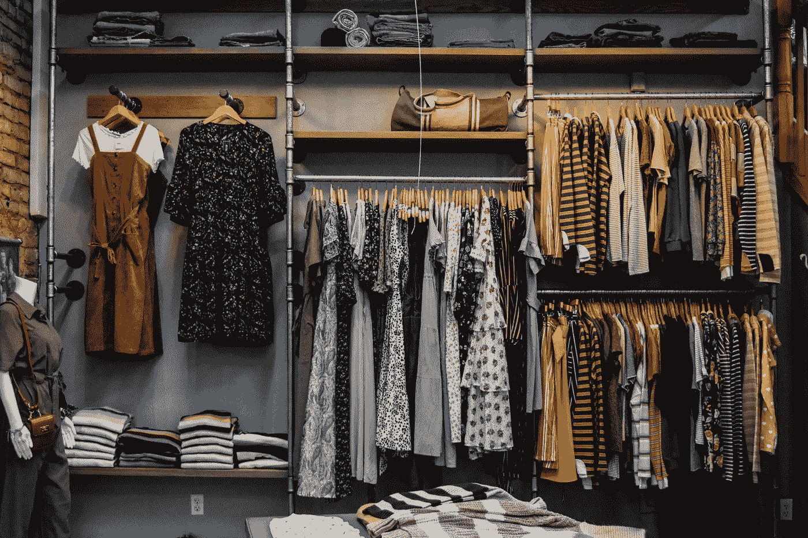
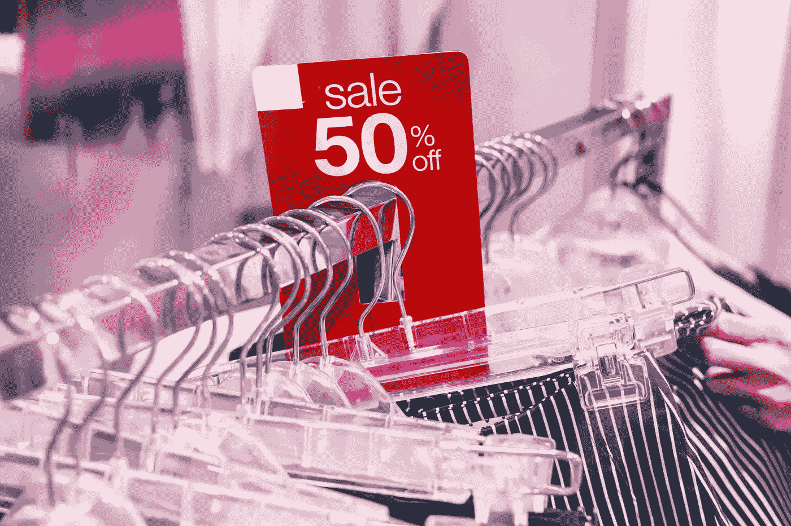
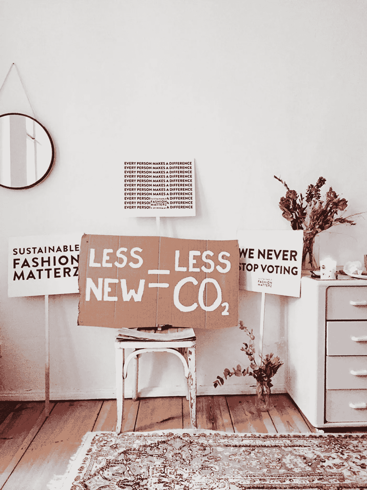

# 重新想象时尚行业:第二部分

> 原文：<https://towardsdatascience.com/re-imagine-the-business-of-fashion-part-3-efcc6d277d8c?source=collection_archive---------26----------------------->

## 数据科学可以让时尚产业变得更可持续。真的还是假的？

照片由 [Pexels](https://www.pexels.com/photo/woman-in-yellow-jacket-holding-white-plastic-hanger-8386645/?utm_content=attributionCopyText&utm_medium=referral&utm_source=pexels) 的[罗恩·拉赫](https://www.pexels.com/@ron-lach?utm_content=attributionCopyText&utm_medium=referral&utm_source=pexels)拍摄

时尚行业的对话无疑正在发生变化。随着越来越多的人意识到时尚活动对环境的有害影响，以及在经营一个成功的时尚企业时面临的其他挑战。

其中一些挑战围绕着在保持以客户为中心的业务模式的同时，平衡可持续性与盈利能力的尝试。

*继续阅读…*

术语 ***“可持续发展”*** 已经成为行业中的流行语，一些品牌真正知道它的意思，但却选择遵循 ***“绿色洗涤之路”。*** 而其他人不知道它需要什么，假设它主要是关于使用棉花和大麻，忘记考虑浪费的水量，过度生产，产生的烟雾，恶劣的劳动工资和工作条件等。[点击此处查看由于棉花消费增加而带来的水资源挑战统计数据](https://www.theworldcounts.com/challenges/consumption/clothing/cotton-farming-water-consumption/story)

人们对 [***【可持续时尚】***](https://shopchechi.com/blogs/news/the-challenges-with-sustainable-fashion-chechi) 已经有了很多了解，所以我想告诉你更多关于数据科学如何帮助时尚公司建立更可持续的业务。

***走吧！！！***

**数据科学是一个应用多个学科的研究领域，例如:**

*   机器学习算法
*   商业智能
*   探索性数据分析
*   数据产品工程等

以便从原始数据中提取可操作的见解。它涉及数据清理、分析、处理、高级分析，以及向利益相关者最终呈现见解和观察/模式，以便做出**数据驱动的决策。**

**数据科学所需的一些技能包括:**

*   软件编程
*   数学
*   统计数字
*   批判性思维等。

> 现在来谈谈这个问题…
> 
> ***数据科学能否帮助时尚行业更可持续发展？***

答案是**是的！**

照片由[energepic.com](https://www.pexels.com/@energepic-com-27411?utm_content=attributionCopyText&utm_medium=referral&utm_source=pexels)从[派克斯](https://www.pexels.com/photo/blue-and-yellow-graph-on-stock-market-monitor-159888/?utm_content=attributionCopyText&utm_medium=referral&utm_source=pexels)拍摄

时尚公司只会根据非结构化数据做出设计和销售决策，而不会听取数据对客户偏好和旅程的说明，这样的日子已经一去不复返了。

随着数据科学的采用，一些时尚企业已经能够在实现可持续发展的同时获得更多利润。

## **数据科学的 4 种独特方式让时尚产业更具可持续性**

**1。从社交媒体和其他在线渠道获得见解:** [例如，Heuritech](https://www.heuritech.com/) 利用社交媒体数据来获取特定的服装细节，以便全面了解时尚产品和市场。

Heuritech 抓取数百万**公共社交媒体内容，**应用计算机视觉技术、机器学习预测算法、市场智能平台，精准预测流行趋势。(*来源:Heuritech* )

从而减少因生产过剩或分配不当而产生的浪费。

这反过来又有助于时装业更加有利可图和可持续发展。

**2** 。**预测要生产的产品的正确数量:**准确预测未来趋势是不够的，了解不同季节对每种产品的正确需求将确保有效的库存管理，降低生产和分销效率，并帮助企业主做出更加明智和数据驱动的决策。

由伯吉斯·米尔纳在 [Unsplash](https://unsplash.com/s/photos/fashion-retail?utm_source=unsplash&utm_medium=referral&utm_content=creditCopyText) 上拍摄的照片

Zara 成功整合了不同的数字战略和技术，以提高销售额和需求的准确性。

***例如，***

> 品牌服装中智能芯片技术的集成产生了实时数据，可用于识别消费者接触最多的时尚产品。

查看下面的文章，深入了解 Zara 如何在供应链管理中利用大数据。

 [## 时尚和大数据

### 将 Zara 作为时尚供应链和库存管理中采用高级分析的案例研究。

olaoluwakiitan-o-olabiyi.medium.com](https://olaoluwakiitan-o-olabiyi.medium.com/fashion-and-big-data-application-cb946dd76844) 

一些时尚品牌在新的生产季节之前通过调查和问卷直接与顾客接触。

这种生产方式有助于控制库存，降低生产成本，减少废物产生，从而减少衣服被填埋的机会。

**3。供应链优化:**也许设计和销售预测已经非常准确，但仍然需要创建正确的推荐产品并在正确的时间配送到正确的商店。

***没有一个合适的分布，再好的趋势预测又有什么意义？***

这就是人工智能技术的用武之地。这种方法用于消除时装店记录/数据或电子商务商店买家账户中观察到的购买模式的神秘性。

因此，确保在正确的时间向正确的顾客或商店提供正确的产品分类、供应和推荐。

***有趣的是，***

在此阶段生成的数据也可以反馈到系统中，以推动需求感知算法并整合价值链不同阶段的数据。

**4。有效的促销策略:**以某个零售品牌 ABC 为例，它决定为一组特定的商品做一个销售广告。然后才能够全部卖掉！！！。

***听起来很棒吧？***

照片由 [Artem Beliaikin](https://www.pexels.com/@belart84?utm_content=attributionCopyText&utm_medium=referral&utm_source=pexels) 从 [Pexels](https://www.pexels.com/photo/clothes-on-sale-2292953/?utm_content=attributionCopyText&utm_medium=referral&utm_source=pexels) 拍摄

但是我们真的能说 ABC 品牌做了正确的决定来张贴销售广告吗？

如果零售商可以预测广告将如何运作，也许更多的衣服可以更早生产出来。

或者也许折扣就没有必要了。从而提高品牌认知度、销售额和利润。

> **听起来更可持续对吗？**
> 
> 我同意！

时尚品牌别无选择，只能在一年的不同时间进行销售，而不一定知道结果会是什么的日子已经一去不复返了。借助正确的人工智能技术，时尚品牌可以优化产品推荐，了解消费者行为，从而知道如何保留和重新定位正确的受众。

时尚产业具有影响力已经不是什么新闻了，我们只需要解读如何让它变得积极。

根据一些学派的观点，时装业是全球变暖的最大元凶之一，据报道，约 20%的世界工业水污染是由时装业造成的。(*来源:TechRepublic* )

其他一些报告称，这种说法是由最少的证据支持的，关于时尚浪费的数据和统计有很多不准确之处。

*另一方面*，如果有希望让这个行业变得更可持续，对环境产生更积极的影响，那么时尚行业就有必要**量化这些影响。**

Cherie Birkner 在 [Unsplash](https://unsplash.com/collections/21355739/eco-living?utm_source=unsplash&utm_medium=referral&utm_content=creditCopyText) 上拍摄的照片

无论是产生的废物量，还是机器产生的烟雾，还是车辆排放的废气(物流)。也许是噪音污染和时装公司使用发电机释放的碳量。

所有这些都需要研究，以便准确理解时尚行业的影响以及数据科学如何发挥作用。

这里有一些关于时尚的事实和一些不可持续的做法。

**总之，作为一个时尚品牌或零售商，这里有 10 个问题数据科学可以帮你解答:**

1.  谁是我的客户？
2.  他们在哪里？
3.  他们想要什么产品？
4.  我如何联系他们？
5.  我应该生产多少？
6.  我应该什么时候重新进货？
7.  我应该在何时向谁提供折扣？
8.  他们什么时候可能会购买？
9.  他们还在哪里购物？
10.  谁是我的竞争对手？

> **鉴于本文关注的是时尚行业，所讨论的技术也适用于其他行业和企业。**

我希望你喜欢读它？

*你是否也认为数据科学可以让企业变得更可持续？*

**聊天区*评论*** 。

[**重新想象时尚的商业**](https://olaoluwakiitan-o-olabiyi.medium.com/re-imagine-the-business-of-fashion-part-1-cc8037cbef6d) **-** 第一部分(时尚品牌和零售商如何通过高级分析重新想象时尚？)

[**重新想象时尚的生意**](https://olaoluwakiitan-o-olabiyi.medium.com/re-imagine-the-business-of-fashion-part-3-efcc6d277d8c)——第二部分(数据科学可以让时尚产业变得更可持续。真的还是假的？)