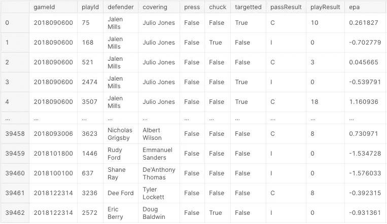
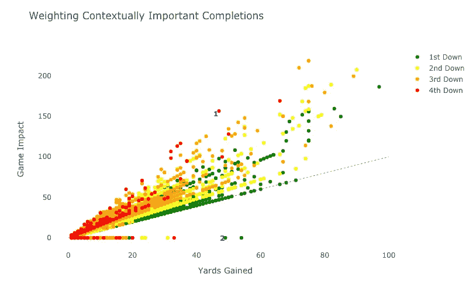
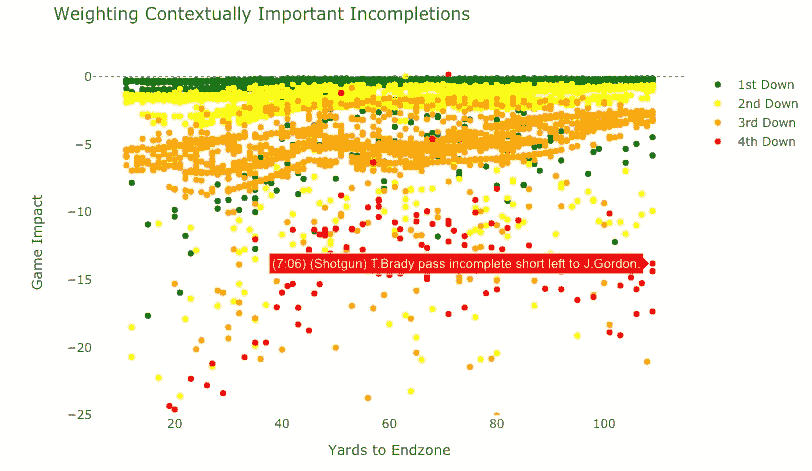
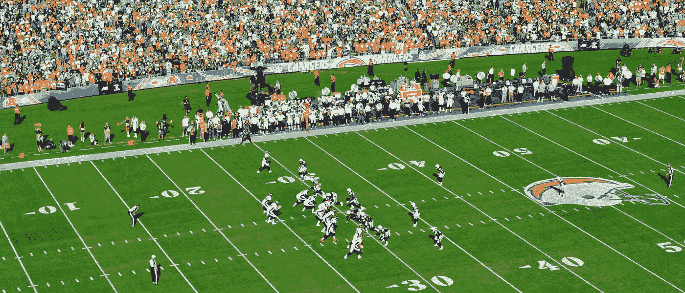

# 用熊猫和 Plotly 重新想象 NFL 角卫的表现

> 原文：<https://towardsdatascience.com/re-imagining-nfl-cornerback-performance-using-pandas-plotly-21e86fe2c445?source=collection_archive---------32----------------------->

## 从 Kaggle 的 Data Bowl 2021 数据构建我们自己的防御性统计数据故事

# 理解数据问题:并非所有的捕获都是平等的

在美式足球中，角卫的工作极其艰难，他们要防止外接手——通常是场上最快最高的球员——接到传球。

你可以想象，今天用来衡量角卫表现的统计数据包括`yards_allowed`和`completions_per_target`，它们被广泛用于展示强弱角卫球员之间的差异

但是这些传统的目标 DB 度量未能捕捉到**游戏背景**的关键元素。以下是这方面的一些具体例子:

> 第 3 洞和第 2 洞的 5 码完成比第 2 洞和第 22 洞的 5 码完成差得多，即使统计表会将计算为相等。
> 
> 此外，将 Julio Jones(2018 年前 10 名接球手)保持在 30 码内只有 3 次接球，这比将 Russell Gage(2018 年不是前 10 名接球手)保持在相同的数字上要令人印象深刻得多。

正是考虑到这个体育分析的缺点，我们将创造一个新的视角来看待我们的 CBs: **游戏影响**。

Riley McCullough 在 [Unsplash](https://unsplash.com?utm_source=medium&utm_medium=referral) 上拍摄的照片

以下是指导我们流程的一般规则:

*   获得进攻里程碑的码数(第一次进攻，上篮，红区码数)应该受到处罚
*   关键的不完整应该得到奖励
*   势均力敌的游戏(好的和坏的)比井喷游戏更有价值

记住这些规则，让我们生成新的“游戏影响”分数的第一个版本！

***注*** *:由于这是一个足球分析问题，我假设你对足球术语有基本的了解，所以我可以专注于数据分析过程*

# **如何通过*游戏情境*** 权衡游戏胜负

我们可以首先从 Kaggle 的 NFL Databowl 2021 加载数据:

这给了我们看起来像这样的原始数据集:

我们的第一个观点是增加对导致进攻里程碑的完整传球的处罚。

熊猫快速评论:

> 我们可以使用`.loc`函数，后跟一个条件语句，有条件地修改单个内联列。
> 
> 例如，如果 X.col 列值大于 5，则`test_pd.loc[test_pd.Xcol>5,’Ycol’] = 10`会将 Ycol 列值更改为 10。
> 
> 这是一个非常有用的函数，因为它比`.apply()`或您计划用来迭代 DF 的任何 for 循环都要快

为此，我们需要…

我们还需要清除无意义的码，在那里通过是完整的，但 EPA 是阴性的(`completed_pd.loc[(completed_pd.epa <= 0), ‘epa_yards’] = 0`)

我们现在已经用熊猫生成了一个新的游戏影响分数！🚀

然后，我们可以使用`Plotly`来创建一个交互式数据可视化，显示我们新的游戏影响得分和传统的“增加的码数”指标之间的差异

快速回顾:

> 改进图表的一个有效方法是添加多个变量。由于 Plotly 的交互组件，我们可以用 X 轴值、Y 轴值、标记颜色、**和**悬停信息讲述一个引人注目的故事。
> 
> 我们可以通过将跟踪中的`text= field`分配给悬停信息来修改悬停信息，并在跟踪构造函数中包含标志`hoverinfo=’text’`

作为一名数据科学家，理解并阐明数据可视化的价值非常重要。通常，数据项目的价值在从数据人员到产品/业务人员的转换中丢失了。

我发现有效的数据交流最好是用清晰的视觉效果，以及适合非技术性叙述的具体数据示例。

为了进一步帮助我们讲述我们的数据故事，添加一些注释来帮助阅读我们的图表将是明智的。我们可以通过下面的代码片段做到这一点:

所有这些为我们提供了以下图表:

**图表分析&数据故事**

下面是我对上图的解读。在向非技术运动爱好者解释产品时，它很受欢迎。希望这个例子能帮助你解释数据

上面的图表量化了游戏环境和完成的影响。

虽然一般随着绝对码数的增加而线性增加，但当比赛导致触地得分或第一次触地得分时，特别是在第三次或第四次触地得分时，**比赛影响**会达到峰值。

在比分接近的比赛中，第三回合的大规模进攻对防守来说是痛苦的，所以《游戏影响》很好地捕捉到了这种效果。相反，对游戏没有影响的大块码被降低到 0 游戏影响，以确保垃圾时间码数不会惩罚一个 DB。

举例说明这一点:

**第一场比赛**(在上面的图表中用红色标记，在 50，150 坐标附近)是第四场比赛的 47 码触地传球，比赛还剩不到 2 分钟。放弃绝对是一场可怕的比赛，因为停止很可能会结束比赛；因此，这场比赛对游戏的影响是重大的。

**第二场比赛**(在上面的图表中以绿色标记，坐标约为 55，0)虽然比第一场比赛稍微多了*码*，但在时间到期前没有到达端区，这是孤注一掷。这出戏的 DB 通过阻止 TD 完成了他的工作，因此游戏的影响被中和了。

根据游戏环境对游戏进行加权的行为将有助于我们稍后的分析将总体良好的数据库与那些*几乎从未*放弃重要游戏的数据库区分开来……并有望揭示一些角落，这些角落的表现实际上比它们的统计数据乍一看要差得多

我们可以不完整地重复熊猫的预处理。这次的不同之处在于，我们将计算未完成的奖励，而不是惩罚。

对代码的唯一更改是将我们的修饰符添加到 EPA，而不是减去它:

和生动的视觉效果:

要为未完成部分生成类似的图表:

我们的未完成比赛影响得分与码到端区的比较

我们将 Y 轴从“增加的码数”切换到“到端区的码数”的原因是因为所有这些比赛增加的码数都是 0。距离端区 100 码的距离为分析我们的数据提供了一个更好的视角

**图表分析&数据故事**

正如一些完成比其他的覆盖更差，一些*未完成*比其他的是更好的防守。

虽然所有这些比赛都是不完整的，但是在红区中的近距离比赛中出现的不完整被拦截，或者以其他方式影响对手获胜的机会，则被奖励以负的比赛影响分数。

注意有多少第四次向下击球有很大的向下重量——好的 DBs 确保第四次向下转换不会发生

上面的截图突出了一个例子:汤姆·布拉迪在比赛还剩 7 分钟的时候，第 4 局没有完成。这是一次重要的防守行动，因此应该得到奖励！一个持续这样打球的角后卫应该被认为是精英角后卫，我们的比赛影响力得分反映了这一点。

# 结论和后续步骤

争论一个新的指标是一项有趣的工作，但它不仅需要数据分析技能，还需要强有力的有说服力的论据。通常，模型和度量标准可以提供对行为/性能的一些洞察，但显然没有什么度量标准是万能的。

这就是为什么数据分析在体育运动中发挥着如此重要的作用，以及数据人如何在不够运动的情况下接触球场🤓，仍然可以通过提供衡量场上表现的标准来产生影响。

有很多理由说明这个新的比赛影响力分数是当前角卫指标的一个很好的发展…也有很多理由说明它不是。例如，足球是一项团队运动，因此将比赛结果完全归因于一个球员是不公平的。

但是这篇文章希望向您展示(1)如何使用 Pandas 作为 Plotly 来构建一个可解释的数据可视化，以及(2)如何围绕可视化来形成一个数据故事，以促进所需的对话。

即使 NFL 不采用我的新指标(Goodell 打电话给我),我也希望这些指标至少成为谈论球员表现的一部分。

照片由 [Unsplash](https://unsplash.com?utm_source=medium&utm_medium=referral) 上的[铝烟灰](https://unsplash.com/@anspchee?utm_source=medium&utm_medium=referral)拍摄

我希望你学到了一些东西，并喜欢阅读。如果你想看到更多这样的文章，请告诉我！