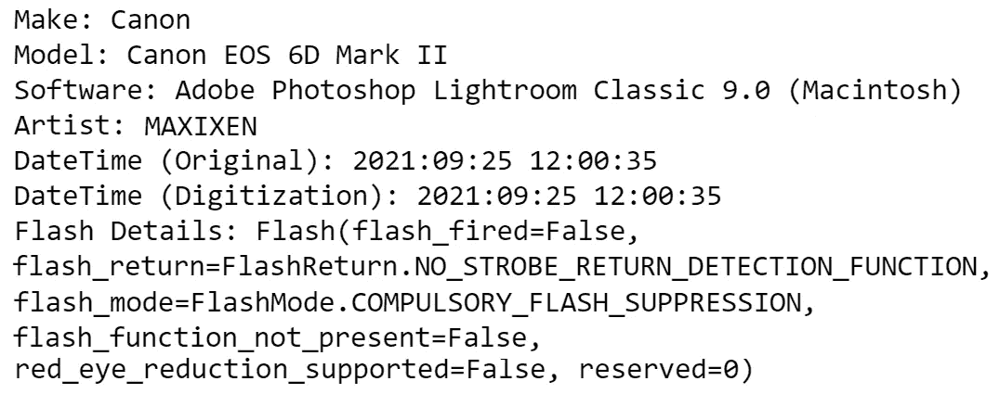

# 使用 Python 读取和编辑图像元数据

> 原文：<https://towardsdatascience.com/read-and-edit-image-metadata-with-python-f635398cd991?source=collection_archive---------4----------------------->

## 使用 Python 的 exif 库提取和修改数字图像文件的元数据


[JESHOOTS.COM](https://unsplash.com/@jeshoots?utm_source=medium&utm_medium=referral)在 [Unsplash](https://unsplash.com?utm_source=medium&utm_medium=referral) 上拍照

对于每张照片，都有比看上去更多的东西。数码相机和智能手机拍摄的图像包含丰富的信息(被称为**元数据**)，超出了可见像素。

这种元数据在许多商业案例中很有帮助。例如，**保险**索赔的**欺诈检测**系统分析提交的照片的元数据，以检查索赔人是否在事故之前**拍摄了这些照片。**

在本文中，我们探索如何使用 *exif* 库来读取和编辑数字图像的元数据。

## 内容

> ***(1)***[*什么是元数据和 Exif？*](#5657)***(2)***[*读取图像元数据*](#cac0)
> ***【3】***[*修改图像元数据*](#9cfd)***(4)***[*保存修改后的图像元数据*](#44e8)

请随意查看随附的 [**GitHub repo**](https://github.com/kennethleungty/Image-Metadata-Exif) 中的所有代码。

# 什么是元数据和 Exif？

元数据是指描述数据的数据集，你可以把它想象成关于数据的**数据。照片的元数据由相机型号和拍摄日期等信息组成。**

这些元数据存储在 **Exif(可交换图像文件格式)**中，这是一种针对数码相机和智能手机等设备拍摄的各种类型媒体(例如图像、视频、音频)的格式**标准**。

本项目使用的 Python 库是[***exif***](https://pypi.org/project/exif/)，恰好是 Exif 格式的同名。

# 读取图像元数据

我们首先用这个命令安装 *exif* :

```
pip install exif
```

对于本次演示，这是我们将要处理的照片:


作者图片

我们通过在检查图像是否包含任何元数据之前读取二进制格式的图像来实例化一个 *exif* `Image`类。如果是这样，`has_exif`方法将返回*真值*。

不同的照片有不同的元数据属性(又名 Exif **标签**),这是由于用于捕捉它们的设备不同。我们可以用`list_all()`方法查看图像的现有属性。


按作者列出的属性列表|图像的子集

要读取特定属性的值，我们可以使用`get()`方法。虽然还有其他方法，但我更喜欢`get()`，因为它通过返回 *None* (而不是抛出错误)来优雅地处理属性不存在的情况。



get()方法的输出|作者的图像

*附:查看*[*Image _ Metadata _ Extraction _ EXIF . ipynb*](https://github.com/kennethleungty/Image-Metadata-Exif/blob/main/Image_Metadata_Extraction_EXIF.ipynb)*笔记本，了解将一张图片的所有元数据提取到熊猫数据帧中的功能。*


照片由[米琳·特雷莫耶](https://unsplash.com/@mylene1708?utm_source=medium&utm_medium=referral)在 [Unsplash](https://unsplash.com?utm_source=medium&utm_medium=referral) 上拍摄

# 修改图像元数据

除了读取元数据，我们还可以执行一系列的修改，比如添加、更新和删除属性。

## ㈠添加元数据

可以添加当前不存在的新属性来进一步丰富元数据。

需要注意的一点是，添加的属性**必须是**一个可识别的 EXIF 标签。否则，添加将不会发生。您可以在此 找到已识别图像属性 [**的完整列表。**](https://exif.readthedocs.io/en/latest/api_reference.html#image-attributes)

比如我们可以添加公认的**版权**属性。在给**版权**属性赋值( *Kenneth Leung 2021* )后，`get()`方法会给我们这个新值，而不是 *None。*

<https://kennethleungty.medium.com/membership>  

## ㈡更新元数据

我们还可以更新图像元数据属性的现有值。


元数据更新后的输出|按作者排序的图像

## ㈢删除元数据

如果我们想删除特定的属性而不是更新它们，我们可以用`.delete()`来完成。


元数据删除后的输出|按作者排序的图像

# *保存修改后的图像元数据*

在所有的修改之后，最后一步是将带有修改后的元数据的图像保存为一个新文件。

如上所述，我们使用前缀为' *modified_'* 的文件名保存了修改后的图像，这样原始图像就不会被覆盖。

# 包装它

*   还有许多其他有趣的属性需要探索，您可以在 [*exif* 文档](https://exif.readthedocs.io/en/latest/api_reference.html)页面上找到更多细节。
*   到目前为止，我们所做的是处理一个单一的图像。 *exif* 包的值是通过**批处理**实现的，其中元数据的提取和修改是在一组**大的**图像上完成的。要查看批处理的运行情况，请看一下 [**GitHub repo**](https://github.com/kennethleungty/Image-Metadata-Exif) 中的`batch_process_metadata.py`脚本。
*   请记住，在使用此图库之前，请备份您的照片，以防止任何意外的数据丢失。

# 在你走之前

欢迎您加入**我的数据科学学习之旅！**点击这个[媒体](https://kennethleungty.medium.com/)页面，查看我的 [GitHub](https://github.com/kennethleungty) ，了解更多令人兴奋的数据科学内容。同时，享受阅读和修改图像元数据的乐趣！

</top-python-libraries-for-image-augmentation-in-computer-vision-2566bed0533e>  </russian-car-plate-detection-with-opencv-and-tesseractocr-dce3d3f9ff5c>  </key-learning-points-from-mlops-specialization-course-2-13af51e22d90> 