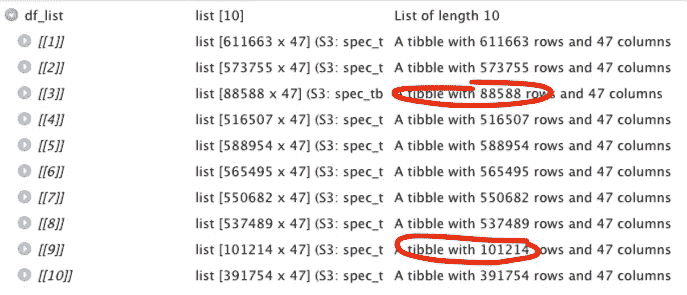

# read_csv 让我失望！

> 原文：<https://towardsdatascience.com/read-csv-let-me-down-956acd1cee91?source=collection_archive---------47----------------------->

## 为什么不相信你最喜欢的数据导入功能


来源:苏珊·尹[https://unsplash.com/photos/2JIvboGLeho](https://unsplash.com/photos/2JIvboGLeho)

作为一名数据科学家，我最不担心甚至想不到的事情之一就是将我的数据导入我的 Jupyter 笔记本或 RStudio 会话的方法是否可行。我完全相信这两个下划线单词:“阅读”“CSV”。不管是用 Python 还是用 R，我的工作就是清理、剖析和分析数据。除了用什么定界符来分隔之外，我很少考虑读数。然而今天，我在使用 R 的 Tidyverse 包中的 read 函数时遇到了两个问题。事情是这样的。

一个客户给了我几个 tsv。我继续用上面提到的 R 函数打开每一个，将它们附加到一个列表中，然后将它们连接成一个大的数据帧。我做了一些检查和检验，一切似乎都合情合理。柱子很清晰。已填充行。我准备好工作了。

我继续工作，一旦我完成了(或者至少认为我已经完成了)，我通过一个报告运行我的数据，该报告给出了一些关于数据和分析质量的高级信息。只是在阅读报告的输出时，我才意识到似乎有一些缺失的数据。很多数据缺失！

然后，我检查了保存到列表中的每个数据帧的内容，发现了两个异常。



可以看出，两个数据帧的行数要少得多。我通过手动打开它们来检查它们，并意识到它们确实在我的会话中丢失了许多数据。

然后，我给一台可靠的 Jupyter 笔记本电脑加电，用熊猫和 T1 一起玩 T0。

```
df_list = []
for file in files:
    df = pd.read_csv(file, sep = '\t')
    df_list.append(df)

data = pd.concat(df_list)
```

我连接了所有的数据帧并检查了行数，大约有一百万多行数据。

两种技术，两种基本功能做着同样的事情。但是有一个让我丢失了大约 100 万行数据。

但事情并没有就此结束。在我的 RStudio 笔记本中，我有很多好的代码要处理，所以我将数据从 Python 导出为一个大文件，并重新导入到我的会话中，这次是用`read_csv`(因为我将它从 Python 导出为 CSV)。谢天谢地，丢失的百万行又回来了。

然后，我做了一些健全性检查，并意识到许多列现在充满了空值！因此，虽然我现在有了正确的行数，但其中的许多数据都丢失了。

我不知道该责怪什么，R 中的导入还是 Python 中的导出。这个问题很容易回答，用 Python 重新导入即可。如果没有丢失数据，问题就不在导出。事实正是如此。当重新导入 Python 时，所有数据都在那里。

所以我返回 R，尝试不使用 Tidyverse 中的函数导入数据，而是使用 data.table 包中的`fread`函数。它也只是一个普通的数据导入包，就像`read_csv`或`read_tsv`一样。

令我高兴的是，我不仅有了我需要的所有行，而且所有数据都被正确地填充到其中。但令我痛苦的是，这意味着我之前对任何文件导入功能的信任需要消失。

# 摘要

这两个问题都是在使用 Tidyverse 中的函数时出现的。当使用 R 或 Python 时，打开原始文件的方法没有区别，R 返回的行数仍然少了大约一百万。在 R 中使用 Tidyverse 或 data.table 时，我重新导入数据的方式也没有什么不同，但是 Tidyverse 引入了 nulls，而 data.table 没有。我不确定 Tidyverse 中的函数是否有问题，但这种不一致令人担忧，也很难理解。

我猜想这样做的原因是为了警告您，您首选的数据导入方法有时可能不如您需要的那样可靠。不要把你所有的信心都放在功能上。进行尽职调查，确保您最终得到的数据帧与您告诉函数导入的数据相同。