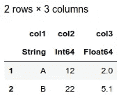
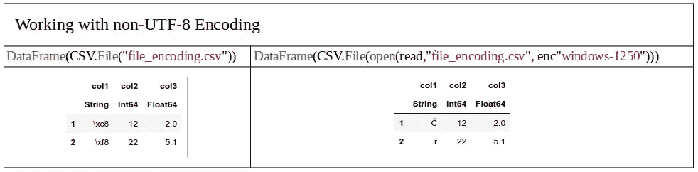
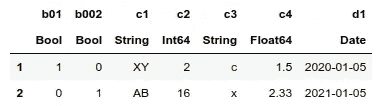
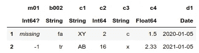
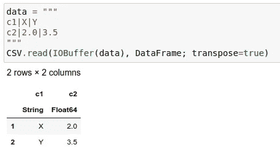
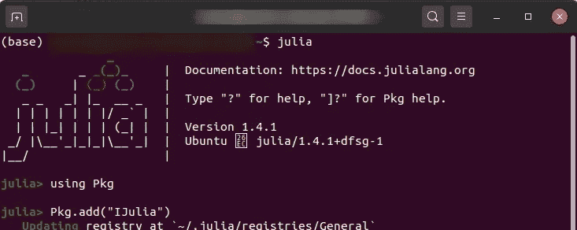
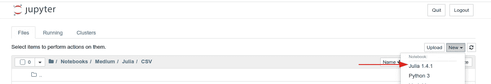

# 在 Julia 中将 CSV 读取到数据框

> 原文：<https://towardsdatascience.com/read-csv-to-data-frame-in-julia-programming-lang-77f3d0081c14?source=collection_archive---------2----------------------->

## 参数说明。使用 CSV.jl，DataFrames.jl，处理 StringEncodings。


在 Julia 中读取 CSV 到数据帧。作者图片

任何数据分析的第一步都是获取数据。毫无疑问，没有比将 CSV 文件加载到数据框中更简单的方法了。在本教程中，我们将探索如何在 Julia 编程语言中做到这一点。

与 [python 的 pandas](https://pandas.pydata.org/pandas-docs/stable/reference/api/pandas.read_csv.html) `[read_csv](https://pandas.pydata.org/pandas-docs/stable/reference/api/pandas.read_csv.html)`不同，Julia 中的函数被分成两个模块——[CSV . JL](https://csv.juliadata.org/stable/)和 [DataFrames.jl](https://dataframes.juliadata.org/stable/) ，并且有多种方式来组合它们。在本指南中，我们将看到:

*   [3 种方式](#f5f4)如何将 CSV 加载到数据框中
*   [非 UTF 8 编码](#e331)
*   解释[CSV 方法的最常见参数](#9586)
*   如何[安装 Julia](#f24f) 并在`[Jupyter Notebook](https://jupyter.org/)`中运行

完整的教程代码可以通过[GitHub-Read _ CSV . ipynb](https://github.com/vaclavdekanovsky/data-analysis-in-examples/blob/master/Julia/CSV/Read_CSV.ipynb)获得。

# CSV.jl 来解析 CSV 文件

作为第一步，您必须声明您将使用的库。在我们的例子中`CSV`和`DataFrames`。

```
using CSV
using DataFrames
```

如果您还没有将它们安装到您的 Julia 环境中，运行 REPL(命令行界面通常通过键入`julia`启动)并运行`import Pkg; Pkg.add("CSV"); Pkg.add("DataFrames")`。

## CSV.jl

让我们从阅读非常简单的逗号分隔值文件(CSV)开始我们的旅程，该文件有 3 列，每列包含不同的数据类型(`string`、`int`和`float`)。

```
col1,col2,col3
A,12,2.0
B,22,5.1
```

要解析一个 CSV，只需将它传递给`CSV.File(path)`命令。Path 参数包含文件的路径。

```
[In]:
# reading the file
csv_reader = **CSV.File(**"file.csv"**)**
println(typeof(csv_reader))[Out]: CSV.File{false}
```

结果是一个`CSV.File` 对象，可以通过迭代得到`CSV.Rows`。

```
[In]:
for row in csv_reader
    println(typeof(row))
end[Out]:
CSV.Row
CSV.Row
```

在`CSV.Row`对象中，您可以使用列名来访问值。

```
[In]:
for row in csv_reader
    println("values: $(row.col1), $(row.col2), $(row.col3)")
end[Out]:
values: A, 12, 2.0
values: B, 22, 5.1
```

您可能已经注意到，CSV 正确地猜到了我们的文件在第一行包含一个标题，并且“，”(逗号)被用作分隔符。这是因为`header`参数的默认值为 1。Julia 从 1 开始索引(不像 python 的 0)。`Delim`参数的默认值是逗号，但是如果 CSV 无法解析它，它将使用前 10 行来猜测其他合适的分隔符，如分号、制表符、空格或竖线。

您总是可以手动指定这些参数。Julia 约定说关键字参数用分号分隔，但是逗号也可以。

```
# to separate kwargs by semicolon is a Julia standard
CSV.File(path**;** header=1, delim=",")# comma works as well
CSV.File(path**,** header=1, delim=",")
```

# 将 CSV 读入数据帧的 3 种方法

为了将`CSV.File`转换成数据帧，你必须将其传递给`DataFrames.DataFrame`对象。在 Julia 中至少有三种方法可以做到这一点。

## 选项 1 —传递到数据帧

你可以把数据框绕在`CSV.File(path; kwargs)`上。

```
df = DataFrame(CSV.File("file.csv"))
```



CSV 加载到 Jupyter 笔记本中显示的 Julia 数据帧。图片作者。

您可以看到 Julia 表示(与 python pandas 不同)显示了列的数据类型，无论是`string`、`int`还是`float`。

## 选项 2 —连接到数据帧的管道

第二种可能性是使用 Julia'a 管道操作符`|>`将`CSV.File`传递给`DataFrame`。

```
df = CSV.File("file.csv") |> DataFrame
```

结果是一样的。

## 选项 3 — CSV.read()

为了使代码与其他语言相似，Julia 的设计者决定添加一点语法糖，并允许第三种选择。`CSV.read()`将文件的 path 参数作为第一个参数，将 DataFrame 对象作为第二个参数。其他参数可以跟随。

```
df = CSV.read("file.csv", DataFrame; kwargs)
```

这些方法在 Julia 版本 1.4.1 中有效，我认为尽管 Julia 还在发展，但它会很稳定。一些旧的教程显示了其他方法，例如 CSV.read 不带 DataFrame 作为参数，这不再有效。

# 编码

Julia 希望所有的字符串都是 UTF 8 编码的。如果不是这样，您必须首先使用其编码打开文件，然后将其传递给 CSV。文件，然后到数据框。您可以使用`open(read, path, encoding)`或`read(path, encoding)`的快捷方式。编码以编码对象的形式出现，您可以在带有编码名称的字符串前使用`enc`轻松创建编码对象，例如`enc"windows-1250"`。

```
DataFrame(CSV.File(open(read,"file_encoding.csv", enc"windows-1250")))#orDataFrame(CSV.File(read("file_encoding.csv", enc"windows-1250")))
```



在 Julia 中处理非 UTF-8 编码。作者图片

# CSV 阅读器参数

Julia CSV parser 非常擅长猜测基本参数，尽管有时您需要手动指定参数。让我们概述一下 CSV 解析器最基本的参数。当然，所有参数都在文档中有解释— [CSV.jl](https://csv.juliadata.org/stable/) 。

## Delim —分隔符

默认情况下，分隔符设置为逗号`","`。如果 CSV 解析不正确，Julia 会尝试使用前 10 行来猜测不同的分隔符。你总是可以硬编码它。

```
# pipe separator
CSV.read(path, DataFrame; delim="|")
```

分隔符可以超过 1 个字符。比如`delim="::"`。

## 页眉

有时候你的数据不是从第一行开始的。其他时候你根本没有任何标题。也有可能不止一行包含标题。朱莉娅能处理所有这些案件:

*   没有标题— `header=0`或`header=false`，则自动生成列名
*   使用字符串或符号向量指定自己的名称
*   首行标题— `header=1`
*   第二行标题— `header=2`，也可用于跳过某些行(跳过也可通过`skipto`或`datarow`完成)。
*   多行是按范围排列的标题— `header=1:2`(第一行和第二行构成标题)
*   多行是列表标题— `header=[1,2]`或`header=[1,3]` *(在后一种情况下，将跳过第 2 行)*

如果选择多行作为标题，那么列名就是这些行的串联。

## 选择并删除参数

您并不总是需要所有的列。您可以使用`select=[1,2,3]`仅设置您需要的列，或者使用`drop=["col1",:col5]`指定您想要跳过的列。

这些列可以通过它们的顺序`1,5,25`来识别。记住 Julia 从 1 号开始索引，所以 1 是第一列。您也可以使用字符串 id`"col1", "customer_name"`或符号。符号使用冒号前缀`(:)[:col1, :customer_name]`或者你可以显式声明它们`[Symbol("col1"), Symbol("customer_name")]`。

## 类型和类型参数

CSV 阅读器将推断类型，但它可能会猜错。如果您知道数据类型，您可以使用`type`或`types`参数指定它们。

*   `type` —为整个数据框设置单一类型
*   `types` —指定每列的确切类型

您应该知道，如果数据不能被转换成特定的类型，值就会被转换成`missing`，这相当于 python 中的`NaN`。

## 解析日期和日期格式参数

处理日期是数据解析的另一个重要部分。`Dateformat`参数允许您为所有被识别为日期的列设置日期格式，或者专门为每列设置日期格式。如果该列未被自动识别为`date`，在`dateformat`参数中提及它会将其转换为日期。

如果解析为定义的格式失败，值被转换为与`Nan`等效的`missing`类型。在 Julia 文档中查看更多关于[日期](https://docs.julialang.org/en/v1/stdlib/Dates/#Dates.DateTime)的信息。

## Truestrings 和 falsestrings 参数

这些参数允许您将输入列表设置为 true 和 false 布尔值。

```
[In]:
data = """
b01|b002|c1|c2|c3|c4|d1
**"t"**|**"fa"**|"XY"|2|c|1.5|2020-01-05
**"f"**|**"tr"**|"AB"|16|x|2.33|2021-01-05
"""CSV.read(IOBuffer(data), DataFrame; 
    truestrings=["t","tr"],
    falsestrings=["f","fa"])
```



确定真值和假值时的最终数据帧。图片作者。

## 缺少字符串参数

有些值意味着没有可用的数据。它们通常是-1 或 999。您可以指定这些值的列表，这些值将被解释为缺失(N/A)。

```
[In]:
data = """
m01|b002|c1|c2|c3|c4|d1
**999**|"fa"|"XY"|2|c|1.5|2020-01-05
-1|"tr"|"AB"|16|x|2.33|2021-01-05
"""CSV.read(IOBuffer(data), DataFrame; 
    missingstrings=["999"])
```



使用 Missingstrings 参数。作者图片

## 注释参数

有些文件包含注释或批注。您可以使用`comment`参数排除它们。

```
# comment lines start with single character
DataFrame(CSV.File(path; comment="~"))# comment lines can start with some string
DataFrame(CSV.File(path; comment="!!")# but you cannot specify more than one string
DataFrame(CSV.File(path; comment=["~","#"]) --> error
```

## **转置参数**

当您可以转置数据并将列变为行时，您可以设置`transpose=true`。



使用 transpose=true 会将行转换为列。作者图片

## 池参数

汇集提醒`category`输入熊猫。它允许将只有几个值的列映射到`ints`,并显著减少列的大小和一些操作的成本。

我用`pool`参数做了一些实验，但没有发现它到底是如何计算出来的。与 pandas 不同，您不能共享特定的列。您只能设置阈值，所有唯一字符串数低于该阈值的列将被合并。

## 解析固定宽度文件

固定宽度文件类似于 CSV，只是每一列始终具有相同的宽度(字符数)。如果内容较短，其余部分通常用空格填充。

虽然有些工具，如许多数据库引擎，使用带分隔符的固定宽度文件将数据导出为文本，以获得更好的阅读体验。使用`CSV.jl`和`ignorerepeated=true`无法读取这样的格式，你必须做进一步的操作将这样的文件转换成数据帧。

# 安装 Julia

你对朱莉娅的容貌印象深刻吗？你想自己试试吗？在你的电脑上安装 julia 很容易。你进入[下载 Julia](https://julialang.org/downloads/) 页面，选择适合你的平台(Win、OS、Linux)的文件或者使用 docker 镜像。

然后从命令行输入`julia`启动朱莉娅·REPL。

## 在 Jupyter 笔记本中运行 Julia

如果你已经安装了 [Jupyter](https://jupyter.org/) (例如你的 python 项目)，你可以通过运行朱莉娅·REPL(在命令行中键入`julia`)来允许朱莉娅脚本，然后通过以下方式添加`IJulia`包:

1.  `using Pkg`
2.  `Pkg.add("IJulia")`



添加 IJulia 包，这样你就可以在 Jupyter 笔记本中运行 Julia 脚本。图片作者。



然后，您可以简单地在 Jypyter 中创建新的 Julia 项目。图片作者。

# 结论

我希望您已经学会了如何将 CSV 文件加载到 Julia 的 DataFrames 模块中，并且您将在您的下一个项目中尝试它。你可以自己比较 Julia 的上传速度和进一步的数据处理选项，并在评论中让我知道你对 Julia 的看法。

在 [github — Read_CSV](https://github.com/vaclavdekanovsky/data-analysis-in-examples/blob/master/Julia/CSV/Read_CSV.ipynb) 上看到笔记本里的所有代码。

```
If you liked this article, maybe you will enjoy the following as well: 
* [Comprehensive tutorial to plotly express in python](/visualization-with-plotly-express-comprehensive-guide-eb5ee4b50b57)
* [Data persistance alternatives in pandas](/stop-persisting-pandas-data-frames-in-csvs-f369a6440af5)
* [Cross-Validation in python](/complete-guide-to-pythons-cross-validation-with-examples-a9676b5cac12)
```