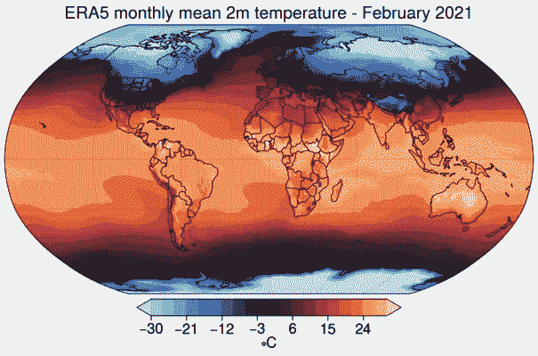

# 用 Python 将 ERA5 直接读入内存

> 原文：<https://towardsdatascience.com/read-era5-directly-into-memory-with-python-511a2740bba0?source=collection_archive---------8----------------------->

## 如何使用气候数据存储 API


[附身摄影](https://unsplash.com/@possessedphotography?utm_source=medium&utm_medium=referral)在 [Unsplash](https://unsplash.com?utm_source=medium&utm_medium=referral) 上拍照

[ERA5](https://www.ecmwf.int/en/forecasts/datasets/reanalysis-datasets/era5) 是欧洲中期天气预报中心( [ECMWF](https://www.ecmwf.int/) )制作的第五代气候再分析。该产品提供了许多大气、地表和海洋状态参数的每小时输出，以及不确定性的估计。然而，除非您在[云](https://registry.opendata.aws/ecmwf-era5/)中工作，否则存储原始每小时输出会占用大量空间。

这篇文章概述了如何安装气候数据存储(CDS) API 来读取和分析 Python 中的 ERA5 输出。

# CDS API 简介

CDS API 允许访问数据集的 [ERA5 系列，其中包括 ERA5 和唯一的 land 补集 ERA5-land。ERA5 有四个主要子集:*每小时*和*每月*产品，每个产品都基于*压力水平*(包括高空区域)和*单一水平*(大气、海洋和陆地表面数量)。ERA5-land 仅包括*单级*。](https://confluence.ecmwf.int/display/CKB/The+family+of+ERA5+datasets)

**四个 ERA5 子集**

*   ERA5 单层每小时数据
*   ERA5 单层月平均数据
*   ERA5 压力水平的每小时数据
*   ERA5 压力水平的月平均数据

**两个 ERA5-land 子集**

*   era 5-陆地每小时数据
*   era 5-土地月度数据

ERA5 再分析在本[手稿](https://rmets.onlinelibrary.wiley.com/doi/full/10.1002/qj.3803)中有详细描述。

# 安装 CDS API 密钥

要开始使用 CDS API，你需要做的第一件事是用 Copernicus 创建一个帐户，并将你唯一的 API 密钥存储在一个点文件中。以下是执行此操作的步骤:

1.  在此 **注册 [**与哥白尼创建账户。**](https://cds.climate.copernicus.eu/)**
2.  一旦您有了帐户，请在此处 登录您的 Copercius 帐户 [**，并记下页面底部的`UID`和`API key`。**](https://cds.climate.copernicus.eu/user)
3.  将下面的代码片段粘贴到您的终端中，用步骤 2 中的代码替换`<UID>`和`<API key>`:

```
{
  echo 'url: https://cds.climate.copernicus.eu/api/v2'
  echo 'key: UID:API_KEY'
  echo 'verify: 0'
} > ~/.cdsapirc
```

上面的命令用您的 API 密匙创建了文件`~/.cdsapirc`，这是使用 CDS API 所必需的。作为健全性检查，使用`more ~/.cdsapirc`来确保一切看起来都是正确的。一个正确的文件将类似于以下内容:

```
url: [https://cds.climate.copernicus.eu/api/v2](https://cds.climate.copernicus.eu/api/v2)
key: 12345:a99b9c9d-9e99-9999-9999-fg99h9i99j9k
verify: 0
```

> **不要把上面的复制到你的** `**~/.cdsapirc**` **文件中，这只是为了举例说明。**

# 安装 CDS API 客户端

一旦在`~/.cdsapirc`中有了 API 密匙，就可以通过`conda`或`pip`安装`cdsapi`客户端:

```
pip install cdsapi
or
conda install cdsapi
```

安装后，确保您可以在 Python 脚本中导入并启动客户端，而不会出现任何错误。

```
import cdsapi
cds = cdsapi.Client()
```

# 使用 CDS API

下面的代码显示了如何在一个日期范围内请求指定压力水平的月平均温度。输出作为`xarray`数据集`ds`存储在内存中。下面的代码也允许将输出保存到磁盘，该操作可以使用`download_flag`打开或关闭:

```
import cdsapi
import xarray as xr
from urllib.request import urlopen# start the client
cds = cdsapi.Client()# dataset you want to read
dataset = "reanalysis-era5-pressure-levels-monthly-means"# flag to download data
download_flag = False# api parameters 
params = {
    "format": "netcdf",
    "product_type": "monthly_averaged_reanalysis",
    "variable": "temperature",
    "pressure_level": '1000',
    'year':['2019','2020'],
    'month':['01','02','03'],
    "time": "00:00", 
    "grid": [1.0, 1.0],
    "area": [90, -180, -90, 180],
    }# retrieves the path to the file
fl = cds.retrieve(dataset, params)# download the file 
if download_flag:
    fl.download("./output.nc")# load into memory
with urlopen(fl.location) as f:
    ds = xr.open_dataset(f.read())
```

这是一个更复杂的请求示例，我请求 2020 年的 1 月、2 月和 3 月。另外，我请求每个月的第一天中午，`12:00`。我需要四分之一度的数据`grid`和美国大陆的数据`area`:`[49.38, -124.67, 25.84, -66.95`。注意，`area`参数指定了一个坐标为`[north, west, south, east]`的边界框。

```
import cdsapi
import xarray as xr
from urllib.request import urlopenc = cdsapi.Client()# dataset to read
dataset = 'reanalysis-era5-pressure-levels'# flag to download data
download_flag = False# api parameters 
params = {
    'format': 'netcdf',
    'product_type': 'reanalysis',
    'variable': 'temperature',
    'pressure_level':'1000',
    'year':['2020'],
    'month':['01','02','03'],
    'day': ['01'],
    'time': ['12:00'],
    'grid': [0.25, 0.25],
    'area': [49.38, -124.67, 25.84, -66.95],
    }# retrieves the path to the file
fl = c.retrieve(dataset, params)# download the file 
if download_flag:
    fl.download("./output.nc")# load into memory
with urlopen(fl.location) as f:
    ds = xr.open_dataset(f.read())
```

代替`year`、`month`、`day`和`time`参数，您也可以指定一个日期列表:

```
'date':['2020-01-01 12:00', '2020-02-01 12:00', '2020-03-01 12:00'],
```

或者，您可以像这样指定一个`date`和`time`:

```
'date':['2020-01-01', '2020-02-01', '2020-03-01'],
'time: '12:00',
```

上面的代码片段都产生相同的请求，说明了 API 的灵活性。这些请求非常具体，大多数时候你会希望请求一个连续的范围。

## 指定日期范围

有几种方法可以做到这一点。最简单的方法是用斜杠分隔所需的日期，该斜杠指定所请求范围的开始和结束日期:

```
'date':'2020-01-01 12:00/2020-03-01 12:00'
```

另一个选择是用熊猫`date_range`。但是，请注意，API 的输入必须是字符串列表。这里有一个使用熊猫的例子:

```
‘date’: list(pd.date_range(‘2020–01–01 12:00',’2020–03–01 12:00', freq=’M’).strftime(‘%Y-%m-%d %H:%M’)),
```

不幸的是，在请求月平均值时不能使用`date`参数，它只适用于高时间分辨率数据。对于月平均数据，您必须使用`year`和`month`参数，它们也接受斜线符号:`start/end`。

`cdsapi`非常适合复杂的请求，并且非常灵活，但是有时您会得到一个难以诊断的错误消息。

## 错误消息

`no data is available within your requested subset. Request returned no data`是一个常见的错误信息，它没有太大的帮助。这通常表示关键字值超出了可用范围。例如，只能请求一组特定的压力水平。另外，`time`参数必须是使用 24 小时制的最接近的小时。以下是我看到的常见错误以及如何修复它们:

*   压力水平必须包含在:[1，2，3，5，7，10，20，30，50，70，范围(100，1000，25)]内，其中`range(100,1000,25)`表示 100 到 1000，增量为 25。如果出现错误，请检查您请求的压力是否包含在此列表中。
*   时间必须是 24 小时制中最接近的小时:`00:00`、`01:00`、…、`23:00`。如果出现错误，请检查时间是否精确到小时。如果您请求月平均值，请确保将`time`参数设置为`‘00:00’`。

## 证明文件

我不知道任何关于 CDS API 的文档，这使得它很难使用，因为允许的关键字和变量名因数据集而异。以下链接会有所帮助:

*   每个数据集允许的关键字参数在这里是<https://confluence.ecmwf.int/display/CKB/Climate+Data+Store+%28CDS%29+API+Keywords>**。**
*   **表 [**中列出了可用的变量，这里**](https://confluence.ecmwf.int/display/CKB/ERA5%3A+data+documentation) **。**你提供列在`variable name in CDS`栏的东西。**

**您也可以在 **处查看表格 [**中的示例脚本。**](https://confluence.ecmwf.int/display/CKB/Climate+Data+Store+(CDS)+API+Keywords)****

**另一个选择是使用 web 界面进行选择，并查看底部的“显示 API 请求”。 [**这里的**](https://cds.climate.copernicus.eu/cdsapp#!/dataset/reanalysis-era5-pressure-levels-monthly-means?tab=form) 是“月平均压力水平”的形式其他数据集可以在 [**这里**](https://cds.climate.copernicus.eu/#!/search?text=ERA5&type=dataset) 找到。单击您想要访问的数据集，然后单击“下载数据”选项卡进行选择。**

# **使 API 更易于使用**

**一旦你理解了它是如何工作的，你就会意识到 CDS API 并不可怕，而是非常强大。我写了一个函数来抽象出我所描述的一些细微差别。这个函数是开源的，所以你可以随意复制和修改它。**

# **使用函数**

**下面是一个使用`get_era5()`函数创建下图的例子:**

****

**2021 年 2 月 ERA5 的平均温度(图片由作者提供)**

# **结束语**

**向 ECMWF 团队致敬，他们发布了`cdsapi`，并使 ERA5 再分析产品变得容易获得。该 API 具有清晰的语法，并且能够在服务器端重新划分输出，这是天赐之物。ECMWF 还在开发一个软件包，旨在进一步简化对这些数据集的访问，这样我们就可以更多地关注科学，而不是编码。在撰写本文时，它仍在开发中，但我鼓励您继续关注 [**climetlab**](https://climetlab.readthedocs.io/en/latest/) 。然而，climetlab 确实在幕后下载数据。希望 climetlab 中的一个特性是无需下载就能将输出读入内存。然而，我们总是可以使用 CDS API 来实现这一点。**

**希望这篇文章能帮助你分析 ERA5 的输出，并简化你的数据管道。编码快乐！**

# **相关职位**

**<https://medium.com/analytics-vidhya/best-free-api-for-weather-records-era5-59c0e204829a>  <https://medium.com/planet-os/digging-into-the-texas-freeze-using-python-and-era5-zarr-data-fa3c8ff562bb>  <https://medium.com/planet-os/era5-reanalysis-data-on-s3-cee2f22422ae>  

感谢你花时间阅读我的帖子。这个功能始于与我的同事 Jashvina Devadoss 的对话，她当时正在开发一个 [*类似的功能*](https://github.com/jashvina-devadoss/ERA5_time_downsample) *。*

*如果你有问题，*建议，或者发现这篇文章有用，请在下面评论。

*感谢阅读和支持媒体作者*

<https://lukegloege.medium.com/membership> **