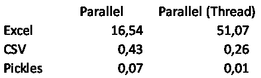

# 用 Python 读 Excel 文件吗？有一个快 1000 倍的方法。

> 原文：<https://towardsdatascience.com/read-excel-files-with-python-1000x-faster-407d07ad0ed8?source=collection_archive---------0----------------------->

## [理解大数据](https://towardsdatascience.com/tagged/making-sense-of-big-data)

## 在本文中，我将向您展示用 Python 加载数据的五种方法。实现了 3 个数量级的加速。


来源:https://www.hippopx.com/[，公共领域](https://www.hippopx.com/)

作为一名 Python 用户，我使用 excel 文件加载/存储数据，因为商务人士喜欢以 excel 或 csv 格式共享数据。不幸的是，Python 处理 Excel 文件特别慢。

在本文中，我将向您展示用 Python 加载数据的五种方法。最终，我们将实现 3 个数量级的加速。会快如闪电。

> *编辑(18/07/2021):我找到了一种方法，可以让进程* ***快 5 倍*** *(结果加速了 5000 倍)。我在文末补充了一下作为加分项。*

# 实验装置

假设我们要加载 10 个 20000 行 25 列的 Excel 文件(总共大约 70MB)。这是一个典型的案例，您希望将事务性数据从 ERP (SAP)加载到 Python 来执行一些分析。

让我们填充这个虚拟数据并导入所需的库(我们将在本文后面讨论 pickle 和 joblib)。

```
import pandas as pd
import numpy as np
from joblib import Parallel, delayed
import timefor file_number in range(10):
 values = np.random.uniform(size=(20000,25))
 pd.DataFrame(values).to_csv(f”Dummy {file_number}.csv”)
 pd.DataFrame(values).to_excel(f”Dummy {file_number}.xlsx”)
 pd.DataFrame(values).to_pickle(f”Dummy {file_number}.pickle”)
```

# 在 Python 中加载数据的 5 种方法

# 想法 1:用 Python 加载一个 Excel 文件

让我们从加载这些文件的简单方法开始。我们将创建第一个 Pandas 数据框架，然后将每个 Excel 文件追加到其中。

```
start = time.time()
df = pd.read_excel(“Dummy 0.xlsx”)
for file_number in range(1,10):
 df.append(pd.read_excel(f”Dummy {file_number}.xlsx”))
end = time.time()
print(“Excel:”, end — start)>> Excel: 53.4
```

用 Python 导入 Excel 文件的简单方法。

运行大约需要 50 秒。相当慢。

# 想法 2:使用 CSV 而不是 Excel 文件

现在让我们假设我们将这些文件保存为。csv(而不是。xlsx)从我们的 ERP/System/SAP。

```
start = time.time()
df = pd.read_csv(“Dummy 0.csv”)
for file_number in range(1,10):
 df.append(pd.read_csv(f”Dummy {file_number}.csv”))
end = time.time()
print(“CSV:”, end — start)>> CSV: 0.632
```

用 Python 导入 csv 文件比 Excel 文件快 100 倍。

我们现在可以在 0.63 秒内加载这些文件。快了将近 10 倍！

**Python 加载 CSV 文件比 Excel 文件快 100 倍。使用 CSV。**

**缺点** : csv 文件几乎总是大于。xlsx 文件。在这个例子中。csv 文件为 9.5MB，而。xlsx 都是 6.4MB。

# 想法 3:更聪明的熊猫数据框架创建

我们可以通过改变创建熊猫数据框架的方式来加快我们的进程。不是将每个文件附加到现有的数据帧，

1.  我们在一个列表中独立加载每个数据帧。
2.  然后将整个列表连接到一个数据帧中。

```
start = time.time()
df = []
for file_number in range(10):
 temp = pd.read_csv(f”Dummy {file_number}.csv”)
 df.append(temp)
df = pd.concat(df, ignore_index=True)
end = time.time()
print(“CSV2:”, end — start)>> CSV2: 0.619
```

用 Python 导入 csv 文件的更智能的方法

我们把时间减少了百分之几。根据我的经验，当你处理更大的数据帧(df >> 100MB)时，这个技巧会变得有用。

# 想法 4:用 Joblib 并行化 CSV 导入

我们想用 Python 加载 10 个文件。与其一个接一个地加载每个文件**，为什么不同时并行地加载它们呢？**

**我们可以使用 [joblib](https://joblib.readthedocs.io/en/latest/parallel.html) 轻松做到这一点。**

```
start = time.time()
def loop(file_number):
 return pd.read_csv(f”Dummy {file_number}.csv”)
df = Parallel(n_jobs=-1, verbose=10)(delayed(loop)(file_number) for file_number in range(10))
df = pd.concat(df, ignore_index=True)
end = time.time()
print(“CSV//:”, end — start)>> CSV//: 0.386
```

**使用 Joblib 并行导入 Python 中的 CSV 文件。**

**这几乎是单核版本的两倍。然而，一般来说，不要指望使用 8 个内核就能让你的处理速度提高 8 倍(在这里，我在 Mac Air 上使用 8 个内核，使用新的 M1 芯片，获得了 2 倍的速度提升)。**

## **用 Joblib 在 Python 中实现简单的并行化**

**[Joblib](https://joblib.readthedocs.io/en/latest/parallel.html) 是一个简单的 Python 库，允许你在//中运行一个函数。在实践中，joblib 作为一个列表理解。只是每次迭代由不同的线程执行。这里有一个例子。**

```
def loop(file_number):
 return pd.read_csv(f”Dummy {file_number}.csv”)
df = Parallel(n_jobs=-1, verbose=10)(delayed(loop)(file_number) for file_number in range(10))#equivalent to
df = [loop(file_number) for file_number in range(10)]
```

**像智能列表理解一样思考 joblib。**

# **想法 5:使用 Pickle 文件**

**将数据存储在 pickle 文件(Python 使用的一种特定格式)中可以(快得多)而不是。csv 文件。**

****缺点**:你将无法手动打开一个 pickle 文件并查看其中的内容。**

```
start = time.time()
def loop(file_number):
 return pd.read_pickle(f”Dummy {file_number}.pickle”)
df = Parallel(n_jobs=-1, verbose=10)(delayed(loop)(file_number) for file_number in range(10))
df = pd.concat(df, ignore_index=True)
end = time.time()
print(“Pickle//:”, end — start)>> Pickle//: 0.072
```

**我们刚刚削减了 80%的运行时间！**

**一般来说，处理 pickle 文件比处理 csv 文件要快得多。但是，另一方面，pickles 文件通常在您的驱动器上占用更多的空间(不是在这个特定的例子中)。**

**实际上，您将无法直接在 pickle 文件中从系统中提取数据。**

**我建议在以下两种情况下使用泡菜:**

1.  **您想要保存来自 Python 进程之一的数据(并且不打算在 Excel 上打开它)以便稍后/在另一个进程中使用。将数据框保存为泡菜，而不是。战斗支援车**
2.  **您需要多次重新加载相同的文件。第一次打开文件时，将其保存为 pickle，以便下次能够直接加载 pickle 版本。
    示例:假设您使用事务性月度数据(每个月您加载一个新月份的数据)。您可以将所有历史数据保存为。pickle 并且，每次你收到一个新文件，你可以把它作为一个. csv 文件加载一次，然后下一次把它作为一个. pickle 文件保存。**

# **好处:并行加载 Excel 文件**

**假设您收到了 excel 文件，并且您没有其他选择，只能按原样加载它们。您还可以使用 joblib 对此进行并行处理。与上面的 pickle 代码相比，我们**只需要**更新循环函数。**

```
start = time.time()
def loop(file_number):
    return pd.read_excel(f"Dummy {file_number}.xlsx")
df = Parallel(n_jobs=-1, verbose=10)(delayed(loop)(file_number) for file_number in range(10))
df = pd.concat(df, ignore_index=True)
end = time.time()
print("Excel//:", end - start)>> 13.45
```

**如何在 Python 中使用并行化加载 excel 文件？**

**我们可以将加载时间减少 70%(从 50 秒减少到 13 秒)。**

**您还可以使用这个循环动态创建 pickle 文件。这样，下次你加载这些文件时，你就能达到闪电般的加载速度。**

```
def loop(file_number):
    temp = pd.read_excel(f"Dummy {file_number}.xlsx")
    temp.to_pickle(f"Dummy {file_number}.pickle")
    return temp
```

# **概述**

**通过并行加载 pickle 文件，我们将加载时间从 50 秒减少到不到十分之一秒。**

*   **Excel: 50 秒**
*   **CSV: 0.63 秒**
*   **更智能的 CSV: 0.62 秒**
*   **//: 0.34 秒内 CSV**
*   **//: 0.07 秒**
*   **//: 13.5 秒**

# **好处 2:并行速度提高 4 倍**

**Joblib 允许更改并行化后端以消除一些开销。你可以通过给 *prefer="threads"* 到 *Parallel* 来做到这一点。**

**使用 prefer="threads "将允许您更快地运行流程。**

**我们获得了大约 0.0096 秒的速度(2021 MacBook Air 运行了 50 多次)。**

**将 prefer="threads "与 CSV 和 Excel 并行化一起使用会产生以下结果。**

****

**正如你所看到的，使用“线程”后端在读取 Excel 文件时会导致更差的分数。但是对于 pickles 来说性能惊人(逐个加载 Excel 文件需要 50 秒，而在//中加载读取 pickles 文件的数据只需要 0.01 秒)。**

## **👉[让我们在 LinkedIn 上联系吧！](https://www.linkedin.com/in/vandeputnicolas/)**

# **关于作者**

**icolas Vandeput 是一名供应链数据科学家，擅长需求预测和库存优化。他在 2016 年创立了他的咨询公司 [SupChains](http://www.supchains.com/) ，并在 2018 年共同创立了 [SKU 科学](https://bit.ly/3ozydFN)——一个快速、简单、实惠的需求预测平台。尼古拉斯对教育充满热情，他既是一个狂热的学习者，也喜欢在大学教学:自 2014 年以来，他一直在比利时布鲁塞尔为硕士学生教授预测和库存优化。自 2020 年以来，他还在法国巴黎的 CentraleSupelec 教授这两门课程。他于 2018 年出版了 [*供应链预测的数据科学*](https://www.amazon.com/Data-Science-Supply-Chain-Forecasting/dp/3110671107)(2021 年第 2 版)和 2020 年出版了 [*库存优化:模型与模拟*](https://www.amazon.com/Inventory-Optimization-Simulations-Nicolas-Vandeput/dp/3110673916) 。**

****