# 阅读评论:分析 Wayfair 产品的 NLP 信号

> 原文：<https://towardsdatascience.com/read-the-reviews-analyzing-nlp-signals-of-wayfair-products-7c31b63cd369?source=collection_archive---------35----------------------->

作者:[亚历克斯·斯皮里德](https://www.linkedin.com/in/aspiride/)，[艾琳·杨](https://www.linkedin.com/in/qyangerin/)，[张杰](https://www.linkedin.com/in/duo-jason-zhang-687368aa/)，[朴相润](https://www.linkedin.com/in/sangyoonpark7/)

4 分钟的海报展示在这里找到。

我们的 Github repo，包含公开源代码和演示示例，这里是。

*完成哈佛的* [*AC297r 顶点课程*](https://www.capstone.iacs.seas.harvard.edu/) *。与来自 Wayfair 的* [*纳撒尼尔·伯班克*](https://www.linkedin.com/in/nathanielburbank/) *合作。感谢课程导师* [*克里斯·坦纳*](https://www.linkedin.com/in/chriswtanner/) *和助教* [*黄家仪*](https://www.linkedin.com/in/wphoebe/) *。*

*免责声明:某些细节，包括某些图形和数字，在本分析之前已经进行了转换。本文中表达的观点仅是作者的观点，并不反映哈佛大学***或* [*高级计算科学研究所(IACS)*](https://iacs.seas.harvard.edu/) *的观点。**

# *背景*

*Wayfair 是一家销售家具和家居用品的在线零售商。该公司是电子零售领域的最大玩家，但电子零售仅占更大的家具市场的一小部分。*

*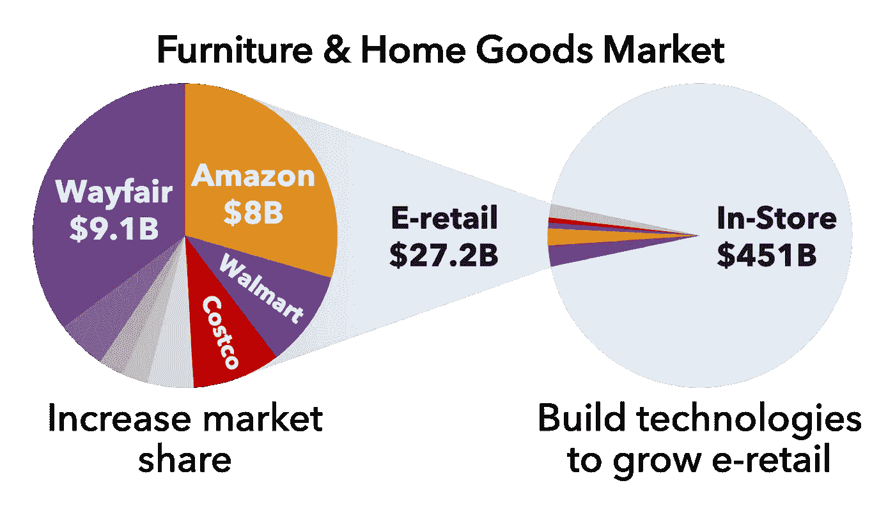*

*来自公司各自财务文件的数据。作者图片*

*质量控制对电子零售商来说是一个挑战，因为他们对库存的控制不如实体零售商。预测未来的退货率在这方面很方便:**确定预计未来退货率高的产品为 Wayfair 提供了一种系统解决其库存质量问题的替代方法**。*

*对于像 Wayfair 这样的电子商务公司来说，一个丰富的数据来源是文字评论。在[最近的一项调查](https://bizrateinsights.com/resources/shopper-survey-report-the-impact-reviews-have-on-consumers-purchase-decisions/)中，92%的受访者称在做出购买决定前至少阅读了一篇产品评论。由于购物者使用这个数据源来评估产品质量，Wayfair 应该利用评论提供的大量数据。这个项目的目标是通过检查自由文本评论是否包含改善回报率预测的信号，来帮助公司朝着这个方向迈出一步。*

*这种基于语言的方法背后的一些假设包括:*

1.  *顾客评论包含了评论者是否退回产品的有意义的信号。*
2.  *评论者相当能代表产品的整体客户体验。*
3.  *顾客在一个时期对产品的体验为他们在下一个时期的体验传递了有意义的信号。*

*具体来说，我们使用各种自然语言处理(NLP)技术从评论中提取了几个新特征，并比较了使用这些 NLP 特征的模型与不使用这些特征的模型的性能。通过使用 2017 年的数据来训练所有模型，以预测 2018 年的比率；通过使用 2018 年的数据预测 2019 年的比率，对它们进行了测试。*

*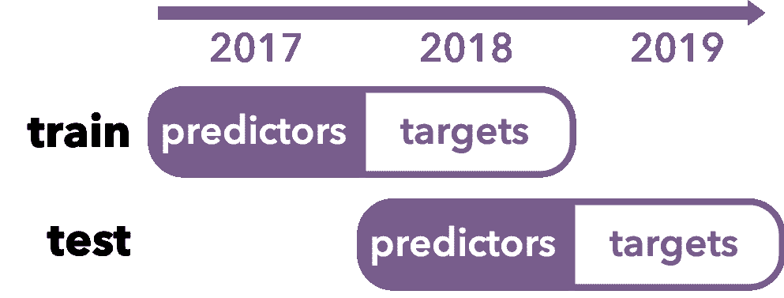*

*训练集和测试集定义。作者图片*

*我们使用两种类型的任务来比较具有 NLP 特征的模型和没有 NLP 特征的模型。第一个任务应用回归模型直接预测下一年的回报率。第二个任务是对产品在下一年是否会有异常回报率进行分类。每项任务代表一个独立的业务用例，测试这两项任务的目的是为了更全面地了解 NLP 功能如何帮助改善 Wayfair 的数据驱动决策和实践。*

*在这个项目中，我们使用了 way fair 2017 年、2018 年和 2019 年的产品级和审查级数据。产品级数据包括市场类别(如照明)、平均重量、订单量(分类)和退货率(按比例调整；它不反映 Wayfair 产品的实际回报率)。评论级数据包括评论(文本)、评级(1 到 5；分类)、产品退货状态和退货原因。*

# *NLP 功能*

*我们的假设是，评论文本包含关于客户体验的额外信息，这些信息无法通过评级等传统方法完全捕捉到。为了测量评论文本中多样化和丰富的信息，我们探索了不同的提取方法，包括预训练模型(情感分析)、迁移学习(BERT 可返回性)和无监督学习(主题建模)。*

## ***情感分析***

*自然语言工具包(NLTK)包含**预先训练的情感分析**和可以应用于文本数据的主观性模型。为了测量情感的强度，NLTK 实现了 VADER。Valence Aware 字典和情感推理器(VADER)是一个基于规则的情感分析器，是为社交媒体情感而创建的。从我们的分析中，我们发现评论通常是非正式的，这使它们更像社交媒体上的帖子，而不是冗长的散文。此外，VADER 可以返回从 0 到 1 的积极、消极和中性情绪的*强度*，以化合价衡量，以及从-1 到 1 的*复合得分*。*

*在我们对个人评论的主观分析中，我们得出结论，VADER 比 NLTK 的情感分析器有更好的表现。例如，VADER 的文档显示，它可以正确地将“我喜欢讨厌迈克尔·贝电影，但我不能挑这部电影的错”这句话归类为积极的，而 base NLTK 情绪分析器却在努力解决这个问题。基于我们自己对情感的主观解释，我们同意 VADER 在 NLTK 上的配价特征。*

*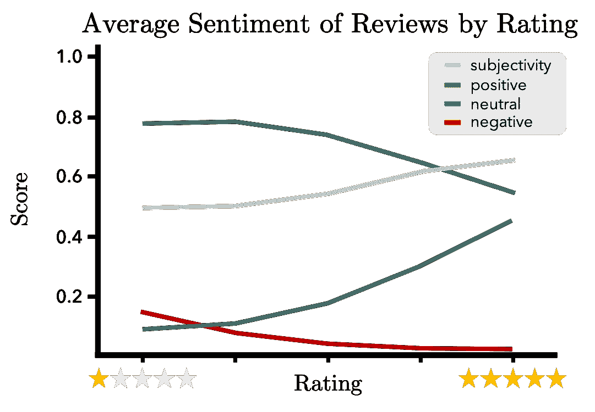*

*作者图片*

*我们的情感特征包括来自 VADER 的正面、负面、中性和复合评分，以及 NLTK 的主观性评分。这些分数是为每个非空文本评论计算的，并通过数据集的简单平均值进行汇总。还增加了每个产品的评论数量。*

*总的来说，上面的图表明，情感分数与我们对它们与评级的关系的预期相符。高评级产品有正面和主观评价，而低评级产品在负面上得分高，倾向于更客观。*

## ***伯特返回能力***

*BERT 是 Google 预先训练的语言模型。基于具有注意机制的 transformer 架构，它能够学习单词之间的上下文关系，并在许多下游任务(如文本分类)中表现出令人印象深刻的性能。因此，我们决定利用 BERT 对人类语言的复杂理解，从综述数据中提取预测信号。*

*对于迁移学习，我们使用我们的定制前馈神经网络(2 个隐藏的密集层和一个 softmax 输出层)扩展了现有的 BERT 基础架构，以构建一个分类器来确定评论是否导致产品退货。我们使用 2017 年经过验证的文本评论(约 450 万)来训练/微调整个模型(即包括 BERT 中的权重)。*

**

*作者图片*

*由于训练数据的类别高度不平衡(只有 1.6%的验证文本评论导致产品退货)，我们对较大的类别(即未退货)进行子采样，使其大小与较小类别(即退货)的大小大致匹配，并在模型训练中应用类别权重。*

*然后使用训练好的模型来计算每个评论被返回的概率，然后通过取平均值将这些评论级别的概率聚集到产品级别。我们将这个 NLP 特性命名为*可返回性*。*

*由于单个数字(可退货性)可能无法捕捉 BERT 提取的丰富信息，我们决定也使用一个与退货相关的评论质量的多元表示。具体来说，我们从基于 BERT 的分类器的最后一个隐藏层中提取了 16 个值，并使用它们的产品级聚合作为与产品回报相关的附加 NLP 特征(下文中称为“嵌入”)。*

*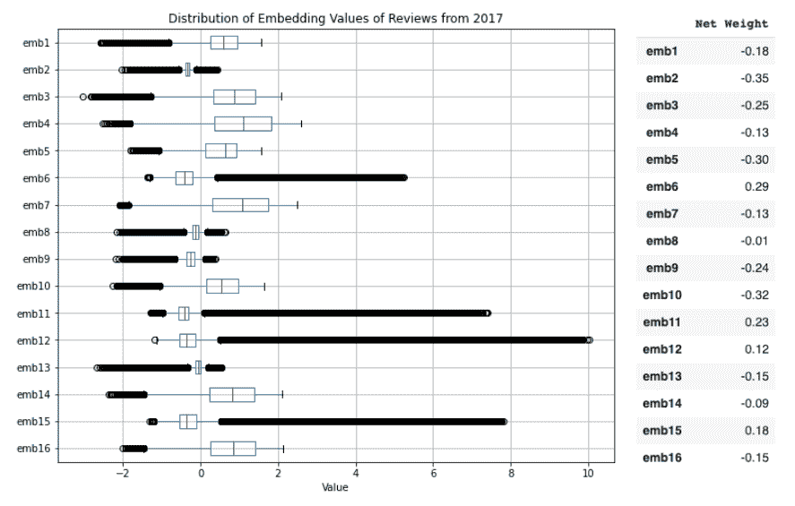*

*作者图片*

*虽然我们知道这 16 个新功能共同编码了与产品退货相关的信息，但每个功能的解释并不简单。因为基于 BERT 的分类器的最后一层本质上执行逻辑回归，所以相应的权重可以被视为逻辑回归中的系数。这有助于我们更好地理解每个嵌入的作用。例如，对应于第 6 个嵌入(即分类器的最后一个隐藏层中的第 6 个节点)的权重是正的，这表明嵌入与输出(即可返回性)正相关。*

## ***话题建模***

*主题建模的基本思想是，研究给定年份中的所有客户评论，可以让我们收集一组单个评论通常涉及的共同主题。如果我们能够提取与导致高或低回报率的因素(以前未捕捉到的)相关的主题，我们可能能够改进回报率的预测。由于这是一种无监督的方法，我们不能指定主题模型应该查看哪些特定的主题。因此，我们的目的是使用这种无监督的超参数调整方法，以提取携带有用信号的主题簇。*

*主题建模的预处理阶段包括去除停用词和空格，应用词汇化来检索每个词的原始形式，以及对每个处理后的词应用分词器。我们没有猜测主题的数量，而是使用分层的狄利克雷过程(HDP)来生成数量。以下是 20 个主题特征中最有用的两个主题的关键词。通过检查这些关键词，我们可以知道 *topic_6* 与组装家具的总体积极体验相关；而 *topic_18* 是关于产品的颜色以及是否与网站上的图片匹配。*

**

*密度图显示主题分数在所有评论中的分布，图片由作者提供*

# *回归*

*一旦这些产品级的 NLP 特征被提取出来，我们就将它们聚合并合并到我们的产品级设计矩阵中。数据是“左连接的”，意味着我们保留了“当前”(相对于“预测”)年销售的所有产品；未来回报率中的缺失值用每个相应产品的当年回报率来估算。产品级特征中的缺失值(即预测值)用各自的类别级中位数进行估算。*

*使用这个扩充的数据矩阵，我们然后建立了预测回报率的回归模型，以检验这些新功能是否在预测未来回报率方面给我们带来了性能提升。我们使用 2017 年的数据进行训练(即预测 2018 年的费率)，使用 2018 年的数据进行测试(即预测 2019 年的费率)。模型性能使用我们的自定义指标进行评估，稍后将对此进行解释。*

*由于不同市场类别的产品在回报率方面可能有不同的模式，我们决定为每个市场类别分别构建模型，以进一步检验其表现。*

## *不对称度量*

*由于这是一个回归问题，我们最初使用 RMSE 作为我们的评估指标。然而，在这种情况下，对 Wayfair 来说，高估一种产品的未来回报率比低估它的成本更高。为了将这种保守的方法正式化，我们设计并使用了如下非对称 RMSE:*

*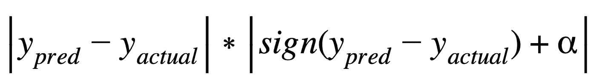*

*我们将𝛼设置为 0.3，这样，如果预测回报率高于实际回报率，该函数将对我们的模型进行更多惩罚。另一方面，如果𝛼 < 0，我们的不对称损失会因预测不足而受到更多惩罚。Wayfair 可以根据他们的业务目标微调价值。*

*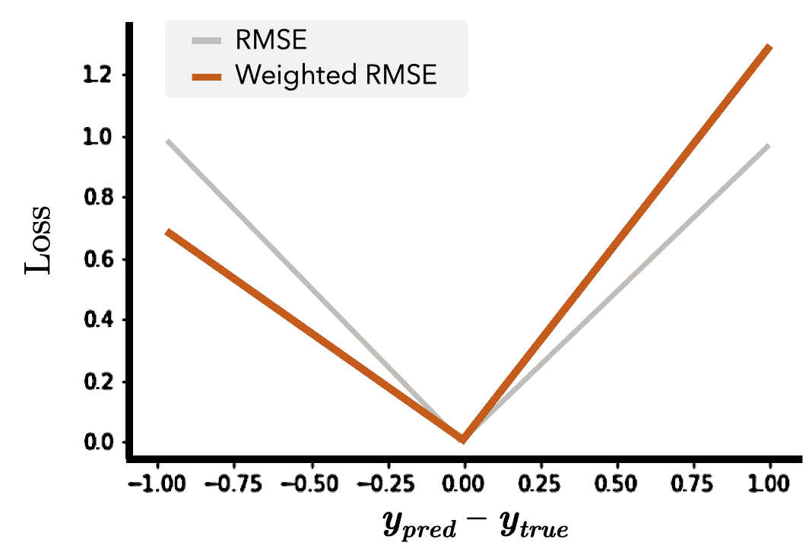*

*作者图片*

## *神经网络 vs 随机森林*

*由于我们不确定哪种模型类型会对我们的数据表现良好，我们尝试了随机森林回归器和前馈神经网络。对于随机森林回归，模型是通过改变每片叶子的最小样本和最大深度的 k-fold 交叉验证来选择的。由于模型包(scikit-learn)不允许我们在拟合模型时更改损失函数，因此我们使用 MSE 标准优化了随机森林，但使用我们的自定义非对称指标评估了其性能。对于神经网络，我们为每个市场类别创建了单独的前馈神经网络，并使用我们的非对称度量作为损失函数直接优化它们。性能比较如下所示:*

*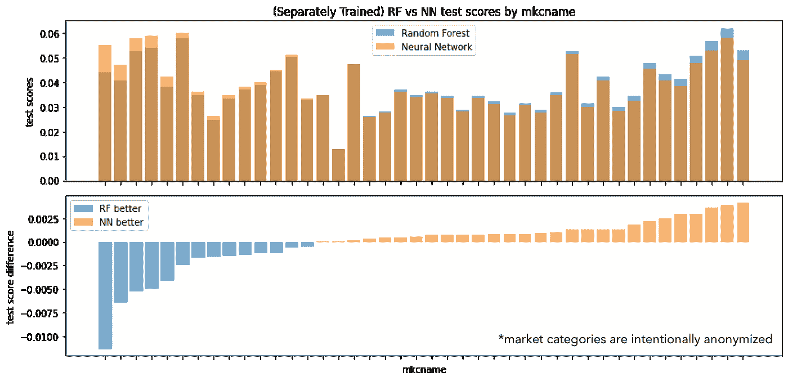*

*作者图片*

*这里的 x 轴代表市场类别，y 轴上的测试分数来自我们的自定义不对称损失。虽然在大多数市场类别中，神经网络似乎优于随机森林回归模型，但与随机森林回归模型优于神经网络的类别相比，其幅度相当小。神经网络显示了一些缺点:与随机森林回归相比，它们更难解释，也很难微调，而且它们在数据量小的市场类别中存在较大的差异。考虑到这些因素，我们决定选择一个随机森林作为回归分析的最终模型类型。*

## *NLP 能提高回归性能吗？*

*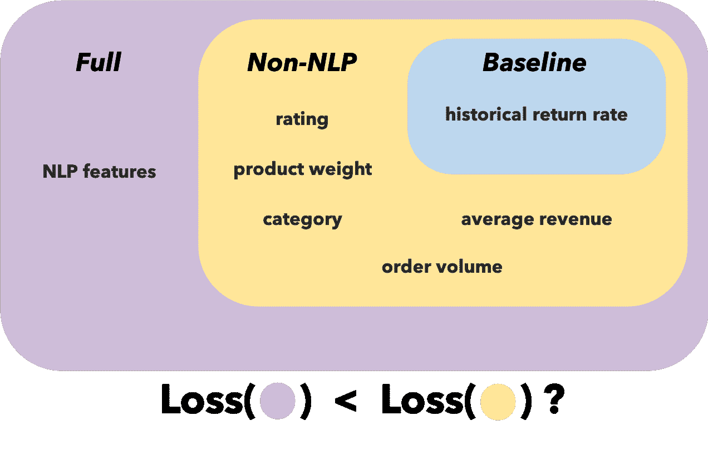*

*功能总结。作者图片*

*为了回答 NLP 是否能提高回归性能的问题，我们使用随机森林回归器来检验 NLP 特性是否能提高我们预测回报率的性能。我们比较了两组模型:一组用非 NLP 和 NLP 特征训练，称为完整模型，另一组只用非 NLP 特征训练。我们将他们的表现与一个简单的基线模型进行了比较，该模型预测下一年的回报率与上一年相同:如果一种产品的 2017 年回报率为 10%，基线将在 2018 年为该产品输出 10%的回报率。*

*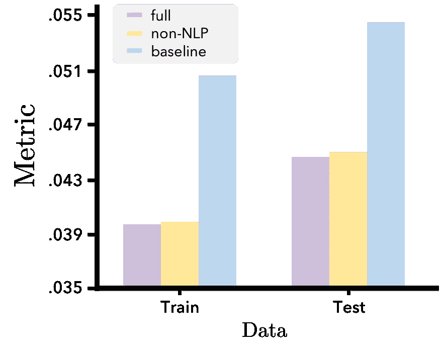*

*紫色条*

*我们可以看到完整模型(具有 NLP 特性)确实提高了测试集的性能，但幅度很小。这就提出了一个问题，即这种改善是否具有统计学意义，或者我们的模型只是在测试集上过度拟合。因此，我们使用了 bootstrap 方法，对测试集进行重新采样，然后重新比较完整模型和非 NLP 模型的性能。*

*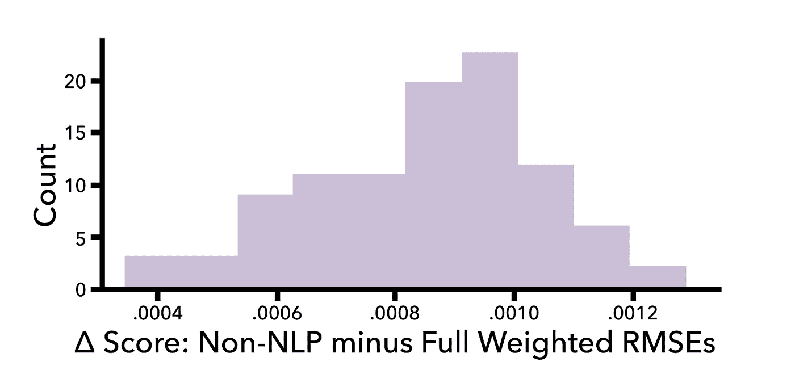*

*因为分数δ是正的，NLP 特征有意义地改进了预测。作者图片*

*该图的 X 轴表示通过引入 NLP 特征，测试集上不对称 RMSE 分数的降低。x 轴上的正刻度表示 NLP 有帮助。因此，该图显示了完整模型的性能提升是稳健的。虽然改善的幅度很小，但这些 NLP 特性确实有助于预测未来的回报率。*

# *分类*

*鉴于回报率预测通常是在识别“高风险”产品的背景下进行的，我们还对异常值检测任务的模型进行了实验和比较。我们将异常值定义为每个市场类别中回报率最高的 10%的产品。为了确保这一标准是合理的，对每个市场类别的回报率阈值进行了如下目测检查:*

*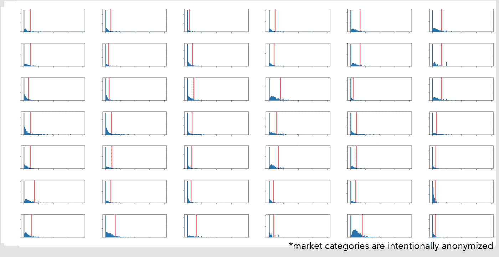*

*每个市场类别的回报率分布。作者图片*

*使用三种模型类型来比较该异常值检测任务的模型性能:*

1.  ***基线**:我们创建并检查了一个不涉及预测因素的基线绩效，我们简单地假设在某一年是异常值的产品在下一年仍然是异常值。*
2.  ***回归变量+排名**:我们使用了回归任务中的同一个回归变量，但将其输出(即预测回报率)转换为类别内排名，用于指定异常值。我们的期望是回归变量可以利用其预测回报率的能力来为异常值生成更好的预测。*
3.  ***分类器**:由于离群点检测是一个分类问题，我们还构建了一个简单的分类器，它在与回归器相同的设计矩阵上进行训练，但具有二元离群点基础事实。*

*如前所述，我们宁愿以容忍有限数量的假阴性为代价来避免假阳性。因此，我们选择精度作为离群点检测的评估标准。*

*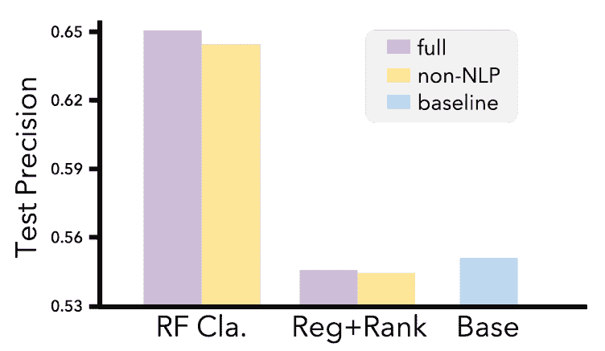*

*随机森林分类器击败了基线，NLP 功能提高了性能。作者图片*

*结果表明，基于精度，分类器击败基线模型，具有最佳性能。更重要的是，我们观察到，在相同的模型类型中，包含 NLP 特征始终会导致更好的模型性能。换句话说，NLP 特征在检测异常值时确实揭示了一些有用的信号。*

*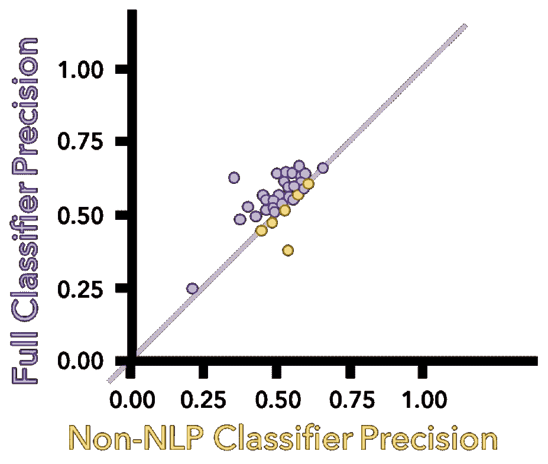*

*NLP 功能提高了大多数市场类别的精确度分数。作者图片*

*由于我们的数据包含超过 40 个市场类别，我们希望检查当从非 NLP 分类器切换到包含 NLP 功能的分类器时，每个市场类别内的精度分数如何变化。下面的散点图显示了使用非 NLP 功能和使用完整功能集的精确得分之间的比较，每个点都是一个市场类别。如果数据点落在灰色对角线上(y=x)，则意味着在加入 NLP 特征时没有改善。当使用 NLP 功能时，落在红线以上的数据点表示精度提高。通过使用非 NLP 和完整分类器计算所有类别的精度分数，我们观察到包含 NLP 特征导致大多数类别的精度提高。事实上，添加 NLP 功能可以带来高达 30%的改进。仅在一个类别中观察到精度下降(当使用 NLP 特征时)。*

*虽然我们有点估计来说明完整模型对非 NLP 模型的改进，但重要的是要确保这种改进不仅仅是对测试集的过度拟合。因此，我们使用 bootstrapping 对测试集中的产品进行重新采样，并根据评估指标(即精度)重新评估模型:*

*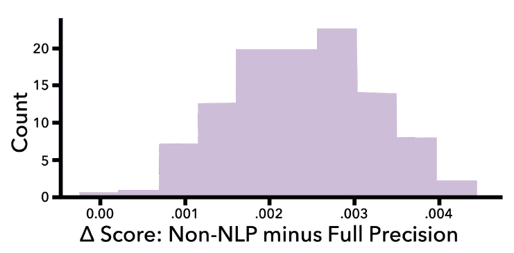*

*分数δ显示 NLP 特征显著地提高了分类性能。作者图片*

*上面的图表明，当添加 NLP 特征时，模型的测试精度提高了，并且这种提高对于测试集中的变化是稳健的。因此，虽然我们的改进幅度很小，但我们的 NLP 功能很可能会带来有意义的改进。*

# *结论*

*这个项目的目标是确定自由文本评论是否能提高回报率的预测。基于我们的回归和分类结果，我们认为答案是肯定的。随着 NLP 特性的增加，我们的随机森林和神经网络回归器不断改进。类似地，回归器+秩和离群分类器也随着 NLP 特征的增加而改进，并且我们检查了这些改进对测试集中的变化的鲁棒性。*

*然而，性能的提高虽然持续，但幅度仍然很小。这就提出了统计意义与实际意义的问题。统计显著性是衡量一个事件在零假设下是否不太可能发生的指标，无论差异的大小有多小。而实际意义则要求效果尺寸大。虽然我们没有进行正式的假设检验，但基于我们的 bootstrap 和回归分析，NLP 的改善似乎在统计意义上持续存在。然而，实际上，改进的幅度仍然很小。*

*考虑到这一点，我们对 Wayfair 的建议取决于预测回报率的业务用例。在某些情况下，预测未来回报率的任何改进都是有价值的。在这些情况下，上面讨论的方法可以作为一个重要的新工具。在其他情况下，考虑到它们产生的预测准确性的小增益，合并 NLP 特征的额外复杂性可能是不值得的。*

# *感谢*

*我们要感谢来自 Wayfair 的 Nathaniel Burbank 对这个项目的指导。黄家仪是一个无价的教学伙伴，给了我们非常宝贵的反馈。最后，感谢 Chris Tanner 帮助我们理解 NLP，并带领我们学习这门课程。*

*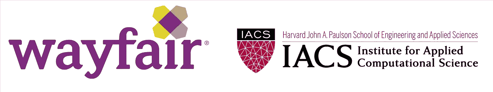*

*与 Wayfair 和 IACS 合作*

# *参考*

*[1] D. Blei，[潜在狄利克雷分配](https://jmlr.org/papers/volume3/blei03a/blei03a.pdf) (2003)，机器学习研究杂志*

*[2] J. Devlin 等人， [BERT:用于语言理解的深度双向转换器的预训练](https://arxiv.org/pdf/1810.04805.pdf) (2018)，arXiv 预印本*

*[3] C.J .休顿和 e .吉伯特，[【VADER:一种基于简约规则的社交媒体文本情感分析模型】](https://ojs.aaai.org/index.php/ICWSM/article/view/14550) (2014)，第八届 AAAI 网络博客和社交媒体国际会议论文集*