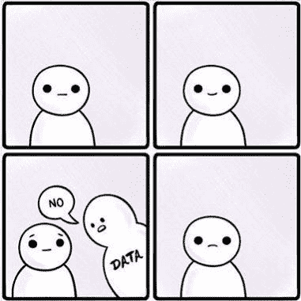

# 在编写下一个 SQL 查询之前，请阅读这篇文章。⌨️

> 原文：<https://towardsdatascience.com/read-this-before-you-write-your-next-sql-query-%EF%B8%8F-de6b3b2c449a?source=collection_archive---------3----------------------->

## [*小窍门*](https://towardsdatascience.com/tagged/tips-and-tricks)

## 或者:为 Airbnb 的首席执行官写即席查询的经验教训。

不要用你糟糕的问题毁掉你的公司。(图片由作者提供)

当我在 Airbnb 的时候，我有一个极好的机会在一个向 Brian Chesky 汇报的新团队中工作。这很令人兴奋——我们正在研究一个新的产品线，所以我们每天都必须做出改变游戏规则的决定。但是作为团队的数据科学家，我开始负责获取数据来指导我们的产品方向，这意味着大量的分析工作。

第一周对我的上下文切换能力是一次严峻的考验:我不仅要找到晦涩的表格，编写大量的查询，还要通过`beautifulsoup`搜索正则表达式，并对 API 请求进行质量控制。到了第三周，我开始变得疲惫(而且邋遢！)，所以我需要一个系统来跟上我的速度。我意识到，在处理数据时，只有两种方式会出错:

1.  **使用错误的数据。**
2.  **用错了数据。**

> 这两个问题都可以通过在您的数据周围有更好的**上下文**来解决。

所以我给自己做了一个清单来减少这些错误，确保我不会让产品被遗忘。我将在此分享我的观点，但具体是什么样的可能取决于您公司的特定堆栈。**以此为例，你可以找到一些好的背景来降低使用桌子的风险，但我鼓励你把它变成你自己的。**

# 那么我需要什么样的上下文，我如何得到它？🤔

嗯，你需要**任何和所有的信息来减少错误使用数据或使用错误数据的机会**。根据我的经验，你只需要三张支票就可以得到合理的保险:

1.  **🗃检查基础表元数据。** 例如，列名，分区信息，它是如何产生的，等等。
2.  🔭检查你的假设。
    这一栏是什么？这是空列吗？有哪些鲜明的价值观？自从我最后一次运行这个查询以来，这些改变了吗？
3.  💏向别人咨询。
    其他人拿这张桌子做什么？如果你有问题，你会问谁？

# 🗃 1.检查基本表元数据

> 第一步是找到一个表，并弄清楚如何查询它。

在你的桌子泄露秘密之前，你必须向它求爱。(经 [Olya Tanner](https://twitter.com/roliepoly) 许可转载)

对于最基本的信息，比如列名、索引信息、分区信息、视图定义，通常可以查询系统表。将这些表列在手边，以便于查询。例如，对于 ANSI SQL 兼容的数据库(大多数)，记住下面的表通常是有帮助的:

*   列名，分区信息，列类型，可空性。
*   `information_schema.tables`和`information_schema.views` 漂亮的所有表格和视图列表。对于视图，通常也可以得到`DDL`语句。

您通常还可以获得其他人编写的查询历史，这有助于了解如何使用表。您甚至可以按语句类型(如`create`、`insert`、`select`)过滤这些语句，以确定如何创建表格:

*   `INFORMATION_SCHEMA.JOBS_BY_PROJECT`([big query](https://cloud.google.com/bigquery/docs/information-schema-jobs))
    `table(information_schema.query_history())`([雪花](https://docs.snowflake.com/en/sql-reference/functions/query_history.html))

# 🔭 2.检查你的假设。

> 写下你的假设并运行查询来检查它们。

一个人制作清单的很好的例子，如果你以前没看过的话。

此时，您想看看数据是否如您所想。虽然我的典型方法是随意遍历`select *`和`select distinct`语句，但这并不是最优的。更好的方法是首先弄清楚:

我需要回答什么问题，我在做什么假设？

写出这些问题，然后写出回答这些问题/验证这些假设的问题。这听起来可能微不足道，但是如果你做了错误的假设，你将不得不重新开始。我们在处理数据时都会做出假设——如果你对这些假设不明确，就会导致灾难。

最近一个项目的一些例子:

*   每个事件只有一行吗？
*   该字段的可能值是什么？
*   这个列曾经是空的吗？
*   如果为空，这些空值是否有系统的模式？

我个人使用 [whale](https://github.com/dataframehq/whale) (CLI 工具，如果我感到不耐烦的话)或 [Hyperquery](http://hyperquery.ai) 来运行(甚至安排)这些快速检查，但是不管你使用什么，只要确保将它们保存在某个地方。

**最后，是的，很好——继续运行一个** `**select ***` **。**有时候你只需要看一段数据。

# 💏 3.找别人核实一下

现在您已经对数据的*形状*有了一个概念，很容易就开始构建您需要构建的东西。**不要。**你需要获得尽可能多的关于这些数据的社会背景和部落知识——在大型组织中尤其如此。

> 现在是时候收集部落知识了。

我知道这些人没有脸，但在获得一些额外的社会背景后，你就不能感受一下右边那个人的喜悦吗？

不幸的是，仅仅通过挖掘数据你能得到的就只有这么多了。你需要和一个真实的人交谈(或者找一些最新的文件)。

查看查询日志(见上文)，苦读 Github(如果您的查询是受版本控制的)，或者检查谁是表的所有者(您通常可以在数据上下文/发现工具中这样做，如 [Hyperquery](http://hyperquery.ai) )—只需找个人放松一下。

一般来说，我会问以下问题:

*   这种情况还在持续吗？
*   这是用于{{ your_use_case }}的最佳数据吗？

公开你目前所做的事情。你可能在错误的桌子上，但是人们欣赏一些尽职调查。

# 结束语

**如果这一切听起来有点难以承受，请查看**[**Hyperquery**](http://hyperquery.ai)**。**我们正在构建一个数据环境平台，让查找所有这些信息变得更加容易，而且是免费的。在一个地方搜索表格、获取基本元数据、浏览数据和获取社会背景。好了，推销结束。抱歉，我控制不住自己——我只是对我们的产品感到非常兴奋。😁

我想让你从这篇文章中得到的一个信息是:**对待** **你的即席分析工作要像对待其他任何事情一样严谨。在你的职业生涯中，最尴尬的事情之一就是中途意识到你的结果可能是错的。围绕不可协商的上下文设置一些最佳实践，以便在每次编写查询时获得*是一种很好的方式，至少可以减轻一些负面影响。***

还是自己体会吧。然后回到这里再读一遍。🙂

*推文*[*@ imrobertyi*](https://twitter.com/imrobertyi)*/*[*@*hyperquery](http://twitter.com/hyperquery)*来问好。👋
关注我们*[*LinkedIn*](https://www.linkedin.com/company/hyperquery)*。🙂* ***要了解更多我们在 Hyperquery 所做的事情(并注册我们数据上下文平台的私有测试版)，请访问***[***Hyperquery . ai***](http://hyperquery.ai)***。*** *(如果你有兴趣帮助构建这个下一代工具，我们正在招聘——查看我们的* [*空缺职位*](https://www.notion.so/Careers-at-Dataframe-3e861dab875443269ee612e9159c2071) *。)*