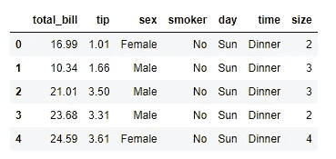
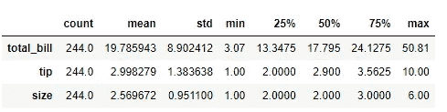
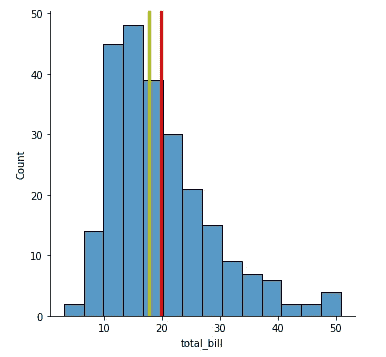
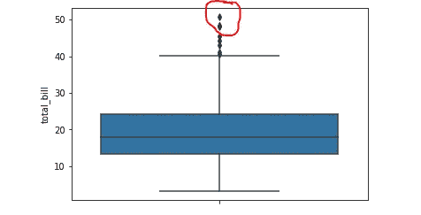
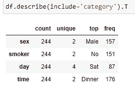

# 阅读和解释汇总统计数据

> 原文：<https://towardsdatascience.com/reading-and-interpreting-summary-statistics-df34f4e69ba6?source=collection_archive---------7----------------------->


照片由[哈利·鲍尔斯](https://unsplash.com/@haleypowers?utm_source=medium&utm_medium=referral)在 [Unsplash](https://unsplash.com?utm_source=medium&utm_medium=referral) 拍摄

## 如何从描述性统计中提取信息的指南

典型的数据科学项目始于数据争论。它是清理杂乱数据并将其转换为适当格式以供进一步分析和建模的过程。

该过程的下一步是探索性数据分析或 EDA。这是您发现数据中隐藏的问题和异常的地方。最重要的是，这是发现信息和见解的开始。

在本文中，我将讨论 EDA 中最有用但未被充分利用的工具之一——描述性统计。

描述性统计充满了信息和见解。一双有经验的眼睛会仔细观察每一个数据点，并从汇总表中提取有价值的信息。然而，我在数据科学中见过许多人，他们在以有意义的方式解释统计摘要时面临困难。有些人会简单地浏览一下，然后尽快进入下一部分。这篇文章的目的是向你介绍如何阅读描述性统计数据并提取有用的信息。

让我们首先看看给定数据集的汇总统计表是什么样子的。我将使用 Python 中的`seaborn`库自带的内置数据集。

```
import seaborn as sns
import pandas as pd
df = sns.load_dataset('tips')
df.head()
```



该数据集中的每个观察值(行)代表在餐馆就餐。这里的列名是不言自明的。在数字列中，“总账单”指的是用餐者支付的账单金额，“小费”代表他们支付的小费金额。

只需一个简单的方法调用`df.describe()`就可以得到数字列的汇总统计数据(我将在最后谈到分类列)。



那么如何解读这份汇总统计数据呢？事实上，您可以从该表中提取 3 种信息:

*   变量的统计分布
*   数据中的异常现象
*   其他兴趣点

# 统计分布

## **的意思是**

在汇总统计数据中，您可能首先会看到的是*均值—* 集中趋势的一个关键[衡量指标。](/statistical-measures-of-central-tendency-d8d4fbb70111)

对于平均值，您试图了解平均数据点是什么样的。你也要把它和你的期望和经历进行比较。例如，客户支付的平均账单是 19.7 美元。你觉得这正常吗？对于一个人的平均餐来说，这有点高，不是吗？但是如果你知道这是两个人的账单(看看“大小”栏的意思)，那么这个账单听起来是合理的。

“小费”的平均值是 2.9 美元，大约是“总账单”的 15%。在我看来这很正常。

## **平均值与标准偏差**

你应该检查的下一个数字是标准差(STD)。

标准偏差是数据点相对于平均值的变化/离差的度量。较小的标准差表示数据主要集中在平均值附近，而较大的标准差表示数据点相当分散。

在上面的例子中，total_bill 的标准是 8.9 美元。这告诉我，人们在餐馆的花费有所不同。这种变化并不是完全出乎意料的，可以通过以后的统计数据进一步证实。

## **平均值与中位数(50%)**

接下来是第 50 百分位(50%栏)，也称为*中位数*。像均值一样，这是集中趋势的另一种度量。如果数据中存在异常值或高可变性，中值是优于平均值的首选指标。

如果均值和中位数的差很小，可以推断数据是对称分布的。如果中值高于平均值，则数据在分布上可能是左偏的。

```
import matplotlib.pyplot as pltsns.displot(df['total_bill'])
plt.axvline(x = df['total_bill'].mean(), linewidth = 3, color='r')
plt.axvline(x = df['total_bill'].median(), linewidth = 3, color='y');
```



总账单分布:黄色=中间值，红色=平均值

## **最小值和最大值**

最小值和最大值分别表示数据集中变量的下限和上限。

我们数据集中的总账单介于 3 美元到 50 美元之间。餐馆账单的上限似乎是合理的，尽管在大型数据集中，我期望更高的值。餐馆账单的最低金额(3 美元)似乎有点低，尤其是当平均金额为 19 美元的时候。但这并非不合理。

# 异常和其他关注点

使用描述性统计，您可以了解数据集中的异常值、异常值和其他感兴趣的点。怎么会？

## **离群值**

第 75 个百分位数和最大值之间的巨大差异表明存在潜在的异常值。最小值和第 25 百分位之间的差值也是如此。

为了绝对确认异常值，您可以创建一个箱线图进行目视检查。

```
sns.boxplot(y=df['total_bill']);
```



箱线图:数据集中可能的异常值

## **危险信号**

有时描述性统计可能会引发危险信号。我们在这个数据集中没有任何危险信号，但是，我在其他地方看到了意想不到的最小值(0 或负值)或绝对疯狂的最大值(例如，某人的年龄是 120 岁！).这些明显表明数据中存在问题，需要进一步调查。

# 描述分类数据

到目前为止，我们已经研究了数字变量的描述性统计。Python `pandas`也提供了分类变量的总结。



如何解释此表:

*   “计数”是指数据集中的观察总数。
*   “性”栏有两个独特的类别
*   “顶级”指的是占主导地位的类别(在这种情况下是男性)
*   “频率”是指占主导地位的类别的比例(有 157 名男性顾客支付了账单)

# 摘要

描述性统计对数据集进行了强有力的综合，简明扼要，可用于提取有价值的信息作为探索性数据分析的一部分，包括变量的统计分布(最小值、最大值、平均值、中值、百分位数)、潜在异常和其他感兴趣的点。除了数字数据，描述性统计还综合了分类变量的信息，显示了每一列中类别的唯一数量、主要类别以及该类别的比例。

感谢您的阅读，如果您有任何意见和想法，请随时写在下面，或者通过[媒体](https://mab-datasc.medium.com/)、[推特、](https://twitter.com/DataEnthus)或 [LinkedIn](https://www.linkedin.com/in/mab-alam/) 与我联系。