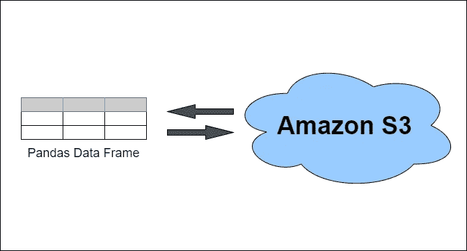

# 熊猫在亚马逊 S3 上读写文件

> 原文：<https://towardsdatascience.com/reading-and-writing-files-from-to-amazon-s3-with-pandas-ccaf90bfe86c?source=collection_archive---------0----------------------->

## 使用 boto3 库和 s3fs 支持的 pandas APIs



# **内容**

*   在 S3 上将熊猫数据帧写入 CSV 文件
*   >使用 boto3
*   >使用 s3fs 支持的 pandas API
*   将 S3 的 CSV 文件读入熊猫数据框
*   >使用 boto3
*   >使用 s3fs 支持的 pandas API
*   摘要

# **⚠请在继续之前阅读**

要继续学习，您需要安装以下 Python 包

*   boto3
*   s3fs
*   熊猫

当 boto3 和 s3fs 都被指定为项目中的依赖项时，存在一个关于依赖项解析的突出问题。如果你对细节感兴趣，请看[这期 GitHub](https://github.com/dask/s3fs/issues/357)。幸运的是，这个问题已经解决了，你可以在 GitHub 上了解更多。

在问题解决之前，如果你需要两个包(例如，在相同的环境中运行下面的例子，或者更一般地，使用 s3fs 进行熊猫到 S3 的便捷交互，使用 boto3 进行与 AWS 的其他编程交互)，你必须将你的 s3fs 固定到版本“≤0.4”，作为[解决方法](https://github.com/dask/s3fs/issues/357#issuecomment-709976012)(感谢[马丁·坎贝尔](https://medium.com/u/82474497d5c2?source=post_page-----ccaf90bfe86c--------------------------------))。

在问题解决之前:

```
python -m pip install boto3 pandas "s3fs<=0.4"
```

问题解决后:

```
python -m pip install boto3 pandas s3fs
```

💭在下面的例子中你会注意到，虽然我们需要导入 boto3 和 pandas，但是我们不需要导入 s3fs，尽管我们需要安装这个包。原因是我们在代码中直接使用了 boto3 和 pandas，但不会直接使用 s3fs。尽管如此，熊猫还是需要它来连接 S3 亚马逊。

> 熊猫现在使用 s3fs 来处理 S3 连接。这不会破坏任何代码。然而，由于`s3fs`不是必需的依赖项，您需要单独安装它，就像以前版本的 pandas 中的`boto`。( [GH11915](https://github.com/pandas-dev/pandas/issues/11915) )。
> 
> [熊猫 0.20.1 版发行说明](https://pandas.pydata.org/pandas-docs/dev/whatsnew/v0.20.0.html#whatsnew-0200-api-breaking-s3)

# 在 S3 上将熊猫数据帧写入 CSV 文件

## 使用 boto3

使用 boto3 库将熊猫数据框写入 S3 上的 CSV 文件的演示脚本

## 使用 s3fs 支持的 pandas API

使用 s3fs 支持的熊猫 API 将熊猫数据框写入 S3 上的 CSV 文件的演示脚本

# 将 S3 的 CSV 文件读入熊猫数据框

## 使用 boto3

使用 boto3 库将 S3 的 CSV 文件读入熊猫数据框的演示脚本

## 使用 s3fs 支持的 pandas API

使用 s3fs 支持的 pandas APIs 将 CSV 文件从 S3 读入 pandas 数据框的演示脚本

# 摘要

如果您在已经有 boto3 的环境中使用 pandas，并且还必须与其他 AWS 服务交互，那么您可能希望使用 boto3。

然而，使用 boto3 需要稍微多一点的代码，并且使用了`[io.StringIO](https://docs.python.org/3/library/io.html#text-i-o)` [【文本 I/O 的内存流】](https://docs.python.org/3/library/io.html#text-i-o)和 Python 的上下文管理器(`[with](https://docs.python.org/3/reference/compound_stmts.html#the-with-statement)`[语句](https://docs.python.org/3/reference/compound_stmts.html#the-with-statement))。这是另外两个你可能还不知道，或者不想学习或者想去“简单地”读/写一个文件到亚马逊 S3 的事情。

不过，我还是建议学习它们；他们经常出现，尤其是`with`声明。但是，pandas 满足了我们这些“简单地”想从亚马逊 S3 读写文件的人，通过使用 s3fs 来实现这一点，其代码即使是 pandas 的新手用户也会感到熟悉。

```
aws_credentials = { "key": "***", "secret": "***", "token": "***" }
df = pd.read_csv("s3://...", storage_options=aws_credientials)
```

或者

```
aws_credentials = { "key": "***", "secret": "***", "token": "***" }
df.to_csv("s3://...", index=False, storage_options=aws_credentials)
```

感谢您的阅读！

# 你接下来应该读的文章

*   [4 个处理脏数据的可爱 Python 函数](/4-cute-python-functions-for-working-with-dirty-data-2cf7974280b5)
*   [提高 Python 代码库中的代码质量](https://onelharrison.medium.com/improving-code-quality-in-python-codebases-f70983f2e309)
*   [如何递归反转链表](https://medium.com/the-core/how-to-recursively-reverse-a-linked-list-9990d59fc13f)

# 更多计算资源

在[OnelTalksTech.com](https://oneltalkstech.com)观看涵盖各种计算主题的视频