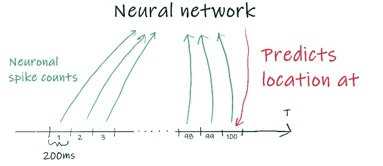
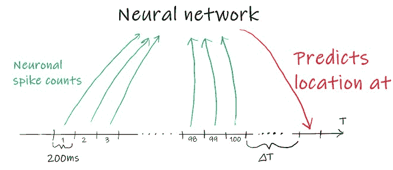
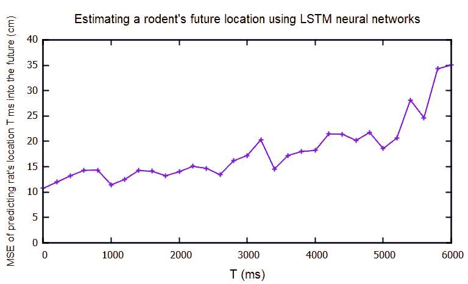
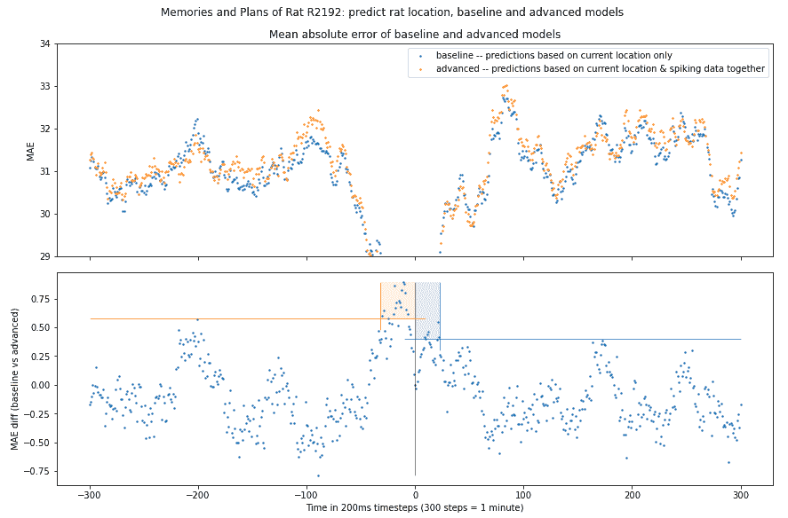
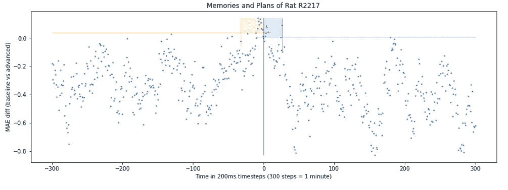
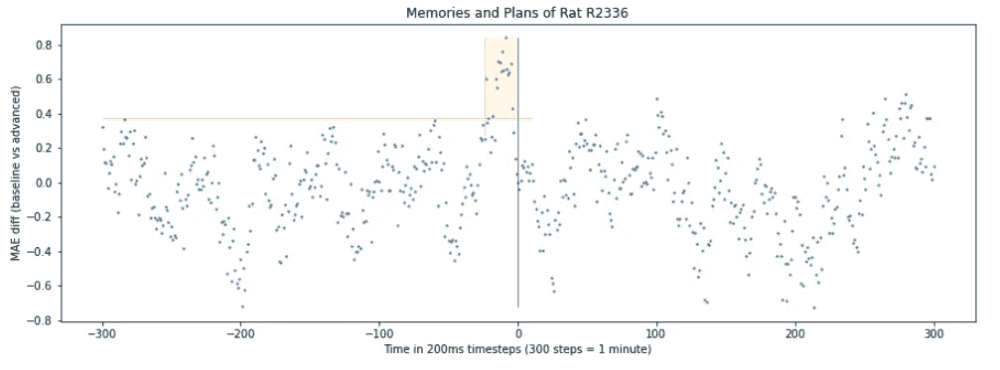
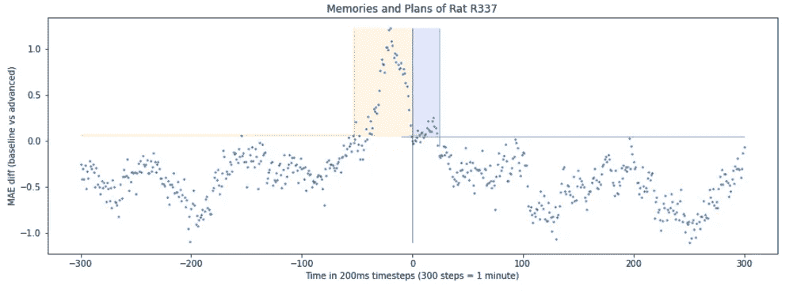
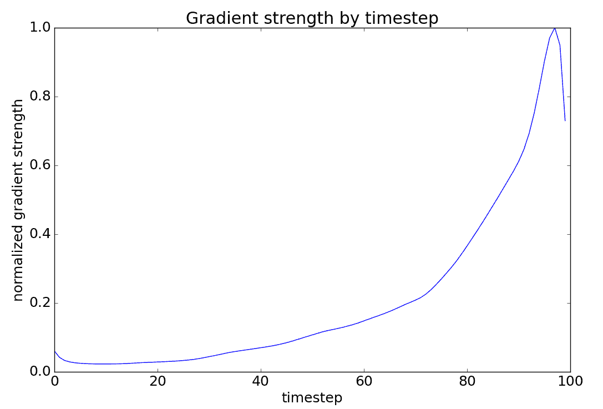
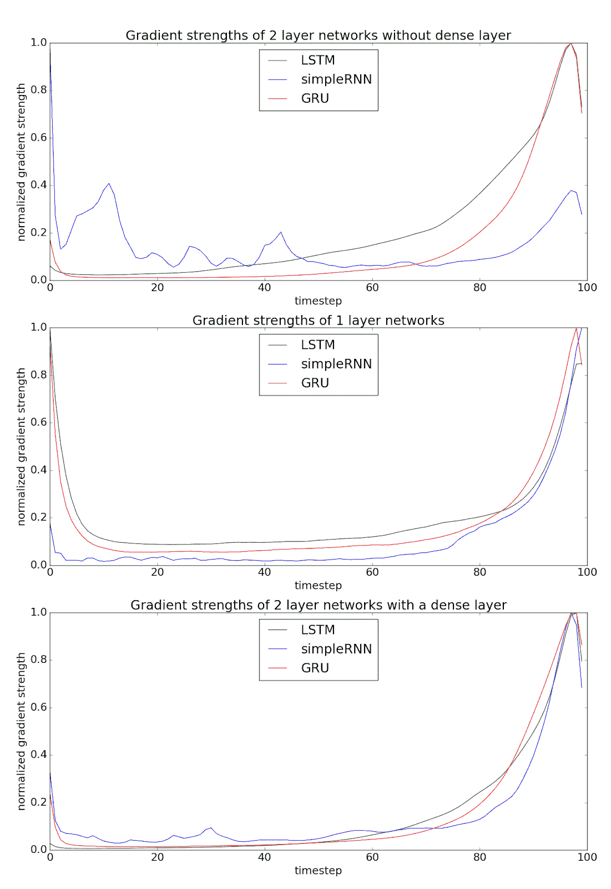

# 读老鼠的心

> 原文：<https://towardsdatascience.com/reading-rats-mind-2e0b705d5e08?source=collection_archive---------61----------------------->

## 哺乳动物海马体的位置细胞能记住它过去的位置并预测未来的位置吗？

图片来源:[pexels.com](https://www.pexels.com/photo/animal-blur-close-up-cute-209112/)

# 简介和背景

2019 年，来自爱沙尼亚塔尔图大学计算机科学系和伦敦大学学院的 Tampuu 等人发表了一篇论文，[利用深度递归网络](https://journals.plos.org/ploscompbiol/article/authors?id=10.1371/journal.pcbi.1006822)对自我定位进行有效的神经解码，其中他们能够利用 RNNs(更具体地说是 LSTM)和海马神经元的记录来预测大鼠的位置。他们表明，在预测 2D 环境中老鼠的位置时，他们的方法比贝叶斯解码器更好。特别是，他们开发了一种解码器，可以从部分重叠的时间窗口中接受神经元棘波计数，然后预测大鼠在最终时间窗口中间的位置。原始论文的作者从 UCL 的 Caswell Barry 实验室获得了数据集。

这篇博文的作者(见下文)旨在通过使用原始论文的 [GitHub 知识库](https://github.com/NeuroCSUT/RatGPS)中可用的相同神经元尖峰数据来扩展他们的方法，并尝试预测不同时间的位置。我们特别感兴趣的是，在未来多远的时间里，一只老鼠的位置细胞拥有关于它运动的信息，以及这些细胞能记住多少过去的事情。

我们的第二个目标是调查最初的研究作者在检查他们的神经网络中的梯度强度时注意到的异常。这篇博文的最后一部分也提供了一个简要的概述。

# 通过神经网络预测未来

在我们变得过于严谨之前，让我们用神经网络做一些简单的训练和预测。这一节并没有过多地探究细节，所以如果你已经深入其中，你可能会觉得下一节更有趣。

## 该方法

在最初的文章中，研究人员使用了具有 LSTM 节点的神经网络来预测老鼠的当前位置。LSTM(或长短期记忆)是一种递归神经网络。LSTM 节点也可以在任意的时间内“记住”信息，这可能与大脑的行为类似。

当大鼠在 2D 环境中移动时，每隔 200 毫秒测量其定位细胞的神经元锋电位计数，即所谓的时间步长。基于 LSTM 的 RNN 输入由 100 个这样的连续时间步长的测量形成。然后要求网络预测老鼠在最后一个时间窗口中心的位置。通过这种方式，研究人员获得了老鼠当前位置的一个非常好的近似值。我们可以用下图来说明这个过程。

预测未来的简单方法是使用相同的架构和输入数据，但改变我们预测的位置。例如，如果我们有 200 毫秒的时间步长，我们可以要求网络从最后的尖峰数据预测未来的 200 毫秒、400 毫秒、600 毫秒等等。

请注意，我们不能使用类似的方法来估计过去的位置。如果我们要估计老鼠在第 99 个时间窗口中心的位置，我们仍然会有关于老鼠在第 99 个时间窗口的过去位置的数据。因此，我们需要一种不同的方法来测试位置细胞是否记得过去的任何位置。我们将在下一节更详细地讨论这一点。

所以如果我们用这种方法预测未来，上面的例子会变成这样:

## 网络体系结构

神经网络本身由一个输入层、两层 LSTM 节点和一个输出层组成。两个 LSTM 层也有一个附加的辍学，以避免过度拟合。该模型总共有大约 300 万个可训练参数。你可能知道，训练大型神经网络可能会变得相当慢。尤其是当你使用普通的 CPU 时。如果你想在合理的时间内完成一些事情，你真的应该使用一些 GPU 加速。幸运的是，Google Colab 是进行这种实验的完美场所，这就是我们所使用的。

## 结果呢

在对这些模型进行了 40 个纪元的训练后，这些就是我们得到的结果。x 轴代表我们预测的未来有多远，而 y 轴代表我们预测的均方误差(观察老鼠的 2D 环境的大小为 1 米×1 米)。

结果看起来和我们预期的差不多。我们预测的未来越遥远，误差就越大。请注意，我们在这里并不真正关心模型有多精确，只关心我们预测的未来有多远(时间 T，单位为毫秒)的误差是如何增加的。这里没有明确的分界点，我们可以说给定的老鼠没有计划到这一步。

注意，这个情节并不完美。可能会发生一些过度拟合，并且给定更多的训练时期，一些模型可能会表现得更好。然而，我们不关心这里的准确性。我们对趋势线感兴趣，即使我们用大量的交叉验证和训练时期来平滑这些图，趋势线也可能不会改变。

虽然这些实验很酷，但它们并没有真正给我们一个很好的洞察力，让我们知道一只老鼠能记住多少，或者它对未来有多少计划。我们需要开发一种更聪明的方法。

# **从当前运动信息中分离老鼠的记忆和未来计划**

## 该方法

我们想测量导航细胞是否有关于老鼠位置的信息，以及在过去和未来有多远。乍一看，一个简单的想法是只训练一个模型，该模型检测神经元尖峰数据与记忆的过去位置或计划的未来位置之间的关系。这基本上就是我们在第一节中所做的。

然而，正如我们从原始论文中了解到的，这些导航细胞在任何给定时刻都在编码关于老鼠当前位置的非常可靠的信息。这意味着，如果我们想真正区分这些神经元编码了多少关于过去记忆或未来计划的额外信息，我们必须消除仅通过知道老鼠的当前位置、移动速度和方向就能猜测过去和未来位置的影响。一种方法是训练两个机器学习模型:

1.  **基线模型** —仅根据大鼠的当前位置、移动速度和方向(即完全不使用神经元尖峰数据)预测过去或未来的位置。为此，我们决定使用 scikit-learn 随机森林回归学习算法。
2.  **高级模型** —使用与基线模型相同的学习算法和相同的超参数，但使用当前位置和运动信息以及神经元尖峰数据作为输入。

**想法:**如果上面的**高级模型**的错误率小于上面的**基线模型**的错误率，我们可以肯定地说，神经元尖峰数据正在编码更多的数据，而不仅仅是老鼠的当前位置、运动方向和速度。通过在过去或未来的不同时间间隔内以这种方式训练和测试一系列模型(每个时间间隔一个模型)，我们可以确定大鼠记得过去多长时间它去过哪里或大鼠计划未来多长时间它的运动的下限。

对于神经元发放解码器，我们选择了能够从神经元发放数据中检测位置信号的 ML 算法。我们想让事情变得合理简单。我们的目标不是尽可能精确，只是足以看到信号存在，因此我们可以区分基线模型和高级模型结果。这就是使用具有默认元参数的简单随机森林回归学习算法而不是复杂的神经网络的基本原理。Random forest 相当容易使用，同时在其默认设置下，如果数据中存在复杂的信号，它也能够检测到这些信号。

## 初始数据

在原始论文的 [GitHub 知识库](https://github.com/NeuroCSUT/RatGPS)中提供的神经元尖峰数据很容易在多个不同的故障中进行预处理。在单独的数据文件中，存在对 2 个不同实验的多个大鼠的测量，并且对于每个大鼠，测量被预处理到不同的时间窗口(对于大于 200 毫秒的时间窗口是重叠的)中，用于计数神经元尖峰。

我们专注于 2D 实验——即关于老鼠在二维环境中导航的数据。在 2D 实验中，我们重点关注了在 200 毫秒非重叠时间窗口内提供神经元峰值计数的数据集。在该数据集中，实验数据集中的一个数据点包括每个神经元的**棘波计数作为 200ms** 期间的特征，以及**大鼠在观察时间帧中间的位置作为标签**。

在 20 分钟的时间跨度内进行神经元尖峰数据和大鼠位置的测量。

## 不同时间间隔的数据预处理和模型

为了训练一个模型来猜测老鼠的位置在过去或将来会在哪里，我们必须沿着时间轴移动标签(老鼠的位置)。比方说，我们想知道老鼠的位置细胞是否对过去 10 秒钟的位置有记忆。然后我们需要移动原始数据集中的标签，这样对于神经元尖峰数据的每个数据点，我们都有从过去 10 秒开始的对应位置。然后，我们可以使用这些数据来训练我们的模型，并验证在预测过去 10 秒时的平均绝对误差。

我们想为不同的时间间隔生成这样的模型，而不仅仅是 10 秒钟，看看老鼠的位置细胞在过去或未来是否知道自己的位置。我们决定扫描所有的时间间隔，从过去 1 分钟开始，到未来 1 分钟结束，时间步长 200ms。因此，对于每只老鼠，我们生成了 2×601 个不同的模型:

*   300 个模型，用于猜测每个模型类型(基线和高级)的过去位置，
*   每个模型类型(基线和高级)的当前位置 1 个模型，
*   每个模型类型(基线和高级)的未来位置有 300 个模型。

因此，总共为基线模型生成了 601 个模型，为高级模型生成了 601 个模型(如上面在“方法”小节中所描述的)。

## 结果呢

下图显示了以上述方式对一只代号为 R2192 的特定大鼠的所有模型进行训练和测试的结果。X 轴反映从过去 1 分钟到未来 1 分钟的时间范围。X 轴上的 0 点是“当前时间”-这是获取预测的输入要素的位置，然后使用所有不同的模型相应地做出不同时间的位置预测。

**上图。**上图中的蓝点是给定时间范围内基线模型的平均绝对误差。橙色的点显示了高级模型的相同情况。请记住，基线模型无法访问神经元尖峰数据，只能访问位置、速度和运动方向。

**下图。**下图显示了任何给定时间范围内基准模型和高级模型的平均绝对误差的差异(即基准模型的平均误差减去高级模型的平均误差),以及指示我们正在寻找的信号的“方框”区域。进一步的解释如下图所示。

为了更好地理解那些图表上发生了什么，让我们在这里解释一些观察结果。

首先，由于基线和高级模型都包括当前位置、运动方向和速度作为输入特征，所以期望两个模型的 MAE-s 在时间点 0(“当前时间”)下降到零。对于我们的模型来说，通过将当前位置作为输入特征来学习预测当前位置实在是微不足道，不是吗？这通过运行模型测试来确认。当然，如果两个模型都准确无误地预测了当前位置，那么它们的误差差也将为 0。

应该引起我们兴趣的是，随着我们沿着时间轴远离点 0，无论是过去还是未来，我们可以观察到，对于某些时间范围，长达数秒，基线和高级模型之间的 MAEs 差异比沿着时间轴更远的其他区域要大得多。这些是加在下方图表中的方框区域，以便更好地定位这些 MAE 差异。**这就是我们一直在寻找的信号。这给了我们一个提示(有一些否认呼吁谨慎做出自信的结论)，老鼠的定位细胞可能确实记得它过去的位置一段时间，也可能“知道”老鼠打算去哪里。这个结果很有趣，应该对这个问题进行更深入的研究。**

然而，在这些图表上还有一些其他的观察结果需要解释:

**问题 1:为什么我们在主要市场价格和主要市场价格差异中都看到这样的振荡趋势？**这是如何为每个时间距离(过去或未来)生成训练和测试数据集的工件。如上文“数据预处理”小节所述，我们查看的时间范围从过去一分钟到未来一分钟，分为 200 毫秒时间步长，这意味着 600 个不同的时间间隔(过去 300 x200 毫秒，未来 300 x200 毫秒)。对于每个这样的时间间隔，我们都在训练一个单独的模型。**为了做到这一点，我们采用特征集，并从中删除前 300 行和后 300 行，以确保在每个可观察的时间间隔内，我们都有相同特征集的标签。**然而，这意味着当我们查看所有 600 个时间步长时，标签的数量(我们预测的位置)正在一个时间步长接一个时间步长地移动。这意味着**标签的统计分布(大鼠所在的位置)在不同的时间间隔内也略有变化，并且是以渐进(即趋势/振荡)的方式变化**——这是 MAEs 轻微可观察到的振荡趋势的来源(以及两个不同模型的 MAEs 的差异)。幸运的是，我们正在寻找的信号，在“当前时间”的邻近区域，仍然强于大多数大鼠的振荡噪声(对于四只大鼠中的一只大鼠来说，未来计划的信号，如果存在的话，被 MAE 振荡淹没而无法突出——见下面大鼠 R2336 的图表)。假设是这种情况，拥有更多数据(覆盖相同 rat 的更多时间)将解决这种情况，因为这将降低从测量窗口开始和结束的 300 个时间步长(目前约为 20 分钟)的 rat 位置的重要性。

**问题 2:为什么在远离 t = 0 的区域，高级模型得到的结果比基线差？**从第二张图中我们可以看出，很明显，离 t=0 较远的 MAE 差异大部分都是负值。这意味着，平均而言，基准模型的 MAE 略小于高级模型的 MAE。问题是为什么？正如我们从一般的机器学习智慧中所知，我们堆积的特征数据越多，而没有相应地增加训练实例的数量，我们就越有可能过度拟合。由于高级模型通过将神经元尖峰数据添加到特征集而不同于基线模型(在上面可视化的大鼠 R2192 的情况下，有 63 个神经元的尖峰数据，即 63 个额外的输入特征)，我们预计会有一些神经元为 ML 算法添加更多的噪声，从而导致一定量的过拟合。

**问题 3:为什么对未来的预测似乎比猜测关于过去地点的记忆要弱(图表上“黄框”比“蓝框”高)？这个观察结果并不令人惊讶，因为过去是一个确定的事实，因此老鼠应该有关于它的具体记忆。同时，未来的计划可能会在途中改变，从而在未来位置的信号较弱时给我们输入数据。**

同样的分析也在另外三只老鼠身上进行。以下是它们各自的图表:

我们可以观察到与第一只老鼠相似的模式。

# 梯度分析

我们的第二个目标是理解原始模型的渐变行为。使用梯度下降的某种变体来训练神经网络，其中网络的权重被迭代地修改。在每次迭代中，我们计算损失或预测误差，然后在梯度的相反方向更新权重，以尽可能减少损失。

原始论文的作者训练了一个 2 层 LSTM 网络，根据过去 100 个时间步长的神经脉冲数据来预测大鼠的当前位置。问题是，神经元如何解码这些信息，这是否反映在神经网络的参数中。一种可能性是查看相对于模型输入(在这种情况下是神经元的尖峰数据)的损失梯度。这个渐变的绝对值(渐变强度)越高，输入的微小变化对输出的影响就越大。

我们还期望最后一个时间步是最具信息性的，具有最高的梯度强度。毕竟，在最后一个时间步长的中心的大鼠的位置是预测目标，并且在最后一个时间步长期间的尖峰数据是最后的输入。由于尖峰数据是从位置单元收集的，我们可以预期最后一个时间步长包含关于最后一个时间步长中心的大鼠位置的最多信息。

然而，神经网络的梯度显示了不同的情况。也就是说，在上一个时间窗口中，梯度强度有非常明显的下降。一种假设是，这是 LSTM 网络结构的一个产物——也许 LSTM 有其内部的细胞状态向量，忘记门可能会避免过度优先考虑最后一个时间步。

为了研究这种可能性，我们训练了不同的循环模型。如果梯度强度的下降在其他模型中持续存在，这将是对数据中这种行为起源的一个暗示——也就是说，在大鼠实际到达观察位置之前一点点，位置细胞的尖峰可能确实与位置最密切相关。

我们总共训练了九个模型，每个模型接收前 100 个时间步中的神经尖峰计数作为输入，并预测最后一个时间步的中心位置。这些模型要么具有 1 个循环层，2 个循环层，要么具有 2 个循环层和在循环层之上的一个致密层。循环层架构是简单的 RNN、LSTM 或 GRU。共有 9 种不同的模型。结果图如下所示。每个子图用于不同的网络层架构，并且在每个子图中，一行对应于一个单元架构。

每个子图上的每条线对应于模型的平均梯度强度，其中平均值取自所有神经元和所有测试数据点。

从图中可以看出，无论我们使用哪种网络，梯度下降行为都会存在。如果我们单独观察神经元，上一个时间步长的梯度下降仍然存在。然而，对于只有一层的简单模型，下降不太明显。

由于这似乎不是特定网络或蜂窝架构的产物，因此进行进一步的研究来调查这种影响将是有趣的。一种选择是使用注意力模型并分析注意力权重。一种更简单的方法是使用数据剔除，我们研究网络的预测精度如何依赖于从输入中移除的数据点。在这种情况下，我们会将最后一个时间步长消除时的损失与第 99 个时间步长从输入数据中消除时的损失进行比较。

# 结束语

总之，我们想强调的是，这里所有的结果和解释都应该被认为是推测性的。这篇博客文章绝不是同行评审的科学论文。我们希望这里提出的想法能为类似领域的进一步研究提供启发。

# 作者

这篇博文的作者是:

*   Asko Seeba，塔尔图大学计算机科学研究所博士生，[moomscode](http://mooncascade.com)的数据分析师/工程师和企业家。
*   Alfred Saidlo，塔尔图大学计算机科学研究所硕士学生，数学爱好者，魔方 speedsolver。
*   Carel Kuusk，Carel Kuusk，塔尔图大学计算机科学研究所硕士学生。

这篇博文是作为塔尔图大学计算神经科学导论课程的一个课程项目的成果而写的。课程项目和博客写作由以下人员监督:

*   Ardi Tampuu，[计算神经科学实验室](https://neuro.cs.ut.ee/people/)、[计算机科学研究所](https://www.cs.ut.ee/en)、[塔尔图大学](https://www.ut.ee/en)的研究员，[激发了当前博文的原始论文](https://journals.plos.org/ploscompbiol/article/authors?id=10.1371/journal.pcbi.1006822)的作者。
*   Raul Vicente，[计算神经科学实验室](https://neuro.cs.ut.ee/people/)，[计算机科学研究所](https://www.cs.ut.ee/en)，[塔尔图大学](https://www.ut.ee/en)的负责人，[激发了当前博客帖子的原始论文](https://journals.plos.org/ploscompbiol/article/authors?id=10.1371/journal.pcbi.1006822)的合著者。