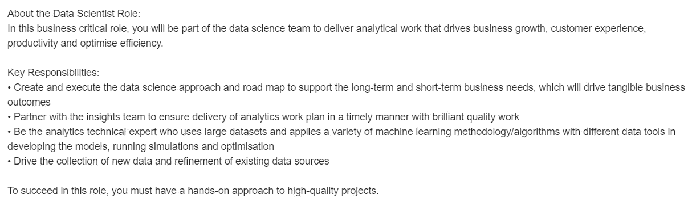

# 真正的数据科学家是不存在的

> 原文：<https://towardsdatascience.com/real-data-scientists-dont-exist-3434107a0892?source=collection_archive---------9----------------------->

## 我们都只是隐藏在华丽术语背后的骗子

[汤姆·罗伯茨](https://unsplash.com/@tomrdesigns?utm_source=unsplash&utm_medium=referral&utm_content=creditCopyText)在 [Unsplash](https://unsplash.com/s/photos/mask?utm_source=unsplash&utm_medium=referral&utm_content=creditCopyText) 上拍照

你有没有看过这样一篇文章:

*“现在每个人都称自己为数据科学家。操纵数据和使用 Python 库的能力并不能让你成为数据科学家。线性代数和统计的知识并不能让你成为数据科学家。使用数据获取商业价值的能力并不能让你成为数据科学家。别再自称数据科学家了。你不是科学家。”*

在阅读了大约五篇提出相同观点的文章后，我发现自己在想:

"*如果是这样，谁是数据科学家？一个人需要具备什么资格才能称自己为数据科学家？”*

这些文章的作者似乎过于沮丧，他们认为**不应该**自称为数据科学家，以至于他们忘记了提及**应该是谁。**

这些作者中没有一个人提到一个真正的数据科学家应该具备的资格。他们也没有提及 ***“真正的数据科学家”的日常工作***

# 那么…谁是真正的数据科学家？

我花了一整天阅读数据科学这个词的定义。

让我与你分享我的发现。

维基百科将数据科学定义为*“一个跨学科领域，它使用科学方法、流程、算法和系统从结构化和非结构化数据中提取知识和见解，并在广泛的应用领域中应用来自数据的知识和可行的见解。”*

《牛津词典》将数据科学家定义为“*受雇分析和解释复杂数字数据(如网站的使用统计数据)的人，尤其是为了帮助企业做出决策。*”

Datarobot 将数据科学定义为"*结合领域专长、编程技能以及数学和统计知识，从数据中提取有意义见解的研究领域。*”

读完这些定义后，我看了看一些数据科学的工作清单。公司希望数据科学家具备哪些技能？

我看到的第一份工作清单是一家财富 500 强公司提供的，我将在这里附上工作描述的截图:

[AIA 数据科学职位描述](https://www.google.com/search?q=data+science+job&ibp=htl;jobs&sa=X&ved=2ahUKEwjxwpaOwfTxAhVvzDgGHZBpBc8Qkd0GMAJ6BAgOEAE#fpstate=tldetail&htivrt=jobs&htiq=data+science+job&htidocid=XgE2ejW-KA91ygwEAAAAAA%3D%3D&sxsrf=ALeKk02GRqGm5S-LP5Kn15kIvW86wZMb8Q:1626882370290)

大多数数据科学职位描述与上面的类似。

因此，如果数据科学家的定义和工作描述与一个人的技能相匹配，我们为什么不允许他们自称为数据科学家呢？

数据科学是一个非常松散的术语。

它被用来描述许多不同的角色，这个术语已经变得如此模糊，几乎没有意义。

我曾与来自非技术背景的跨国公司数据科学团队领导共事过。

从事统计工作的人通常称自己为数据科学家，从事数据工程或分析相关工作的人也是如此。

这个术语太宽泛了，涵盖了许多不同人的工作范围。这没关系。

# 谁应该称自己为数据科学家？

我的职位名称中有“*数据科学”*几个字，我的技能与上面描述的完全一样。

如果您定期处理数据以获得洞察力并得出商业价值，您就是(根据定义)数据科学家。

清理和操纵数据、创建数据管道和构建预测模型的能力**让**有资格称自己为数据科学家。

数据科学已经被广泛接受。

数据科学这个术语现在已经非常宽泛，它定义了全世界数百万人的工作范围。

老实说，纠结于条款是没有意义的。

除非“*数据科学家*”一夜之间神奇地被一个不同的词取代，否则人们不会停止称自己为数据科学家。