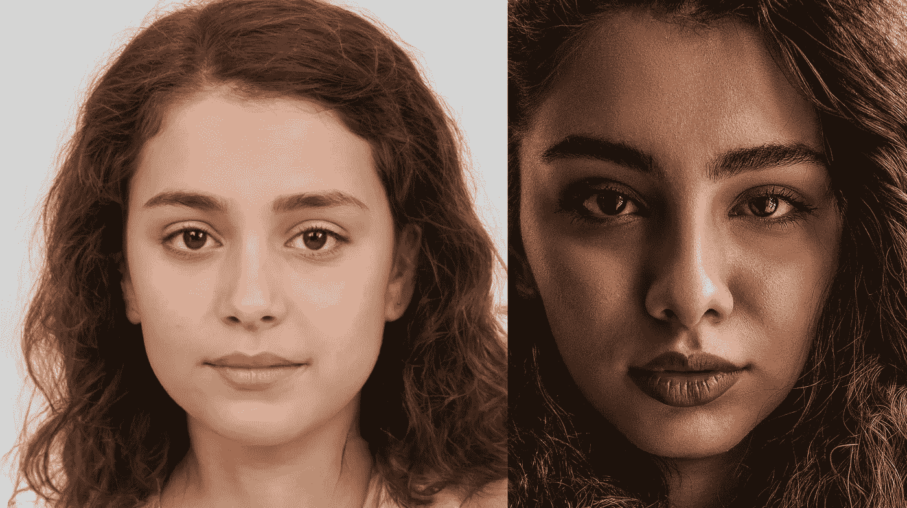
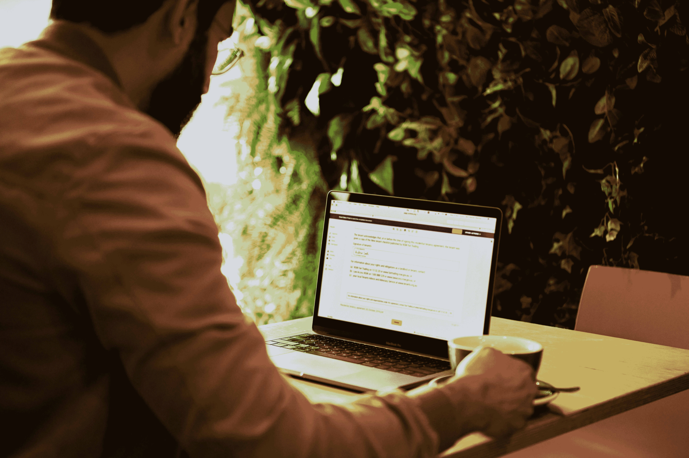
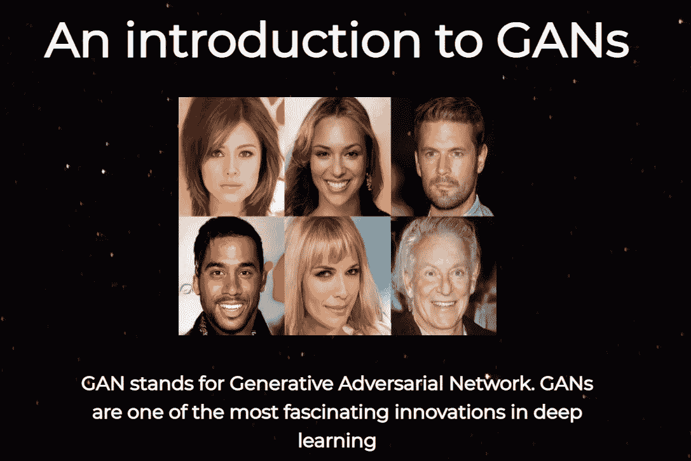
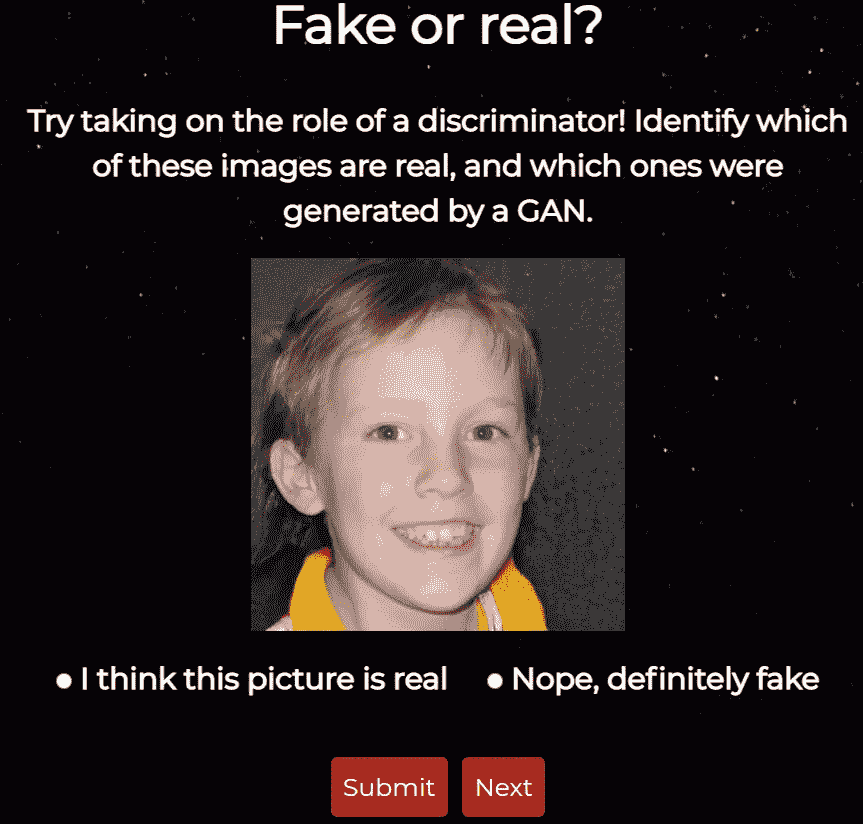

# 真脸还是 AI 生成的假？

> 原文：<https://towardsdatascience.com/real-face-or-ai-generated-fake-d95b30c1f86f?source=collection_archive---------9----------------------->

## 你能说出这两者的区别吗？

图片由[生成.照片](https://generated.photos/faces)和[奥米德阿明](https://unsplash.com/@omidarmin?utm_source=unsplash&utm_medium=referral&utm_content=creditCopyText)上的 [Unsplash](https://unsplash.com/s/photos/face?utm_source=unsplash&utm_medium=referral&utm_content=creditCopyText)

在过去的几年里，我们已经看到了人工智能的巨大进步。它在医疗保健、时尚、教育和农业等行业都有应用，并被预测为下一个大的数字颠覆之一。

正如吴恩达所说:

> 正如 100 年前电力几乎改变了一切一样，今天我实际上很难想到一个我认为人工智能在未来几年内不会改变的行业。

然而，AI 是一个可以被误用的工具。这是一个强大的工具，如果它落入坏人之手，可以用来扰乱日常生活。

在这篇文章中，我将介绍人工智能的一个应用，它被用来欺骗人们和传播错误信息。

# 人工智能技术的应用

在过去的几年里，一个名为“deepfake”的人工智能应用程序在互联网上掀起了风暴。Deepfakes 是由神经网络创建的极具说服力的虚假视频。

名人和政治家的脸被贴在不同的身体上，虚假的视频被制作出来。

2020 年，deepfakes 成为主流。

它们已被广泛用于广告和电视节目中，并越来越多地被用来传播虚假信息。

2018 年，有人制作了一个视频，描绘巴拉克·奥巴马(Barack Obama)称唐纳德·特朗普(Donald Trump)是一个诅咒。视频开始几分钟后，人们发现奥巴马从未真正说出这些话。更确切地说，是《滚出去》的导演兼编剧乔丹·皮尔说的。

他的声音被数字化地插入到正式总统的视频中，以制造一个假的。该视频展示了 deepfakes 的威力有多大，以及它们如何被用来传播错误信息。

## 深度学习模型也可以用来创建假图像。

人工智能模型能够生成看起来与真人几乎一样的假脸。这些年来，他们变得非常擅长于此，几乎不可能区分真实的脸和人工智能生成的假脸。

## 你能分辨出这些脸哪个是真的吗？

图片由[生成.照片](https://generated.photos/faces)和[奥米德阿明](https://unsplash.com/@omidarmin?utm_source=unsplash&utm_medium=referral&utm_content=creditCopyText)上的 [Unsplash](https://unsplash.com/s/photos/face?utm_source=unsplash&utm_medium=referral&utm_content=creditCopyText)

右边的脸是真实的。左边的照片是由人工智能应用程序生成的。

# 虚假图像背后的技术

照片由 [DocuSign](https://unsplash.com/@docusign?utm_source=unsplash&utm_medium=referral&utm_content=creditCopyText) 在 [Unsplash](/s/photos/technology?utm_source=unsplash&utm_medium=referral&utm_content=creditCopyText) 上拍摄

Deepfakes 和假图像是由一类叫做“GANs”的机器学习模型生成的。

GANs 代表生成对抗网络，由研究员 Ian Goodfellow 和他的同事在 2014 年设计。

## 这个想法

由[absolute vision](https://unsplash.com/@freegraphictoday?utm_source=unsplash&utm_medium=referral&utm_content=creditCopyText)在 [Unsplash](/s/photos/idea?utm_source=unsplash&utm_medium=referral&utm_content=creditCopyText) 上拍摄的照片

这一切都始于人工智能研究员伊恩·古德菲勒的一个想法。他想创建一个能够生成虚假数据的深度学习模型。

他的想法包括使用两个神经网络，并让它们相互竞争。

第一个网络将用于基于现有数据集生成假图像。第二个网络将学会辨别真假图像的区别。

第一个网络称为发生器，第二个网络称为鉴别器。

生成器的工作是欺骗鉴别者，让他们相信生成的图像是真实的。这样，随着鉴别器识别假图像的能力越来越强，生成器就会开始生成更真实的图像来欺骗鉴别器。

这个生成器和鉴别器都是对手。随着一个网络变得更好，另一个也变得更好。

伊恩是在和几个朋友在酒吧时想出这个主意的，这些朋友告诉他这是不可能的。他们认为不可能在第一个网络的内环中训练第二个神经网络，并且他们假设该网络不会收敛。

那天晚上回家后，伊恩觉得这个想法值得一试。他写了一些代码并测试了他的软件。他第一次尝试就成功了！

他发明的东西现在被称为 GAN，是深度学习领域最令人着迷的创新之一。事实上，脸书首席人工智能科学家 Yann LeCun 称 GANs 为“过去 20 年中深度学习领域最酷的想法”

# 真实图像与 GAN 生成的图像

作者图片

正如我上面提到的，GAN 生成的图像非常有说服力。神经网络已经惊人地擅长创造逼真的人脸。

这可能是危险的，因为 GANs 可以用来创建虚假的约会资料，鲶鱼人，并传播虚假信息。

对我们来说，能够辨别真假是非常重要的。

## 我创建了一个应用程序来测试你是否能区分一个真人的脸和一张假脸。

你可以参加我的测验，试着识别哪些图像是真实的脸，哪些是 GAN 生成的。

在这个项目中，我使用了 100 万个假脸数据集来获得 GAN 生成的图像，并使用 Kaggle 的 UTKFace 数据集来获得真实图像。

我的测验是这样的:

作者图片

你需要做的就是猜测你在页面上看到的图片是假的还是真的。随着你不断练习，你会更好地识别计算机生成的图像。

本质上，你在我的测验中所做的和一个鉴别者所做的完全一样。

GAN 中的鉴别器学习伪图像和真实图像之间的区别。随着时间的推移，它会更好地识别假图像。这正是你在参加测验时要做的。

你可以在这里进入我的测验[。这个测验应用程序的灵感来自于一个叫做 thispersondoesnotexist.com](https://does-this-person-exist.herokuapp.com/static/index2.html)[的网站，你可以去看看。每次刷新网站，都给你看一张假的 GAN 生成的脸。](https://thispersondoesnotexist.com/)

# 结论

这篇文章介绍了人工智能生成的图像和 deepfakes 背后的技术。如果你想进一步了解这个话题，我推荐以下资源:

*   [一个关于甘斯的虚拟专家小组](https://www.youtube.com/watch?v=9d4jmPmTWmc)
*   [生成性对抗网络简介](https://www.youtube.com/watch?v=4fQRoBz0BnM)
*   伊恩·古德菲勒:生成性对抗网络教程
*   [甘斯在 Coursera 上的专精](https://www.coursera.org/specializations/generative-adversarial-networks-gans)
*   [伊恩·古德菲勒和莱克斯·弗里德曼的播客](https://lexfridman.com/ian-goodfellow/)

如果你对 GANs 的想法很感兴趣，并且想玩玩假图像，那么你可以随意参加我的测试,想玩多久就玩多久。

如果你已经走了这么远，感谢你的阅读！我希望你喜欢我的文章。

> 人工智能是用更复杂的技术取代人类决策——falgu ni Desai