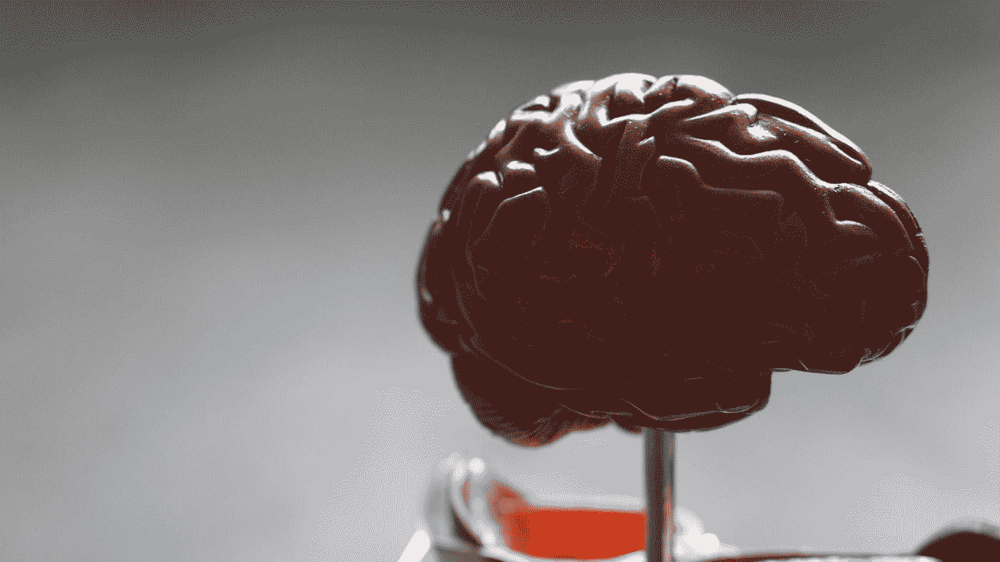
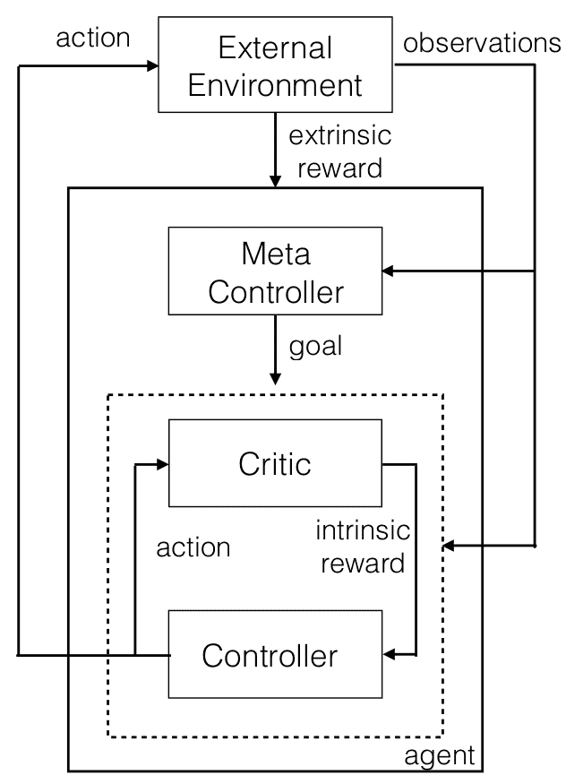
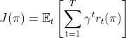
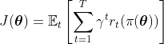
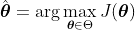
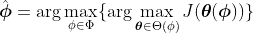
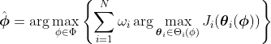
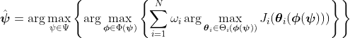
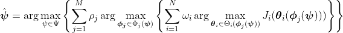

# 现实生活中的元学习:教与学会学习

> 原文：<https://towardsdatascience.com/real-life-meta-learning-teaching-and-learning-to-learn-186877376709?source=collection_archive---------15----------------------->

## [思想和理论](https://towardsdatascience.com/tagged/thoughts-and-theory)

由[本·怀特](https://unsplash.com/@benwhitephotography?utm_source=medium&utm_medium=referral)在 [Unsplash](https://unsplash.com?utm_source=medium&utm_medium=referral) 上拍摄

***教*** 和 ***学*** 是我们可以培养的两个最重要的技能，让自己和身边的人变得更好。虽然我们可能认为这些技能只适用于我们在学校的时候，但在这篇文章中，我希望说明在你的余生中每天积极使用这些技能是多么重要。

不管喜欢与否，我们总是 ***教*** 和 ***学***——但是 ***影响*** ，无论是积极的还是消极的，我们通过这些活动留给自己和他人的很大程度上取决于我们在这些能力方面的技能[1]。通过**学习我们教和学的最好方法**(元教学和元学习)，我们的教和学的努力**将为每个人做更多的事情**。

在这篇文章中，我的目标是通过三个主要观点给你一个关于终身学习和教学的新视角:

1.  ***学习*** 和 ***教学*** 是我们一生中至关重要的活动，远远超出了课堂。
2.  学习 ***我们如何学习*** (元学习)对于最大化学习的有效性至关重要。
3.  思考教学的一种方式是，我们是 ***在教别人如何学习*** 。

我们将从概念上谈论这些想法开始，之后，我们将深入研究如何将这些想法公式化为优化问题。如果你想看我相应的关于这些优化的文章，你可以在这里 查看 [**。**](https://drive.google.com/file/d/16J4HwxgzQqzaVEx6WV4eno5gaY5YdKsv/view?usp=sharing)

准备好了吗？让我们开始吧！

# 1.教学和学习是终身的活动

**什么是学习？**

当我们学习时，我们的大脑会形成或加强脑细胞之间的物理回路。Robina Weermeijer 在 [Unsplash](https://unsplash.com?utm_source=medium&utm_medium=referral) 上的照片

想想你最近一次学到的东西。你从 5 年前或高中的课上学到的最后一件事是什么？当然不是——作为人类，我们不断学习新的概念、技能，更新我们对世界的信念。我们不需要去学校或参加会议来学习新的东西——部分由于互联网的力量，我们有很多一生都可以获得的知识，等待我们去学习。除了在学校学习代数、几何和物理，我们还**学习我们如何学习**。

我不是神经科学专家，但我知道每当我们学习新的东西时，我们大脑中的神经元就会连接到新的神经元回路中。随着我们了解更多，定义这些神经元回路的连接变得更强[2]，这表明学习本身就是一个正反馈循环:**我们现在了解得越多，未来就越容易学习**。从某种意义上说，是大脑的肌肉记忆。

那么，这与终身学习有什么关系呢？嗯，如前所述，我们学得越多，将来就越容易学。养成学习的习惯，不管你学的是什么，都会让你在以后的生活中更好地准备有效的学习。我认为重要的是要强调一个习惯可以是 5 分钟或 5 小时的学习——无论你在生活中能抽出时间做什么。

## *什么是教学？*

照片由 [NeONBRAND](https://unsplash.com/@neonbrand?utm_source=medium&utm_medium=referral) 在 [Unsplash](https://unsplash.com?utm_source=medium&utm_medium=referral) 上拍摄

就像学习一样，我们不需要有头衔 ***老师*** 或 ***教授*** 才能在某种意义上成为“老师”。虽然我们应该从这些职业中获得教导他人的灵感，但我们也应该认识到我们都有教导他人的责任。考虑以下场景:

1.  一名高级数据科学家向一名实习生展示如何使用熊猫数据帧对象。
2.  一位家长帮助他们的孩子第一次学习骑自行车。
3.  在球队输掉冠军赛后，一名教练和一名球员谈论面对逆境时的应变能力。

在所有三个案例中，一个人**为另一个人的学习贡献了**。无论是**向**某人展示一个新的视角，**指导**他们学习一项新技能，还是**通过一则轶事讲述**一堂人生课，这些都是我们称之为**教学时刻**。这些情景说明了教学的另一个重要方面:自主学习。

要成为一名好老师，就要给你的学生学习的统治权，同时向他们展示如何有效地使用这些统治权。这让他们能够优化自己的学习，而不必完全控制自己的学习方式。根据我的辅导和教学经验，有时对我的学生最有帮助的不是教他们一个概念，而是教他们如何自学一个概念。随着通过数字学习媒体获得高质量教育的机会增加，所有年龄、背景和领域的学生都将能够以我们从未想过的方式指导自己的学习。

事实上，这种信息获取渠道的增加使得教授如何学习变得更加重要:考虑到我们可以获得的所有信息，我们如何确保我们和我们的后代能够有效地学习和使用这些信息？这就是元学习的用武之地。

# 2.等等，等一下。元学习？

我可能是一个强化学习的书呆子，过度使用了“元”这个词，但元学习实际上是我们可以概念化的一种方式，教我们自己如何最优地学习新概念和新想法。

直观地说， ***元学习*** 是关于学会如何学习，或者更具体地说，学会如何更有效地学习。从强化学习的角度来看，一个 ***元学习者*** 是利用 ***学习者*** 的**的表现作为反馈机制来训练的——如果学习者在学习一项任务中是有效的，元学习者就被 ***奖励*** ，如果学习者是无效的，元学习者就被 ***奖励这导致不仅有一个有效的学习者，而且有一个有效的元学习者，从而使学习者在未来的任务中取得成功。*****

**作为人类，我们以大致相同的方式学习如何学习。考虑一下你是否正在学习一门新语言——如果你参加了语言评估并且表现良好，你很可能会保持相同的学习技巧。但是如果你在评估中表现不好，你可能会**运用**这种学习技巧在下次评估中表现得更好。**“学会学习”**这种技能对我们个人和技术的成长至关重要。**

****

**在强化学习的背景下，元学习者的图解。信不信由你，这个过程类似于我们如何自学！图片来源:[3]。**

**通过更加注意我们如何学习，以及我们如何适应我们的学习，我们成为**更有效的元学习者**，这反过来使我们**成为更有效的学习者**。考虑以下问题(如果你真的有这种感觉，把它们写下来):你学习的最好方法是什么？哪些方面不学最好？如果你发现你是凭经验得出这些结论的——也就是说，你观察到了什么样的学习技巧导致好的表现，什么样的学习技巧导致坏的表现，那么你已经完成了现实生活中的元学习！**

# ****3。教授元学习:你如何教授如何学习？****

**当我们教学时，我们是在帮助人们学习他们如何学习。通过使他人能够更有效地学习，我们通过向他们展示如何学习来训练不同的元学习者。虽然我们最终不能为他们决定学习方法，但通过给学生探索各种学习方法的机会，我们在某种意义上训练他们为自己确定一套最佳的学习方法。这种训练“算法”在原理上类似于元学习[3]。**

**下面，我有一些针对这种元学习为主的教学风格的有效教学策略的小技巧。首先，我要承认这个列表远非详尽无遗——相反，它只是为了给你提供一些例子。如果你也有例子可以在这里添加，我将非常感谢你在评论中添加它们！以下是一些高层次的教学方法:**

1.  ****展示工具。**工具是你应用和建立你所学主题的具体联系的手段。如果不了解行业工具，建立这些联系会困难得多。展示工具的应用和设计将允许学生自学如何最好地学习新的工具集。**
2.  **让他们主宰自己的学习。考虑让你的学生向你解释概念。让他们引导你通过一段文字、一段伪代码或一个框图。问他们认为概念 X 可以应用于什么。**
3.  ****告诉他们在哪里可以找到他们想要的东西。**根据我作为学生、教师和导师的经验(和其他人一样，也有自己的偏见),当学生能够自己确定答案时，他们会比别人给他们答案时更积极地参与进来。如果你的学生被卡住了，考虑给他们看答案的地图，而不是答案本身。**
4.  ****认识到你的学生是聪明的。如果说我从《我们如何学习》这本书中学到了什么的话，那就是人类通常是周围最有效率和能力的学习者。认识到这一点，并利用这一点将你的学生推向他们的极限。当你的学生远远超出你的预期时，不要感到惊讶:)****

**本节结束时有一个有趣的提示——如果你在将教学概念化为训练元学习者时考虑如何优化你的教学风格，那么你真的在使用**元元学习**！**

# **从最优化的角度看教与学**

**在整篇文章中，我们一直在讨论如何提高我们的**学习**和**教学**能力。让我们从**优化**的角度来看看我们如何做到这一点，使用元学习和强化学习的原则来指导我们。以下优化问题中形式化的目标可以通过元学习方法和梯度上升方法来优化。我们将把优化和训练算法例程留给读者，并把我们的重点放在正式定义目标上。**

**如果你想看我相应的关于这些优化的文章，你可以在这里 查看 [**。**](https://drive.google.com/file/d/16J4HwxgzQqzaVEx6WV4eno5gaY5YdKsv/view?usp=sharing)**

## **优化学习者参数**

**在强化学习中，我们的目标通常是找到一个**策略**,它可以优化一些回报的度量——在最简单的情况下，这可以被计算为随着时间的推移而打折的回报。**

**我们将从定义学习者为给定任务优化的随机目标开始。优化目标被形式化为折扣奖励的期望总和。抽象而简单地说，为了捕捉策略 **π** 对收益 J()的影响，我们简单地将奖励 r 写成策略 ***π*** 的函数，将它们写成 r( ***π):*****

****

**其中γ是 0 到 1 之间的常数，表示未来奖励的折扣。这个目标被公式化为一个期望，因为我们考虑了奖励是随机的一般情况。策略通常由一组参数 **θ** 来参数化。因此，我们可以根据 **θ** 将上述目标改写为:**

****

**最优参数集 **θ** 使这个**学习者目标**最大化，因为使这个目标最大化使学习者的期望折扣奖励最大化:**

****

**请注意，θ代表我们的假设空间——我们可以优化参数集的所有学习者模型的空间。上述优化为学习者代理找到了一组最佳学习参数。在现实生活中， **θ** 对应的是我们为了在给定的任务 J()中表现出色而学习的特定技能。现在，让我们更上一层楼。**

## **优化元学习者参数**

**在学习者之上的一个层次，我们有元学习者，它决定了我们学习的能力。假设我们用一组参数**φ**∈φ对元学习器进行参数化，其中φ是我们的元学习器的假设空间。**

**由于元学习者决定了学习者能够在给定任务上学习得多好，我们可以捕捉这种依赖性的一种方式是通过用元学习者的参数 **φ** 来参数化学习者的假设空间θ和参数 **θ** 。这使得学习者参数集 **θ** 和学习者可以学习的可能模型的空间θ都依赖于元学习者的当前参数。以这种方式参数化，我们可以把元学习者的目标写成:**

****

**注意，在这个优化目标中，随机返回函数 J()不依赖于元学习者的参数，即学习者代理的目标不能被元学习者修改。这防止了元学习者使某些任务变得更容易或更困难。**

**这种优化为元学习者定义了最佳的参数集。在现实生活中，这种优化对应于我们如何学会学习。然而，上面的优化目标仅仅定义了如何为单个任务学习。在现实生活中，我们学习不仅仅是为了一个任务，而是很多任务。**

**为了优化超过 *N* 个不同的任务，我们可以用 *i* 来索引每个任务，用某个因子ωi > 0 来加权每个任务，并将每个任务的随机回报记为 Ji()。因此，这一目标采取以下形式:**

****

**上述优化解决了参数集，该参数集优化了如何在 *N* 个所选任务的加权和上学习。在现实生活中，这类似于我们如何学习优化我们的学习。**

**到目前为止，我们已经讨论了学习——教学在这方面发挥了什么作用？具体来说，我们如何利用目前介绍的目标来提高教学能力？**

## **优化元元学习者参数**

**学习如何成为一个更好的老师，从学习的角度来看，可以概念化为元-元学习。为什么？因为我们通过观察哪些教学方法能让学生更有效地学习，哪些方法不能，来改进我们的教学。在这种情况下，对于我们的元元学习者，我们有一个更抽象的参数集，**ψ**∈ψ，其中ψ是元元学习者的假设空间。这些参数用于优化元学习者，与元学习者的参数用于优化学习者的方式相同。从某种意义上说，目标是不变的，只是我们针对这种变化优化了参数:**

****

**优化参数 **ψ** 相当于要么提高我们学会学习的方式，要么提高别人学会学习的能力，又名**教**！**

**如果我们试图教一个人或我们自己，这个目标是成立的——这对许多人来说是如何工作的？假设有 *M* 个我们要优化学习的个体，索引为 *j* ，我们用ρj > 0 对优化每个个体学习的重要性进行加权。那么我们的元学习目标就变成了:**

****

**由于我们是生活中许多人的老师和导师，也许这个公式是我们可以用来**改进教学**的最具代表性的目标。**

**以上这些优化仅仅是**制定学习和教学的一种方式**，但我希望它们提供了另一种视角来看待**我们如何优化我们的学习，既为了我们自己，也为了他人**。**

# **总结**

**这篇文章并不掌握成为一个完美的学习者和教师的关键，但我希望它为你提供了关于终身学习和教学对你意味着什么的新视角。**

**随着我们可以获得的信息比以往任何时候都多，我们尽可能地用它来教和学是至关重要的。我会让你来决定你学习和教学的最佳方式。没有一个教学或学习的时刻可以浪费！**

**非常感谢您的阅读！如果你想看更多关于强化学习、计算机视觉、机器人和机器学习的故事，请[在 Medium 上关注我](https://rmsander.medium.com/)！**

# **感谢**

**感谢 [CODECOGS](https://codecogs.com/) 提供了有用的[内联方程渲染工具](https://codecogs.com/latex/eqneditor.php)，也感谢[菲利普·伊索拉教授](http://web.mit.edu/phillipi/)在麻省理工学院讲授 [6.882](https://phillipi.github.io/6.882/2020/) (体现智能)，这门课启发了我写这篇文章。**

# **参考**

**[1]普罗泽斯基博士《教与学》*社区眼睛健康*第 13 卷，34(2000):30–1。**

**[2]德阿纳，斯塔尼斯拉斯。*我们如何学习:为什么大脑比任何机器学习得都好……目前来说*。企鹅，2020。**

**[3]Tejas d . Kulkarni、Karthik R. Narasimhan、Ardavan Saeedi 和 Joshua B. Tenenbaum。2016.分层深度强化学习:整合时间抽象和内在动机。《第 30 届国际神经信息处理系统会议录》(NIPS'16)。美国纽约州红钩市柯伦联合有限公司，邮编 3682–3690。**