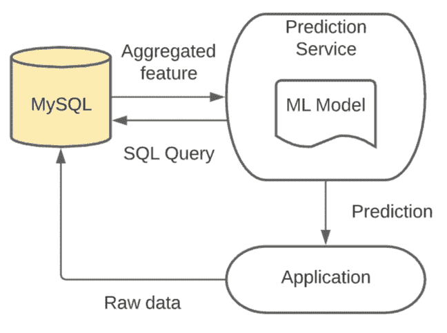
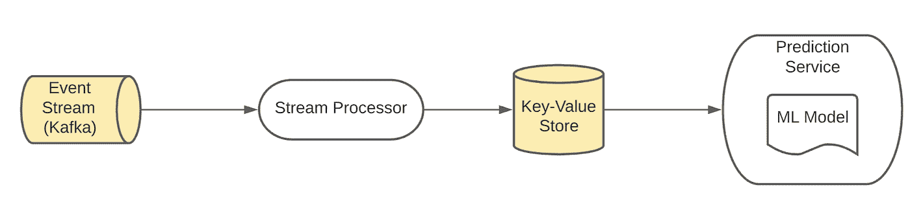
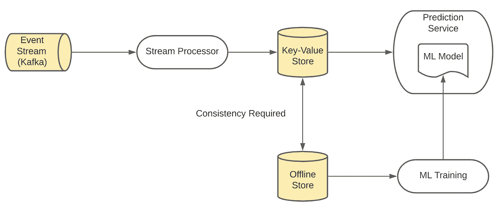

# 机器学习的实时聚合特性(第 1 部分)

> 原文：<https://towardsdatascience.com/real-time-aggregation-features-for-machine-learning-part-1-ec7337c0a504?source=collection_archive---------28----------------------->

## 为什么实时 ML 特性对 ML 应用程序至关重要并且难以实现

作者:凯文·斯坦普夫(泰克顿)，迈克·伊斯特汉姆(泰克顿)，尼基尔·辛哈(Airbnb)

(*图片作者*)

# 介绍

机器学习特征源自组织的原始数据，并向 ML 模型提供信号。一种非常常见的特征变换类型是滚动时间窗聚合。例如，您可以使用信用卡的滚动 30 分钟交易计数来预测给定交易具有欺诈性的可能性。

在 SQL 查询中使用窗口函数对您喜欢的数据仓库进行离线计算滚动时间窗口聚合非常容易。然而，为生产中的实时预测提供这种类型的功能带来了一个困难的问题:如何有效地以非常高的规模(> 1000 QPS)，以低服务延迟(<< 100ms), at high freshness (<< 1s) and with high feature accuracy?

These types of features are incredibly important for countless real-time ML applications whose predictive power is very sensitive to a user’s behavior up until the very moment of the prediction. Common examples where every event counts are real-time recommendation, fraud detection, spam detection, personalization, and pricing predictions.

In this two-part blog ([第二部分](https://stumpfkevin.medium.com/real-time-aggregation-features-for-machine-learning-part-2-fe9fd42522c0))提供这样一个聚集了大量原始事件(> 1000)的功能，我们将讨论这种功能类型最常见的技术挑战，以及 Airbnb 和 Tecton 用来解决这些挑战的经过战斗考验的架构。

# 技术挑战

对于上面提出的问题，一个简单的实现可能是在每次进行实时预测时，简单地查询生产中的事务数据库(如 MySQL ):

架构 1:为每个 ML 预测查询生产数据库(作者的*图片)*

这在小范围内工作得很好，如果您的数据库中有原始事件，这是一个很好的开始方式。然而，在高规模下，和/或一旦您的聚合依赖于大量的原始事件，您的服务延迟将开始激增，您的 MySQL 数据库将最终崩溃。

扩展上述架构的常见下一步是在新的原始数据可用时实时预计算聚合，并在针对低延迟服务优化的可扩展 KV-store 中提供这些功能(如 Dynamo 或 Redis):

架构 2:使用流处理器预先计算特性

这带来了一系列技术挑战，其中一些我们将在接下来的几节中探讨。

# 长时间运行的时间窗口聚合的内存限制

团队经常使用 Apache Spark 或 Flink 来运行流时间窗口聚合。Spark 或 Flink 作业的内存需求是时间窗口大小以及流的事件密度的函数。

想象一下，一个信用卡处理器的欺诈检测应用程序使用用户 4 周的交易计数作为一个重要特征。流处理作业现在需要将 4 周内发生的所有事务放入内存。

对于大数据量，如果没有正确配置，这将很快导致 OutOfMemoryExceptions。作为一种解决方案，团队通常求助于减少时间窗口、减少事件体大小、对流式作业进行分区，或者使用像 RocksDB 这样的状态存储，它可以将状态刷新到磁盘或冷存储。

# 回填挑战

一旦您对流式作业进行了微调以使其可靠运行，您可能会意识到您选择的流式服务并不包含足够的历史数据来回填新要素。例如，AWS Kinesis 最多只能保存 2 周的数据。如果您现在想要一个 6 周的时间窗口聚合，您的流聚合将提供不准确的特征值，直到它已经运行了 4 周。

在这些情况下，公司通常会将其流式传输时间窗口限制在流式传输基础架构中可用的数据持续时间内，通常会将重要信号留在桌面上。其他人可能会手工设计一个批处理管道，该管道预计算来自历史批处理源的数据，并尝试将其与由流管道向前填充的数据相结合。还有一些人可能会求助于 Kafka 等流基础设施，其保留期更具可配置性，并接受这样一个事实，即处理 Kafka 的大量历史数据比针对针对大规模批处理而优化的数据存储(如数据仓库或数据湖)运行批处理作业需要更长的时间。

# 保持高功能新鲜度

假设您已经解决了流时间窗口聚合的回填和内存挑战。几个 ML 应用程序的另一个常见挑战是它们依赖于非常新的特性(< 1 s)。理想情况下，在最大似然预测时，当您获取特征值时，您希望考虑到直到预测时刻发生的每一个事件。然而，实现实时的新鲜度是具有挑战性的，并且会变得非常昂贵。

如果您使用 Apache Spark 这样的流处理器来实现这些时间窗口聚合，控制特性新鲜度的一种常见方法是使用**滑动时间窗口聚合。**通过滑动时间窗聚合，您可以选择特定的滑动间隔，该间隔决定了流式作业发出更新的要素值的频率(并因此设置要素新鲜度的上限)。此外，我们发现流处理器在高数据量下可以支持的最小滑动间隔通常在几分钟的范围内，这限制了您的最大特性新鲜度。

其他流处理器，如 Apache Flink，允许您在没有滑动间隔的情况下运行聚合。每当在流中发现新事件时，它们可以发出特性更新。现在，您的要素与处理最近事件时一样新鲜。不幸的是，这意味着如果您不小心的话，您的特性的陈旧性将会变得无止境:如果没有新的事件被处理，那么您在产品中提供的特性值将不会得到更新，除非您还配置了一个超时，当经过了一定量的处理时间时强制进行更新。因此，滚动时间窗口聚合不会聚合预测发生之前特定时间窗口内发生的所有事件，而是聚合在找到流中最后一个事件之前发生的所有事件。

# 生成训练数据集

让我们假设你已经掌握了上面列出的所有挑战。您可以将这些特性应用到您的生产模型中！

但是，你仍然需要训练一个模型。这意味着您需要维护要素值的历史日志，以便了解过去不同时间点的世界状况。您可能不会存储和提供生产键值存储中的那些历史特征值，生产键值存储针对低延迟和大规模请求进行了优化。相反，您可能会选择像数据仓库或数据湖这样的离线存储，这是为偶尔处理大量数据而优化的。您的架构现在需要发展成这样:

架构 3:架构 2 有一个离线商店用于训练和批量预测(作者的*图片)*

你必须确保你用来训练你的模型的离线特征值的计算*与你的生产路径*和*一致，你的离线商店提供历史上准确的特征值而不引入数据泄露——否则你引入了可怕且难以调试的 [train-serve-skew](https://developers.google.com/machine-learning/guides/rules-of-ml#training-serving_skew) 。*

# 结论(第一部分)

在本文中，我们讨论了许多技术挑战，这些挑战使得在大规模生产中提供新的滚动时间窗口聚合变得困难。第二部分将讨论泰克顿和 Airbnb 所采用的应对这些挑战的解决方案。

[1]如果提到的任何一个特征和要求的保证可以放松，一个不同的解决方案可能更好

[2]这并不总是正确的——对于一些 ML 应用程序来说，特性新鲜感很快接近递减/无回报

[3]两种常见的方法是记录生产服务的特征值，以及使用单独的计算路径从离线数据源回填