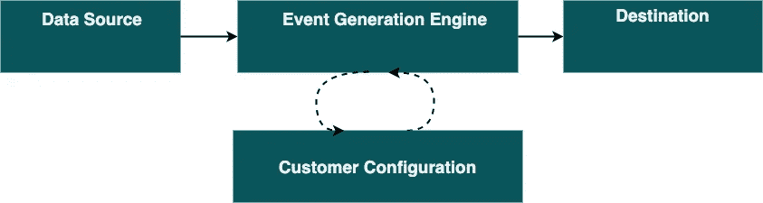

# 航空工业中的实时分析第一部分

> 原文：<https://towardsdatascience.com/real-time-analytics-in-the-aviation-industry-part-1-f90418cd7dc3?source=collection_archive---------43----------------------->

## 我们的挑战引入对飞行数据的实时分析以提供有价值的见解

约瑟夫·布拉德肖在 [Unsplash](https://unsplash.com?utm_source=medium&utm_medium=referral) 上拍摄的照片

在 [Spidertracks](https://www.spidertracks.com/) ，我们致力于通过提供实时飞机跟踪以及将飞行数据转化为有价值的见解来帮助航空业变得更加安全。作为该公司成为数据驱动型组织之旅的一部分，我目前正在参与一个项目，该项目授权客户定义典型的飞行是什么样子的，并允许我们的平台负责触发*事件*——也称为*安全事件*——如果意外发生的话。

这个项目有一些有趣的问题需要解决，我将把这 2 篇文章集中在*事件生成引擎*的技术方面:我们的需求；选择流处理技术；挑战和局限。

首先，需要注意这个难题的四个方面:

洞察数据管道

*   *数据源*是由[飞机姿态](https://en.wikiversity.org/wiki/Aircraft_piloting/Attitude_flying)和位置等飞行度量组成的，在飞行过程中从飞机上获取并摄取到 AWS。
*   *客户配置*(例如在*救援*飞行期间，在给定*高度*下，可接受的 [*俯仰*](https://www.grc.nasa.gov/www/k-12/VirtualAero/BottleRocket/airplane/pitch.html) 值是多少)存储在 NoSQL 数据库中。
*   *事件生成引擎*将客户配置与输入的飞行指标结合起来，以决定是否必须生成事件。
*   *目的地*是放置生成的*事件*以供消费的地方。

在项目开始之前,*数据源*已经就位，我们对如何在数据库中存储*客户配置*有了清晰的理解。这个项目架构的复杂性来自于构建*事件生成引擎。*

# 事件生成引擎

## 要求

*   从数据被接收到 AWS 到*事件*提供给我们的客户之间的低延迟；
*   引擎必须是 [*有状态的*](https://www.alooma.com/blog/stream-processing-101#:~:text=Stateful%20stream%20processing,-In%20a%20Stateless&text=Stateful%20stream%20processing%20means%20that,stream%20processing%20system%20as%20well.) *，*有两个主要原因:
    a) *事件*应该只在当前传入行满足配置标准而前一行*不满足*的情况下生成。这保证了当阈值已经达到时，不会产生*事件**。
    b)在飞行过程中，飞机可能没有被完全覆盖，这意味着数据可能以稀疏的方式被摄取。但是，管道的行为方式应该与数据实时可用的方式相同。*
*   *该架构是面向未来的，但我们知道产品应该尽快提供给一小部分客户，以验证我们的假设。*

## *选择流处理技术:选项*

*根据定义的需求，我们开始了一项调查，以确定什么样的流处理技术能够满足我们的需求。从技术角度来看，我们寻求的是:*

*   *在 AWS 上运行*
*   *使我们能够快速交付并迭代我们的方法*
*   *要求低维护*
*   *可靠吗*

*经过一番研究，我们发现了几个不错的候选人:*

*   *[Spark Streaming](https://spark.apache.org/streaming/) :具有良好文档和社区支持的近实时[流处理框架。在 AWS 上，我们可以通过](https://www.precisely.com/blog/big-data/difference-between-real-time-near-real-time-batch-processing-big-data) [AWS Glue](https://aws.amazon.com/about-aws/whats-new/2020/04/aws-glue-now-supports-serverless-streaming-etl/) (无服务器)或 [AWS EMR](https://aws.amazon.com/solutions/implementations/real-time-analytics-spark-streaming/) (托管集群)来运行它。*
*   *[Apache Flink](https://flink.apache.org/) :实时流处理框架，相比 Spark Streaming 这是一个优势，但在我看来社区支持较弱。Apache Flink 也运行在 [AWS EMR](https://docs.aws.amazon.com/emr/latest/ReleaseGuide/emr-flink.html) (托管集群)上，但其在 AWS 上的无服务器产品需要通过 [AWS Kinesis Analytics](https://docs.aws.amazon.com/kinesisanalytics/latest/java/what-is.html) 。*
*   *[SQL](https://docs.aws.amazon.com/kinesisanalytics/latest/dev/what-is.html)的 Kinesis Analytics:使用 [SQL](https://www.tutorialspoint.com/sql/sql-overview.htm) 实时分析流数据的服务。这项服务与其他两个候选服务的一些关键区别是，SQL 的 Kinesis Analytics 不是一个框架，而是一个云服务，流处理是通过 SQL 而不是使用编程语言来完成的。*

> *[Kafka Streams](https://kafka.apache.org/documentation/streams/) 是唯一可行的选择，如果我们已经通过 Kafka 运行我们的摄取管道。*

## *选择流处理技术:决策*

*我们决定使用 SQL 的 Kinesis Analytics。我将首先解释为什么我们在第一次迭代中放弃了 Spark Streaming 和 Apache Flink:*

*   *我们意识到开发 Apache Flink 应用程序并对其进行故障诊断的学习曲线非常陡峭，考虑到我们的截止日期，这是不可行的。更具体地说，Apache Flink 应用程序主要是用 Java 开发的，我们的堆栈是用 Python 构建的。Pyflink 是一个支持使用 flink 开发 python 的库，但它不能通过 AWS 上的无服务器服务获得(在撰写本文时，Apache Flink 的 Kinesis Analytics 仅支持 Java)*
*   *Spark Streaming 是一个更好的选择——我们确实有 Apache Spark 的内部经验——但 AWS 通过 AWS Glue 提供的无服务器产品似乎不如通过 Kinesis Analytics 运行流媒体应用程序划算。*

*为什么 Kinesis Analytics for SQL:*

*   *无服务器:考虑到交付我们第一次迭代的最后期限，我们明白我们的努力应该放在生成*事件*的逻辑上，而不是学习如何维护平台。事实证明这对我们非常重要。*
*   *凭借团队中良好的 SQL 经验，我们认为学习[流 SQL](https://wso2.com/library/articles/2018/02/stream-processing-101-from-sql-to-streaming-sql-in-ten-minutes/) 是可以实现的；*
*   *自动缩放:Kinesis Analytics [自动缩放](https://docs.aws.amazon.com/kinesisanalytics/latest/dev/how-it-works-autoscaling.html)以匹配容量和吞吐量。*

## *接下来是什么？*

*在本系列的第 2 部分中，我将深入探讨 SQL 的 Kinesis Analytics:它如何融入我们的数据管道，在这个过程中我们有哪些惊喜，以及我们的*事件生成引擎*的未来可能会是什么样子。*