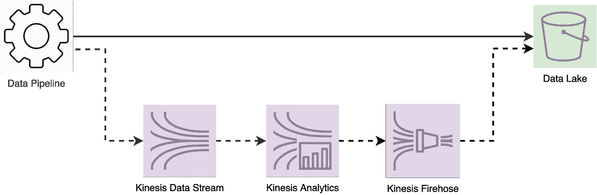
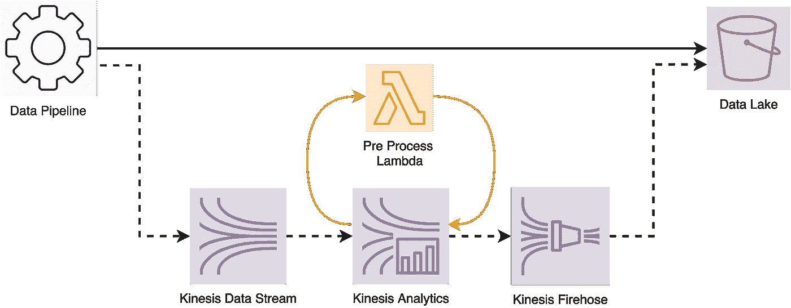

# 航空业中的实时分析——第 2 部分:利用 SQL 的 Kinesis 分析

> 原文：<https://towardsdatascience.com/real-time-analytics-in-the-aviation-industry-part-2-leveraging-kinesis-analytics-for-sql-64ae7240cfe?source=collection_archive---------38----------------------->

## SQL kine sis Analytics 如何融入我们的数据管道，以及我们面临的挑战


Avel Chuklanov 在 [Unsplash](https://unsplash.com?utm_source=medium&utm_medium=referral) 上拍摄的照片

这是我设计和构建*事件生成引擎系列的第二部分，也是最后一部分。*在[第 1 部分](/real-time-analytics-in-the-aviation-industry-part-1-f90418cd7dc3)中，我解释了为什么我们在项目的第一次迭代中选择了[AWS kine sis Analytics for SQL](https://aws.amazon.com/kinesis/data-analytics/)，现在我将分享它如何适应我们现有的架构，以及我们为确保它为我们工作所做的调整。

# 运动学分析:运动部件

## 数据源

在此项目之前，数据从飞机上捕获，发送到数据管道进行浓缩，并存储在[数据湖](https://aws.amazon.com/big-data/datalakes-and-analytics/what-is-a-data-lake/)中进行分析。

我们的目的是通过添加一个并行步骤来修改该数据管道，该步骤可以将源数据发送到数据湖，还可以发送到 Kinesis Analytics 以生成*事件*。我们发现 Kinesis Analytics 可以从两个流源读取数据: [Kinesis 数据流](https://aws.amazon.com/kinesis/data-streams/)和 [Kinesis 数据消防软管](https://aws.amazon.com/kinesis/data-firehose/?kinesis-blogs.sort-by=item.additionalFields.createdDate&kinesis-blogs.sort-order=desc)。我们决定将数据管道扩展到 Kinesis 数据流，然后自动转到 Kinesis Analytics 进行分析。

为什么是 Kinesis 数据流？Kinesis 数据流提供了比 Kinesis 数据消防软管更低的延迟，我们可以在未来聪明地使用[分片](https://docs.aws.amazon.com/streams/latest/dev/key-concepts.html#shard)来平衡工作负载。

## 目的地

Kinesis Analytics 可以将数据输出到 Kinesis 数据流、Kinesis Data Firehose 或一个 [Lambda 函数](https://docs.aws.amazon.com/lambda/latest/dg/welcome.html)(通常用于进一步丰富数据)。在我们的例子中，我们希望将*事件*推送到数据湖，所以 Kinesis Data Firehose 是合适的选择，因为它与 S3(我们的数据湖所在的地方)连接，可以在将数据刷新到 S3 之前缓冲数据(保持文件大小在我们的控制之下)。

## 转变

Kinesis Analytics 负责运行我们的转换步骤。这就是我们的习俗*事件*世代逻辑生活的地方。

在一个或多个 Kinesis 分析应用中，我们将输入数据映射到一个*应用内流。*这个对象(让我们把它命名为 input *_stream)* 从我们的 Kinesis 数据流中提取数据，并可以使用 SQL 进行查询。然后，我们检查是否必须通过读取*客户配置来生成一个事件(关于我们如何做的更多信息，请参见本文后面的*，我们将输出写入另一个*流*。第二个流(让我们把它命名为 *output_stream* )被映射到一个 Kinesis Firehose 交付流，负责写入数据湖。

以下 SQL 代码让您体验了 Kinesis Analytics 中的一个简单查询:

```
-- Output Stream Definition: linked to Kinesis Firehose
CREATE OR REPLACE STREAM "OUTPUT_STREAM"
(
   "column_1" varchar(100),
   "column_2" varchar(100)
);-- Output pump: responsible for generating an event
CREATE OR REPLACE PUMP "OUTPUT_PUMP" AS
INSERT INTO "OUTPUT_STREAM"
SELECT STREAM
"input"."value_1",
"input"."value_2"
FROM "INPUT_STREAM" "input"
```

简单地说，下图显示了添加到现有管道中的内容。



Kinesis Analytics 加入数据管道

# 管道挑战

现在我们已经了解了 Kinesis Analytics 如何融入管道以及服务内部发生了什么，我将分享我们在更新管道中面临的挑战。

## 1 -管道负载

Kinesis 数据流通过添加碎片进行缩放。每个碎片可以处理高达 2MB/s 的读取和 1MB/s 的写入。你添加的碎片越多，你支付的服务费就越多。

作为负载测试的一部分——为了重现产品的样子——我们超过了 1MB/s 的写入限制。最初的想法是通过增加碎片数量来解决。然而，我们决定先尝试一些替代方案来控制成本:

*   *压缩*:我们尝试使用一个名为 [zlib](https://docs.python.org/3/library/zlib.html) 的 Python 库来压缩负载。我们惊喜地发现压缩率提高了 85%。
*   *分块*:我们没有一次将全部有效载荷写入 Kinesis 数据流，而是将其分块，以便在一次调用中发送更少的记录。

这两项改进都让我们有信心用单个碎片运行 Kinesis 数据流。此外，我们设置了警报，让我们知道何时达到 80%的限制，这样我们就可以在看到[节流错误](https://aws.amazon.com/premiumsupport/knowledge-center/kinesis-data-stream-throttling/)之前采取行动。

然而，我们确实面临着压缩方面的挑战。Kinesis 数据分析无法读取压缩数据，所以我们需要在 Kinesis 数据流和 Kinesis 数据分析之间的一个步骤来解压缩有效载荷。幸运的是，Kinesis 数据分析有一个特性，允许调用一个[预处理 lambda 函数](https://docs.aws.amazon.com/kinesisanalytics/latest/dev/lambda-preprocessing.html)。我们让这个 lambda 解压缩有效载荷，并将其返回到 Kinesis 数据分析进行消费。下图展示了更新后的管道。



预处理添加到数据管道中的 lambda

## 2 - Kinesis 数据分析-读取客户配置

这是作为*事件生成引擎的一部分要克服的最大挑战。*首先，让我们介绍 Kinesis 数据分析应用程序中可用的*数据对象*:

*   *应用内流*:本文已经提到过，用于引用来自数据源的数据的对象。例如:从 Kinesis 数据流或 Kinesis 消防软管输送流中读取。
*   *参考数据源*:存储在 S3 上的文件，用于丰富/加入输入数据流。

我们的最终目标是让*事件生成引擎*读取*客户配置*并将它们与*传入的流数据*结合起来，以决定是否生成事件。明确的前进方式是将*客户配置*存储在 S3 文件中，并使用*引用数据源*对象来应用我们的逻辑。然而，这也带来了我们希望避免的问题:

*   维护 S3 文件:*客户配置*从前端不断更新，并存储在 NoSQL 数据库中。保持 S3 文件最新将会解决其他挑战，比如并发处理和 S3 最终一致性(顺便说一下，这将不再是问题了)。
*   Kinesis 数据分析更新:为了反映应用于 Kinesis 数据分析中 S3 文件的更改，我们需要运行一个*更新命令*，将流置于*更新*模式。除了在更新时使流不可用之外，它还破坏了应用程序的状态。我这么说是什么意思？这意味着，如果你正在使用[窗口](https://docs.aws.amazon.com/kinesisanalytics/latest/dev/examples-window.html)，应用程序会失去对先前记录的跟踪，并且可能不会像你预期的那样运行。

**我们是怎么解决的？** 老实说，我不认为 SQL 的 Kinesis Analytics 提供了一种体面的方式来管理这种类型的场景，其中用于“丰富”流数据的数据经常发生变化。

我们知道 S3 文件引用根本不起作用，由于没有其他可用的*数据对象*，我们最终追加了*客户配置*作为流数据的一部分，我们使用 SQL 从 Kinesis Data Analytics 内的*应用内流*中提取配置。

**这种方法难道没有把管道负载的问题带回来吗？** 不，这是因为在发送到 Kinesis 数据流之前，我们没有在源中丰富*客户配置*，而是利用预处理 lambda 为我们完成了这项工作。现在，这个 lambda 除了解压缩有效负载之外，还从 NoSQL 数据库中读取*客户配置*，并将它们附加到流中。

# 缩放管道

展望未来，我们可能必须扩展这一管道，以容纳更多的并发航班和额外的预配置事件定义。

我们可能需要扩展的地方:

*   Kinesis 数据流的附加碎片(数据加载)；
*   额外的 Kinesis 分析应用(更多事件定义)；

为了确保上述工作符合预期，我们进行了一些实验，我们验证了即使我们只在一侧扩展，管道行为仍然保持一致**。总之，多个 Kinesis 数据流碎片将与单个 Kinesis 分析应用一起工作，并且多个 Kinesis 分析应用也从单个 Kinesis 数据流碎片中读取，而没有并发问题。**

# 事件生成引擎的未来

本文中解释的设置可以成功地处理这个项目的当前需求以及预期的工作量。然而，有一些因素可能会导致我们在未来迭代并潜在地取代 SQL 的 Kinesis 数据分析:

*   增加客户定义事件配置的能力:在这个时候，我们——spider tracks——定义事件配置的样子，并为我们的客户提供输入阈值的能力。如果该产品发展到客户完全控制事件配置的地步，我们可能无法用纯 SQL 做到这一点，我们将使用 Spark Streaming 或 Apache Flink 来寻找编程方法。
*   成本:目前我们正在使用无服务器服务，从低维护的角度来看这很好，但与我们通过运行自己的集群所能执行的优化相比，它的成本更高。

就是这样。感谢您阅读我们的旅程！