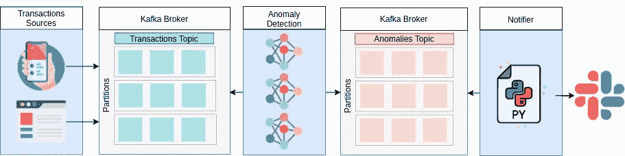
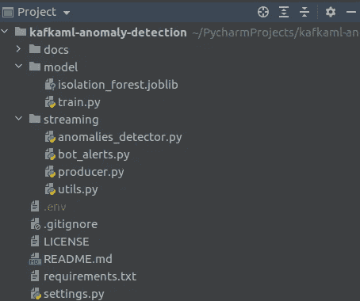
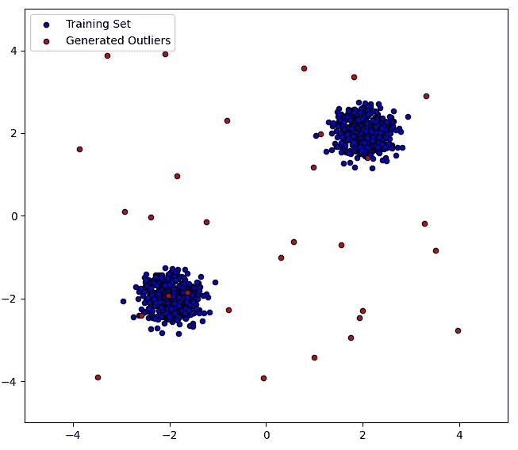

# 基于 Apache Kafka 和 Python 的实时异常检测

> 原文：<https://towardsdatascience.com/real-time-anomaly-detection-with-apache-kafka-and-python-3a40281c01c9?source=collection_archive---------8----------------------->

## *了解如何使用 Python 对来自 Kafka 的流数据进行预测。*


照片由[阿隆在](https://unsplash.com/@aronvisuals) [Unsplash](https://unsplash.com/photos/BXOXnQ26B7o) 上的视觉效果拍摄。

在这篇文章中，我将讨论如何使用 Apache Kafka 的传入流数据进行实时预测；我们将要实现的解决方案如下所示:



解决方案图。图片由作者提供。来自[平面图标](https://flaticon.com/)的图标。

这个想法是:

*   使用无监督机器学习训练异常检测算法。
*   创建一个新的数据生成器，将事务发送到 Kafka 主题。
*   阅读 Kafka 主题中的数据，使用训练好的 ml 模型进行预测。
*   如果模型检测到事务不是内联者，就把它发送到另一个 Kafka 主题。
*   创建最后一个读取异常并向松弛通道发送警报的消费者。

本文假设您了解 Apache Kafka、机器学习和 Python 的基础知识。

交易可以表示任何相关信息，以便实时分析并预测是否有异常情况，如信用卡交易、GPS 日志、系统消耗指标等。

# **1。项目结构:**

我们的项目结构将是这样的，你可以在这里得到完整的代码:

```
git clone [https://github.com/rodrigo-arenas/kafkaml-anomaly-detection.git](https://github.com/rodrigo-arenas/kafkaml-anomaly-detection.git)
```



首先查看 settings.py 它有一些我们需要设置的变量，比如 Kafka broker 主机和端口；您可以保留默认设置(监听本地主机以及 Kafka 和 zookeeper 的默认端口)。

streaming/utils.py 文件包含创建 Kafka 消费者和生产者的配置；它有一些默认选项，如果需要，您也可以更改。

现在安装要求:

```
pip install -r requirements.txt
```

# **2。训练模型**

为了说明如何设置这个解决方案，我们将生成随机数据；它会有两个变量，它们看起来像这样:



异常检测数据。图片由作者提供。

接下来，我们将使用一个[隔离森林](https://scikit-learn.org/stable/modules/generated/sklearn.ensemble.IsolationForest.html#sklearn.ensemble.IsolationForest)模型来检测离群值；简而言之，该模型将通过跟踪(采样)变量轴上的随机线来尝试隔离数据点，并在几次迭代后，测量隔离每个观察值的“难度”,因此在 train.py 文件中我们有:

运行这个之后，应该会创建 isolation_forest.joblib 文件；这是经过训练的模型。

# 3.创建主题

我们将使用两个主题；第一个称为“事务”，生产者将发送新的事务记录。让我们使用以下命令从终端创建它:

```
kafka-topics.sh --zookeeper localhost:2181 --topic transactions --create --partitions 3 --replication-factor 1
```

第二个主题将被称为“异常”，检测到异常的模块将在这里发送数据，最后一个消费者将读取数据以发送一个松弛通知:

```
kafka-topics.sh --zookeeper localhost:2181 --topic anomalies --create --partitions 3 --replication-factor 1
```

# 4.交易生成者:

现在，我们将生成第一个向 Kafka 主题“transactions”发送新数据的生成器；我们将使用合流-卡夫卡包；在文件 streaming/producer.py 中，我们有:

有了这段代码，一个生产者会向一个卡夫卡主题发送数据，概率为 OUTLIERS _ GENERATION _ PROBABILITY；数据将来自“异常值生成器”，将发送自动增量 id、机器学习模型所需的数据和 UTC 中的当前时间。

让我们检查到目前为止一切都是正确的，运行 producer.py 文件，并作为消费者从终端登录到主题:

```
kafka-console-consumer.sh --bootstrap-server 127.0.0.1:9092 --topic transactions
```

您应该会看到这样的传入消息:

交易生成者。作者 Gif。

# 5.异常值检测器消费者:

数据来了！现在，我们必须从消费者那里读取它，将其传递给机器学习模型以进行预测，并过滤离群值。这是在如下所示的 streaming/anomalies _ detector . py 文件中完成的:

消费者阅读来自“交易”主题的消息，并且消费者向“异常”主题发送离群值；除了我们已经拥有的数据之外，它还将通过模型给出的分数来丰富记录，这是一种衡量数据“有多少”被视为异常值的方法。

请注意，只有那些预测输出为-1 的消息才会转到新主题；这就是这个模型将数据归类为内联者的方式。

另外，注意这个主题有三个分区，所以在最后，我使用多重处理来模拟三个独立的消费者，并加快这个过程；它们都属于同一个 group_id。在生产中，这些消费者可能会在不同的服务器上运行。

让我们检查这一步，确保生成器正在运行并运行 anomalies_detector.py 文件，现在在终端中，让我们打开异常主题，我们应该看到模型预测为异常值的传入事务，它应该如下所示:

异常检测。作者 Gif。

这里有一个事务生产者和异常值检测如何同时运行的可视化；顶部窗口是事务生产者主题，底部窗口是发送到异常主题的离群值。

实时异常检测。作者 Gif。

# 5.时差通知:

最后一步，我们希望对这些检测到的异常值采取一些措施；在现实生活中，它可以阻止交易、扩展服务器、生成建议、向管理用户发送警报等。

这里，我们将向一个松弛通道发送一个警报；为此，请确保创建一个 slack 应用程序，将该应用程序添加到 slack 通道，并注册一个名为 SLACK_API_TOKEN 的环境变量来验证 SLACK。这里是[相关文档。](https://api.slack.com/start)

现在我们使用文件 streaming/bot _ alerts . py；代码如下:

所以在这里，脚本创建了一个新的消费者，但是它订阅了“异常”主题；一旦消息到达，它将使用 Slack API 发送消息；对于这个演示，我发送了相同的原始消息(尽量使它更漂亮！).传入的消息如下所示:

宽限通知。作者 Gif。

原来如此；解决方案已经启动并运行！我希望这对你有用。请记住，完整的代码在这里:

<https://github.com/rodrigo-arenas/kafkaml-anomaly-detection>  

我想留下一些关于这个特定实现的最后考虑:

*   我在本地机器上进行所有的设置和运行，选择多少分区、消费者、代理、zookeeper 服务器和要设置的副本(以及其他配置)是您必须根据您的业务特征、数据生成速率、可用资源等进行分析的事情。我在演示中使用了足够小的数字。
*   我使用 scikit-learn 和“纯”Python 来处理数据流，但根据消息量/生产率，可能有必要使用流处理功能，如 [spark streaming](https://spark.apache.org/docs/latest/streaming-kafka-0-10-integration.html) 。
*   你必须知道的还有对[松弛 API](https://api.slack.com/docs/rate-limits) 的限制。