# 使用深度学习的实时艺术品生成

> 原文：<https://towardsdatascience.com/real-time-artwork-generation-using-deep-learning-a33a2084ae98?source=collection_archive---------20----------------------->

## 用于任意内容样式图像对之间的样式转换的自适应实例标准化(AdaIN)。

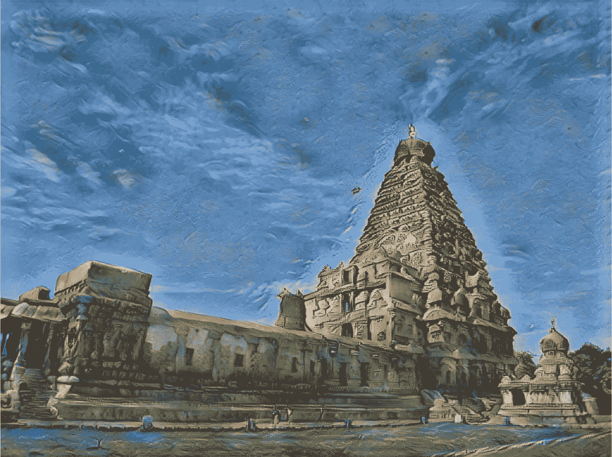

AI 生成的艺术品。图片来源:[6]

在这篇文章中，我们将会看到黄等人的论文《实时任意风格转换与自适应实例规范化》(AdaIN)。艾尔。我们之所以关注这篇论文，是因为它比当时或发布时的其他最先进的方法有一些关键优势。

最重要的是，这种方法一旦经过训练，就可以用于在任意内容样式的图像对之间转换样式，甚至是在训练期间没有看到的图像对。而 Gatys 等人提出的方法。艾尔。也可以在任何内容样式图像对之间转换样式，与此方法相比，它非常慢，因为它在推断过程中对样式化图像进行迭代优化。AdaIN 方法也是灵活的，它允许控制风格化图像中转换的风格的强度，还允许扩展，如风格插值和空间控制。

接下来，我们将首先熟悉实例规范化、自适应实例规范化，然后深入研究 AdaIN 论文的工作。最后，我们将看到一些输出，并查看实现自适应实例规范化和训练风格转移网络的代码。

# 实例规范化

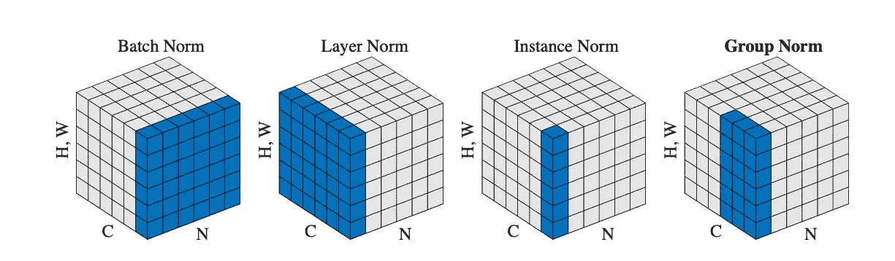

图 1:不同的物化技术。图片来源:[3]。

批次归一化使用整批的平均值和方差对整批固定大小的特征图进行归一化。另一方面，实例标准化(也称为对比标准化)对每个样本的每个通道进行标准化。

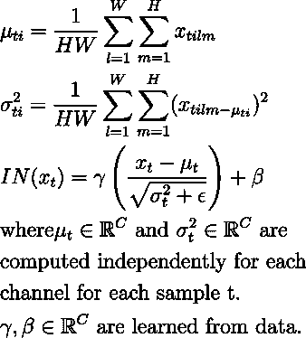

情商。1:实例规范化

来自 Eq。1，我们可以清楚地看到，每个样本的每个通道都是单独归一化的。与批处理规范的另一个区别是，与批处理规范不同，实例规范也应用于推理过程中。

实例规范对输入图像的对比度进行标准化，使风格化图像独立于输入图像对比度，从而提高输出质量[2]。[1]的作者还指出，实例标准化通过匹配特征统计(均值和方差)来充当样式标准化的一种形式。这里，图像标准化的风格由可学习的仿射参数γ和β[1]定义。

要了解更多关于实例规范和其他规范化技术，请点击查看 T2 的帖子[。](https://medium.com/u/e1cd4f0da28f?source=post_page-----a33a2084ae98--------------------------------)

## 条件实例规范化

条件实例标准化在[4]中介绍，其中作者建议为每种风格的图像学习不同的γs 和βs。

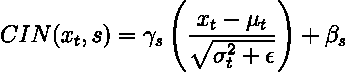

情商。2:条件实例规范化。

虽然这种方法工作良好，但它需要 2xCxS 个额外参数(C: # channels，S: # styles)，从而增加了网络的规模。因为实例 norm 执行一种形式的样式转换[1]，为每种样式设置一组参数允许我们将图像标准化为每种样式。

# 自适应实例标准化

作者扩展了仿射参数γ和β定义实例范数的规范化风格的思想，提出了自适应实例规范化。在建议中，实例标准化被修改以适应不同的内容风格的图像对。

AdaIN 将内容特征和风格特征 **x** 和 **y** 作为输入，并简单地将内容特征的统计量(均值和方差)与风格特征 **y** 的统计量进行匹配。这里没有可学习的参数，转换如下获得

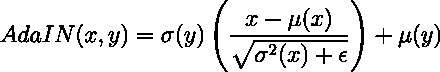

情商。3:自适应实例规范化。

其中，σ (⋅是标准偏差，σ(⋅)是方差，μ(⋅是平均值，所有这些都是按照实例规范中的空间维度计算的。

# 亚当式传输网络

## 体系结构

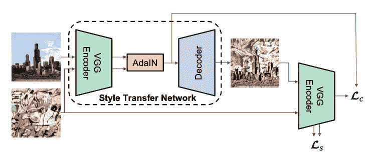

图 2:提议的风格转移网络架构/图片来源:[1]

AdaIn StyleNet 遵循编码器-解码器架构(图 2)。编码器 **f(⋅)** 是 VGG19 网络的前几个预训练层(直到 relu4_1)。编码器是固定的，没有经过训练。

对编码器的输出执行自适应实例标准化，如下所示

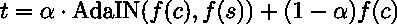

情商。4:阿丹混合。

其中 f(c)和 f(s)分别是由编码器为内容和风格图像产生的特征图。混合系数α∈[0，1]控制风格化图像中风格的强度。α在训练期间被设置为 1。

解码器 **g(⋅)** 与编码器相反，池被 2x 最近邻向上扩展所取代。解码器用随机权重初始化，并学习其权重。通过将变换后的特征图 **t** 传递到生成器中来获得风格化图像。

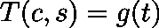

情商。5:风格化图像生成

## 损失函数

损失目标是风格和内容损失的组合。

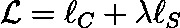

情商。6:全部损失

内容损失是从 VGG 编码器获得的风格化图像的特征图和 AdaIN 输出 ***t*** 之间的欧几里德距离:

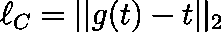

情商。7:内容丢失

AdaIN 输出 ***t*** 用作内容目标，因为它有助于模型更快地收敛。风格损失的计算公式如下:

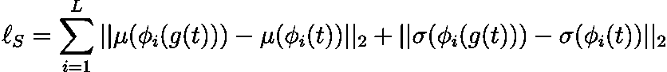

情商。8:风格丧失

每个 **ϕ** i 都是 VGG 19 网络的一层。这里使用 relu1_1、relu2_1、relu3_1 和 relu4_1。

# 输出样本

这里有一些由模型生成的艺术作品。

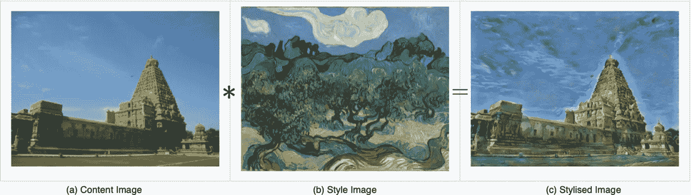

风格转移在行动。图像来源:(a)[7]，(b)[8]，(c )[6]

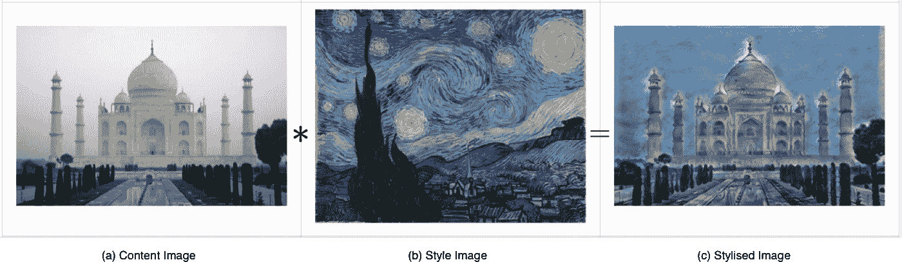

风格转移在行动。图片来源:(a)[9]，(b)[10]，(c )[6]

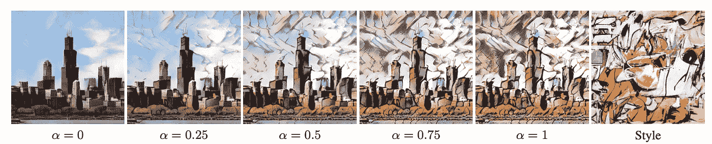

使用α在推断期间控制风格化图像上的风格强度。图像来源:[1]

# 代码和预训练模型

实现自适应实例规范化的代码片段:

训练 AdaIN 型传输网络的代码可在此处找到:

<https://github.com/aadhithya/AdaIN-pytorch>  

预训练模型(pytorch 和 onnx 格式)的权重可在此处找到:

<https://github.com/aadhithya/AdaIN-pytorch/releases/tag/1.0>  

# 结论

这篇文章介绍了实例规范化以及自适应实例规范化如何用于任意内容样式图像对之间的样式转换。通过训练生成器网络和使用自适应实例标准化，我们能够在任何内容样式图像对之间转移样式。我们还能够在运行时控制生成图像的样式强度。该方法提供的另一个优势是推理速度超过当时的其他模型。最后，展示了一些输出，代码和预先训练的推理权重可供免费、非商业使用。

如果您发现帖子中有任何错误，请留下评论，我会修复它们！

如果你喜欢这篇文章，请考虑关注作者， [Aadhithya Sankar](https://medium.com/u/82053676fe58?source=post_page-----a33a2084ae98--------------------------------) 。

# 参考

[1]黄、荀、贝隆吉。“通过自适应实例规范化实时传输任意样式。”*IEEE 计算机视觉国际会议论文集*。2017.

[2] D.Ulyanov，A.Vedaldi 和 V.Lempitsky .改进的纹理网络:在前馈风格化和纹理合成中最大化质量和多样性。2017 年 *CVPR* 。

[3]吴、庾信、何。“分组规范化。”欧洲计算机视觉会议(ECCV)会议录。2018.

[4] V. Dumoulin、J. Shlens 和 M. Kudlur。艺术风格的学术表现。在 *ICLR* ，2017。

[5]李彦宏，王，刘军，侯。揭开神经类型转移的神秘面纱。 *arXiv 预印本 arXiv:1701.01036* ，2017。

[6][https://github.com/aadhithya/AdaIN-pytorch](https://github.com/aadhithya/AdaIN-pytorch)

[7][https://en . Wikipedia . org/wiki/File:Side _ profile，_Brihadeeswara.jpg](https://en.wikipedia.org/wiki/File:Side_profile,_Brihadeeswara.jpg)

[8][https://en . Wikipedia . org/wiki/Olive _ Trees _(梵高系列)#/media/File:梵高 _The_Olive_Trees..jpg](https://en.wikipedia.org/wiki/Olive_Trees_(Van_Gogh_series)#/media/File:Van_Gogh_The_Olive_Trees..jpg)

【9】[https://en . Wikipedia . org/wiki/Taj _ Mahal #/media/File:Taj _ Mahal _ in _ India _-_ Kristian _ bertel . jpg](https://en.wikipedia.org/wiki/Taj_Mahal#/media/File:Taj_Mahal_in_India_-_Kristian_Bertel.jpg)

【10】[https://en . Wikipedia . org/wiki/The _ Starry _ Night #/media/File:Van _ Gogh _-_ Starry _ Night _-_ Google _ Art _ project . jpg](https://en.wikipedia.org/wiki/The_Starry_Night#/media/File:Van_Gogh_-_Starry_Night_-_Google_Art_Project.jpg)

# 作者的其他作品

如果你喜欢这篇文章，这里有一些你可能会喜欢的文章:

</learning-disentangled-representations-with-invertible-flow-based-interpretation-networks-9954554a28d2>  </demystified-wasserstein-gans-wgan-f835324899f4>  </a-primer-on-atrous-convolutions-and-depth-wise-separable-convolutions-443b106919f5> 