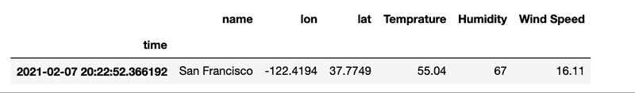
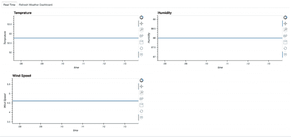
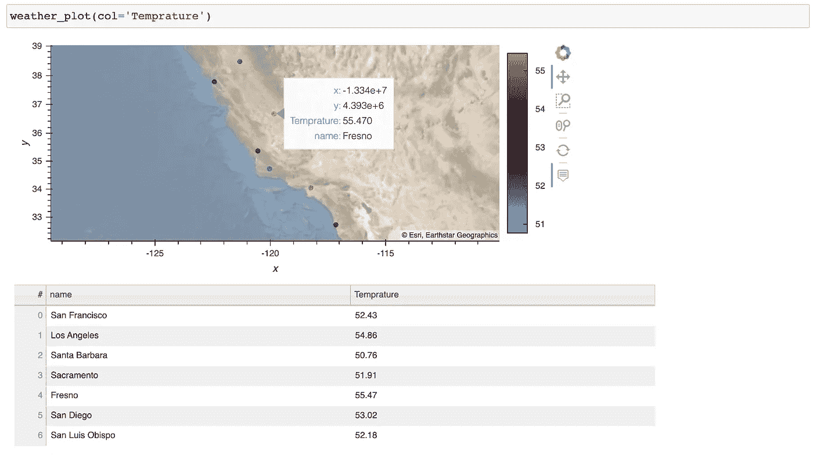
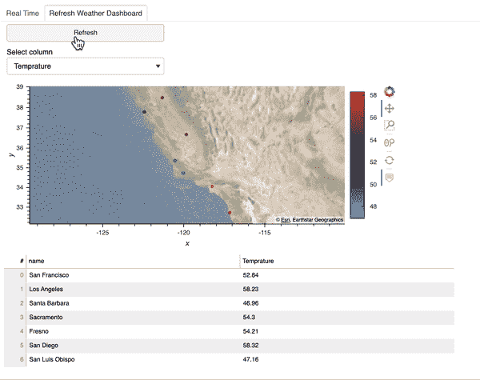

# Python 中的实时仪表板

> 原文：<https://towardsdatascience.com/real-time-dashboard-in-python-970e3c32b3d7?source=collection_archive---------1----------------------->

## [实践教程](https://towardsdatascience.com/tagged/hands-on-tutorials)

## 流和刷新


[摄莎莎故事](https://unsplash.com/@sanfrancisco?utm_source=unsplash&utm_medium=referral&utm_content=creditCopyText)上 [Unsplash](https://unsplash.com/s/photos/dashboard?utm_source=unsplash&utm_medium=referral&utm_content=creditCopyText)

数据科学家使用数据可视化来交流数据和产生见解。数据科学家必须知道如何创建有意义的可视化仪表板，尤其是实时仪表板。本文讨论了用 Python 获得实时仪表板的两种方法:

*   首先，我们使用流数据并创建一个自动更新的流仪表板。
*   第二，每当我们需要刷新仪表板时，我们使用“刷新”按钮来刷新仪表板。

出于演示的目的，图和仪表板是非常基本的，但你会得到我们如何做一个实时仪表板的想法。

本文的代码可以在这里找到: [realtime_dashboard.ipynb](https://github.com/sophiamyang/real_time_dashboard/blob/main/realtime_dashboard.ipynb) 和 [realtime_dashboard.py](https://github.com/sophiamyang/real_time_dashboard/blob/main/realtime_dashboard.py) 。这两个文件的内容完全相同，只是格式不同。

# 数据源

为了展示我们如何使用真实世界的 API 创建这个仪表板，我们在本文中使用来自 OpenWeather API 的天气数据作为示例。

如果您想尝试本文中提到的代码，您需要访问 OpenWeather 天气 API。你可以在[开放天气网站](https://openweathermap.org/api)注册，然后获得 [API 密匙](http://home.openweathermap.org/api_keys)。

# 建立

在进入代码之前，让我们安装需要的包:

`conda install datashader holoviews hvplot notebook numpy pandas panel param requests streamz`

# 导入包

在这里，我们导入用于本文的包:

# 流式数据和仪表板

首先，我们使用 OpenWeather API 创建一个函数`weather_data`来获取一系列城市的天气数据。输出是一个熊猫数据帧，每行代表一个城市。

其次，我们使用`streamz`来创建一个基于旧金山天气数据的流数据帧。函数`streaming_weather_data`被`PeriodicDataFrame`函数用作回调函数，以创建`streamz`流数据帧`df`。`streamz`文档记录了`PeriodicDataFrame`的工作原理:

> streamz 为此提供了一个高级便利类，称为 PeriodicDataFrame。PeriodicDataFrame 使用 Python 的 asyncio 事件循环(在 Jupyter 和其他交互式框架中用作 Tornado 的一部分)定期调用用户提供的函数，收集结果并供以后处理。
> 
> [https://streamz . readthedocs . io/en/latest/data frames . html # streaming-data frames](https://streamz.readthedocs.io/en/latest/dataframes.html#streaming-dataframes)

`streamz`流数据帧`df`看起来像这样，每 30 秒更新一次值(从我们设置`interval=’30'`开始)。



第三，我们使用`hvPlot`绘制`streamz`数据帧来制作一些非常基本的图形，然后我们使用`panel`来组织图形并将所有内容放入仪表板中。如果您想了解更多关于如何使用`hvPlot`绘制`streamz`数据帧的信息，请参见 [hvPlot 文档](https://hvplot.holoviz.org/user_guide/Streaming.html)。

这是仪表板的样子。由于流数据帧每 30 秒更新一次，该控制面板也将每 30 秒自动更新一次。这里我们看到温度发生了变化，而湿度和风速没有变化。



很好，现在你知道如何制作一个流数据框架和一个流仪表板了。

如果你想了解更多，我的朋友吉姆·贝德纳尔博士在流媒体仪表盘上有一个很棒的视频教程。请检查一下！

# 刷新仪表板

有时候，我们并不真的需要一个流媒体仪表盘。相反，我们可能只想在看到仪表板时刷新它。在本节中，我将向您展示如何在您的控制面板中创建一个“刷新”按钮，并在您单击“刷新”时用新数据刷新控制面板。

首先，让我们创建一个简单的函数`weather_plot`在一张给定城市名称的地图上绘制天气数据，并返回绘图和数据。



有了绘图功能，我们就可以开始制作可刷新的仪表板了。每当我们点击按钮`Refresh`时，我使用`param.Action`函数来触发更新。此外，我使用`param.ObjectSelector`函数创建我们感兴趣的数据框列的下拉菜单，并且每当我们在下拉菜单中选择不同的选项时`param.ObjectSelector`触发更新。然后`@param.depends('action', 'select_column')`装饰器告诉`get_plot`函数每当我们点击`Refresh`按钮或选择另一列时重新运行。

以下是刷新控制面板的外观:



最后，我们可以使用`panel`来合并我们创建的两个仪表板。

# 部署

我们最后的仪表板`pane`是一个`panel`对象，可以通过运行:

```
panel serve realtime_dashboard.py
```

或者

```
panel serve realtime_dashboard.ipynb
```

关于`panel`部署的更多信息，请参考`panel` [文档](https://panel.holoviz.org/user_guide/Deploy_and_Export.html)。

现在你知道如何使用`hvplot`、`panel`和`streamz`在 python 中制作实时流仪表盘和可刷新仪表盘。希望这篇文章对你有帮助！

# 参考

[https://anaconda . cloud/tutorials/4038 AE 58-286 a-4 FDC-b8bf-b4b 257 e 2 EDF 3](https://anaconda.cloud/tutorials/4038ae58-286a-4fdc-b8bf-b4b257e2edf3)

[https://openweathermap.org/api](https://openweathermap.org/api)

【https://panel.holoviz.org/gallery/param/action_button.html】

[https://streamz.readthedocs.io/en/latest/dataframes.html](https://streamz.readthedocs.io/en/latest/dataframes.html)

[https://hvplot.holoviz.org/user_guide/Streaming.html](https://hvplot.holoviz.org/user_guide/Streaming.html)

[https://panel.holoviz.org/user_guide/Deploy_and_Export.html](https://panel.holoviz.org/user_guide/Deploy_and_Export.html)

作者索菲亚·杨 2021 年 2 月 7 日

在[媒体](https://sophiamyang.medium.com/)、[推特](https://twitter.com/sophiamyang)、 [Linkedin](https://www.linkedin.com/in/sophiamyang/) 和 [YouTube](https://www.youtube.com/channel/UCruSa8hlUAa3aHQ189oOggQ) :)上关注我