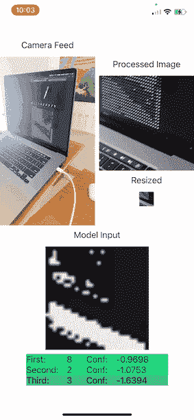
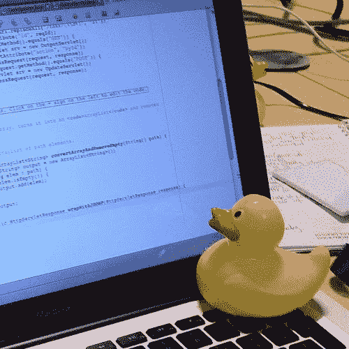
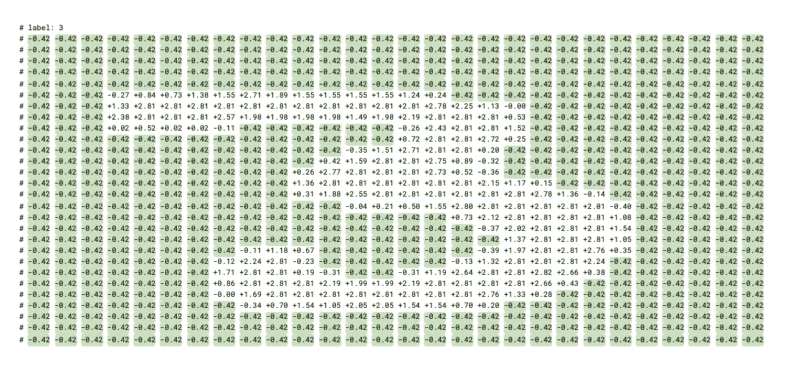
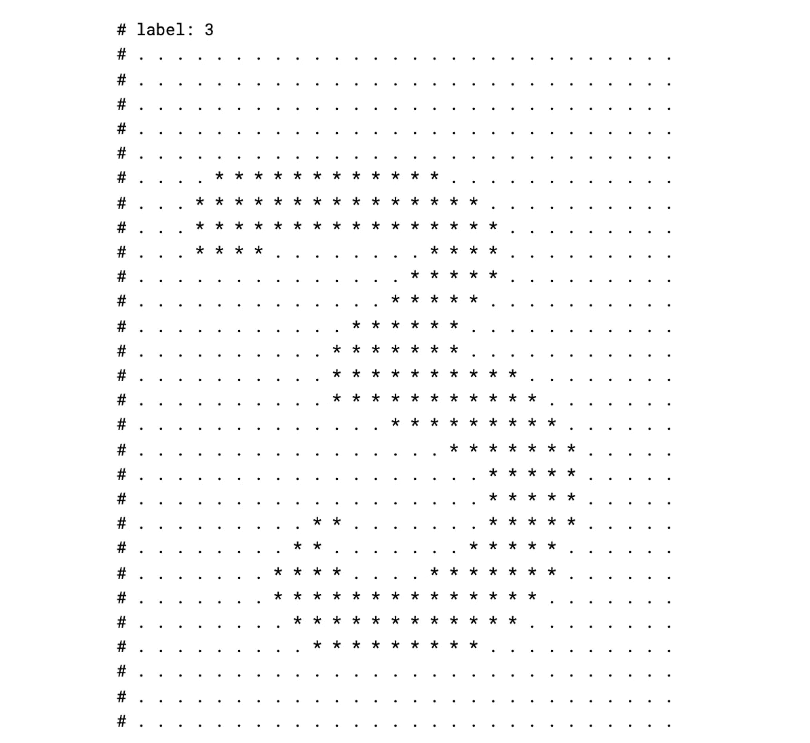
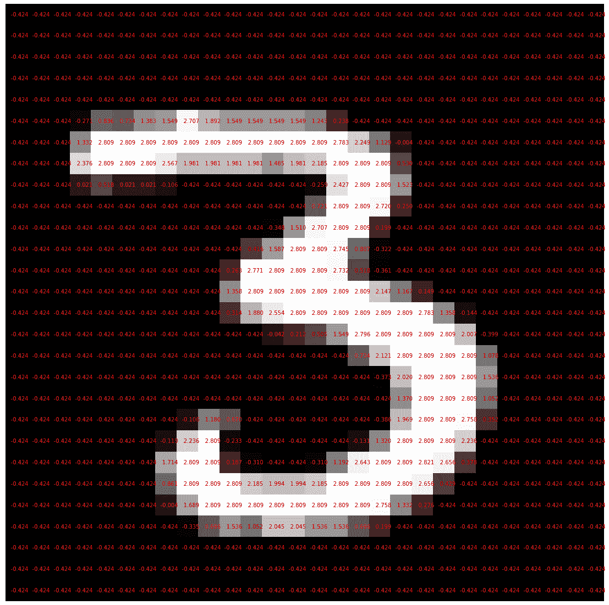
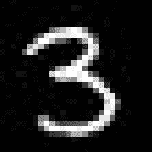
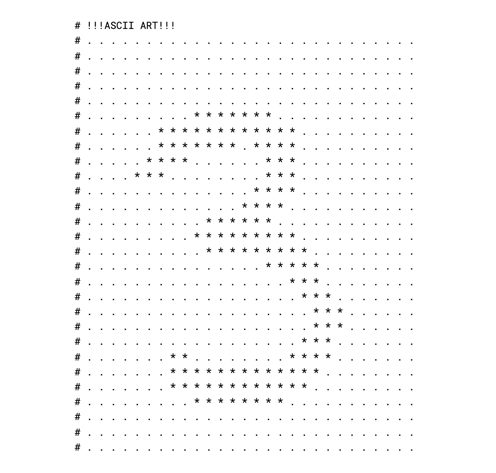

# IOS 中的实时数字识别

> 原文：<https://towardsdatascience.com/real-time-digit-recognition-in-ios-2a982f32fcce?source=collection_archive---------21----------------------->

## 在 swift 中使用 torchscript 处理现场摄像机馈送



作者演示 gif

计算的未来包括能像我们一样看东西的计算机。手机识别我们的脸，相机看书，汽车自动驾驶。我们只会有更多的这些。

很难不好奇这些算法是如何工作的。对于像我这样的人来说，建筑是最好的学习方式。在这一努力中，我围绕计算机视觉的 hello world 问题开发了一个 ios 应用程序。这篇文章记录了我和我的[橡皮鸭](https://en.wikipedia.org/wiki/Rubber_duck_debugging)在开发应用程序时的对话。源代码是 github 上的[。我希望你觉得这是有用的。](https://github.com/grandbora/mnist-digit-ios)



维基百科上看到的我的橡皮鸭([汤姆·莫瑞斯——自己的作品，CC BY-SA 3.0](https://commons.wikimedia.org/w/index.php?curid=16745966) )

# 范围

识别手写数字是计算机视觉的基石问题。最好通过神经网络来解决。对于这个问题，有大量关于训练神经网络模型的资源。我不会重复模型构建和训练的细节。因此，我假设在这些方面有一些先验知识。在这个练习中，我的重点是将一个经过训练的模型移植到移动环境中。

我正在寻找答案的问题:

*   如何将模型从 python 导出到 ios？
*   我如何在 swift 中运行推理？
*   我如何从实时摄像头捕捉图像？

## 技术堆栈

我使用 pytorch 来构建模型，因为我想尝试一下 torchscript。对于 ios 应用程序，我使用 swift 和 swiftUI。

# 创建模型

通过设计，我选择了一个被广泛研究的问题。Amitrajit 的帖子是解决这个问题的好资源之一。我遵循它的指导来选择网络架构和超参数。


MNIST 数据库图片来自[维基百科](https://en.wikipedia.org/wiki/MNIST_database#/media/File:MnistExamples.png)

我选定的模型有两个卷积层和两个全连接层。它使用 [LogSoftmax](https://pytorch.org/docs/master/nn.functional.html#torch.nn.functional.log_softmax) 作为输出层激活。

另一个重要的细节是优化器、损失函数和训练参数。

通过这种配置，该模型在 [mnist 数据集](http://yann.lecun.com/exdb/mnist/)上的 3 个时期的训练中实现了 97%的准确度。

# 模型输入

该模型根据*训练数据*进行训练。我想让它在来自相机流的图像上工作。这被称为*生产数据*。应用程序必须对*生产数据*进行预处理，以匹配*训练数据*的形状和语义。否则它给出的结果将是次优的，[如果不是垃圾](https://xkcd.com/1838)。

为了正确地进行预处理，必须对训练数据和生产数据以及模型返回的输出数据有全面的了解。因此，我和我的鸭子花了很长时间讨论这些数据。

让我们从训练数据集开始。在没有任何变换的情况下，数据集包含 [PIL 图像](https://pillow.readthedocs.io/en/stable/reference/Image.html)及其标签的元组。

我们将对该数据集应用两种转换。一个是将数据从 PIL 格式转换成张量。另一个运行规范化逻辑。

第一次变换后，我们得到了形状为`(1, 28, 28)`的张量。这是因为图像是单通道(灰度)，28×28 像素的图像。这些张量保存浮点数，值在`0`和`1`之间。这些值反映了像素的亮度；`0`是黑色，`1`是白色。

第二个转换计算张量中每个元素的标准分数(也称为 z 分数)。标准分数告诉我们一个值离平均值有多少标准差。这个数据集的均值是`0.1307`，标准差是`0.3081`。因此，在这个变换之后，张量的值将在`-0.4242`和`2.8215`之间展开。

这些转换步骤背后有许多有趣的信息。为了简洁起见，我只给出几个链接。首先，源代码说明了很多问题。看看 [ToTensor](https://github.com/pytorch/vision/blob/b266c2f1a5c10f5caf22f5aea7418acc392a5075/torchvision/transforms/transforms.py#L72) 类和[它的底层实现](https://github.com/pytorch/vision/blob/b266c2f1a5c10f5caf22f5aea7418acc392a5075/torchvision/transforms/functional.py#L89)。其次，阅读关于[标准分数](https://en.wikipedia.org/wiki/Standard_score)，以及[我们为什么将它应用于训练数据集](https://datascience.stackexchange.com/a/82448)。然后看[规范化](https://github.com/pytorch/vision/blob/b266c2f1a5c10f5caf22f5aea7418acc392a5075/torchvision/transforms/transforms.py#L189)类的代码和[它的实现](https://github.com/pytorch/vision/blob/b266c2f1a5c10f5caf22f5aea7418acc392a5075/torchvision/transforms/functional.py#L299)。最后， [Compose](https://github.com/pytorch/vision/blob/b266c2f1a5c10f5caf22f5aea7418acc392a5075/torchvision/transforms/transforms.py#L28) 类将展示这些步骤如何[简单地链接在一起](https://github.com/pytorch/vision/blob/b266c2f1a5c10f5caf22f5aea7418acc392a5075/torchvision/transforms/transforms.py#L59-L61)。

# 形象化

我们了解了输入格式。接下来，我们应该检查语义。神经网络的一个挑战是它们处理的大量数据。输入的原始打印输出不能被人类消化。

我们必须使这些数据易于理解，这样人们就可以对其进行推理。一种常见的方法是使用可视化技术。有许多复杂的工具可以用来可视化大型数据集。在我们的例子中，数据集很简单。只有打印的声明能让我们走得更远。我们知道数据代表一个 28 乘 28 的图像。让我们相应地打印它。

输出中突出显示的`-0.42`显示了我们期望看到的模式。



在这个输入中，正数代表亮像素，而负数属于黑色背景。这个输入的标签说这个数据代表数字三。我们看到的模式证实了这一点。让我们更改代码，使模式更加清晰可见。



这个 ascii 艺术的尝试给了我们一个很好的洞察，我们用什么来喂养这个模型。这种原始可视化的优点是可移植性。我们稍后将在 ios 环境中使用相同的逻辑。

不是每个数据集都像这个一样容易可视化。对于更复杂的数据集，有复杂的工具。一个例子是 Matplotlib 。



# 输出

这个模型正在解决一个分类问题。它预测了 10 个类别中每个类别的置信度得分。这反映在模型架构中。输出层是具有 10 个节点的全连接层。每个节点代表十个数字中的一个。

置信度得分是由激活方法决定的。在我们的例子中，这是 [LogSoftmax](https://pytorch.org/docs/master/nn.functional.html#torch.nn.functional.log_softmax) (阅读更多关于 [softmax 函数](https://medium.com/data-science-bootcamp/understand-the-softmax-function-in-minutes-f3a59641e86d)和[为什么我们要添加对数](https://datascience.stackexchange.com/questions/40714/what-is-the-advantage-of-using-log-softmax-instead-of-softmax))。这个函数给我们负数。数字越接近零，置信度越高。

在这个例子中，模型在第三类中具有最高的置信度，表明这个图像最有可能代表数字 3。

# 摆脱 Python

Torchscript 是迈向非 python 环境的第一步。简单来说，torchscript 给了我们一个可以在 c++中使用的模型。一旦模型被训练，我们就可以[将其转换成 torchscript 模块](https://pytorch.org/docs/stable/generated/torch.jit.trace.html)。

Torchscript 提供了几种检查模块的方法。其中之一就是`.code`属性。

这个表示捕获了我们在模型中定义的前进方法的步骤。进一步的细节在[火炬脚本介绍教程](https://pytorch.org/tutorials/beginner/Intro_to_TorchScript_tutorial.html)中解释。我们还可以[优化移动模块](https://pytorch.org/tutorials/recipes/script_optimized.html#optimize-a-torchscript-model)。

最后我们[序列化模块并保存到磁盘](https://pytorch.org/docs/stable/generated/torch.jit.ScriptModule.html#torch.jit.ScriptModule.save)。此时，模块就可以导出了。

# 进入 IOS

我们训练了一个模型，将像素数据(图像)转化为数字预测。我们可以从 c++中调用它。我们如何在 ios 中运行它？这是我们将在本节中发现的内容。

在 ios 中使用 torchscript 的先决条件是 *libtorch* 库。它允许我们反序列化我们在 python 环境中序列化的模型。这个库可以在 [cocoapods](https://cocoapods.org/) 中获得。

下一个障碍是从 swift 调用这个库。Swift 需要手握才能与 c++对话。Swift 可以和 objective-c 对话，objective-c 可以和 c++对话。因此，我们需要一个围绕 libtorch api 的 objective-c 包装器。

包装包括三部分结构:

*   [桥接接头](https://github.com/grandbora/mnist-digit-ios/blob/master/mnist_digit/TorchBridge/mnist_digit-Bridging-Header.h)
*   [火炬模块头](https://github.com/grandbora/mnist-digit-ios/blob/master/mnist_digit/TorchBridge/MnistModule.h)
*   [火炬模块实现](https://github.com/grandbora/mnist-digit-ios/blob/master/mnist_digit/TorchBridge/MnistModule.mm)

桥接头包括模块头的单个导入。模块头包含声明。只有模块实现是有趣的。它提供了两种方法。

`initWithFileAtPath`在给定的文件路径反序列化模型。一旦模型被反序列化，它就将其设置为[评估模式](https://pytorch.org/docs/stable/generated/torch.jit.ScriptModule.html#torch.jit.ScriptModule.eval)。

`predictImage`方法是整合的核心。这是我们对模型进行推理的地方。

首先我们需要一个张量来进行推理。我们使用 [torch::from_blob](https://pytorch.org/cppdocs/api/function_namespacetorch_1aff6f8e6185457b2b67a1a9f292effe6b.html) 函数将图像缓冲区转换为张量。

```
at::Tensor tensor = 
  torch::from_blob(imageBuffer, {1, 1, 28, 28}, at::kFloat);
```

第二个参数`{1, 1, 28, 28}`，表示我们想要创建的张量的大小。该值显示批处理大小，后跟单个训练图像的大小。即使我们在单个图像上运行推理，pytorch 模块也总是期望输入是批处理的。因此批量大小为一。最后一个参数表示张量中元素的类型。

接下来的两行是我缺乏 c++经验的地方。在高层次上，我知道我们禁用梯度计算，因为我们正在运行推理而已。我找不到这些电话的具体细节。

```
torch::autograd::AutoGradMode guard(**false**);
at::AutoNonVariableTypeMode non_var_type_mode(**true**);
```

最后，我们调用正向方法，并将结果转换为张量。

```
**auto** outputTensor = _impl.forward({tensor}).toTensor();
```

其余的逻辑是自我描述的。我们处理输出以返回一个数字数组。

# 运行推理

在我的第一次迭代中，我对来自 mnist 数据集的静态图像进行了推理。我们的模型是在这个数据集上训练的。对于这些图像，我们应该从模型中获得高精度。



我将数据集中的一些图像添加到资产目录中。然后我可以访问这些图像。

接下来，我们需要一个模型实例来调用推理方法。我们使用之前实现的 api 来[实例化模型](https://github.com/grandbora/mnist-digit-ios/blob/master/mnist_digit/AppSetup.swift#L5-L12)。文件路径应该指向一个[序列化的 torchscript 模型](https://github.com/grandbora/mnist-digit-ios/blob/master/mnist_digit/model/traced_script_module.pt)。在我们的例子中，在将模型转换为 torchscript 之后，这是我们之前生成的文件的副本。

我们有了输入，我们有了模型实例，我们应该准备好调用`predict`方法。然而，我们不是，因为我们需要预处理输入图像，以将其转换为我们的模型理解的结构。这就是我们对模型输入的理解变得重要的地方。

我们的输入是一个`UIImage`。`predict`方法期望的是一个浮点数数组。我们不仅希望将图像像素转换为浮点数，还希望对这些数字进行规范化。如果您还记得我们在训练集上运行的数据转换，其中之一就是规范化。

```
torchvision.transforms.Normalize((0.1307,), (0.3081,))
```

再次强调它；我们希望生产输入数据尽可能接近训练数据。否则我们会得到垃圾结果。

我们需要采取一系列步骤来将输入数据转换成模型期望的格式。一旦确定，这些步骤很容易实现。最多需要熟悉一下 swift 标准库和苹果的核心图像框架。

# 输入管道

我再重申一下目标:`UIImage -> Byte Array -> Float Array`。我将这条管道分解为以下几个步骤:

*   将 UIImage 转换为 CGImage
*   读取 CGImage 字节
*   使标准化

# UIImage 到 CGImage

在 ios 中处理图像有些复杂。一个恰当的例子是读取字节。为了访问一个`UIImage`的字节，我们需要先把它转换成一个`CIImage`，然后再转换成一个`CGImage`。之后，我们可以读取图像的字节。关于这些图像类的介绍，请查看 hackingwithswith swift 上的[集成核心图像帖子。](https://www.hackingwithswift.com/books/ios-swiftui/integrating-core-image-with-swiftui)

该逻辑可能会失败，因此该方法返回一个可选结果。在错误处理之后，我们可以访问 CGImage。

# 读取字节

我们回到了读取字节的轨道上。在这一步中，我们将分配一个内存空间，并在该内存中重新绘制图像。在这个过程之后，我们感兴趣的字节将在分配的内存中结束。

我们通过初始化一个变量来分配内存。

```
**var** rawBytes: [UInt8] = 
  [UInt8](repeating: 0, count: 28 * 28) // 1 bytes per pixel;
```

有几件事需要注意。我们使用 8 位无符号整数。任何 8 位数据类型都可以在这里工作。其次，数组的大小与训练图像的像素数相匹配。我们使用灰度图像进行训练，我们只需要一个字节来表示每个像素。

接下来，我们将创建一个位图图形上下文。这个结构将使我们能够重新绘制图像。上下文的构造函数需要一个指向内存空间的指针。我们将使用 swift 标准库方法[和 unsafmutablebytes](https://developer.apple.com/documentation/swift/array/2633739-withunsafemutablebytes)来获取一个指针。

构造函数参数对于正确理解非常重要。`data`指向分配的内存。`width`和`height`是自我描述的。根据文档，每个像素在存储器中都有分量。在我们的例子中，一个像素只有一个字节大小的分量。因此，`bitsPerComponent`就是`8`。`space`表示色彩空间。在我们的例子中，这是灰度。`bitmapInfo`表示该位图没有 alpha(透明)通道。[文档](https://developer.apple.com/documentation/coregraphics/cgcontext/1455939-init)有关于参数的更多信息。

在必要的错误处理之后，我们可以继续绘制图像。首先，我们定义想要绘制图像的区域。然后我们调用[绘制方法](https://developer.apple.com/documentation/coregraphics/cgcontext/2427126-draw)。

当这个回调函数执行时，它将用我们在`cgImage`中的图像的像素数据覆盖`rawBytes`数组的值。

# 使标准化

预处理的最后一步是归一化。首先，我们用`255`除这些值，得到介于`0`和`1`之间的数字。然后，我们将应用应用于训练数据集的相同逻辑。如果你之前看过规格化方法的[源代码，你就会知道移植起来很简单。](https://github.com/pytorch/vision/blob/b266c2f1a5c10f5caf22f5aea7418acc392a5075/torchvision/transforms/functional.py#L336)

我们得到了在`-0.4242`和`2.8215`之间的浮点数。和我们在训练环境中的完全一样。

# 可视化 II

作为最后一项检查，让我们运行 ascii art 方法，这次是在 swift 中。



输出看起来与输入图像非常相似。

# 运行推理 II

早期我们实例化了这个模型。我们还对输入进行了预处理。我们准备调用`predict`方法。

我们再次使用了带有不可替换字节的方法。这是因为模块对象上的`predict`方法需要一个指针。在错误处理之后，我们得到一组预测结果。

正如我们之前所研究的，输出有 10 个数字。我们感兴趣的是最高的置信度得分。我们运行一个排序逻辑来识别这些。

排序结果的第一个元素是具有高置信度的`3`。有用！🥳

# 插曲

我们刚刚设法让 ios 应用程序识别一个数字的静态图像。令人惊讶的是，即使对于这样一个被广泛研究的问题，构建解决方案的细节也是如此之多。同样令人满意的是看到所有的部分走到一起并交付结果。

到目前为止，我们实现了两个目标:

*   **如何将模型从 python 导出到 ios？**
*   **我如何在 swift 中运行推理？**
*   我如何从实时摄像头捕捉图像？

在第二部分，我们将发现现场视频处理隐藏的细节。敬请关注。