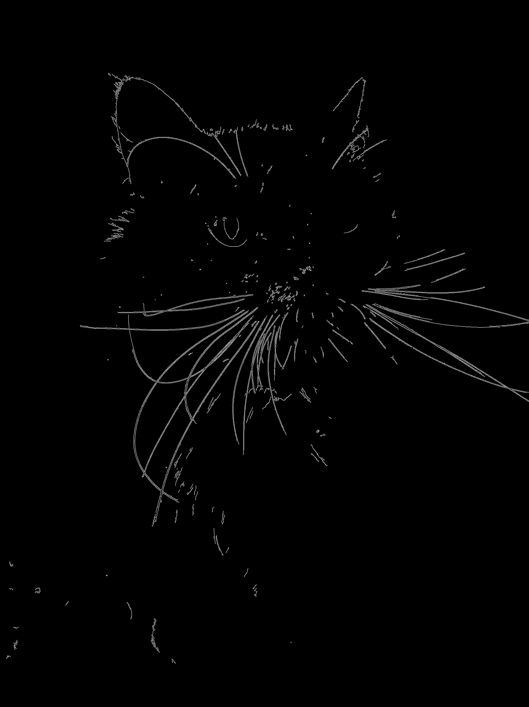
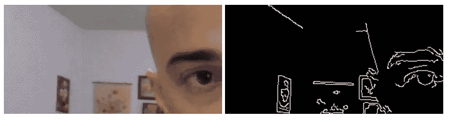

# 浏览器中的实时边缘检测

> 原文：<https://towardsdatascience.com/real-time-edge-detection-in-browser-ee4d61ba05ef?source=collection_archive---------22----------------------->

## 使用 OpenCV.js 查找视频中的边缘



我的猫周围检测到的边缘。作者制作的图像。

边缘检测是计算机视觉中的一个基本工具。通过使用鲜明的亮度对比，可以在图像中找到大致的轮廓和形状。边缘检测通常用作一种过滤器来找出照片中项目之间的区别，它为对象识别提供了第一块垫脚石。

OpenCV 以 C++、Java、Python 和 JavaScript 提供了广泛的计算机视觉工具。其中包括使用 Canny 方法的边缘检测算法。OpenCV 的边缘检测实现以性能为出发点，可以与实时视频接口，几乎没有明显的延迟。

虽然 Python 中有很多例子和教程，但 JavaScript 中的例子和教程很少。随着 web 技术可移植性的增加，现在占据了桌面应用程序甚至电话应用程序的空间，介绍一下在 web 应用程序中使用 OpenCV 的基础知识是有意义的。

# Canny 边缘检测

Canny edge detection 以其创新者 John Canny 的名字命名，它试图找到这样的边缘:

1.  它在图像中找到尽可能多的边缘，
2.  边缘点应该位于边缘的中心，并且
3.  边缘仅被标记一次，并且不包括背景噪声

Canny 边缘检测是在计算机视觉的早期(1986 年)开发的，至今仍是前沿应用的黄金标准。对于那些性能优于 Canny 的少数边缘检测算法，它们通常需要更多的时间和计算能力，这使得它们不适合实时检测。

幸运的是，没有必要从头开始写一个算法。OpenCV 用几行简单的代码提供了 Canny 边缘检测的有效实现。

Canny 方法如何找到边的数学问题超出了本文的范围，但是更多的细节可以在这里找到。

# HTML 设置

在跳转到 JavaScript 应用边缘检测之前，必须在 HTML 页面上设置适当的元素。为了进行实时检测，OpenCV 需要一个视频标签和两个画布。

```
<!DOCTYPE html>
<html>
    <head>
        <Title>
            Real Time Edge Detection with OpenCV.js
        </Title>
    </head>
    <body>
        <video id="video" playsinline autoplay></video>
        <canvas id = "streamCanvas"></canvas>
        <canvas id = "edgeDetectionCanvas"></canvas>

        <script type="text/javascript" src="lib/CV2/opencv.js"></script>
        <script type="text/javascript" src="js/edgeDetection.js"></script>
    </body>
</html>
```

包含两个画布的原因是因为 OpenCV 不能从视频标签中读取帧。相反，将使用一种变通方法将视频标签中的帧呈现到第一个画布上。这幅画布将被称为 streamCanvas。然后，OpenCV 可以读取和修改第一个画布上的帧，并将其呈现在第二个画布上，名为 edgeDetectionCanvas。

请注意，opencv.js 库包含在第一个脚本标记中。可在“https://docs . opencv . org/{ VERSION _ NUMBER }/opencv . js”找到一份副本。本文使用了 4.5.1 版本，可以在[这里](https://docs.opencv.org/4.5.1/opencv.js)找到。

# 浏览器中的实时边缘检测

```
// Set a variable for the video tag
const video = document.getElementById("video");// Function to stream video from the web cam
async function streamVideo() {
    // Set video parameters
    const constraints = {
        // no audio is required
        audio: false,
        // Set the video size
        video: {
            width: 800, height: 400
        }
    };

    try {
        // Get the video stream

        const stream = await navigator.mediaDevices.getUserMedia(constraints);
        window.stream = stream;
        video.srcObject = stream; 

    } catch (e) {
        alert("An error occurred while accessing the web cam.");
    }   
}
```

第一行只是为视频标记建立了一个变量，这个变量将在程序中定期使用。

接下来，定义一个异步函数，将视频从网络摄像头传输到视频标签。在该功能中，定义了一组视频参数。音频被设置为 False，因为这纯粹是一个视觉演示，宽度和高度是相应定义的。

try/catch 实际上封装了用于流式传输的代码。如果在访问网络摄像头时出现问题，或者用户根本没有问题，就会有警报通知他们。否则，来自摄像机的视频将直接流入视频标签，而 getUserMedia 方法不会再有任何问题。

```
// Function to draw a video frame onto the canvas
function drawCanvas() {
    // Get context and draw frame from video element
    var canvas = document.getElementById("streamCanvas")
    var ctx = canvas.getContext('2d');
    ctx.drawImage(video, 0, 0); 
}
```

另一个函数被定义为将视频标签中的一帧绘制到其中一个画布上。在其中，定义了“streamCanvas ”,并将画布指定为 2D 画布(与 3D 渲染相反，3D 渲染也是可能的)。

最后，从视频标签中提取图像。drawImage 方法中的一对 0 只是指定在画布上的坐标(0，0)处绘制图像。

```
function edgeDetection() {

    // Start video stream
    streamVideo();

    // Set interval to repeat function every 42 milliseconds
    setInterval(() => {
        // Draw frame to the intermediate canvas
        drawCanvas();

        // Get the current frame from the intermediate canvas
        var src = cv.imread("streamCanvas");
        cv.cvtColor(src, src, cv.COLOR_RGB2GRAY, 0);
        cv.Canny(src, src, 50, 100, 3, false);
        cv.imshow("edgeDetectionCanvas", src);
        src.delete(); }, 42);
}
```

这里定义了边缘检测的实际功能。在执行任何操作之前，都会调用 streamVideo 函数，这样视频就会立即传输到视频标签。

setInterval 函数以定义的时间间隔重复其内容。在这种情况下，它被设置为 42 毫秒，因为它对应于每秒大约 24 次重复。当调用 drawCanvas 时，它以每秒 24 帧的速度绘制视频。

最后使用 OpenCV，从 imread 命令开始，它只是捕获 streamCanvas 上的当前帧。下一行将彩色图像转换成黑白图像。下面一行实际上应用了 Canny 边缘检测。

注意 Canny 函数参数中的 50 和 100。这些分别被定义为最小值和最大值。强度高于最大值的任何边都会立即被分类为边。任何强度低于最小值的边缘都会立即被归类为非边缘。基于连通性来判断两个值之间的强度，以确定其作为边缘的状态。

最后，imshow 方法将新修改的帧呈现到 edgeDetectionCanvas，并删除该帧的源以释放内存。

更详细的解释可以在官方文档[这里](https://www.docs.opencv.org/master/da/d22/tutorial_py_canny.html)找到。

```
// main function to clean up
function main() { // Hide the video tag
    video.style.display = "none";
    // Run edge detection
    edgeDetection();
}// Load main
main();
```

在最后的清理中，定义了一个主函数，该函数隐藏视频标签并运行边缘检测。这将使两个画布并排，以便可以清楚地看到常规流式视频和边缘检测之间的差异。



视频流和边缘检测的并排比较。作者制作的图像。

# 结论

OpenCV 为计算机视觉提供了非常强大的工具集。由于强调实时应用，OpenCV 为任何对从图像中获得洞察力感兴趣的人提供了宝贵的资产。

Canny 边缘检测的使用是许多其他计算机视觉应用的基础，例如背景去除和对象检测和识别。理解基本原理将为更复杂的计算机视觉任务提供基础。