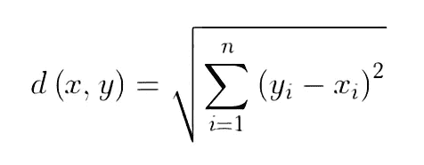
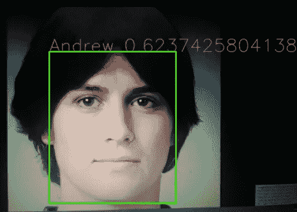

# 使用 Pytorch 和多任务级联卷积神经网络(MTCNN)识别 Sonora 大学计算机科学学生的实时面部识别应用程序

> 原文：<https://towardsdatascience.com/real-time-facial-recognition-application-to-identify-computer-science-students-at-the-university-of-253bc43d7c32?source=collection_archive---------35----------------------->

## 解释和使用，关于我们如何完成我们的工作


来自: [Link de la imagen](https://www.freepik.es/vector-gratis/hombre-cara-escanear-tecnologia-digital-biometrica_5597121.htm#page=1&query=face%20recognition&position=6)

戴安娜·劳拉·巴列斯特罗斯·巴伦苏埃拉、埃利乌德·吉尔贝托·罗德里格斯·马丁内斯、乌戈·弗朗西斯科·卡诺·贝利斯、马丁·何塞·维加·诺列加

索诺拉大学，埃莫西约，索诺拉

[mjvnor@outlook.com](mailto:mjvnor@outlook.com)，[dballesterosvalenzuela@gmail.com](mailto:dballesterosvalenzuela@gmail.com)，slabxcobra@gmail.com，eliud.giroma@gmail.com。

github:[https://github . com/MJVNOR/Real-time-face-recognition-mt CNN/tree/main](https://github.com/MJVNOR/Real-time-facial-recognition-MTCNN/tree/main)

抽象。这个项目的目标是检测埃莫西约索诺拉州索诺拉大学的每个计算机科学学生，以便能够在能够识别他们面部的基础上开展其他项目。在这个项目中，我们使用带有神经网络的图像处理进行面部识别。我们实现了 MTCNN，这是一种检测图像中的人脸和面部标志的神经网络，是当今最准确的工具之一。

关键词:面部识别，神经网络，pytorch

# **1。简介**

使用面部识别及其实现的机构的数量每天都在增加，这是因为它有许多好处，例如识别迷路的人，识别可能的小偷，识别哪些工人在某一天去工作，等等。面部识别是:给定一张“未知”人脸的图像，在一组“已知”图像中找到同一张人脸的图像。

面部识别已经经历了几个取得进展的阶段。我们可以看到以前它只是一个虚构的东西，而今天我们可以在许多应用和地方找到它。

伍德罗·威尔逊·布莱索被认为是这项技术的先驱，因为他在 1960 年研究了一个对人脸特征进行分类的系统，尽管这个过程是非常手工的，但他使用触笔和坐标来精确定位人的眼睛、鼻子或嘴。

今天，我们可以看到面部识别是如何成为人工智能的一部分，使我们能够检测和识别人脸。

在这项工作中，使用了人工智能领域的工具，能够实时识别人脸，并且如果该人脸是我们学生数据集的一部分，则能够识别该人

# **2。提议的工件**

实时面部识别应用。

2.1 内容建模:

我们做的第一件事是使用 MTCNN 网络来生成学生面部的数据集，并让它返回面部确实是面部(每张图像只有一个面部)和面部是张量形式的概率。

```
mtcnn0 = MTCNN(image_size=240, margin=0, keep_all=False, min_face_size=40)
```

我们使用一个默认模型(vggface2)来输入我们的张量数据集，并返回每个人脸的最重要的数据(以矩阵形式)，这称为嵌入。

```
resnet = InceptionResnetV1(pretrained='vggface2'.eval()for img, idx in loader:
    face, prob **=** mtcnn0(img, return_prob**=**True)
    if face **is** **not** None **and** prob**>**0.92:
        emb **=** resnet(face.unsqueeze(0))
        embedding_list.append(emb.detach())
        name_list.append(idx_to_class[idx])data **=** [embedding_list, name_list]
torch.save(data, 'data.pt')
```

在一个循环中，我们访问设备的摄像头以开始我们的识别。我们使用 MTCNN 类型的第二个网络，该网络用于检测是否有人脸(如果检测到人脸，它会在每个人脸周围打印/绘制一个方框)，并给出它确实是人脸的概率，但这一次该网络的输入将是我们相机的帧(澄清该网络可以在每个帧中一次检测多个人脸)。我们再次使用 vggface2 模型来嵌入我们检测到的人脸。

使用保存的人脸嵌入和使用我们相机的帧生成的嵌入，我们计算学生的人脸组与我们在我们的帧中检测到的人脸之间的距离，并且使用最小的距离，我们说这个人脸是某个学生的。

```
load_data **=** torch.load('data.pt')
embedding_list **=** load_data[0]
name_list **=** load_data[1]cam **=** cv2.VideoCapture(0)while True:
    img **=** Image.fromarray(frame)
    if img_cropped_list **is** **not** None:
        boxes, _ **=** mtcnn.detect(img)
        for i, prob in enumerate(prob_list):
            if prob**>**0.90:
                emb **=** resnet(img_cropped_list[i].unsqueeze(0)).detach()
                dist_list **=** [] 
                for idx, emb_db in enumerate(embedding_list):
                    dist **=** torch.dist(emb, emb_db).item()
                    dist_list.append(dist)min_dist **=** min(dist_list)
                min_dist_idx **=** dist_list.index(min_dist) 
                name **=** name_list[min_dist_idx]box **=** boxes[i]
                original_frame **=** frame.copy()if min_dist**<**0.90:frame **=** cv2.putText(frame, name**+**' '**+**str(min_dist), (box[0],box[1]), cv2.FONT_HERSHEY_SIMPLEX, 1, (63, 0, 252),1, cv2.LINE_AA)frame **=** cv2.rectangle(frame, (box[0],box[1]) , (box[2],box[3]), (13,214,53), 2)cv2.imshow("IMG", frame)
```

# 3.MTCNN 是如何工作的

MTCNN 模型是由张、张和智峰在论文“使用多任务级联卷积网络的联合人脸检测和对准”中提出的。该模型的主要目标是检测人脸及其特征，它由三级卷积网络组成。

该模型基于利用多任务学习，以便划分面部和特征的检测任务，因为以多任务方式这样做通过利用包含在相关任务的信号训练中的域特定信息来提高概括，并且这是通过在使用信息的共享表示的同时并行训练任务来完成的。

开始阶段之前的第一步是获取图像，并以不同的比例调整其大小，以建立图像金字塔，这是网络第一部分的入口。

第一阶段包括拥有一个全卷积网络(FCN)，我们用它代替 CNN，因为它的架构中没有密集层。这个建议的网络被用于获得面和它们各自的包围盒。这个网络的输出给了我们所有可能的候选人脸。

在网络的第二阶段，第一阶段的输出被用作 CNN 网络的输入，这被称为“改进网络(R-Net)”，这减少了可能的候选的数量，校准边界框，并且进行非最大抑制(NMS)来联合我们的可能的候选。作为输出，它告诉我们输入是否是一张脸。

最后，第三个非常类似于 R-Net，它给出了候选人眼睛、鼻子和嘴巴的位置。

# 4.我们如何计算距离

我们使用欧几里德距离。欧几里德距离代表平面上两点之间的最小距离，它是两点之间的直线。



*法师作者*

这个距离的计算方法是两个向量的元素之间的平方差之和的平方根，如前面的公式所示。

`dist = torch.dist(emb,emb_db).item()`

我们给这个函数我们正在检测的人脸，我们从我们的数据库中获取每个人脸的距离，从那里我们保存所有的距离并取最短的一个。

# 4.1.检测结果

这个人并不存在，我们把他从 thispersondoesnotexist.com 带来，我们把他放在我们的数据库里，叫他 Andrew 来展示这个程序工作的例子。



“安德鲁”(不存在的人)

正如我们所看到的，程序检测到“Andrew”的距离大约为 0.6237。距离值越低，那个人就越有可能是那个人。

# 5.我们犯的错误和发现的错误

我们发现，当我们在数据库中创建同事面部的嵌入时，一个同事的计算机内存不足，而另一个没有，换句话说，你必须有 1gb 以上的可用内存(ram)。

我们也尝试过实现多线程，结果惨败。

# 6.结论和未来工作

我们可以说，使用 MTCNN 并利用嵌入来获得距离给了我们非常精确的结果(即使每个人的人脸数量很少)，但负面的一面是，当它检测到人脸时，FPS 会降低，当它检测到你是“确定”的人时，FPS 会降低更多。

我们计划更改应用中的某些内容，以尽可能降低 FPS(例如使用除计算距离之外的另一种方法)，并能够为项目添加更多功能，以便与我们自己的同事一起改进和利用技术。

# 参考

1.  张，张，张，李，乔，于(2016)。基于多任务级联卷积网络的联合人脸检测和对齐。IEEE 信号处理快报，23(10)，1499–1503。李普舒茨，s，拉斯李普森，m:集合论:离散数学。麦格劳-希尔公司，第 1–22 页(2007 年)
2.  多任务学习。机器学习 28，41–75(1997)。[https://doi.org/10.1023/A:1007379606734](https://doi.org/10.1023/A:1007379606734)