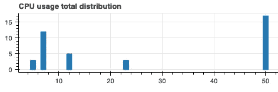
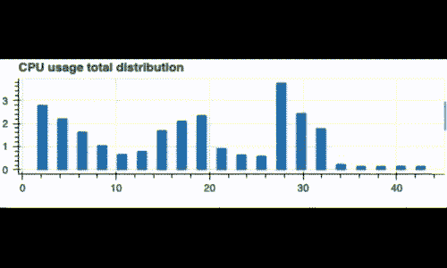

# 无界数据的实时直方图

> 原文：<https://towardsdatascience.com/real-time-histogram-plots-on-unbounded-data-9948892c29a4?source=collection_archive---------23----------------------->

## 使用动态图表在笔记本电脑中监控您的流数据


阿迪·戈尔茨坦在 [Unsplash](https://unsplash.com/s/photos/audio-mixing-console?utm_source=unsplash&utm_medium=referral&utm_content=creditCopyText) 上拍摄的照片。作者的所有其他数字。

每个人的数据科学工具箱都包含一些基础工具。我们系统地使用它们，直到我们认为它们的使用是理所当然的。直方图就是其中之一。我们在探索阶段、在选择模型之前验证数据分布类型期间以及许多其他事情中使用它们进行可视化(有时甚至没有意识到)。不幸的是，对于大多数库来说，对实时数据使用直方图是不可能的。

人们通常对像 CSV 数据集这样的有界数据使用直方图。但是计算直方图的传统方法不适用于无界/流数据。这是因为算法需要遍历数据集的所有元素。在本文中，您将学习如何动态计算和更新直方图。实时发出的数据。

这里的实际例子是监视一段时间内系统的 CPU 使用情况。我们将实时计算并绘制 CPU 使用率的直方图，可能是在无限长的时间内。不过，正如您将看到的，这需要很少的内存。

为此，我们将在一个笔记本中使用三个 python 包:

*   [psutil](https://github.com/giampaolo/psutil) 检索机器的 CPU 使用率
*   [散景](https://bokeh.org/)绘制直方图并更新
*   [制作](https://www.makinage.org/)计算直方图

让我们首先用 pip 安装它们:

```
pip install psutil, bokeh, makinage
```

对于本文的所有代码，我们需要几个导入:

```
from collections import namedtuple
import time
from datetime import datetime
import ipywidgets as widgets
from bokeh.plotting import figure, ColumnDataSource
from bokeh.io import output_notebook, push_notebook, show

import psutil
import rx
import rx.operators as ops
import rxsci as rs
```

# 生成 CPU 使用流

我们首先需要生成要分析的数据。我们将创建包含时间戳和每 100 毫秒测量的 CPU 使用率的项目。我们首先为这些项目定义一个数据结构:

```
CpuMeasure = namedtuple ( "CpuMeasure" , [ 'timestamp' , 'value' ])
```

然后我们可以将这些项目作为数据流发出。我们为此使用制造方法。Maki-Nage 是一个基于[react vex](https://github.com/reactivex/rxpy)的流处理框架。为了生成源流，我们直接使用 ReactiveX:

```
def create_cpu_observable(period=.1):
    return rx.timer(duetime=period, period=period).pipe(
        ops.map(lambda i: CpuMeasure(
            int(datetime.utcnow().timestamp()),
            psutil.cpu_percent()
        ))
    )
```

这个函数的结果是一个流对象。这就是所谓的可观测量。这个可观察对象每 100 毫秒(0.1 秒)发出一个 CpuMeasure 对象。

# 绘制和更新条形图

下一步是准备实时图。我们想要绘制一个已经计算过的直方图，所以我们需要一个柱状图。所以我们在这里使用一个散景窗口小部件。这个数字是刚刚初始化的，暂时没有数据。

```
source_cpu_total = ColumnDataSource(
    data={'edges': [], 'values': []}
)

p_cpu_total = figure(
    title="CPU usage total distribution",
    plot_width=500, plot_height=150
)
p_cpu_total.vbar(
    x='edges', top='values', width=1.0,
    source=source_cpu_total
)

outw = widgets.Output()
display(outw)

with outw:
    h_cpu_total = show(p_cpu_total, notebook_handle=True)
```

稍后，我们将通过将 *source_cpu_total* 对象设置为其他值来更新绘图。*边缘*字段对应于直方图仓，*值*字段对应于每个仓中的项目数。

我们可以将图形更新步骤封装在一个专用函数中:

```
def update_histogram(graph_id, source, histogram):
    edges, values = zip(*histogram)
    source.data = {
        'edges': edges,
        'values': values,
    }
    push_notebook(handle=graph_id)
```

这里 *graph_id* 是散景图对象， *source* 是散景数据源， *histogram* 是预先计算的直方图。

我们现在可以通过使用假值来测试这段代码:

```
update_histogram(
    h_cpu_total, source_cpu_total,
    [(5, 3), (7, 12), (12, 5), (23, 3), (50, 17)]
)
```

结果看起来像这样:



# 计算直方图

既然数据源和图表已经可用，我们就可以计算实际的直方图了。Maki Nage 实现了 Ben-Haim 等人在论文[A Streaming Parallel Decision Tree Algorithm](https://jmlr.org/papers/volume11/ben-haim10a/ben-haim10a.pdf)中定义的分布式压缩算法。这也是在 Apache Hive[histogram _ numeric](https://github.com/apache/hive/blob/7b3ecf617a6d46f48a3b6f77e0339fd4ad95a420/ql/src/java/org/apache/hadoop/hive/ql/udf/generic/NumericHistogram.java#L30)函数上实现的算法。

该算法的原理是将数据分布压缩为动态直方图:当新数据进入时，该直方图的条块边缘被动态调整，但是条块的数量在创建时被设置。从这个压缩的表示中，可以非常精确地计算不同度量的近似值:

*   意思是
*   方差，标准偏差
*   分位数
*   柱状图

由于压缩分布的大小是固定的，所以它非常节省内存，并且完全独立于分布的基数:无论输入数据集的大小如何，您只需要 100 个字节来压缩分布！

为了填充压缩的分布，我们使用了 [math.dist.update](https://www.makinage.org/doc/rxsci/latest/operators_math.html#rxsci.math.dist.update) 操作符。

虽然这种压缩表示是直方图，但它不能直接用作可显示的直方图:每个条柱都有唯一的宽度，并且条柱的数量可能比您想要显示的要多得多。所以我们使用另一个操作符从压缩的分布中计算直方图: [math.dist.histogram](https://www.makinage.org/doc/rxsci/latest/operators_math.html#rxsci.math.dist.histogram) 。

整个计算和显示由 10 行代码组成:

```
create_cpu_observable().pipe(
    rs.state.with_memory_store(pipeline=rx.pipe(
        rs.ops.map(lambda i: i.value),
        rs.math.dist.update(),
        rs.math.dist.histogram(bin_count=20),
        rs.ops.map(lambda i: (h_cpu_total, source_cpu_total, i))
    )),
).subscribe(
    on_next=lambda i: update_histogram(*i),
)
```

让我们分解这些线。

首先，我们创建 CPU 使用率的可观察值。然后，我们对其应用操作管道。这些是按顺序应用于每个项目的数据转换。有状态操作需要状态存储。这是存储所有中间计算的位置。我们用 *with_memory_store* 操作符进行配置。

下一步是提取每个项目的价值。在第一个例子中，我们不需要时间戳，所以我们通过*映射*操作符来处理*值*字段。

接下来的两个步骤包括更新分布和为每个输入项目计算 20 个箱的直方图。

最后，用绘制直方图所需的参数创建一个元组。在 *on_next* 回调中，直方图被绘制为该管道的接收器。

运行此代码会显示 CPU 利用率的实时直方图:



# 双重监控

现在，如果我们想从一开始就监控我们的系统，并查看其最近的状态(如最近 3 分钟)，该怎么办？我们可以通过计算两个分布来做到这一点:一个是全局分布，另一个是最近 3 分钟内的分布。

为此，我们首先将计算转移到一个专用函数，以便我们可以重用它:

```
def compute_histogram(graph_id, source):
    return rx.pipe(
        rs.ops.map(lambda i: i.value),
        rs.math.dist.update(),
        rs.math.dist.histogram(bin_count=20),
        rs.ops.map(lambda i: (graph_id, source, i))
    )
```

那么我们必须并行计算这两个直方图。我们在这里使用了两个以上的操作符。

第一个是 [tee_map](https://www.makinage.org/doc/rxsci/latest/operators_other.html?highlight=tee_map#rxsci.ops.tee_map) 操作符。该操作符将一个源可观测数据转发给几个管道，以便几个计算并行发生。

第二个是[拆分](https://www.makinage.org/doc/rxsci/latest/operators_data.html?highlight=split#rxsci.data.split)操作符。它将源可观测性分割为 3 分钟的窗口。这允许每三分钟重置一次直方图，并且只显示最近的数据。

```
disposable = create_cpu_observable().pipe(
    rs.state.with_memory_store(pipeline=rx.pipe(
        rs.ops.tee_map(
            # unbounded distribution
            compute_histogram(h_cpu_total, source_cpu_total),
            # bounded distribution of 3 minutes
            rs.data.split(
                predicate=lambda i:
                    i.timestamp - (i.timestamp % 180),
                pipeline=compute_histogram(
                    h_cpu_recent, source_cpu_recent
                ),
            ),
            join="merge",
        )
    )),
).subscribe(
    on_next=lambda i: update_histogram(*i),
)
```

随着图形创建的更新，这将实时更新两个直方图。

这些例子的全部代码可在[这里](https://github.com/maki-nage/makinage-examples/tree/master/notebook/cpu_usage.ipynb)获得。

# 更进一步

这里提出的算法也适用于分布式系统:分布的压缩表示是可合并的。当您将一个计算分配给几个工作人员时，这尤其有用。人们可以通过合并所有部分表示来聚集最终结果。

也可以在任何 python 环境中使用该算法。Maki Nage 实现在一个名为 [distogram](https://github.com/maki-nage/distogram) 的专用包中，并且没有依赖性。

最后，如果您想了解更多关于流处理的知识，您可以阅读我在 Maki-Nage 上写的另一篇介绍文章。

*原载*于 [KDnuggets](https://www.kdnuggets.com/2021/09/real-time-histogram-plots-unbounded-data.html) *。*