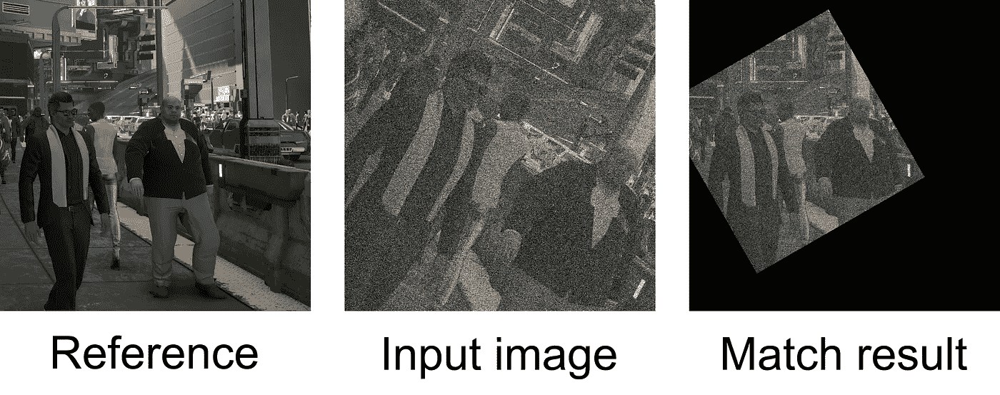
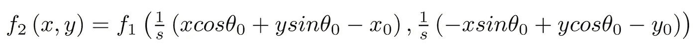
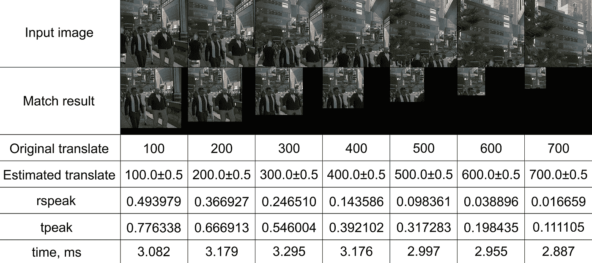
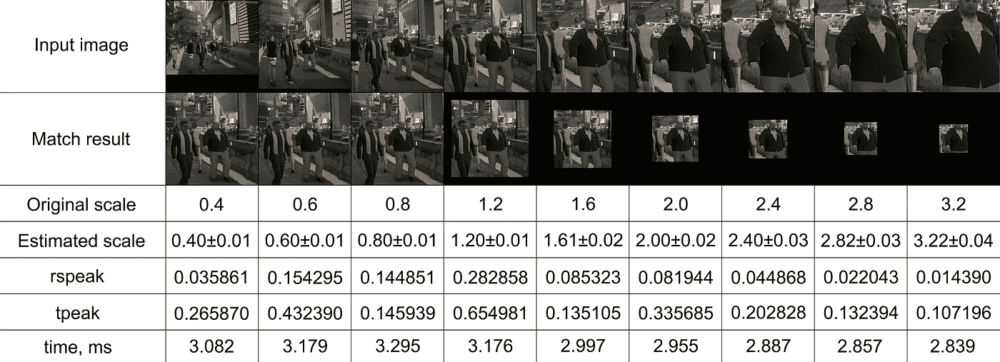
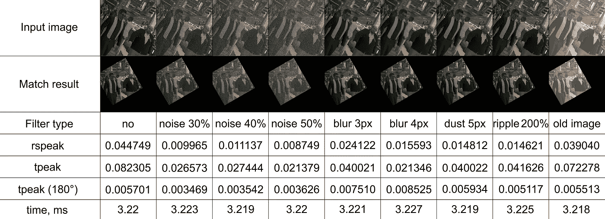

# 基于 VkFFT 库的 GPU 实时图像配准

> 原文：<https://towardsdatascience.com/real-time-image-registration-on-gpu-with-vkfft-library-c4e47f8050a0?source=collection_archive---------35----------------------->

## 如何用快速傅立叶变换检测图像的平移、旋转和缩放

文章中所有图片均由作者根据赛博朋克 2077 游戏截图制作

# 图像配准问题概述

图像配准是计算机视觉和图像处理中的一个重要问题。如果我们有同一个物体的两个图像，这个问题可以表述为:我们如何确定一个坐标系变换，使我们能够匹配显示的物体？

有多种方法可供选择。基于相关性的方法通过比较像素值来匹配整个图像或子图像。基于特征的方法检测和匹配在两个图片上表示对象的相同部分的控制点。本文介绍了一种相关方法的 GPU 实现，该方法在快速傅立叶变换后在频域中操作，在论文[1]中提出。通过使用 GPU 开发的最新进展和定制的高度优化的 FFT 库[2],有可能将匹配所需的时间从几分钟减少到几毫秒，从而实现算法的实时使用。

# 基于 FFT 的图像识别是如何工作的？

傅立叶域中的操作允许利用它的许多奇妙特性。例如，让我们定义两个图像，其中一个是另一个的简单平移(x0，y0):

在傅立叶域中，这个关系看起来像:

这一事实被称为傅立叶变换定理，允许计算两幅图像的交叉功率谱，在每一点定义为:

这里*表示复共轭。如果我们对此频谱进行逆 FFT，我们将在位置(x0，y0)获得一个单一峰值，这可以通过应用最大化程序轻松确定。上述方法也称为相位相关法。

文献[1]提出了这种方法的扩展，以涵盖旋转和缩放变换。它基于傅立叶变换的另一个特性——傅立叶变换的幅度是平移不变的:

现在让我们定义两个图像，其中一个是另一个图像的平移(x₀，y₀)、旋转(θ₀)和缩放因子 s 的组合:

如果我们现在切换到极坐标:

图像傅立叶变换的幅度可以改写为:

如果我们将对数变换应用于ρ:

我们得到对数极坐标系统中的量值的以下表示:

可以看出，在这个坐标系中，通过θ₀旋转和通过因子 s 缩放变成了简单的平移。因此，应用已经定义的相位相关过程，我们可以确定这两个参数。预先从幅度切换到幅度的对数也是有利的。

如果我们以更高的分辨率旋转和缩放图像，我们可以用另一个相位相关步骤来确定平移。注意:这种方法不能区分θ₀角和 180° +θ₀.为此，我们简单地用 180°+θ₀角进行另一步平移匹配，并选择具有最高峰值的角度。

这种方法目前的局限性是缩放在两个轴上都是一致的，并且图像必须是正方形的(或者填充到正方形)。

# **GPU 能带来什么？**

GPU 在计算能力、数据传输速度和可用内存大小方面的最新进展使其对通用用途极具吸引力，扩展了其原始渲染和可视化目标任务。GPU 中使用的单指令-多线程(SIMT)设计方法已被证明在数据级并行任务中极其有效。其中一个任务是多维 FFT，它是相位相关方法的核心。

这个项目是通过 Vulkan API 的方式实现的(与 Nvidia 的 CUDA 相反，后者通常用于数据科学)。它大量使用了[vkft 库](https://github.com/DTolm/VkFFT)(也是作者开发的)。VkFFT 是 Vulkan 中的一个开源的跨平台快速傅立叶变换库，性能优于专有的 Nvidia 的 cuFFT 库。

由于不依赖于专有的黑盒解决方案，优化应用程序布局的每一个小部分都是可能的，这将在下一节讨论。

# **算法的 GPU 实现**

平移、旋转和缩放检测的完整算法可以总结为以下命令列表:

1.  两幅图像的正向 FFT
2.  对数量值到对数极坐标系统的转换
3.  两个图像的对数幅度的对数极坐标表示的正向 FFT
4.  互功率谱计算
5.  对数极坐标互功率谱的逆 FFT
6.  最大化减少例程，以确定角度和比例因子
7.  具有最高分辨率的图像的旋转和缩放
8.  旋转图像的 FFT
9.  互功率谱计算
10.  互功率谱的逆 FFT
11.  最大化器减少例程以确定翻译
12.  步骤 7–11，180°+θ₀角，解决角度的 180°不确定性
13.  输入图像的最终旋转、缩放和平移

操作总量:图像大小的 6 倍 FFT 和对数极坐标系统大小的 3 倍 FFT，3 倍交叉幂计算，3 倍最大化器减少例行启动，3 倍旋转/缩放/平移转换合并在一次操作中。所有操作都在三个颜色通道上执行。也可以在对数极坐标系统中使用不同的系统尺寸。

我们来测试一下算法性能。测试将包括四个部分。首先，我们将分别测试平移、旋转和缩放，以确定正确检测的范围。然后，我们将继续进行所有的转换，并结合额外的外部过滤器应用于输入图像。

测试将在 Nvidia 1660Ti GPU 上进行。对数极坐标系统大小设置为 512 px 512 px。参考图片是游戏《赛博朋克 2077》中一个 1024 像素 x 1024px 像素的截图:

# **平移变换**

该测试检查图像可以沿对角线移动多远的范围，以便仍然与参考匹配。rspeak 和 tpeak 是 maximizer reduce 例程检测到的峰值，如果我们将参考图像与其自身进行匹配，则它们等于 1.0。可以看出，基于 FFT 的图像识别可以精确匹配翻译系统，直到重叠小到图像大小的 30%。

GPU 执行所有 13 个匹配步骤所需的时间约为 3.3 毫秒。偏差主要受旋转/缩放/平移例程的影响，因为将颜色设置为黑色(针对缺失数据)不需要额外的内存传输。

GPU 上的 FFT 是带宽受限的问题。这使得所有旨在减少从 GPU 内存转移到芯片的内存量的优化变得非常重要。图像 FFT 的 6 倍步长是利用 VkFFT 中实现的实数到复数优化来执行的，这将存储图像所需的内存减少了一半。FFT 以单精度完成。每个 FFT 仍然需要两次上传到芯片，两次从芯片下载到 GPU 存储器，因为我们有两个轴。我们还有三种颜色，分别处理。每个图像 FFT 在芯片和 VRAM 之间传输的内存总量等于 50MB。对数极坐标 FFT 的分辨率较小，需要 24MB 的存储器传输。传输的总内存为 6x50+3x24=372MB。1660Ti 的理论带宽是 288GB/s，如果只按这个速率传输数据，至少需要 1.26ms。的确，如果我们只用 VkFFT 做 FFT(不考虑算法的其他部分)，总用时会是~1.70ms，接近得到的理论值。

通过使用 Vulkan 中的子组功能，可以有效地进行缩减。减少所需的内存传输量接近系统大小(我们通过比较 1024 个线程存储的 1024 个数字来减少，因此在每次启动例程时，比较的数字量会减少 1024 倍)。传输的内存总量约为 32MB，以理论带宽传输需要 0.11 毫秒。测量的计时显示，计算算法中的所有缩减需要 0.14 毫秒。

计算一个互功率谱需要两次系统上传(带颜色)和一次从芯片下载(不带颜色)。该算法有两个这样的计算来确定平移，一个用于对数功率谱。这总共需要 75MB，可以在 0.25ms 内完成。测量的时间表明，在该算法中计算互功率谱需要 0.36ms。

对数极坐标系统转换的计算也需要两次上传系统(带颜色)和两次下载(带颜色)。这总共需要 50MB，可以在 0.17ms 内完成。测得的计时显示，在算法中计算转换需要 0.22ms。

旋转/缩放/平移例程占用剩余的时间(0.5-0.9 毫秒)，并使用双线性插值。这个例程没有进行优化以最小化内存传输和合并，因此它的时间在不同的角度和规模之间会有很大的不同，正如在接下来的测试中可以看到的那样。

总的来说，中程 GPU 上的 3 毫秒范围适用于现实生活中的图像处理，并有望与 GPU 的带宽成线性比例关系。关于上一代 AMD GPUs 的 L3 缓存，还有一点值得注意。整个系统可以在执行期间存储在那里，充分利用其速度(这在 VkFFT 基准测试中得到验证)。

# 旋转变换

该测试检查算法是否可以检测 0°到 360°范围内的所有角度。可以看出，基于 FFT 的图像识别可以检测整个范围内的旋转。在这里，未优化的双线性插值甚至比 FFT 需要更多的时间，这表明优化对 GPU 编程是多么重要。

# 缩放变换

该测试检查算法可以检测的缩放变换的范围。可以看出，基于 FFT 的图像识别可以在参考图像的 0.4x 到 3.2x 的大范围内检测缩放。时间上的差异再一次被解释为，将颜色设置为黑色(对于丢失的数据)不需要额外的内存传输。

# 平移+旋转+缩放+过滤

该测试通过应用除外部过滤器之外的所有支持的检测转换，将算法推向极限，使图像失真。它将用于确定 rspeak 和 tpeak 的有效条件。

首先，在没有滤镜的情况下，图像经历了以下变换:对角平移 200px(左上方向)，然后围绕中心顺时针旋转 30 °,缩放因子为 1.6。

然后应用以下测试:

1.  高斯噪声—高达图像的 50%
2.  高斯模糊—直到 4px 模糊
3.  灰尘和刮痕滤镜(不同的模糊滤镜)—工作到 5px 模糊
4.  波纹滤镜(以类似波浪的方式扭曲图像)—工作到 200%
5.  旧图像过滤器(更改调色板)

可以看出，基于 FFT 的图像配准提供了非常好的噪声和模糊鲁棒性。测试还表明，该算法是成功还是失败的一个好的度量可以是 tpeak 与 180°旋转图像的 tpeak 的比较，用于消除角度的 180°不确定性。在所有成功的测试中，正确的 tpeak 至少比另一个值大两倍(通常大一个数量级)，而在所有失败的测试中，它们的值是相当的。

# 结论

本文提出了一种基于 FFT 的图像配准算法(在论文[1]中首次提出)的 GPU 实现，该算法可以匹配平移、旋转和缩放的图像。该算法对噪声和模糊具有鲁棒性，可以在中程 GPU 上在 3 毫秒内执行两个 1024px x 1024px 图像的匹配，这允许实时使用。该算法是在 Vulkan API 的帮助下编写的，不依赖于专有软件。它使用 VkFFT 库[2]作为核心模块。Vulkan API 支持的平台非常广泛，使得算法实现可以跨平台。

配准精度已经在许多不同的变换和滤波器上进行了测试。到目前为止，该算法实现支持重叠小至图像大小的 30%的平移、完整的 360°旋转范围以及从参考图像大小的 0.4 到 3.2 倍的缩放。

一种基于 tpeak 比较确定结果有效性的新方法在各种过滤器上进行了测试。

通过应用不同的频率滤波器、开窗、使用子像素检测技术、不同的插值技术以及对数极坐标转换的进一步实验，可以进一步提高基于 FFT 的图像配准的精度。

# 参考

[1] B. Srinivasa Reddy 和 B. N. Chatterji，[一种基于 FFT 的平移、旋转和尺度不变图像配准技术](https://semanticscholar.org/paper/6dfe0a0173f8b2087bc052108184f65299f1b605) (1996)，IEEE 图像处理汇刊。5 (8): 1266–1271

[2] D .托尔马切夫， [VkFFT — Vulkan 快速傅立叶变换库](https://github.com/DTolm/VkFFT) (2020)，GitHub