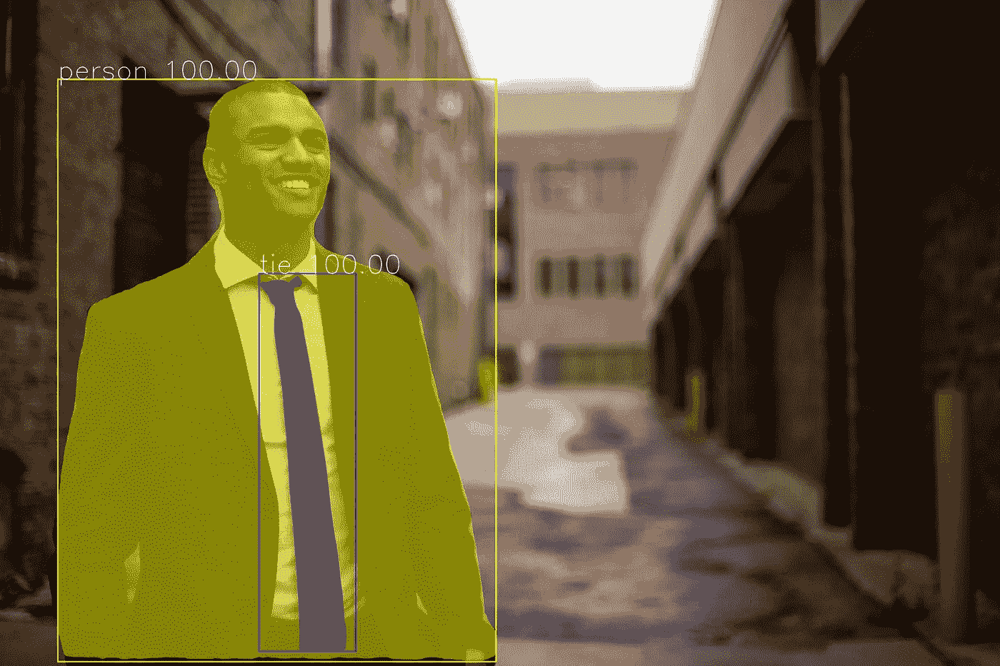

# 使用 5 行代码的实时图像分割

> 原文：<https://towardsdatascience.com/real-time-image-segmentation-using-5-lines-of-code-7c480abdb835?source=collection_archive---------3----------------------->

## [实践教程](https://towardsdatascience.com/tagged/hands-on-tutorials)

## 使用 PixelLib 在图像和视频中执行准确快速的对象分割


[原始视频来源](https://www.pexels.com/video/cabs-passing-through-the-streets-of-new-york-city-5834623/)

## 目录

1.  [**图像分割在计算机视觉中的应用**](https://medium.com/p/7c480abdb835#9208)
2.  [**图像分割**](https://medium.com/p/7c480abdb835#d968)
3.  [**批量图像分割**](https://medium.com/p/7c480abdb835#42f1)
4.  [**视频分割**](https://medium.com/p/7c480abdb835#eaae)
5.  [**摄像机画面分割**](https://medium.com/p/7c480abdb835#bbf8)

## **图像分割在计算机视觉中的应用**

计算机视觉是计算机看到并分析他们所看到的东西的能力。图像分割是计算机视觉的一个方面，它处理将计算机可视化的对象的内容分割成不同的类别以便更好地分析。图像分割过程的一个很好的例子是图像中对象的前景-背景分离，这是一种将对象从其背景中分离出来以分析对象及其背景的技术。图像分割实现前景和背景分离的能力使其在解决许多计算机视觉问题中具有不可估量的价值，例如医学图像分析、背景编辑、自动驾驶汽车中的视觉和卫星图像分析。

PixelLib 库是一个使用几行 python 代码就可以轻松集成图像和视频中的对象分割的库。它支持许多惊人的功能，例如:

1.  图像和视频中对象的语义和实例分割。
2.  细分模型的定制训练。
3.  图像和视频中的背景编辑。
4.  图像和视频中物体的提取。

## 对实时图像分割应用的需求

计算机视觉中最大的挑战之一是在实时应用的准确性和速度性能之间保持平衡。在计算机视觉领域，存在计算机视觉解决方案要么更精确和更慢，要么不太精确和更快的两难境地。之前版本的 PixelLib 使用 tensorflow 深度学习库作为其后端，该库采用 Mask R-CNN 来执行实例分割。Mask R-CNN 是一个很好的架构，但是无法在实时应用的准确性和速度性能之间取得平衡。我太兴奋了😊宣布 PixelLib 现在支持 pytorch 后端使用***point rende***分割架构对图像和视频中的对象进行更快、更准确的分割和提取。 ***PointRend*** 由[亚历山大·基里洛夫等人](https://arxiv.org/abs/1912.08193)提出的对象分割架构用于代替 Mask R-CNN 进行对象的实例分割。 ***PointRend*** 是一个用于实现对象分割的优秀的艺术级神经网络。它生成精确的分割模板，并以高推理速度运行，以满足日益增长的对精确和实时计算机视觉应用的需求。

## 多操作系统支持

> *PixelLib 是一个为不同操作系统提供支持的库。我将 PixelLib 与 python 实现的*[***point rend by detectron 2***](https://github.com/facebookresearch/detectron2/tree/main/projects/PointRend)**集成，后者只支持 Linux OS。**

> *我对最初的 Detectron2 PointRend 实现进行了修改，以支持 Windows 操作系统。我很高兴告诉大家一个好消息，用于 PixelLib 的 PointRend 实现支持 Linux 和 Windows 操作系统。*

****

***面具 R-CNN** vs **点趋势** ( [来源](https://unsplash.com/photos/6UWqw25wfLI))*

****

****面具 R-CNN*** vs **点趋势** ( [来源](https://unsplash.com/photos/rrI02QQ9GSQ))*

> *上面的样本图像是 ***点趋势*** 的分割结果与掩模 RCNN 相比的差异的例子。很明显，右边的 ***点趋势*** 图像结果与左边的掩模 R-CNN 结果相比是更好的分割输出。*

***注意:**本文基于使用 pytorch 和 ***PointRend*** 执行实例分割。如果您想了解如何使用 tensorflow 和 Mask R-CNN 执行实例分割，请阅读下面的这篇文章:*

*[](/image-segmentation-with-six-lines-0f-code-acb870a462e8) [## 用 5 行代码实现图像分割

towardsdatascience.com](/image-segmentation-with-six-lines-0f-code-acb870a462e8) 

## **下载 Python**

PixelLib pytorch 版本支持 python 版本 3.7 及以上。下载兼容的 python 版本。

[](https://www.python.org/) [## 欢迎来到 Python.org

### Python 编程语言的官方主页

www.python.org](https://www.python.org/) 

## **安装 PixelLib 及其依赖项**

**安装 Pytorch**

PixelLib Pytorch 版本支持 Pytorch 的这些版本(**、T21【1 . 6 . 0、1.7.1、1.8.0 和 1.9.0 、T23)。**

**注意:**Pytorch***1 . 7 . 0***不受支持，请勿使用任何低于 ***1.6.0*** 的 py torch 版本。安装兼容的 Pytorch 版本。

[](https://pytorch.org/) [## PyTorch

### 推动自然语言处理和多任务学习的发展。利用 PyTorch 的灵活性有效地研究新的…

pytorch.org](https://pytorch.org/) 

**安装 Pycocotools**

*   *pip3 安装 pycocotools*

**安装 PixelLib**

*   *pip3 安装 pixellib*

**如果已安装，使用**升级至最新版本:

*   *pip3 安装 pixellib —升级*

# 图象分割法

PixelLib 使用五行 python 代码，用 ***PointRend*** 模型在图像和视频中进行对象分割。下载 [***点趋势模型***](https://github.com/ayoolaolafenwa/PixelLib/releases/download/0.2.0/pointrend_resnet50.pkl) 。这是图像分割的代码。

**第 1–4 行:** PixelLib 包被导入，我们还从模块***PixelLib . torch backend . instance***中导入了类***instance segmentation****(从 pytorch 支持中导入实例分割类)。我们创建了该类的一个实例，最后加载了我们已经下载的***point rende***模型。*

***第 5 行:**我们调用函数 ***segmentImage*** 对图像中的物体进行分割，并为函数添加了以下参数:*

*   ****image_path:*** 这是待分割图像的路径。*
*   ****show_bbox:*** 这是一个可选参数，用边界框显示分割结果。*
*   ****输出图像名称:*** 这是保存的分割图像的名称。*

***用于分割的样本图像***

**

*[来源](https://commons.wikimedia.org/wiki/File:Carspotters.jpg)*

```
*ins.segmentImage("image.jpg",output_image_name="output.jpg")*
```

***分割后的图像***

**

```
*The checkpoint state_dict contains keys that are not used by the model: proposal_generator.anchor_generator.cell_anchors.{0, 1, 2, 3, 4}*
```

> *如果您运行分段代码，上面的日志可能会出现！这不是一个错误，代码将正常工作！*

## ***获取分割结果***

```
*results, output = ins.segmentImage("image.jpg", show_bboxes=True, output_image_name="result.jpg")
print(results)* 
```

*分割结果返回一个字典，该字典具有许多与图像中被分割的对象相关联的值。打印的结果将采用以下格式:*

```
*{'boxes':  array([[ 579,  462, 1105,  704],
       [   1,  486,  321,  734],
       [ 321,  371,  423,  742],
       [ 436,  369,  565,  788],
       [ 191,  397,  270,  532],
       [1138,  357, 1197,  482],
       [ 877,  382,  969,  477],),'class_ids': array([ 2,  2,  0,  0,  0,  0,  0,  2,  0,  0,  0,  0,  2, 24, 24,2,  2,2,  0,  0,  0,  0,  0,  0], dtype=int64), 'class_names': ['car', 'car', 'person', 'person', 'person', 'person', 'person', 'car', 'person', 'person', 'person', 'person', 'car', 'backpack', 'backpack', 'car', 'car', 'car', 'person', 'person', 'person', 'person', 'person', 'person'], 'object_counts': Counter({'person': 15, 'car': 7, 'backpack': 2}), 'scores': array([100., 100., 100., 100.,  99.,  99.,  98.,  98.,  97.,  96.,  95.,95.,  95.,  95.,  94.,  94.,  93.,  91.,  90.,  88.,  82.,  72.,69.,  66.], dtype=float32), 'masks': array([[[False, False, False, ..., False, False, False],[False, False, False, ..., False, False, False],'extracted_objects': []*
```

## ***上面打印的结果值包括:***

```
*{'boxes': array([[5.790e+02, 4.620e+02, 1.105e+03, 7.050e+02],[1.000e+00, 4.870e+02, 3.220e+02, 7.340e+02],[1.142e+03, 3.640e+02, 1.161e+03, 4.060e+02]], dtype=float32),*
```

***框:**这些是被分割对象的边界框坐标。我没有显示所有盒子的坐标，这是因为列表太长了。*

```
*'class_ids': array([ 2,  2,  0,  0,  0,  0,  0,  2,  0,  0,  0,  0,  2, 24, 24,2,  2,2,  0,  0,  0,  0,  0,  0], dtype=int64),*
```

***类标识:**这些是被分割对象的类标识。*

```
*'class_names': ['car', 'car', 'person', 'person', 'person', 'person', 'person', 'car', 'person', 'person', 'person', 'person', 'car', 'backpack', 'backpack', 'car', 'car', 'car', 'person', 'person', 'person', 'person', 'person', 'person'],*
```

***类名:**这些是被分割对象的类名。*

```
*'object_counts': Counter({'person': 15, 'car': 7, 'backpack': 2}),*
```

***object_counts:** 这些是图像中分割的每个类别的计数。我使用了 **python 内置的计数器**来计数对象。在这种情况下，图像中分割出了 ***15 个人******7 辆汽车*** 和 ***2 个背包*** 。*

```
*'scores': array([100., 100., 100., 100.,  99.,  99.,  98.,  98.,  97.,  96.,  95.,95.,  95.,  95.,  94.,  94.,  93.,  91.,  90.,  88.,  82.,  72.,69.,  66.], dtype=float32),*
```

***分数:**这些是每个被分割对象的置信度分数。*

```
*'masks': array([[[False, False, False, ..., False, False, False],[False, False, False, ..., False, False, False],*
```

***遮罩:**这些是每个被分割对象的遮罩值。我没有显示所有的掩码值，这是因为列表太长了。*

***注:**返回的掩码默认值以 bolean 为单位。通过使用新的参数 ***mask_points_values，可以获得掩模的坐标。****

```
*ins.segmentImage("sample.jpg", show_bboxes=True, mask_points_values=True,  output_image_name="output.jpg")*
```

****mask _ points _ values***参数被添加到 ***segmentImage*** 函数并设置为 ***True*** ，新的遮罩值将为:*

```
*[[array([[295, 497]])
  array([[422, 114], 
       [421, 115],   
       [417, 115],
       ...,
       [436, 115],
       [433, 115],
       [432, 114]])]]*
```

***extracted_objects:** 如果我们提取对象，这是提取对象值的容器列表。它是空的，因为我们没有提取任何东西。我们将在本文后面讨论如何提取这些分割对象。*

```
*results, output = ins.segmentImage("image.jpg", show_bboxes=True, output_image_name="result.jpg")*
```

## ***访问由分割结果呈现的值***

***包围盒坐标值***

```
*results["boxes"]*
```

***类 id 值***

```
*results["class_ids"]*
```

***类名值***

```
*results["class_names"]*
```

***对象计数值***

```
*results["object_counts"]*
```

***屏蔽值***

```
*results["masks"]*
```

## ***检测阈值***

*PixelLib 使得确定对象分割的检测阈值成为可能。*

```
*ins.load_model("pointrend_resnet50.pkl", confidence = 0.3)*
```

***置信度:**这是 ***load_model*** 函数中引入的一个新参数，设置为 ***0.3*** 来阈值检测 ***30%*** 。我为检测阈值设置的默认值是 ***0.5*** ，可以使用 ***置信度*** 参数增加或减少。*

## ***速度记录***

*PixelLib 使实时对象分割成为可能，并增加了调整推理速度以适应实时预测的能力。使用 4GB 容量的 Nvidia GPU 处理单幅图像的默认推理速度约为 ***0.26 秒*** 。*

***速度调整:***

*PixelLib 支持速度调节，有两种速度调节模式，分别是**和 ***快速*** 模式:***

****1 快速模式****

```
**ins.load_model("pointrend_resnet50.pkl", detection_speed = "fast")**
```

**在****load _ model****函数中，我们添加了参数***detection _ speed***并将值设置为 ***fast*** 。 ***快速*** 模式处理单幅图像达到 ***0.20 秒*** 。****

****快速模式检测的完整代码****

****2 快速模式****

```
**ins.load_model("pointrend_resnet50.pkl", detection_speed = "fast")**
```

**在 ***load_model*** 函数中，我们添加了参数***detection _ speed***，并将值设置为 ***rapid*** 。 ***快速*** 模式处理单幅图像达到*0.15 秒。***

*****快速模式检测的完整代码*****

## ***点趋势模型***

***用于对象分割的点趋势模型有两种，分别是 ***resnet50 变体*** 和 ***resnet101 变体*** 。本文通篇使用的是 ***resnet50 变体*** ，因为它速度更快，准确性更好。 ***resnet101 变型*** 比 ***resnet50 变型*** 更精确但速度慢。根据 Detectron2 上的[官方报道](https://github.com/facebookresearch/detectron2/tree/main/projects/PointRend)车型 ***resnet50 变种*** 在 COCO 上实现 ***38.3 贴图****resnet 101 变种*** 在 COCO 上实现 ***40.1 贴图*** 。*****

****resnet 101 的速度记录:**默认速度为 ***0.5 秒*，*快速*** 模式为 ***0.3 秒*** 而 ***快速*** 模式为 ***0.25 秒*** 。**

****resnet 101 变体的代码****

```
**ins.load_model("pointrend_resnet101.pkl", network_backbone = "resnet101")**
```

**与 ***resnet101*** 模型执行推理的代码是一样的，除了我们在 ***load_mode* l** 函数中加载了***point rend******resnet 101 模型*** 之外。从[这里](https://github.com/ayoolaolafenwa/PixelLib/releases/download/0.2.0/pointrend_resnet101.pkl)下载 **resnet101 型号**。我们还增加了一个额外的参数***network _ backbone***，并将值设置为 ***resnet101*** 。**

****注:**如果想达到高推理速度和良好的准确性，使用***point rende resnet 50 变体*** ，但如果更在意准确性，则使用***point rende resnet 101 变体*** 。所有这些推断报告都是基于使用 4GB 容量的 Nvidia GPU。**

## **图像分割中的自定义对象检测**

**使用的 ***PointRend*** 模型是一个预训练的 COCO 模型，支持 80 类对象。PixelLib 支持自定义对象检测，这使得过滤检测和确保目标对象的分割成为可能。我们可以从支持的 80 类对象中进行选择，以匹配我们的目标。这些是 80 类受支持的对象:**

```
**person, bicycle, car, motorcycle, airplane,bus, train, truck, boat, traffic_light, fire_hydrant, stop_sign,parking_meter, bench, bird, cat, dog, horse, sheep, cow, elephant, bear, zebra,giraffe, backpack, umbrella, handbag, tie, suitcase, frisbee, skis, snowboard,sports_ball, kite, baseball_bat, baseball_glove, skateboard, surfboard, tennis_racket,bottle, wine_glass, cup, fork, knife, spoon, bowl, banana, apple, sandwich, orange,broccoli, carrot, hot_dog, pizza, donut, cake, chair, couch, potted_plant, bed,dining_table, toilet, tv, laptop, mouse, remote, keyboard, cell_phone, microwave,oven, toaster, sink, refrigerator, book, clock, vase, scissors, teddy_bear, hair_dryer,toothbrush.**
```

**我们想要过滤我们的样本图像的检测，以便只检测图像中的 ***人*** 。**

```
**target_classes = ins.select_target_classes(person = True)ins.segmentImage("image.jpg", segment_target_classes = target_classes, output_image_name="output.jpg")**
```

**调用函数***select _ target _ classes***选择要分割的目标对象。函数 ***segmentImage*** 获得了一个新参数***segment _ target _ classes***从 ***目标类*** 中选择，并根据它们过滤检测。**

****

*****太棒了！！！PixelLib 只检测图像中出现的人。*****

****自定义对象检测的完整代码****

## **图像中的目标提取**

**PixelLib 使得提取和分析图像中分割的对象成为可能。**

****对象提取代码****

**用于图像分割的代码是相同的，除了我们在****segment image***函数中添加了额外的参数来执行对象提取。***

```
**ins.segmentImage("image.jpg", extract_segmented_objects = True, save_extracted_objects = True, output_image_name="output.jpg")**
```

*   ****extract _ segmented _ objects:**这是处理分段对象提取的参数。使用以下方式访问提取的对象值:**

```
**results, output = ins.segmentImage("image.jpg", show_bboxes=True, output_image_name="result.jpg")#access the extracted objects from the results
results["extracted_objects"]**
```

*   ****save _ extracted _ objects:**这是将每个提取的对象保存为图像的参数。每个被分割的对象将被保存为***segmented _ object _ index***例如***segmented _ object _ 1***。对象是根据提取的顺序保存的。**

```
**segmented_object_1.jpg
segmented_object_2.jpg
segmented_object_3.jpg
segmented_object_4.jpg
segmented_object_5.jpg
segmented_object_6.jpg**
```

******

**从遮罩坐标中提取物体**** 

****注意:**图像中的所有物体都被提取出来，我选择只显示其中的两个。**

## ****从包围盒坐标中提取****

**默认提取方法从遮罩的坐标中提取对象。提取只给我们关于物体本身的信息，而排除了它的周围环境。考虑一个问题，其中我们想要分析对象和它在图像中所处的区域。PixelLib 能够通过使用边界框的坐标提取分割的对象及其在图像中的远程位置来解决这个问题。**

****修改了提取代码****

```
**ins.segmentImage("image.jpg", extract_segmented_objects = True, extract_from_box = True, save_extracted_objects = True, output_image_name="output.jpg")**
```

**我们引入了一个新的参数 ***extract_from_box*** 来提取从包围盒坐标中分割出来的对象。每个提取的对象将被保存为***object _ extract _ index***例如***object _ extract _ 1***。对象是根据提取的顺序保存的。**

```
**object_extract1.jpg
object_extract2.jpg
object_extract3.jpg
object_extract4.jpg
object_extract5.jpg
object_extract6.jpg**
```

******

从边界框坐标中提取** 

****使用边界框坐标提取对象的完整代码****

****图像分割输出可视化**。**

**PixelLib 可以根据图像的分辨率来调节图像的可视化。**

```
**ins.segmentImage("sample.jpg", show_bboxes=True, output_image_name= "output.jpg")**
```

****

**[来源](https://unsplash.com/photos/UiVe5QvOhao)**

**可视化效果不可见，因为文本大小 ***、*** 和框粗细太细。我们可以调整文本大小、粗细和框的粗细来调整可视化效果。**

## **为了更好的可视化而进行的修改**

```
**ins.segmentImage(“sample.jpg”, show_bboxes=True, text_size=5, text_thickness=4, box_thickness=10, output_image_name=”output.jpg”)**
```

*****segmentImage*** 函数接受了调节文本和边界框厚度的新参数。**

*   *****text_size:*** 默认的文字尺寸是 ***0.6*** ，中等分辨率的图片也可以。对于高分辨率的图像来说，它太小了。我把数值增加到 ***5*** 。**
*   *****文本 _ 粗细:*** 默认的文本粗细是 ***1*** 。我把它增加到 ***4*** 来匹配图像分辨率。**
*   *****box _ thickness:***默认的盒子厚度是 ***2*** 我把它改成了 ***10*** 以匹配图像分辨率。**

****输出视觉效果更好的图像****

****

*****注:*** 根据您的图像分辨率调节参数。如果您的图像分辨率较低，我对这个分辨率为 ***5760 x 3840*** 的样本图像使用的值可能会太大。如果您有分辨率非常高的图像，您可以增加参数值，使其超过我在这个示例代码中设置的值。***text _ thickness***和***box _ thickness***参数的值必须是整数，不能用浮点数表示。 ***text_size*** 值可以用整数和浮点数表示。**

# **批量图像分割**

**PixelLib 可以对同一文件夹中的一批图像进行预测。**

****批量分段代码****

```
**ins.segmentBatch("inputfolder",  show_bboxes=True, output_folder_name = "outputfolder")**
```

**批量分割的代码非常类似于单个图像分割，除了我们用 ***segmentBatch*** 函数替换了 ***segmentImage*** 函数。我们将以下参数添加到 ***段批次:*****

*   ****folder_path:** 这是包含我们要分割的图像的文件夹。**
*   ****输出文件夹名称:**这是我们将保存所有分割图像的文件夹名称。**

****样本文件夹结构****

```
**--input_folder
    --test1.jpg
    --test2.jpg
    --test3.jpg

--output_folder 
    --test1.jpg
    --test2.jpg
    --test3.jpg**
```

****批量图像分割对象提取代码****

```
**ins.segmentBatch("inputfolder", show_bboxes=True, extract_segmented_objects=True, save_extracted_objects=True, output_folder_name="outputfolder")**
```

**我们在 **segmentBatch** 函数中添加了**extract _ segmented _ objects**和 **save_extracted_objects 参数**，分别对提取和保存提取的对象。输入文件夹中每幅图像的提取对象将保存在一个单独的文件夹中，其名称为***imagename _ extracts***例如，如果图像名称为*这意味着提取的对象将保存在一个名为***test1 _ extracts***的文件夹中。***

****注意:**提取对象的文件夹在图像的相同输入文件夹中创建。*样本文件夹结构***

```
**--input_folder
    --test1.jpg
    --test1_extracts     --test2.jpg
    --test2_extracts     --test3.jpg
    --test3_extracts--output_folder   
    --test1.jpg
    --test2.jpg
    --test3.jpg**
```

****从边界框坐标中提取对象的代码****

```
**ins.segmentBatch("inputfolder", show_bboxes=True, extract_segmented_objects=True, extract_from_box=True,save_extracted_objects=True, output_folder_name="outputfolder")**
```

**我们在 **segmentBatch** 函数中添加了 **extract_from_box** 和 **save_extracted_objects 参数**，分别对**和**提取并保存提取的对象。**

****注意:**从边界框坐标中提取的对象的文件夹也在图像的相同输入文件夹中创建。*样本文件夹结构***

```
**--input_folder
    --test1.jpg
    --test1_extracts --test2.jpg
    --test2_extracts --test3.jpg
    --test3_extracts--output_folder   
    --test1.jpg
    --test2.jpg
    --test3.jpg**
```

****批量图像分割中自定义对象分割的代码****

```
**target_classes = ins.select_target_classes(person = True)
ins.segmentBatch("inputfolder", show_bboxes=True, segment_target_classes = target_classes, output_folder_name="outputfolder")**
```

**我们调用函数 **select_target_classes** 来选择要分割的目标对象。函数 ***segmentBatch*** 函数获得了一个新参数***segment _ target _ classes***以从 ***目标类*** 中进行选择，并根据它们过滤检测。**

****批量图像分割中的快速模式检测代码****

```
**ins.load_model(“pointrend_resnet50.pkl”, detection_speed = "fast")**
```

**在****load _ model****函数中，我们增加了参数***detection _ speed***并将值设置为 ***fast*** 。 ***快速*** 模式处理单幅图像达到 ***0.20 秒*** 。****

****批量图像分割快速模式检测代码****

```
**ins.load_model(“pointrend_resnet50.pkl”, detection_speed = "rapid")**
```

**我们将用于推断的检测速度设置为 ***快速*** 模式。**

**在****load _ model****函数中，我们添加了参数***detection _ speed***并将值设置为 ***【快速】*** 。 ***快速*** 模式处理单幅图像达到*0.15 秒。*****

*****注:**除了 ***segmentImage*** 函数被 ***segmentBatch 替代之外，PixelLib 所有支持特性的批量图像分割的代码实现与单个图像分割相同。******

# **视频和相机馈送中的对象分割**

**PixelLib 使实时摄像机输入和视频文件中的实时对象分割成为可能。**

## ****视频分割****

**用于视频分段的代码**

****第 1–4 行:** PixelLib 包被导入，我们还从模块***PixelLib . torch backend . instance**中导入了类***instance segmentation****(从 pytorch 支持中导入实例分割类)。我们创建了该类的一个实例，最后加载了***point rende***模型。如果模型尚未下载，请从[这里](https://github.com/ayoolaolafenwa/PixelLib/releases/download/0.2.0/pointrend_resnet50.pkl)下载。******

****第 5 行:**我们调用函数***process _ video***对视频中的对象进行分割，该函数增加了以下参数:**

*   ****video_path:** 这是要分割的视频的路径。**
*   ****show_bboxes:** 这是一个可选参数，用边界框显示结果中的分割对象。**
*   ****每秒帧数:**该参数将为保存的视频设置每秒帧数。**
*   ****输出视频名称:**这是输出分段视频的名称。**

```
**ins.process_video("sample_video.mp4", show_bboxes=True, frames_per_second=3, output_video_name="output_video.mp4")**
```

****视频中物体提取的代码****

```
**ins.process_video(“sample_video.mp4”, show_bboxes=True,  extract_segmented_objectsframes_per_second=5, output_video_name=”output_video.mp4")**
```

*****process_video*** 函数新增了参数****extract _ segmented _ objects***和***save _ extracted _ objects***分别用于提取和保存分段对象。***

**********

提取的对象** 

****提取视频中的包围盒坐标****

****修改了提取代码****

```
**ins.process_video(“sample.mp4”, show_bboxes=True, extract_segmented_objects=True, extract_from_box=True,save_extracted_objects=True, frames_per_second=5, output_video_name=”output_video.mp4")**
```

*   *****extract _ from _ box***被添加到从包围盒坐标提取分割对象的功能中。**

**********

方框摘录** 

****自定义视频中的对象分割****

**PixelLib 可以在视频中执行自定义对象分割，以过滤未使用的检测和分割目标类别。**

****视频自定义检测代码****

```
**target_classes = ins.select_target_classes(person = True, bicycle =True)ins.process_video("sample_video.mp4", show_bboxes=True, segment_target_classes = target_classes,frames_per_second=5, output_video_name="output_video.mp4")**
```

**调用函数***select _ target _ classes***选择要分割的目标对象。函数***process _ video***得到了一个新的参数***segment _ target _ classes***从 ***目标类*** 中选择并根据它们过滤检测。**

****视频分割中的快速模式检测代码****

```
**ins.load_model(“pointrend_resnet50.pkl”, detection_speed = "fast")**
```

**我们将视频处理的检测速度设置为 ***快速*** 模式。**

****视频分割中的快速模式检测代码****

```
**ins.load_model(“pointrend_resnet50.pkl”, detection_speed = "rapid")**
```

**我们将视频处理的检测速度设置为 ***快速*** 模式。**

# **实况摄像机馈送中的对象分割**

**PixelLib 为实时摄像机输入的实时分段提供了出色的支持。**

****现场摄像机画面分割代码****

```
**import cv2 capture = cv2.VideoCapture(0)**
```

**我们导入了 cv2 并包含了捕捉相机帧的代码。**

```
**segment_video.process_camera(capture,  show_bboxes = True, frames_per_second= 5, check_fps=True, show_frames= True,frame_name= "frame", output_video_name="output_video.mp4")**
```

**在执行分段的代码中，我们替换了要捕获的视频文件路径，也就是说，我们正在处理摄像机捕获的帧流。我们添加了额外的参数来显示相机的帧:**

*   ****show_frames *:*** 这是处理分段摄像机帧显示的参数。**
*   ****frame_name:** 这是显示的相机帧的名称。**
*   *****check_fps:*** 该参数将在相机进给处理结束时每秒打印出帧数。**
*   **这是一个可选参数，显示带有边界框的分段对象。**
*   ****每秒帧数:**该参数设置保存的视频文件每秒帧数。在这种情况下，它被设置为 5，即保存的视频文件每秒将有 5 帧。**
*   ****输出视频名称:**这是保存的分段视频的名称。**

****实时摄像处理的速度调整****

**默认速度模式达到 ***4fps*** 。 ***快速*** 速度模式达到*6 fps****快速*** 速度模式达到 ***9fps*** 。这些报告基于使用 4GB 容量的 Nvidia GPU****

****相机进给中的快速模式检测代码****

```
**ins.load_model(“pointrend_resnet50.pkl”, detection_speed = "fast")**
```

**我们将处理实况摄像机馈送的检测速度设置为 ***快速*** 模式，推断速度将为 ***6fps*** 。**

****快速模式检测代码****

```
**ins.load_model(“pointrend_resnet50.pkl”, detection_speed = "rapid")**
```

**我们将处理实况摄像机馈送的检测速度设置为 ***快速*** 模式，推断速度将为 ***9fps*** 。**

****现场摄像机馈送中的自定义对象分割代码****

```
**target_classes = segment_video.select_target_classes(person=True)segment_video.process_camera(capture,  show_bboxes = True, frames_per_second= 5, segment_target_classes = target_classes,show_frames= True,frame_name= "frame", output_video_name="output_video.mp4")**
```

**调用函数***select _ target _ classes***选择要分割的目标对象。函数***process _ camera***得到了一个新参数***segment _ target _ classes***从 ***目标类*** 中选择并根据它们过滤检测。**

****现场摄像机输入中的对象提取代码****

```
**segment_video.process_camera(capture,  show_bboxes = True, frames_per_second= 5, extract_segmented_objects=True, save_extracted_objects=True,show_frames= True,frame_name= "frame", output_video_name="output_video.mp4")**
```

*****process _ camera***函数有新的参数****extract _ segmented _ objects***和***save _ extracted _ objects***来分别提取和保存分段对象。***

*   *****extract _ from _ box***被添加到从包围盒坐标提取分割对象的功能中。**

****从现场摄像机输入的框坐标中提取目标对象的代码****

```
**segment_video.process_camera(capture,  show_bboxes = True, frames_per_second= 5, extract_segmented_objects=True, extract_from_box=True,save_extracted_objects=True, show_frames= True,frame_name= "frame", output_video_name="output_video.mp4")**
```

*   *****extract _ from _ box***被添加到从包围盒坐标提取分割对象的功能中。**

**我们在本文中详细讨论了如何使用 PixelLib Pytorch 版本在图像和实时摄像机馈送中执行准确快速的图像分割和对象提取。我们还描述了使用 PointRend 网络架构添加到 PixelLib 的升级，这使得该库能够满足日益增长的需求，以平衡计算机视觉中的准确性和速度性能。**

****注意:**PixelLib py torch 版本不支持自定义训练，使用 PointRend 的自定义训练即将发布。**

> **[访问 PixelLib 官方 github 知识库](https://github.com/ayoolaolafenwa/PixelLib)**
> 
> **[访问 PixelLib 的官方文档](https://pixellib.readthedocs.io/en/latest/)**

**通过以下方式联系我:**

**电子邮件:[olafenwaayoola@gmail.com](https://mail.google.com/mail/u/0/#inbox)**

**Linkedin: [阿尤拉·奥拉芬娃](https://www.linkedin.com/in/ayoola-olafenwa-003b901a9/)**

**推特: [@AyoolaOlafenwa](https://twitter.com/AyoolaOlafenwa)**

**查看这些关于如何利用 PixelLib 在图像和视频中进行语义分割、实例分割、对象提取和背景编辑的文章。**

**[](/video-segmentation-with-5-lines-of-code-87f798afb93) [## 用 5 行代码实现视频分割

### 视频的语义和实例分割。

towardsdatascience.com](/video-segmentation-with-5-lines-of-code-87f798afb93) [](/semantic-segmentation-of-150-classes-of-objects-with-5-lines-of-code-7f244fa96b6c) [## 用 5 行代码对 150 类对象进行语义分割

### 用 PixelLib 对 150 类对象进行语义分割

towardsdatascience.com](/semantic-segmentation-of-150-classes-of-objects-with-5-lines-of-code-7f244fa96b6c) [](/change-the-background-of-any-image-with-5-lines-of-code-23a0ef10ce9a) [## 用 5 行代码改变任何图像的背景

towardsdatascience.com](/change-the-background-of-any-image-with-5-lines-of-code-23a0ef10ce9a) [](/change-the-background-of-any-video-with-5-lines-of-code-7cc847394f5d) [## 用 5 行代码改变任何视频的背景

### 使用 PixelLib 对视频进行模糊、彩色、灰度处理并创建虚拟背景

towardsdatascience.com](/change-the-background-of-any-video-with-5-lines-of-code-7cc847394f5d) [](/extraction-of-objects-in-images-and-videos-using-5-lines-of-code-6a9e35677a31) [## 使用 5 行代码提取图像和视频中的对象。

### 计算机视觉是计算机看到和识别物体的媒介。计算机视觉的目标是让…

towardsdatascience.com](/extraction-of-objects-in-images-and-videos-using-5-lines-of-code-6a9e35677a31)***