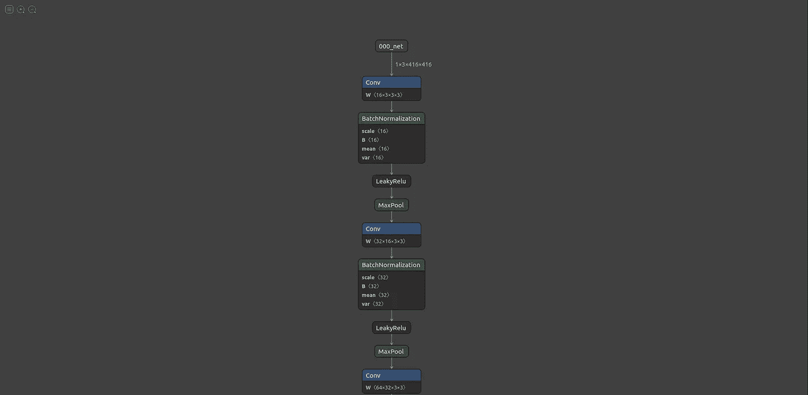
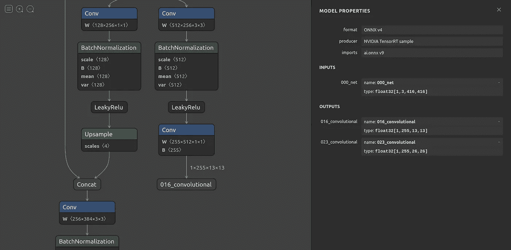

# CPU 上的实时目标检测

> 原文：<https://towardsdatascience.com/real-time-object-detection-on-cpu-9f77d32deeaf?source=collection_archive---------12----------------------->

利用 OpenVino 在 CPU 上实现实时目标检测。听起来很神奇，对吧？好吧，让我们真的去相信它。


Marc-Olivier Jodoin 在 [Unsplash](https://unsplash.com?utm_source=medium&utm_medium=referral) 上拍摄的照片

第一次有人问我是否有可能在 CPU 上进行实时物体检测，我对这个问题不屑一顾，心想:“一定是在开玩笑吧？”。

嗯，有可能！我试着去相信它。我们将介绍在 CPU 上以 40 帧/秒的速度实现对象检测。

我建议你读一点以下术语的意思，然后继续学习教程。你仍然可以在不理解这些术语的情况下，仅仅通过盲目地复制教程来完成，但这有什么乐趣呢，不是吗？

*   [ONNX](https://onnx.ai/)
*   [OpenVINO](https://docs.openvinotoolkit.org/latest/index.html)
*   [暗网](https://pjreddie.com/darknet/)

这篇博客假设你对上述术语的含义有所了解，并对深度学习和物体检测有一个大致的了解。我们将使用 **yolov3-tiny** 使用 darknet 进行对象检测。让我们开始吧！

我们需要预先训练好的**yolov 3-小权重**，它可以从[这里](https://pjreddie.com/media/files/yolov3-tiny.weights)下载，它的**配置文件**可以从[这里](https://github.com/pjreddie/darknet/blob/master/cfg/yolov3-tiny.cfg)复制。

接下来的步骤是将预训练的权重转换为 onnx，然后转换为 OpenVINO 的 IR 格式，这是 OpenVINO 进行推理所需的 xml、bin 和映射文件。我们将通过 4 个连续的步骤来完成这项工作。

1.  将 YOLO 重量转换为 ONNX
2.  使用 Netron 查找输出图层的名称
3.  将 ONNX 转换为 IR 格式
4.  使用 OpenVINO 运行推理

## 步骤 1:将 YOLO 重量转换为 ONNX

我将使用 jkjung-avt 的 tensorrt_demos 库将 yolo 权重转换为 onnx。这是我的个人偏好，因为我以前曾用它进行 TensorRT 转换。有许多其他存储库可以做同样的事情。我们将按照自述文件中提到的步骤将 yolov3-tiny weights 转换为 onnx。我们开始吧！

```
$ git clone [https://github.com/jkjung-avt/tensorrt_demos.git](https://github.com/jkjung-avt/tensorrt_demos.git)$ pip3 install onnx==1.4.1$ cd tensorrt_demos/yolo/
```

将权重文件和 cfg 文件复制到这个目录，即 tensorrt_demos 存储库中的 yolo 目录。

1.  将权重文件重命名为 **yolov3-tiny-416.weights**
2.  将 cfg 文件重命名为 **yolov3-tiny-416.cfg**
3.  用这里给出的类名[创建一个名为 **labels.txt** 的新文件。](https://github.com/pjreddie/darknet/blob/master/data/coco.names)

这些步骤是必要的，因为存储库需要它们来为特定的模型和输入大小进行转换。

**注意:我们使用 416x416 尺寸作为输入。如果您有自定义尺寸，可以对其进行修改。**

移动并重命名文件后，让我们运行脚本来进行实际的转换。

```
$ python3 yolo_to_onnx.py -m yolov3-tiny-416
```

这将创建一个名为 **yolov3-tiny-416.onnx.** 的输出文件。让我们执行下一步，找到需要转换为 IR 格式的模型输出层的名称。为了找到输出层的名称，我们将使用 [**netron**](https://github.com/lutzroeder/netron) 来帮助可视化模型图/架构。

## 步骤 2:使用 Netron 查找输出层的名称

```
$ pip3 install netron$ netron
Serving at [http://localhost:8080](http://localhost:8080)
```

打开链接并上传 onnx 文件。它将显示如下所示的模型架构。



向下滚动架构到输出节点并点击它。右侧将出现一个详细信息框，显示输出节点名称，如下所示。



复制输出节点名称。我们需要名字来将 onnx 文件转换成 IR 格式。节点名称为:`016_convolutional,023_convolutional`

## 步骤 3:将 ONNX 转换为 IR 格式

我们需要设置 OpenVINO 及其依赖项来使用它。使用此[连杆](https://docs.openvinotoolkit.org/latest/openvino_docs_install_guides_installing_openvino_linux.html)安装 **OpenVINO 2021.1.110** 。

**注意:安装开发版本，而不是运行版本，因为它不包括模型转换脚本。**

注意:我建议使用虚拟环境来安装这些包，因为它很容易管理依赖关系。

您可能已经安装了这些软件包，但是如果您还没有安装，请使用 pip 安装下面给出的软件包。

```
$ cd /opt/intel/openvino_2021/python$ source /opt/intel/openvino_2021/bin/setupvars.sh$ pip3 install networkx defusedxml test-generator==0.1.1$ cd /opt/intel/openvino_2021.1.110/deployment_tools/model_optimizer/install_prerequisites/$ ./install_prerequisites_onnx.sh
```

最后，设置和安装完成后，让我们运行脚本将 ONNX 文件转换为 IR 格式。用本地路径替换`model_dir`和`output_dir`。

```
$ python3 /opt/intel/openvino_2021.1.110/deployment_tools/model_optimizer/mo.py --input_model /**path_to_model_dir**/yolov3-tiny-416.onnx -s 255 --reverse_input_channels --output 016_convolutional,023_convolutional --output_dir /**path_to_output_dir**/
```

这将输出 3 个文件，即。绑定文件、xml 文件和映射文件。这些文件是 OpenVINO 推理的中间表示。

## 步骤 4:使用 OpenVINO 运行推理

随着所有的转换最终完成，让我们在我们的网络摄像头或图像上运行一个演示，以检查推理速度。

```
$ git clone [https://github.com/Chen-MingChang/pytorch_YOLO_OpenVINO_demo.git](https://github.com/Chen-MingChang/pytorch_YOLO_OpenVINO_demo.git)**# activate environment that you used to install the above packages before running below commands.**$ cd /opt/intel/openvino_2021/python$ source /opt/intel/openvino_2021/bin/setupvars.sh$ cd /**path_to_cloned_repository**/pytorch_YOLO_OpenVINO_demo$ python3 yolo_openvino_demo.py -m /**path_to_model_directory**/yolov3-tiny-416.xml -i 'cam' -at yolov3 --labels /**path_to_labels**/labels.txt
```

你会看到比实时推断更快的输出视频。

如果您没有网络摄像头，请使用下面的命令在视频上尝试一下。

```
$ python3 yolo__openvino_demo.py -m /**path_to_model_directory**/yolov3-tiny-416.xml -i /**path_to_video_dir**/video.mp4 -at yolov3 --labels /**path_to_labels**/labels.txt
```

我们已经成功地将 yolov3-tiny 转换为在 CPU 上进行实时推理。嗯，我会说 40 FPS 几乎是实时的两倍。如果我需要阐述任何观点或需要任何更正，请评论下来。

## 参考

<https://pjreddie.com/darknet/yolo/>    <https://docs.openvinotoolkit.org/latest/index.html>  <https://github.com/jkjung-avt/tensorrt_demos>  <https://github.com/Chen-MingChang/pytorch_YOLO_OpenVINO_demo>  <https://github.com/lutzroeder/netron> 