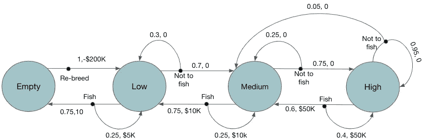
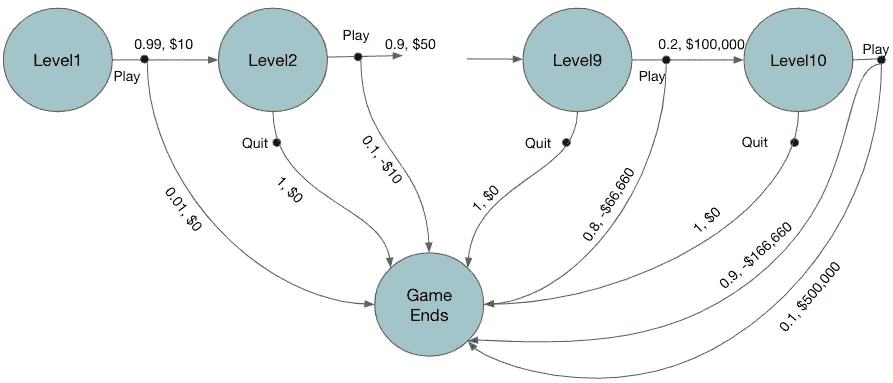
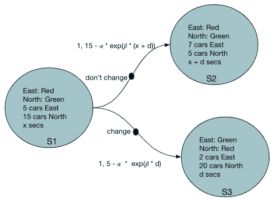
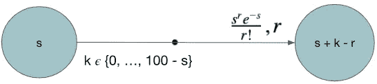

# 马尔可夫决策过程的现实应用

> 原文：<https://towardsdatascience.com/real-world-applications-of-markov-decision-process-mdp-a39685546026?source=collection_archive---------2----------------------->

## [理解大数据](https://towardsdatascience.com/tagged/making-sense-of-big-data)

## 从实例中学习，将问题公式化为马尔可夫决策过程，以应用强化学习

马尔可夫决策过程(MDP)是强化学习(RL)的一个基本要素。MDP 允许顺序决策的形式化，其中一个状态的行为不仅影响直接的回报，还影响随后的状态。这是一个非常有用的框架，通过采取一系列行动来模拟最大化长期回报的问题。由萨顿和巴尔托[1]所著的《[强化学习——简介](https://mitpress.mit.edu/books/reinforcement-learning-second-edition)》一书的第三章对 MDP 做了很好的介绍。这本书也可以免费在[下载](https://web.stanford.edu/class/psych209/Readings/SuttonBartoIPRLBook2ndEd.pdf)。

将问题表达为 MDP 是通过动态编程或其他 RL 技术解决问题的第一步。玩电脑游戏或执行任务的机器人通常会自然地映射到 MDP。但是许多其他现实世界的问题也可以通过这个框架来解决。然而，现实世界中的例子并不多。本文提供了一些有限 MDP 的真实例子。我们还展示了相应的*转换图*，它有效地总结了 MDP 动力学。这样的例子可以作为很好的动机，学习和发展的技能，以制定问题，如 MDP。

## MDP 基础知识

在 MDP 中，主体通过采取行动与环境交互，并寻求主体从环境中获得最大回报。在任何给定的时间戳 t，该过程如下

1.  环境处于 St 状态
2.  代理在以下时间采取行动
3.  环境基于 St 和 At 生成奖励 Rt
4.  环境移动到下一个状态 St+1

代理的目标是使一段时间内收集的总报酬(σRt)最大化。代理人需要在给定的状态下找到最优的行动，使总回报最大化。从一个状态 St 采取行动的概率分布称为策略π(At | St)。求解 MDP 的目标是找到最优策略。

为了用 MDP 表达一个问题，需要定义以下内容

*   **环境的状态**
*   **代理可以对每个状态采取的动作**
*   **对给定状态采取行动后获得的奖励**
*   **状态转移**概率。

动作只能依赖于当前状态，而不能依赖于任何先前的状态或先前的动作(马尔可夫属性)。奖励的产生仅取决于(当前状态，行动)对。行动和回报都是随机的。

一旦问题被表示为 MDP，就可以使用动态规划或许多其他技术来寻找最优策略。

在 MDP 有更多的细节，这将是有益的回顾萨顿的 RL 书的第 3 章。

## MDP 的真实例子

## **1。今年是否捕捞鲑鱼**

我们需要决定在一个特定的区域里，一年要捕获多少比例的鲑鱼，以获得最大的长期回报。每条鲑鱼产生固定数量的美元。但是如果大部分的鲑鱼被捕获，那么下一年的产量将会降低。我们需要找到鲑鱼的最佳比例，以实现长期回报的最大化。

这里我们考虑上述问题的一个简化版本；是否捕捞一定量的三文鱼。这个问题可以表示为如下的 MDP

**州:**当年该地区可获得的鲑鱼数量。为简单起见，假设只有四种状态；**空**、**低**、**中**、**高**。这四种状态定义如下

***空*** - >没有三文鱼可用； ***低*** - >可用鲑鱼数量低于某个阈值 t1； ***中等*** - >可用鲑鱼数量介于 t1 和 T2 之间； ***高*** - >可用鲑鱼数量均超过 T2

**动作:**为了简单起见，假设只有两个动作；**落鱼**和**未落鱼**。鱼意味着捕捉一定比例的鲑鱼。对于空的状态，唯一可能的动作是不捕鱼。

**奖励**:在某个状态钓鱼会产生奖励，假设在低、中、高状态钓鱼的奖励分别是$5K、$50K 和$100k。如果一个行动需要清空状态，那么奖励是非常低的-20 万美元，因为它需要重新繁殖新的鲑鱼，这需要时间和金钱。

**状态转换**:在一个州捕鱼有较高的概率转移到鲑鱼数量较少的州。类似地，不捕鱼行动有更高的概率移动到鲑鱼数量更高的州(州高除外)。

图 1:MDP 鲑鱼捕捞的过渡图

图 1 显示了这个 MDP 的转换图。有两种节点。大圆圈是*状态节点*，黑色实心小圆圈是*动作节点*。一旦采取了行动，环境就会以奖励作为回应，并转换到下一个状态。这种状态转换由从动作节点到状态节点的箭头表示。每个箭头显示<跃迁概率，奖励>。例如，从状态*媒体*动作节点*鱼*有 2 个箭头过渡到 2 个不同的状态；i) *低*带*(概率=0.75，奖励=$10K)* 或者 ii)回*中*带*(概率=0.25，奖励=$10K)。*在*清空*的状态下，唯一的动作是*重新繁殖*并通过*转换到状态 Low(概率=1，奖励=-$200K)。*

## 2.**智力竞赛节目**

在一个智力竞赛节目中，有 10 个级别，在每个级别都会问一个问题，如果回答正确，就会根据当前级别给予一定的金钱奖励。级别越高，问题越难，但奖励也越高。

在每一轮游戏中，如果参与者正确回答了测验，那么他/她将赢得奖励，并可以决定是继续玩下一关还是退出。如果退出，则参与者可以保留到目前为止获得的所有奖励。在任何一轮中，如果参与者未能正确回答，那么他/她将失去迄今为止获得的“所有”奖励。游戏在 10 级停止。目标是决定玩或退出的行动，使总回报最大化

**状态:**{一级，二级，…，十级}

动作:玩下一关或退出

**奖励**:在 1 级、2 级、…、10 级玩分别产生奖励$10、$50、$100、$500、$1000、$5000、$10000、$50000、$100000、$ 100000、$50000、$500000，概率 p = 0.99、0.9、0.8、…、0.2、0.1。这里的概率是给出正确答案的概率。在任何级别，参与者以概率(1- p)输掉，并输掉迄今赢得的所有奖励。

图 2:问答游戏 MDP 的转换图

在图 2 中我们可以看到，对于动作*玩*，有两种可能的转换，i) *赢了*以概率 p 转换到下一个级别，并且当前级别的奖励金额 ii) *输了*以概率(1-p)结束游戏，并且失去了到目前为止赢得的所有奖励。动作*退出*以概率 1 结束游戏，无奖励。

## 3.减少交通路口的等待时间

我们想要决定十字路口交通灯的持续时间，以最大化不停车通过十字路口的汽车数量。为简单起见，让我们假设这只是一个双向交叉路口，即交通只能在两个方向流动；*北*或*东*；而红绿灯只有两种颜色*红色*和*绿色*。还假设系统可以通过传感器或仅仅一些估计来访问接近十字路口的汽车数量。

假设 MDP 的每个时间步长代表几(d=3 或 5)秒。在每个时间步，我们需要决定是否改变交通灯。

**状态:**这里的状态表示为以下各项的组合

1.  每个方向上交通灯的颜色(红色、绿色)
2.  相同颜色交通灯的持续时间
3.  每个方向接近十字路口的汽车数量。

**动作:**是否改变红绿灯

**奖励:**下一时间步通过路口的车数减去另一方向堵车的某种折扣。折扣应该随着流量被阻塞的持续时间呈指数增长。请注意，持续时间是作为当前状态的一部分捕获的，因此马尔可夫属性仍然保留。

*奖励* =(下一时间步预计通过的车数)— α * exp(另一方向红灯亮的β *时长)

**状态转换**:转换是确定性的。操作要么改变交通灯的颜色，要么不改变。对于任何一个动作，它都会改变到一个新的状态，如下面的转换图所示。

图 3:转换图；仅显示了许多可能状态中的 3 种

## 4.有多少病人入院

医院有一定数量的床位。它每天接收随机数量的病人，并需要决定它可以接纳多少病人。此外，医院里每天都有一部分病人康复出院。医院希望在很长一段时间内使康复的人数最大化。

**状态:**假设医院有 100 个床位，可用床位数{1，2，…，100}

**行动:**医院每天都会收到基于泊松随机变量的入院请求。行动就是接纳多少病人。因此，该动作是 0 到(100-s)之间的数字，其中 s 是当前状态，即被占用的床位数。该操作需要少于医院当天收到的请求数。

所以 *action = {0，min(100-s，请求数)}*

**奖励:**奖励是当天康复的患者数量，是当前状态下患者数量的函数。我们可以将此视为具有均值 s 的泊松分布。

图 4:在这个转换图中只显示了一个动作和状态转换。它根据带有均值 s(当前患者数量)的激情分布获得奖励(康复患者)

## 结论

在这篇文档中，我们展示了一些现实世界中可以建模为马尔可夫决策问题的例子。这样的现实世界的问题显示了这个框架的有用性和力量。这些例子和相应的转换图可以帮助开发使用 MDP 表达问题的技巧。作为进一步的探索，可以尝试使用动态规划来解决这些问题，并探索最优解。

## 参考

[1]强化学习:由理查德 s 萨顿和安德鲁 g 巴尔托介绍