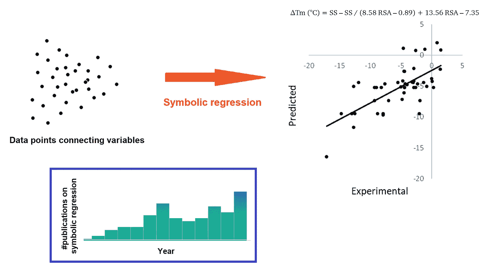

# 符号回归的现实应用

> 原文：<https://towardsdatascience.com/real-world-applications-of-symbolic-regression-2025d17b88ef?source=collection_archive---------6----------------------->

符号回归的主要思想，即寻找与变量相关的方程，已经存在很长时间了。但直到最近十年，它才开始对物理、化学、生物和工程的实际研究产生影响。在那里可以找到关键的新方法，一些你可以使用的现代程序，以及一些应用实例。作者 Luciano Abriata 图。

## 对数据的分析性描述，而不仅仅是黑匣子

## 符号回归(即找到与变量相关的方程)不像常规神经网络那样是一个黑箱，并且提供了不仅可以预测数据而且可以合理实现预测的模型，因此远不如其他机器学习和数学建模技术受欢迎。然而，正如我在这里介绍的，越来越多的符号回归应用正在成为现实，特别是随着新方法的发展，这些新方法集成了物理学启发的约束，数据投影和预处理，以及收敛到简单、有意义的方程的新方法。

# 简而言之的索引

*   [**简介**](#4bae)
*   [**两种新颖的物理约束符号回归方法**](#83b2)
*   [**符号回归在化学和生物科学中的现代实际应用**](#20a5)

# **简介**

符号回归包括识别符合输入和输出值数据集的数学表达式。有许多不同的方法来处理该问题并实现将输入连接到输出的这种解析表达式，一些方法更多地与机器学习技术相关，一些方法利用遗传算法，一些方法基于预先设定的规则，而另一些方法更广泛地利用可能方程的空间，等等。寻找连接变量的解析方程远非易事，尤其是当人们寻找那些看起来像通常通过理论手段推导出来的那样“优雅”的简单方程时。例如，一个物体经历恒定加速度，从零速度开始运动，所走过的距离就是 d = a t / 2。或者只是再举一个例子，放射性衰变导致一种物质的辐射强度呈指数下降:I = I(0) exp(-kt)。在这些例子中，给定一组在增加的时间行进的距离，或者一组辐射强度对时间，符号回归将被期望检索相应的方程。但是当然，其他函数也可能符合数据，不一定描述数据背后的简单物理。

与使用常规回归、神经网络或其他数学工具建模数据相比，使用符号回归建模数据具有一些优势。对我来说，两个最重要的优势是:

1.  不仅可以像其他建模方法一样对数据进行建模并能够从新输入预测新输出，还可以实际掌握**变量以给定方式相关的原因**。为什么的答案**最终可以帮助提出什么是物理的、生物的、或化学的、金融的等等。(视题目而定)联想背后。例如，指数衰减通常与单步、一级事件相关，其速率与密度(辐射强度、培养物中的细胞数量等)成比例。).随着时间的推移，随着起始密度的降低，其变化率也随之降低，这以综合的形式导致了基于指数的方程。同样，从加速度作为位置对时间的二阶导数的初等积分，可以获得以恒定加速度行进的距离的方程。**
2.  如果获得的方程是正确的，该模型可能比大多数其他数学模型具有更大的外推能力，尤其是那些基于神经网络的模型，神经网络通常很适合插值，但只能在训练域之外进行外推。

换句话说，来自一个好的符号回归的结果更容易理解，更少的黑箱，可能更强大。

为了真正实现这些优势，重要的一点是最大化获得物理上合理的方程的机会。为此，许多方法结合了“方程搜索空间”的物理约束导航。另一方面，人们需要对方程搜索空间进行大量采样，特别是对于传统符号回归更容易失败的高维问题。为了最大限度地提高采样、简单性和物理准确性，科学家们现在正在通过将机器学习和进化算法与基于物理学的方程约束相结合来构建新的符号回归器。

我不会深入讨论符号回归的细节，因为在这里的 [TDS 编辑](https://medium.com/u/7e12c71dfa81?source=post_page-----2025d17b88ef--------------------------------)(例如[这一篇](/symbolic-regression-the-forgotten-machine-learning-method-ac50365a7d95)作者[拉菲尔·鲁杰罗](https://medium.com/u/4101e7425d00?source=post_page-----2025d17b88ef--------------------------------))和维基百科([这里](https://en.wikipedia.org/wiki/Symbolic_regression))以及其他资源中都有精彩的文章。相反，**我在这里关注符号回归**的科学应用的实际、现代例子，正如 Rafael 文章的标题所说，它有点像一种“被遗忘”的方法，可能被常规的机器学习方法所掩盖:

 [## 符号回归:被遗忘的机器学习方法

### 将数据转换成公式可以产生简单而强大的模型

towardsdatascience.com](/symbolic-regression-the-forgotten-machine-learning-method-ac50365a7d95) 

我首先回顾两篇重要的近期文章，它们已经展示了应用，但主要集中在从数据中发现方程的最现代方法背后的理论。在接下来的部分，我将介绍一些非常有趣的应用，其中一个实际上来自我自己的研究。

# 首先，两种新的物理约束符号回归方法具有广泛的应用

## 第一篇文章:Udresku 和 Tegmark 2020

我要强调的第一篇文章是这篇发表在 2020 年*科学进展*(此处[文章，开放访问](https://www.science.org/doi/10.1126/sciadv.aay2631))的文章。它的标题是“AI Feynman:一种受物理学启发的符号回归方法”,正如你所看到的，它也引用了著名物理学家理查德·费曼……这里开发的方法和软件可以发现该作者的一本书中的所有 100 个物理方程。

这项工作的核心思想相对简单:为了建立他们新的符号回归算法，他们将神经网络拟合与一组物理学启发的约束和方程特征相结合。这项工作的一个关键组成部分是认识到出现在物理学中的函数(本质上是大多数科学应用)通常具有某种限制方程搜索空间的属性。这在论文中有详细的描述，但是让我们概括一下:变量和系数有必须一致的物理单位(例如，对数经常应用于单位被抵消的比率或类似的论点)。多项式通常达到低阶(但不一定限于平方幂:见平方根，光散射对 wavelength/10⁴的依赖性等。).大多数方程由一个或几个项组成，每个项通常不超过两个自变量。这些方程是连续的和光滑的，至少在它们合理的范围内是这样；并且它们通常相对于它们的一些或所有变量是对称的。最后，变量通常被分成小组，或者用不同的术语单独分组。

本文提出的算法考虑了不同块中的所有这些点，并通过将问题分成更小的问题并分别在这些块上运行来递归地工作。该方法的一些重要亮点:

首先，值得注意的是，该方法确实涉及强力方程搜索的阶段；然而，通过对更大问题的分割部分进行运行，它可以更好地对搜索空间进行采样。

第二，该作品还使用了一种特殊的方式来减少过拟合的机会，即像以前的作品一样定义获胜函数(“获胜”指的是各种备选答案的竞争)。

第三，在运行时，该程序利用常规神经网络来创建插值数据，这有助于评估方程所需的拟合程序，以及测试对称性、平滑度和项可分性的程序。

第四个有趣的地方是，该方法基于正规方程中常见的数学方法，在输入中使用数据转换(例如，输入 x 而不是仅仅输入 x ),以加速方程发现。

本文描述的程序是 GitHub 提供的[。在作者报告的测试中，程序需要几十秒到几十分钟来收敛少量数据点上的符号回归。该程序能够恢复费曼书中的所有 100 个方程，仅使用初等函数(+、∫、/、sqrt、exp、log、s in、cos、arsin 和 tanh)和小有理数以及 *e* 和π。通过向数据集添加模拟噪声，作者还测试了该方法和程序的稳健性。](https://github.com/SJ001/AI-Feynman)

以下是在*科学进展*的原文:

 [## 美国科学促进会

### 2021 美国科学促进协会。保留所有权利。AAAS 是 HINARI，AGORA 的合作伙伴…

www.science.org](https://www.science.org/doi/10.1126/sciadv.aay2631) 

通过阅读丹尼尔·夏皮罗博士撰写的这篇 TDS 文章，你可以对这个项目更加了解:

 [## AI Feynman 2.0:从数据中学习回归方程

### 让我们在一个全新的图书馆上踢轮胎

towardsdatascience.com](/ai-feynman-2-0-learning-regression-equations-from-data-3232151bd929) 

## 第二篇文章:Reinbold 等人 2021

我要强调的第二篇文章发表在 2021 年的*自然通讯*(此处[开放获取文章](https://www.nature.com/articles/s41467-021-23479-0))。像 AI-Feynman 一样，本文描述的方法也利用真实物理方程的各种特征作为方程搜索问题的约束，同时寻求平衡准确性和简单性的简约模型。此外，由于作者解决了导数非常重要的问题，他们实现了微分方程的弱公式，以降低噪声敏感性并消除对不可访问变量的依赖。采用弱公式的主要原因是将微分方程化为积分方程，以避免计算导数的负担。关于[弱形式的更多信息，请看这个伟大的博客](https://www.comsol.com/blogs/brief-introduction-weak-form)。

在他们的论文中，作者展示了这种方法在湍流速度场实验测量中的应用。根据这一仅有的输入数据，该方法允许重构不可接近的变量，例如驱动流动的压力。尽管如前所述，它只适用于这个测试用例，但该方法可能也适用于其他类型的问题。

这是发表在*自然通讯*上的原始论文:

 [## 通过物理方式从嘈杂、不完整、高维的实验数据中进行稳健学习…

### 机器学习为第一原理分析提供了一种有趣的替代方法，可以从…

www.nature.com](https://www.nature.com/articles/s41467-021-23479-0) 

# 现在它们在这里:符号回归在化学和生物科学中的现代实际应用

截至 2021 年 9 月 30 日，在 PubMed(世界上最大的自然科学在线图书馆)的所有论文标题和摘要中寻找“符号回归”会返回 76 个结果。这不包括只在正文中提到这个术语的文章；并且仅限于生物学和化学领域的论文，而忽略了计算机科学领域的论文，因此它是符号回归代表所报道工作的重要应用的论文的良好代理。

有一篇发表于 1997 年的文章，谈到符号回归是一种发现“一元函数”的方法。然后一直是一片空白，直到 2011 年，一篇论文使用符号回归找到了一个描述肾小球滤过率的方程，肾小球滤过率是衡量肾功能的一个指标，对肾移植很有用。得到的方程被证明优于当时存在的其它方程。

从 2011 年起，标题或摘要中带有“象征性回归”的出版物数量开始平稳增长，截至 9 月 30 日，2021 年有 16 种:

PubMed 主办的标题和/或摘要中提到“符号回归”的文章数量。作者 Luciano Abriata 的数据来自 PubMed data。

现在让我们来看一些我觉得最有趣的案例，它们展示了现代符号回归方法的实际应用。

[**本**](https://www.nature.com/articles/s41467-020-17263-9) **2020 年*Nature communication s****中的论文对各种钙钛矿的析氧活性数据进行了符号回归，以了解哪些变量是活性的最佳预测因子，通过哪些方程。通过这项工作，作者可以确定一个简单的描述符，即该研究领域中常用的表征钙钛矿组成的两个因子的比率，以及根据该描述符模拟活性的方程。这一符号模型导致了一系列具有改进活性的新型氧化物钙钛矿催化剂的发现，作者合成并表征了这些催化剂以证实它们的高活性。符号回归是用 [gplearn](https://gplearn.readthedocs.io/en/stable/) 实现的，这是一个 Python 库，用这个功能扩展了 scikit-learn。论文在这里:*

* [## 从符号回归得到的简单描述符加速了新钙钛矿的发现…

### 符号回归在指导材料设计方面大有可为，但它在材料科学中的应用仍处于起步阶段

www.nature.com](https://www.nature.com/articles/s41467-020-17263-9) 

这是在 python 中用于符号回归(和其他非常有趣的方法)的 gplearn 库:

 [## 欢迎阅读 gplearn 的文档！- gplearn 0.4.1 文档

### 一个、一般、法则、引导、前进、全体、有机的存在，即，\]\[乘、变…

gplearn.readthedocs.io](https://gplearn.readthedocs.io/en/stable/) 

**[**下一篇论文**](https://pubmed.ncbi.nlm.nih.gov/34005960/) **， *Phys Rev E* 2021** ，处于符号回归的方法开发和从失真视频中发现物理规律的实际应用的接口。本文提出了一种对原始视频中未标记对象的运动方程进行无监督学习的方法。想象一个相对静止的场景，一个物体在上面运动，你想要得到这个物体的运动方程，甚至不需要标记或者有目的地跟踪它。我选择这篇文章在这里展示，因为它很好地集成了图像分析、预处理、低维投影和符号回归本身。**

**在这种方法中，自动编码器首先将视频的每一帧映射到简化运动的低维潜在空间中。这作为一个预回归，然后被送入帕累托最优符号回归，以找到描述对象运动的微分方程。预回归步骤可以对未标记的移动对象的坐标进行建模，即使视频失真，就像现实生活中的视频一样。潜在空间维度的使用有助于避免拓扑问题，并且可以在以后通过主成分分析来去除。最后，通过最小化整体运动，该方法还可以自动发现惯性框架，从而减少最终运动的失真(例如由于移动的摄像机或背景而发生的失真),并因此便于获得简单的方程。**

**这篇论文提出了一种非常新颖的分析视频的方法，在这里:**

** [## 符号回归:从扭曲的视频中发现物理规律

### 我们提出了一种方法，用于无监督学习运动方程的对象在原始和可选的扭曲…

pubmed.ncbi.nlm.nih.gov](https://pubmed.ncbi.nlm.nih.gov/34005960/) 

或者这是 arXiv 的预印本:

 [## 符号压迫:从扭曲的视频中发现物理规律

### 我们提出了一种方法，用于无监督学习运动方程的对象在原始和可选的扭曲…

arxiv.org](https://arxiv.org/abs/2005.11212) 

**[**下一篇论文**](https://pubmed.ncbi.nlm.nih.gov/31617228/)***生物鉴定* 2019 年，**提出了生态动力学的建模，即共享一个栖息地的各种物种的种群如何随着时间的推移相互之间以及与非生物因素之间的关系而进化。这项工作将符号回归与一组合理的生态功能反应结合起来，根据生物丰度的时间相关数据对生态系统动态进行逆向工程。给定输入数据，该过程返回描述它的候选微分方程组，然后分析它们在生态学概念方面的意义。正如作者所讨论的，我们可以确定使用符号回归的两个主要优点。首先，所得的微分方程可以潜在地被解释以理解生态系统的潜在生态机制，例如物种之间的生态相互作用的类型，例如成对的捕食者和被捕食者物种之间的生态相互作用。作者强调的第二个要点是，即使在数据有限或信息不充分的情况下，该方法似乎也表现良好，这可能是因为它们提供了方程本身的候选起始部分，从而将搜索限制在只有低质量或稀疏数据才能拟合的有意义的方程。**

**这篇论文，采用了这种有趣的方法，在这里:**

** [## 通过符号回归揭示复杂的生态动力学

### 了解复杂生态系统的动态是维护和控制它们的必要步骤。然而…

pubmed.ncbi.nlm.nih.gov](https://pubmed.ncbi.nlm.nih.gov/31617228/) 

**另一篇** [**论文，由我在** *分子生物技术*](https://link.springer.com/article/10.1007/s12033-021-00349-0) 2021 年发表，使用符号回归对突变对蛋白质热稳定性的影响进行建模，同时了解不同因素如何调节对稳定性的影响。正如论文所示，这个问题建模起来非常复杂，部分原因是可用数据量有限。但是一个特定的突变，从氨基酸缬氨酸到氨基酸丙氨酸，在数据集中有 47 个记录条目。使用野生型(缬氨酸)氨基酸在其结构背景下的三个因子，即其相对溶剂可及性、二级结构和从原子 B 因子量化的柔韧性，对该数据进行符号回归，得到该方程:

δTm(C)= SS–SS/(8.58 RSA–0.89)+13.56 RSA–7.35

该方程拟合的相关系数 r 为 0.68，平均误差 RMS 为 3.3℃。该方程没有显示出灵活性的相关影响，因为该模型仅与二级结构(SS)和相对溶剂可及性(RSA)一起工作良好。事实上，该模型的关键术语是-7.35 的偏移，这意味着全局不稳定效应，以及对 RSA 的+13.56 倍的强烈调节:暴露的氨基酸越多，其对稳定性的积极作用越强。这具有完美的物理意义，因为缬氨酸是一种疏水性氨基酸，因此它更喜欢隐藏在水中，所以当它高度暴露(高 RSA)时，它被疏水性较低的丙氨酸取代导致稳定。

本文还证明了符号回归比在相同因素上使用多元线性回归产生更好的结果，特别是在相关图的形状(斜率)方面:

符号回归(左)与多元线性回归(右)来模拟缬氨酸到丙氨酸突变对蛋白质热稳定性的影响，来自[这项工作](https://link.springer.com/article/10.1007/s12033-021-00349-0)。作者编制的图表。

这篇以简单符号回归应用为特色的论文如下:

 [## 回顾预测突变时蛋白质解链温度变化的挑战

### 预测突变对蛋白质稳定性的影响是基础和应用生物学中的一个关键问题，但…

link.springer.com](https://link.springer.com/article/10.1007/s12033-021-00349-0) 

这项工作中的符号回归是用 TuringBot 进行的，这是一个易于使用的程序:

 [## 符号回归软件——turing bot

### 假设您想从一组输入变量中预测一个数值。在 2021 年，大多数人会在一个…

turingbotsoftware.com](https://turingbotsoftware.com/) 

**一些额外的有趣作品**

开发 AI Feynman 的同一小组的最后一篇论文之一描述了 [AI Poincaré](https://journals.aps.org/prl/abstract/10.1103/PhysRevLett.126.180604) ，这是一个符号回归系统，它使用来自动态系统的轨迹数据自动发现守恒量。通过对五个物理哈密顿量的测试，该程序可以发现它们的守恒量、周期轨道、相变和击穿时标，而不需要任何领域知识，甚至不需要轨迹是如何产生的物理模型。

本着引导符号回归搜索的精神，像上面的一些例子一样，[这篇论文](https://pubs.acs.org/doi/full/10.1021/acs.jpclett.9b02232)从激子能量学的理论方程中输入术语，以模拟激子结合能的解析表示。

这篇综述提供了应用于材料科学的符号回归的概述，以及该领域和工程问题中的一些例子。此外，这篇评论还提到了 2009 年[科学](https://www.science.org/doi/10.1126/science.1165893?url_ver=Z39.88-2003&rfr_id=ori:rid:crossref.org&rfr_dat=cr_pub%20%200pubmed)杂志的一篇论文，该论文将符号回归作为一种从实验数据中发现自然规律方程的方法，这可能是我在这里介绍的所有其他作品的基础。

**如果你有一些使用符号回归的有趣文章要分享，请在评论中告诉我。我希望很快看到更多这种令人兴奋的、非常有用的技术。**

喜欢这篇文章，想给我提示？[[**Paypal**](https://www.paypal.me/LAbriata)]-谢谢！

*我是一个自然、科学、技术、编程、DIY 爱好者。生物技术专家和化学家，在潮湿的实验室和计算机里。我写我广泛兴趣范围内的一切。查看我的* [*列表*](https://lucianosphere.medium.com/lists) *了解更多故事。* [*成为媒介会员*](https://lucianosphere.medium.com/membership) *访问我和其他作家的所有故事，* [*订阅通过邮件获取我的新故事*](https://lucianosphere.medium.com/subscribe) *(平台原创附属链接)。******