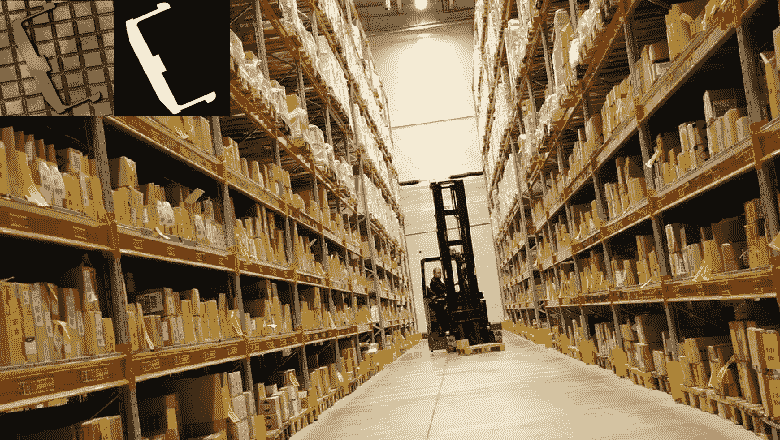
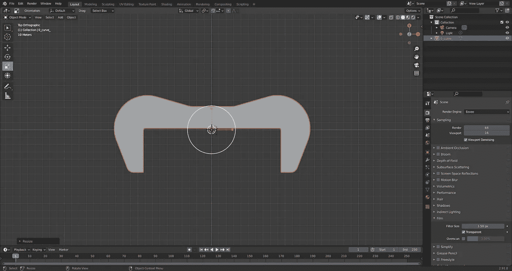
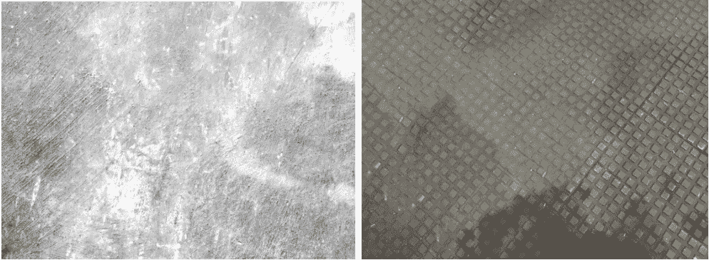
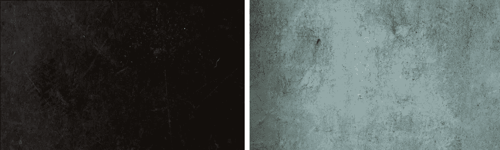
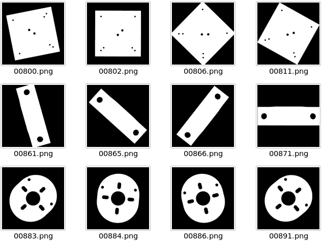
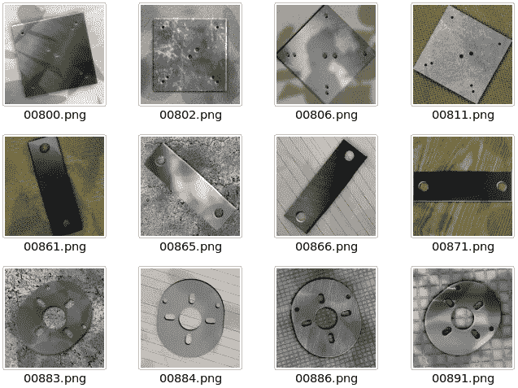
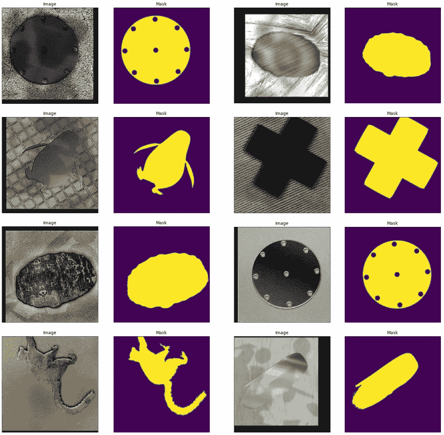
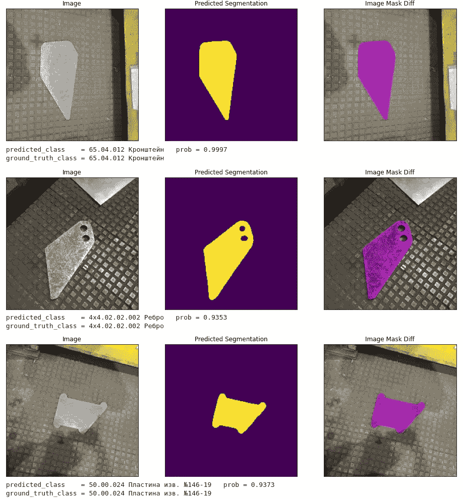
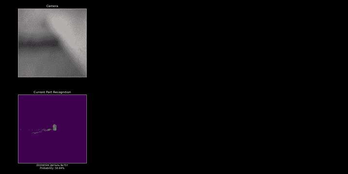

# 现实世界的 ML:仓库识别系统

> 原文：<https://towardsdatascience.com/real-world-ml-warehouse-recognition-system-7b0e8dee373c?source=collection_archive---------43----------------------->

## [理解大数据](https://towardsdatascience.com/tagged/making-sense-of-big-data)

## 真实 ML 项目的逐步描述

图片来源于知识共享 CC0 许可下的 [pxhere](https://pxhere.com/ru/photo/880246) 。左上角的小图片是作者的。

作为 ICL 服务公司快速人工智能解决方案原型团队的团队领导，我最近有机会参与的一个项目是实现一个仓库系统来识别存储的工厂零件。这个问题很容易理解:仓库工作人员(尤其是新手)经常不能识别新到的物品，也不能足够快地找到他们的存储位置。当您有成千上万种不同的商品类型时，任务就变得不简单了，变成了翻阅目录和浏览仓库行，希望找到您感兴趣的商品，这可能要花上半个小时，显然是浪费时间。

一个立即想到的解决方案是建立一个由计算机视觉驱动的系统，告诉你感兴趣的物品的名称，并显示类似物品在仓库中的位置。

直接的解决方案是拍摄每个零件的数十张照片(大约 1 万张)，并使用这些照片来训练零件分类器。然后随着新零件不断被添加到目录中，拍摄更多照片并重新训练系统。这种解决方案是可行的，但是……创建这样一个训练数据集需要几个月的时间，之后还需要对不断增长的数据集进行永久控制。但是客户通常希望更快、更便宜地得到结果，并且不需要定期支付昂贵的系统手动再培训费用。

我们能做些什么吗？

我们很幸运，我们的答案是肯定的。一个细微的差别使我们能够显著降低项目的成本和持续时间，在我们的案例中，我们处理一个工厂仓库，储存的零件都是平的，尽管它们是由不同厚度的钢板制成的。更重要的是，所有零件都有 CAD 模型。

图一。Blender 中的 CAD 模型示例[2](图片由作者提供)

因此，我们提出的最佳解决方案是在 CAD 模型生成的合成图像上训练系统，然后在真实照片上使用它。这种方法消除了从真实物体的照片中收集大量数据集的必要性。在我们的例子中，这是可能的，因为所有的部分都是平的。

为了实现这一目标，我们使用了两种模型:

*   分割模型，其将为对象的输入照片给出遮罩(平坦对象的遮罩唯一地定义了一个部分；掩模的例子可以在下面的图 5 中找到)；
*   分类模型，查看作为输入的对象的掩码，并识别零件。

分类模型是经典的 ResNet-50 [3]，在 ImageNet 上预先训练[4]。数据集是以一种相当简单的方式创建的。使用 Blender [2]的可用 CAD 模型和脚本，我们使用从场景中心的各种偏移和相对于垂直方向的不同相机角度来渲染我们的部件的遮罩(这是必要的，因为尽管部件是平的，相机可以在不同的角度下拍摄它们；我们允许偏离垂直方向最多 30 度)。类别的数量等于目录中零件的数量。当新零件添加到目录中时(即在专用网络共享上检测到新 CAD 模型时)，模型会自动重新训练，这需要几个小时，并在并行用于推理的同一本地 GPU 上进行。

细分模型有点复杂。有必要训练模型来使用合成数据分割这些部分，以便此后分割将在不同照明水平下对真实照片精确地起作用，容忍这些部分的材料纹理的变化、背景的变化以及阴影。

分割模型包括一个经典的 U-Net [5](一个二进制分割器，其中对于图像的每个像素，我们确定它是否属于一个部分，用骰子损失[6]训练)，基于相同的 ResNet-50 [3]，在 ImageNet 上预先训练[4]。虽然并非不重要，但用于训练分割图像的这种合成数据集是通过模拟我们从以下内容的随机组合中组成的部件的各种可能外观来构建的:

*   零件口罩(严格来说任何口罩都行，不仅仅是工厂零件的口罩)；

图二。用于生成零件合成图像的遮罩示例(图片由作者提供)

*   背景纹理(来自任何免费剪贴画集合)；

图 3。用于生成零件合成图像的背景纹理示例。(左)照片由来自 [Unsplash](https://unsplash.com/photos/OvGPaee-RHo) 的[杰森·登特](https://unsplash.com/@jdent)拍摄。(右)作者照片

*   部件材料纹理(来自任何免费剪贴画集合)；

图 4。用于生成零件合成图像的材质纹理示例。(左)照片由 [Malik Skydsgaard](https://unsplash.com/@malikskyds) 从 [Unsplash](https://unsplash.com/photos/jY9rX-E7ztU) 拍摄。(右)来自 [Unsplash](https://unsplash.com/photos/kG-ZwDuQ8ME) 的[安妮·斯普拉特](https://unsplash.com/@anniespratt)的照片

*   边缘上的眩光可能看起来像什么(参见下面图 6 中的生成示例)；
*   零件边缘如何将阴影投射到背景上(参见下面图 6 中的生成示例)；
*   阴影如何投射到整个场景上(见图 6 中的生成示例)。

这个主题相当复杂，但是一个像样的计算机图形专家将很容易解决在合理的时间内生成用于分割的合成示例的问题。我不打算在这里给出公式，而只给出掩模的例子(图 5)，它们相对容易从 CAD 模型中获得，以及从这种掩模程序性地生成伪照片的例子(图 6)。

图 5。用于生成零件合成图像的零件遮罩示例(图片由作者提供)

图 6。从遮罩生成的零件的合成图像示例(图片由作者提供)

让我们增加一些补充。现在训练分段器的例子看起来像这样。

图 7。用于训练分段模型的增强示例(图片由作者提供)

训练数据准备好之后，剩下的事情就简单了。我们训练分割模型来分割图像，并且训练分类器模型来对部分遮罩进行分类。然后，我们在测试集上检查分类的准确性(在我们的例子中，我们有 177 张真实零件照片)。

图 8。测试集的几个例子的分类结果(图片由作者提供)

我们得到了:

正确预测:100.00% (177 个中的 177 个)

好吧，我们很幸运，整个测试集被 100%正确地识别，尽管每次运行的结果可能略有不同。随机性来自测试时间增加(TTA) [8]技术，我们用于分割和分类，因为 TTA 可以减少约 10%的误差。因此，分类过程是非确定性的，并且依赖于 TTA 的随机种子。如果我们查看 10 次运行的平均准确度，那么结果是大约 99%(稍后我们将获得更客观的数字，届时我们将获得大量真实图像并组成一个全面的测试集)。

剩下的就是把它包装在一个简单的用户界面中，在第一个版本中是这样的。

图 9。该系统第一版的用户界面(图片由作者提供)

在这里，我们看到来自摄像机的图像(在这种情况下，测试台сamera，我们在它下面放置打印的零件黑白照片)，通过分段模型和前 16 个模型预测处理零件的结果(如果模型偶尔在前 1 个预测中出错，则有超过 99.9%的概率在前 16 个列表中找到正确的零件)。对于预测零件，我们可以在仓库地图上看到它的名称和位置，以及货架号的附加指示。

因此，仓库工人现在总是有办法快速了解他们遇到了哪种零件以及这些零件存放在哪里。为此，他们只需将零件放在仓库入口处摄像机的视野范围内。

PS:

本文是计划中的“真实世界的 ML”系列的第一篇，我计划在这里分享创建涉及 ML 的产品的故事，这些产品是我们与我们的数据科学家团队一起构建的。

我还开了一个微博[https://twitter.com/AiParticles](https://twitter.com/AiParticles)，在里面我概述了机器学习领域最近的前沿著作中的关键点和想法。

请在评论中留下您的反馈。祝大家好运！

**参考文献**

[1]https://icl-services.com/eng ICL 服务—

[2]搅拌机—[https://www.blender.org](https://www.blender.org/)

[3]，何，，，任，，等.深度残差学习用于图像识别.[https://arxiv.org/abs/1512.03385](https://arxiv.org/abs/1512.03385)

[4] Olga Russakovsky，Jia Deng，，Jonathan Krause，Sanjeev Satheesh，Sean Ma，，Andrej Karpathy，Aditya Khosla，Michael Bernstein，Alexander C. Berg，李菲菲等. ImageNet 大规模视觉识别挑战赛.[https://arxiv.org/abs/1409.0575](https://arxiv.org/abs/1409.0575)

[5] Olaf Ronneberger，Philipp Fischer，Thomas Brox，等. U-Net:用于生物医学图像分割的卷积网络.[https://arxiv.org/abs/1505.04597](https://arxiv.org/abs/1505.04597)

[6] Fausto Milletari，Nassir Navab，Seyed-Ahmad Ahmadi，等. V-Net:用于体积医学图像分割的全卷积神经网络.[https://arxiv.org/abs/1606.04797](https://arxiv.org/abs/1606.04797)

[7]数据扩充—[https://en.wikipedia.org/wiki/Data_augmentation](https://en.wikipedia.org/wiki/Data_augmentation)

[8]测试时间增加—[https://stepup.ai/test_time_data_augmentation](https://stepup.ai/test_time_data_augmentation/)