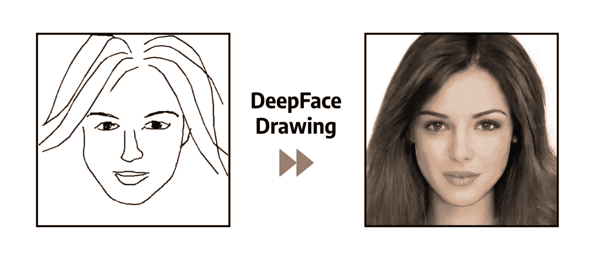
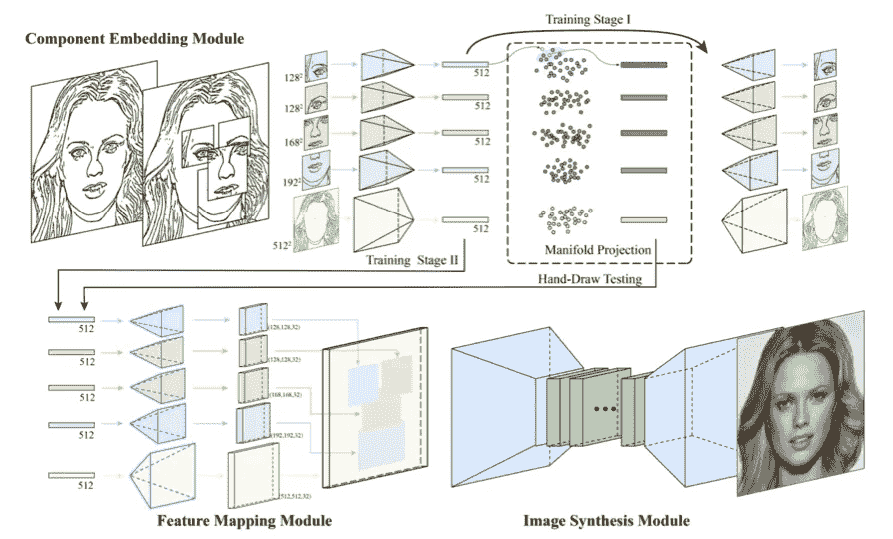
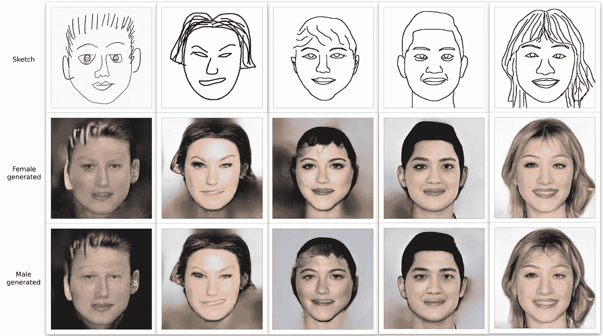
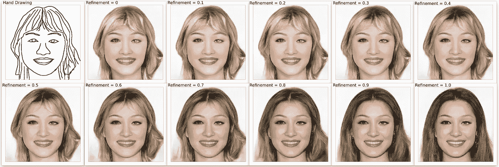

# 使用深度学习的草图中的真实人脸图像

> 原文：<https://towardsdatascience.com/realistic-face-images-from-sketches-using-deep-learning-700952c01c7b?source=collection_archive---------22----------------------->

## DeepFaceDrawing 的环境设置和模型实现快速指南



从模型生成的摘要图像。来自[深面绘制](http://www.geometrylearning.com/DeepFaceDrawing/)的草图

你有没有想过深度学习和人工智能的极限？8 年前， [AlexNet](https://en.wikipedia.org/wiki/AlexNet) 在 ImageNet 2012 挑战赛中取得了 15.3%的前 5 名误差，这在当时是不可思议的，这要归功于 [CNN](https://en.wikipedia.org/wiki/Convolutional_neural_network) 和 GPU 训练。3 年后的 2015 年， [ResNet-152](https://www.kaggle.com/pytorch/resnet152) 显示只有 3.57%的误差，比这项任务 5%的人为误差要好。同样在 2015 年， [DCGAN](https://arxiv.org/abs/1511.06434) 向世界展示了深度学习算法不仅可以对物体进行分类，还可以创造新的物体。2017 年末，Google 推出的[transformer architecture](https://arxiv.org/pdf/1706.03762.pdf)不仅带来了比 NLP 领域的 [LSTMs](https://en.wikipedia.org/wiki/Long_short-term_memory) 更快的训练和更好的结果，还通过带来注意力模块挑战了计算机视觉世界。

感谢所有为深度学习领域做出贡献的人，我们有越来越多以前想不到的应用，这就引出了今天的话题，从手绘草图生成逼真的人脸图像。首先，功劳归于[研究人员](http://www.geometrylearning.com/DeepFaceDrawing/)，感谢[开源代码](https://github.com/IGLICT/DeepFaceDrawing-Jittor)。我将简要介绍模型架构，然后我们将亲自动手在本地部署这个模型！

# 模型架构



来自[论文](http://www.geometrylearning.com/paper/DeepFaceDrawing.pdf)的架构

如上面的架构所示，该模型分为三个部分，即组件嵌入(CE)模块、特征映射(FM)模块和图像合成(is)模块。尺寸为 512×512 的手绘人脸图像的输入首先被分解成五个部分:“左眼”、“右眼”、“鼻子”、“嘴”和“余数”。“眼睛”、“鼻子”和“嘴”通过取大小为 128、168 和 192 的热窗分开，而“剩余部分”实际上是草图的剩余部分。然后使用 5 个具有 512 维潜在描述符的自动编码器对这五个分量进行特征编码。组件的特征向量被认为是底层组件流形的点样本，并通过使用 [K 最近邻](https://en.wikipedia.org/wiki/K-nearest_neighbors_algorithm)将其各个部分投影到相应的组件流形，用于细化手绘草图，如流形投影部分所示。

组件的单个特征向量被投影到流形上以增加它们的可信度。在 FM 模块中，作者没有将每个分量向量解码回图像，然后在分量级别上进行合成，而是选择将向量的草图融合到一个完整的面部，然后生成完整的图像，因为这有助于在局部细节和全局风格方面获得更一致的结果。给定组合的特征向量图，IS 模块使用条件 GAN 架构将它们转换成真实的人脸图像。他们还应用了两阶段训练方法，其中阶段 1 仅 CE 模块中的五个单独的自动编码器使用不同的组件草图进行训练。然后在阶段 2 中，固定阶段 1 中的参数，FM/IS 模块协同工作，通过训练 GAN 生成人脸图像。

# 履行

在此之前，**如果你只是在寻找一个用应用**快速测试绘图的话，一定要去看看[项目主页](http://www.geometrylearning.com/DeepFaceDrawing/)，在那里原作者创建了一个**基于 web 的** [**测试界面**](http://deepfacedrawing.geometrylearning.com/index_EN_621.html/) 。

开始这个博客的动机来自于我试图实现最初的 GitHub 库。由于 [Jittor](https://github.com/Jittor/jittor) 需要 Ubuntu > = 16.04，而大部分人都在用 MacOS/Windows，那么最简单的方法之一就是使用 Docker 从头开始搭建工作环境。

## 先决条件

*   系统:MacOS/Windows/Linux(任何支持 docker 的 OS)
*   RAM:最低 8 GB，运行模式将占用大约 6 GB
*   磁盘空间:最小 5 GB
*   GPU:没有都可以，除非你想做进一步的训练

## 1.下载 Docker

在你的操作系统中下载并安装 [Docker](https://docs.docker.com/get-docker/) 。

## 2.打开您的终端/CMD 或您选择的任何命令行界面

在这里，我们将为运行模型构建 docker 映像。首先创建一个 Dockerfile 文件，包含以下内容。

```
vim Dockerfile
```

然后构建 docker 映像并运行它。在 Dockerfile 的同一个目录中，

```
# Build the docker image called ubuntu_for_deepface
docker build -t ubuntu_for_deepface .# Start a container called ubuntu_env and memory limit of 8GB
docker run -it --name ubuntu_env --memory=8g ubuntu_for_deepface
```

**或者**，你可以拉我创建的预编译 docker 镜像，避免创建和编译 Dockerfile。

```
# Pull the docker image from Docker Hub
docker pull frank0124/drawing-to-face

# Start a container called ubuntu_env based on the pulled image
docker run -it --name ubuntu_env --memory=8g frank0124/drawing-to-face
```

您应该能够看到终端/CMD 提示符更改为

```
root@xxxxxxxxxxxx:/#
```

这意味着您在正在运行的 docker 容器中。Docker 一开始可能会很难处理，但如果你利用搜索引擎并通读一些[文档](https://docs.docker.com/engine/reference/run/)，你就能掌握它。

## 3.下载预先训练的重量

原来的[回购](https://github.com/IGLICT/DeepFaceDrawing-Jittor)已经在集装箱里了。在这里，我还通过从我的 GitHub 中删除不必要的特性，提供了一个简化版本的代码。在容器中，

```
git clone [https://github.com/franknb/Drawing-to-Face.git](https://github.com/franknb/Drawing-to-Face.git)
cd /Drawing-to-Face/Params# If you are using the original code, simply
cd /DeepFaceDrawing-Jittor/Params
```

然后下载预先训练的重量，

```
wget https://www.dropbox.com/s/5s5c4zuq6jy0cgc/Combine.zip
unzip Combine.zip && rm Combine.zip
wget https://www.dropbox.com/s/cs4895ci51h8xn3/AE_whole.zip
unzip AE_whole.zip && rm AE_whole.zip
cd ..
```

## 4.试运行并检查结果

```
cd /Drawing-to-Face
python3.7 example.py
```

在它运行之后，您应该期望在运行容器的 **/results** 目录中生成图像。很难看到结果*。jpg* 文件，这需要你在运行 docker 之前设置 X11 socket。这里我推荐简单的“复制粘贴”方法。

在您自己的操作系统上打开一个新的终端/CMD，

```
# This line of code copies the results folder to your current directory in your OS
docker cp ubuntu_env:/Drawing-to-Face/results ./
```

然后，您可以简单地转到运行终端/CMD 的当前目录，并找到粘贴的图像。

**或者**，如果运行的是原来的 *test_model.py* ，查看[本页](https://github.com/franknb/Drawing-to-Face)获取详细说明。

## 5.后续步骤

现在您知道了模型可以在您自己的环境中运行，是时候绘制和运行更多的测试了。

首先，您想要创建一些 512 乘 512 大小的草图 jpg 文件。你可以把它画在任何你想画的地方，在 iPad 上，甚至在纸上，然后给它拍照。然后确保它有正确的格式和大小，我推荐 Photoshop 来处理这个过程，以便于控制大小/格式。如果你还没有准备好自己制作人脸草图，也可以参考这个[测试界面](http://deepfacedrawing.geometrylearning.com/index_EN_621.html/)。它有一个基于阴影的画板，可以给你一些绘画的参考。把所有你想测试的图像放在一个名为 **test** 的目录/文件夹中。

现在，在 docker 中，您想要删除现有的测试图像以避免再次运行它们。

```
# In the running container
rm /Drawing-to-Face/test/*
```

最后，再次打开 terminal/CMD 并找到您创建的测试目录，其中包含您想要测试的映像。

```
# In your own OS
docker cp test ubuntu_env:/Drawing-to-Face/
```

你的下一步是什么？也许通读模型部分的代码以更好地理解它是如何工作的，或者构建一个利用该算法的应用程序。

# 模型性能



实际产出 1

让我们看看上面的一些模型输出。所有案例都是在所有优化参数都设置为 0.5 的情况下生成的，这是该模型的**秘方**以实现更好的图像生成。总共有 6 个参数(性别、眼睛 1、眼睛 2、鼻子、嘴和余数)可以为生成的一张图片设置。在我提供的 [example.py](https://github.com/franknb/Drawing-to-Face/blob/main/example.py) 中，我将所有细化参数设置为 0.5，性别设置为 0(男性)，而在原 [test_model.py](https://github.com/IGLICT/DeepFaceDrawing-Jittor/blob/master/test_model.py) 中，作者给出了 5 张测试图片 30 个参数的矩阵。

左边的第一张草图有一点卡通风格，特别是大眼睛，略高的眉毛和奇怪的鼻子。在生成的图像中，我们可以看到模特努力地把眼睛和眉毛放上去。对于头发、脸、嘴和耳朵，模型在使结果尽可能真实方面做了出色的工作。左起第二张草图也是如此，有夸张的眼睛/嘴巴形状，模型确实在草图和现实之间取得了平衡。

与前两张相比，左起的草图 3 到 5 更“现实”。我们也最终得到了更好(更真实)的生成图像，接近前面预告图像的质量。



实际产出 2

上面的模型输出是基于上面的第五张草图，其中性别设置为女性。我们对所有优化参数集进行了从 0 到 1 的完全转换。如[论文](http://www.geometrylearning.com/paper/DeepFaceDrawing.pdf)所述(求精参数= 1-置信度参数)，

> *𝑤𝑏𝑐 = 1(置信度参数)意味着充分利用输入草图进行图像合成，而通过设置𝑤𝑏𝑐 = 0，我们完全信任用于插值的数据。此混合功能对于创建与任何现有样本或其混合非常不同的面特别有用。*

我们可以看到，草图发型(带有刘海)无法从现有的样本或其混合中获得，但我们可以通过将参数设置为 0.5 左右来生成带有刘海的图像，介于忠实和真实之间，这使我们能够获得类似草图但真实的输出。

你可以在我的 [GitHub](https://github.com/franknb/Drawing-to-Face) 查看所有的源代码。