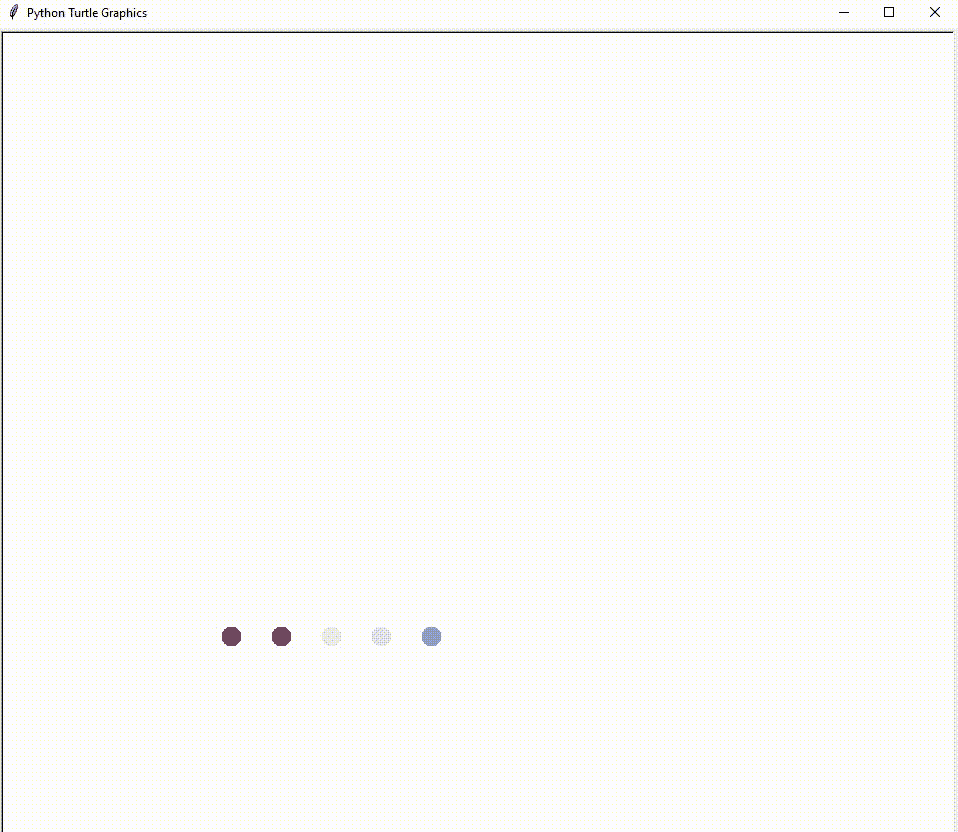

# 回顾 Python 基础知识，开始学习数据科学

> 原文：<https://towardsdatascience.com/recap-on-the-python-basics-to-get-started-for-data-science-ae2d3874a08f?source=collection_archive---------17----------------------->

## 66 天的数据

## 复习学过的东西，学习新的东西。


背景:基思·米斯纳在 [Unsplash](https://unsplash.com/s/photos/background?utm_source=unsplash&utm_medium=referral&utm_content=creditCopyText) 上拍摄的照片

> 经过长时间的学习，我们会对这些学科有更广泛的理解。复习我们过去学过的知识可能会给我们提供关于某一特定主题的新见解。

肯·吉的“[第 66 天的数据是什么](https://www.youtube.com/watch?v=qV_AlRwhI3I)”视频激励了我。该视频解释了由他发起的一项挑战，包括两部分:

1.  连续 66 天每天学习数据科学，哪怕只有 5 分钟。
2.  使用#66DaysOfData 在我们选择的社交媒体平台上分享我们的进展。

我决定在 2021 年 7 月 24 日开始我的旅程，并选择 Medium 作为我的分享平台。

在我 66 天数据之旅的第一天🎉，我决定写下我在阅读朋友推荐的一本书时得到的想法，“用 Python 掌握机器学习”。这本书解释了如何端到端地进行机器学习项目。这本书从基本的 Python 语法和一些用于机器学习的常用库开始，如 *Pandas* 、 *Numpy* 、 *Matplotlib、*和 *ScikitLearn* 。

这让我想起了我进机器学习第一个班的时候。我在上课前自学了 Python 基础，我以为我准备好了，但我错了。机器学习的编程实验室从一些基本的 Python 语法开始，直接跳到上面提到的公共库。我在学期开始时不知所措🤢。

幸运的是，事情没有那么困难，同学们都支持🥰.

好了，回忆够了，我们开始吧！

本文分享一些我自学 Python 基础时没有学到的东西，但这对我的数据科学学习之旅和我的工作非常有用(也很有趣)。

# 可变的

大多数时候，当我们开始学习一门编程语言时，我们是从变量赋值开始的。Python 中的变量赋值和其他编程语言中的一样。我们可以在 Python 中把*字符串*、*数字*(包括整数和浮点)、以及*布尔*赋值为变量。此外，我们可以在 Python 中将一个空值或者所谓的 *None* 赋值为变量。

```
string_variable = "Hello"
numerical_variable = 5 
boolean_variable = True
no_value_variable = None
```


背景:图片由[里尔](https://unsplash.com/@leladesign?utm_source=unsplash&utm_medium=referral&utm_content=creditCopyText)在 [Unsplash](https://unsplash.com/s/photos/orange?utm_source=unsplash&utm_medium=referral&utm_content=creditCopyText) 上拍摄

## a.字符串变量有趣的事实

我们可以编写下面的脚本，而不是编写一个 **for 循环**来打印一个短语 100 次。

```
print(“phrase\n” * 100)
```

`“\n”`表示新的一行，因此，脚本每次都会在新的一行中打印单词“短语”。

## b.f 弦

用字符串打印变量的方法很少，但是 **f-string** 是最有效的方法。

```
name = "Janelle"
years = 10
print(f"My name is {name}, I have been working in this company for {years} years")
# output: My name is Janelle, I have been working in this company for 10 years
```

是的，通过在括号后添加一个`**f**`并用一个**花括号**将变量名称括起来，我们可以很容易地在一长串字符串中打印多个变量。与使用`+`符号连接字符串和变量，或者使用[字符串格式化操作](https://docs.python.org/2/library/stdtypes.html#string-formatting-operations) **相比，代码将更容易阅读。**

## c.多重赋值

通常我们一次给一个变量赋值，但有时多次赋值也很方便。

```
a,b = 3,5
print(f"a: {a}; b: {b}")
# output:a: 3; b: 5
```

比如刷变量也是一种多赋值的类型。

## d.滑动两个变量

```
a,b = b,a
print(f"a: {a}; b: {b}")
# output: a: 5; b: 3
```

在 Python 中，我们可以直接取两个变量的值，而不是声明一个新变量作为其中一个变量的值的临时存储。

# 数据结构

Python 的常见数据结构是列表、元组和字典。

```
a_list = ["Tom", 26, "Anywhere"]
a_tuple = (25, 7)
a_dictionary = {"name": "Tom", "age": 26, "home": "Anywhere"}
```

在数据科学中，经常使用的数据结构包括 DataFrame 和 NumPy 数组。一个数据科学项目通常使用几个库来完成不同的任务。例如，数据预处理和数据可视化，不同的库并不总是使用相同的数据结构进行输入。为了有效地使用不同的库，我们还应该知道如何将一种数据结构转换成另一种。


背景:图片由 [Lea L](https://unsplash.com/@leladesign?utm_source=unsplash&utm_medium=referral&utm_content=creditCopyText) 在 [Unsplash](https://unsplash.com/s/photos/orange?utm_source=unsplash&utm_medium=referral&utm_content=creditCopyText) 上拍摄

## 数字阵列

NumPy 是一个 Python 库，用于处理数组。NumPy 数组类似于链表，除了它存储在内存中一个连续的位置**。因此，Numpy 数组的处理速度比列表快[2]。**

```
import numpy

lists = [1, 2, 3, 4, 5]
lists = [x + 5 for x in lists]
print(lists)
# output: [6, 7, 8, 9, 10]arrays = numpy.array([1, 2, 3, 4, 5])
arrays += 5
print(arrays)
# output: [ 6  7  8  9 10]
```

NumPy 数组和列表都可以用作数学运算的输入。

## 熊猫数据框

DataFrame 是一个多维数组，其中的列和行可以标记为[1]。换句话说，DataFrame 类似于 Excel 表格。


Excel 表格。图片来自作者。

## 将一种数据结构转换成另一种数据结构

更好地理解数据帧，以及如何从列表和数组创建数据帧。

下图解释了上面脚本的输出。


图片作者。

# 流控制

流控制指的是 While 循环、For 循环和 If-Then-Else。

```
time_now = 0
while time_now <= 8:
    print("Continue to work")
    time_now += 1For x in range(n):
    print(x)age = 23
if age < 21:
    print("You cannot drive as you under the legal age to own a license.")
elif age >= 21:
    print("You can drive.")
```

**While 循环:**继续执行动作，直到条件不成立。

**循环:**重复任务 *n 次*。

**If-Then-Else:** 如果条件满足，则执行动作


背景:图片由 [Lea L](https://unsplash.com/@leladesign?utm_source=unsplash&utm_medium=referral&utm_content=creditCopyText) 在 [Unsplash](https://unsplash.com/s/photos/orange?utm_source=unsplash&utm_medium=referral&utm_content=creditCopyText) 上拍摄

```
def adult(age):
    return age >= 21

age = 23
if adult(age):
    print("You can drive.")
else:
    print("You cannot drive as you under legal age to own a license.")
```

这样，我们可能需要编写更多的代码行，但这使得代码更具可读性。对我来说，在为大型项目编码时，我觉得这是一个很好的实践(在这种情况下，我往往会忘记数字代表什么)。

# 功能

在 Python 基础知识中，我们学习了如何声明一个新函数以及如何使用内置函数，比如 print()。随着学习的进行，可能会出现新的术语，如递归和 method。


背景:图片由 [Lea L](https://unsplash.com/@leladesign?utm_source=unsplash&utm_medium=referral&utm_content=creditCopyText) 在 [Unsplash](https://unsplash.com/s/photos/orange?utm_source=unsplash&utm_medium=referral&utm_content=creditCopyText) 上拍摄

## a.递归

引用函数的递归函数在函数本身内部被调用，**在一定条件下**。如果没有设置适当的条件，可能会意外地创建一个无限循环。

```
# Recursive function
def recursive_factorial(n):
    if n == 1:
        return n
    else:
        return n * recursive_factorial(n - 1)

# user input
num = 6

# check if the input is valid or not
if num < 0:
    print("Invalid input ! Please enter a positive number.")
elif num == 0:
    print("Factorial of number 0 is 1")
else:
    print("Factorial of number", num, "=", recursive_factorial(num))# output: Factorial of number 6 = 720
```

Python 中[递归的完整解释。](https://www.geeksforgeeks.org/recursion-in-python/)

## b.方法

方法与函数相同，它执行一项任务。当一个函数被附加到一个类上时，它就被称为方法。

可以将类定义为创建新对象的蓝图，这些对象具有相同的变量(如果附加到类，则称为特性)，并且可以执行某些方法(当函数附加到类或在类中定义时，该函数称为方法)。

你注意到了吗，我总是在 Class 的第一个字母上用大写字母，这是因为我们是这样命名一个类的。类名总是以大写字母开头[3]。

Python 中的类的一个典型例子是学生标记集合。在下面的例子中，在输入被收集后，学生的名字和标记将被打印在屏幕上。

输出如下图所示。


图片作者。

通过创建一个`Student Class`，我们可以省去使用`print()`函数逐个打印学生姓名和分数的工作。相反，我们可以使用在`Student Class`中声明的方法。

在下图的下拉列表中，有

1.f' *(代表特性)*在名称和标记之前—在学生类中创建的变量

2.m' *(代表方法)*在 print_result()之前—在学生类中定义的函数


如果有效地使用它，这个类可以使我们的工作更容易。

这是 Python 语法的基础。

要开始数据科学之路，我们需要更进一步。就像 web 开发人员至少应该了解 Flask 或 Django 库一样，数据科学家应该了解:

1.  熊猫 —加载和处理结构数据
2.  [Numpy](https://numpy.org/doc/stable/) —数字数据的更快计算
3.  [Matplotlib](https://matplotlib.org/) —创建静态、动画和交互式可视化
4.  [ScikitLearn](https://scikit-learn.org/stable/index.html) —机器学习，数据预处理和评估

以上是我们开始数据科学之旅需要了解的基础知识。成为一名数据科学家需要学习的东西还很多。请记住，科学家可以永不停止学习。

有多个库可用于执行一项任务。总是有更新更好的库来完成任务。作为科学家，我们应该始终跟踪技术的更新，并学会最有效和最准确地解决问题。

> 使用 Python 总会有一些乐趣！

学习很有趣！这是我周末用 Python 做的一个有趣的项目，用 Python 库、`colorgram.py`和`turtle`重现了达明安·赫斯特的点画。一个简单而有趣的项目。

*鸣谢:这个项目的灵感来自于 Angela Yu 博士的 100 天代码课程。*



用 Python 海龟库创建的点画。作者 GIF。

剧本如下。

如果你还没试过，也自己试试吧😄

# 边注

[Python 中的文本处理](/text-processing-in-python-29e86ea4114c) —在本文的最后，我分享了如何针对不同的目的，将输出的当前数据结构更改为所需的数据结构。

# 保持联系

订阅 [YouTube](https://www.youtube.com/channel/UCiMtx0qbILP41Ot-pkk6eJw)

# 参考

[1]Jason Brownlee 的《掌握 Python 的机器学习》

[2][W3School 对 Numpy 的介绍](https://www.w3schools.com/python/numpy/numpy_intro.asp)

[3] 100 天的代码课程，由 Angela Yu 博士主讲

*祝贺并感谢你阅读到最后。希望你喜欢这篇文章。*😊


照片由[安](https://unsplash.com/@ann10?utm_source=unsplash&utm_medium=referral&utm_content=creditCopyText)在 [Unsplash](https://unsplash.com/s/photos/grateful?utm_source=unsplash&utm_medium=referral&utm_content=creditCopyText) 上拍摄