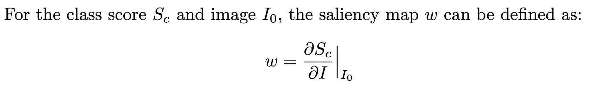
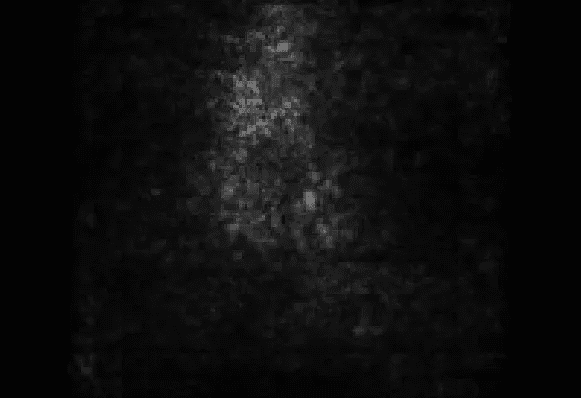
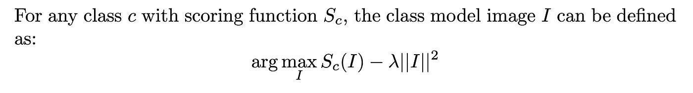
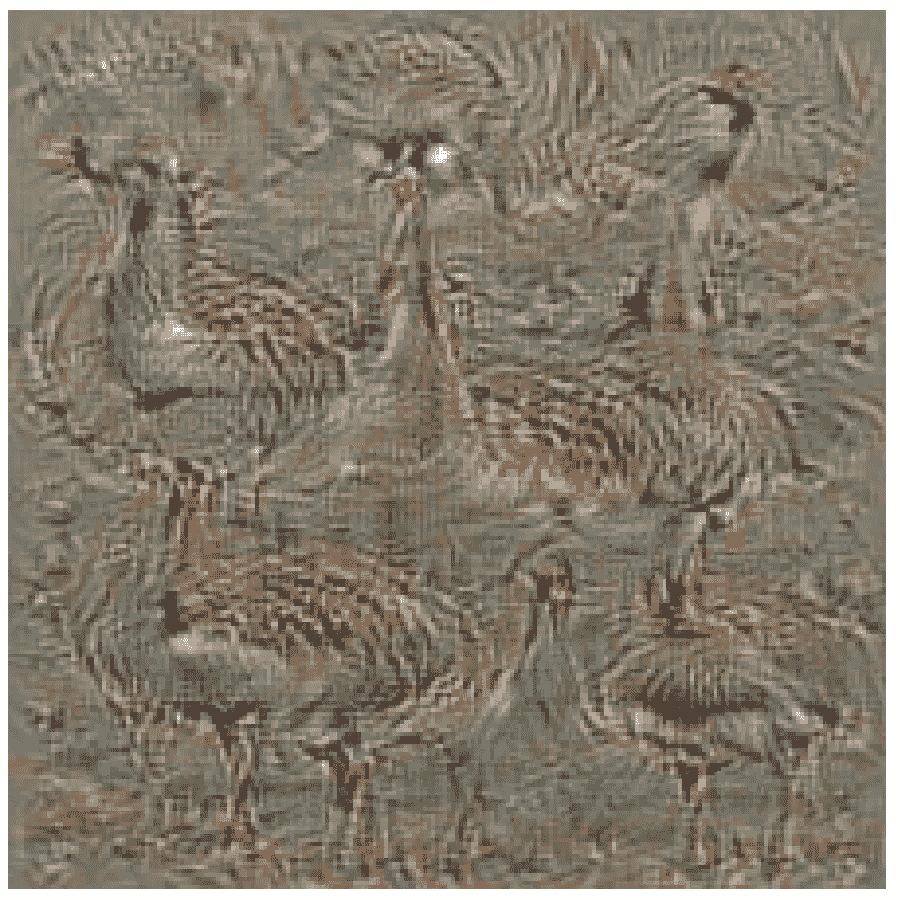
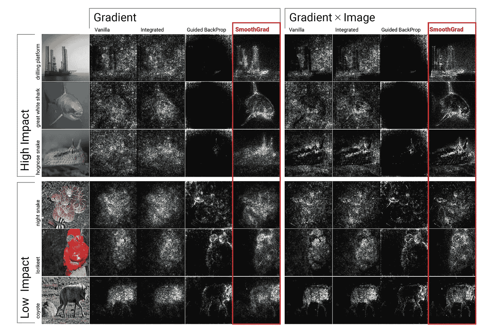
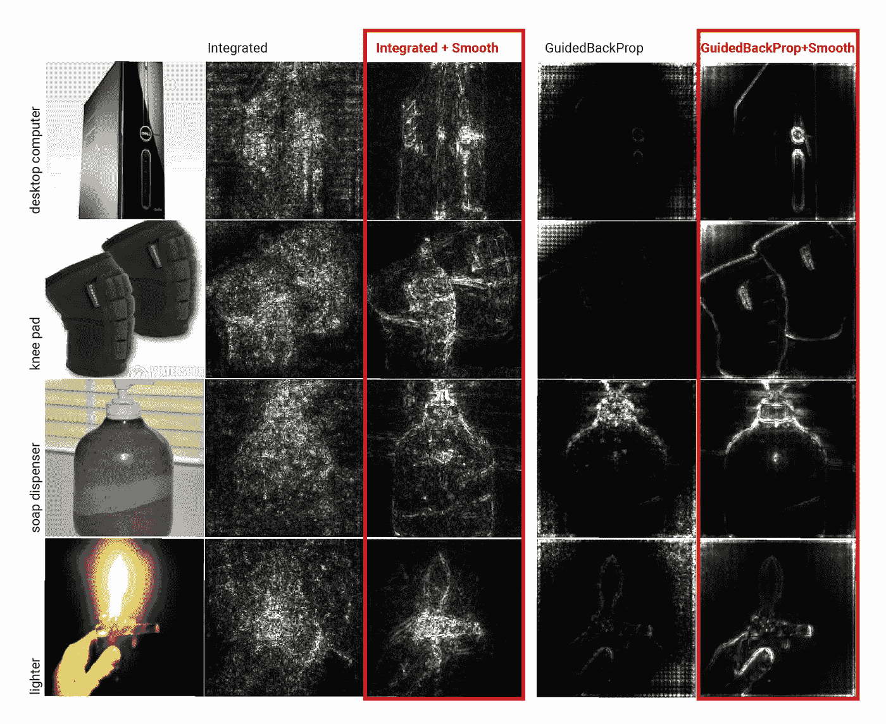

# 可解释的神经网络:最新进展，第 1 部分

> 原文：<https://towardsdatascience.com/recent-advancements-in-explainable-neural-networks-2cd06b5d2016?source=collection_archive---------25----------------------->

## 回顾十年(2010–2020)，四集系列

# **神经网络的兴起**

神经网络已经超越了许多其他机器学习模型，如 SVM，adaboost，梯度提升树等。在各种任务中，如图像识别、视觉问答、句子完成等。，在许多机器学习问题上确立了自己的新地位。多年来的多项研究已经证明了神经网络在学习数据中隐含模式的有效性。但是，对于神经网络究竟学习什么以及它如何做出决策，很大程度上是未知的，有时甚至是神秘的。

# **交代**

图像对人类来说很容易理解。例如，人类可以容易地指出图像中感兴趣的对象，区分背景和前景，并列出图像中感兴趣的不同对象。

另一方面，机器学习模型只将图像视为像素值的矩形阵列，没有形状和色调的内在表示。尽管存在这种限制，但当神经网络在大量标记图像上训练时，是什么使它们如此擅长识别图像？

# 这个博客是关于什么的？

在 2010 年至 2020 年的十年中，随着寻找性能更好、更容易训练的深度神经网络的发展，越来越多的研究人员也对深入了解神经网络学习什么以及如何做出决策感兴趣。

这篇博客聚焦于后面的工作，突出了在理解和解释神经网络所做的决定方面的重要进展，特别是关于图像理解。我们按照大致的时间顺序描述了这个领域的发展，展示了这些年来思想的流动。

我们将我们的演讲分为四个博客系列:

*   [第一部分](https://groshanlal.medium.com/recent-advancements-in-explainable-neural-networks-2cd06b5d2016)讲述了**图像像素的可视化梯度**对于解释 CNN 的 pre-softmax 类得分的有效性。
*   [第 2 部分](https://groshanlal.medium.com/explainable-neural-networks-recent-advancements-part-2-8cce67833ba)讲述了一些更先进的/改进的基于梯度的方法，如**解卷积**、**导向反向传播**用于解释 CNN。
*   [第 3 部分](https://groshanlal.medium.com/explainable-neural-networks-recent-advancements-part-3-6a838d15f2fb)讲述了基于梯度的方法的一些缺点，并讨论了替代的公理化方法，如**逐层相关性传播**、**泰勒分解**、**深度提升。**
*   [第 4 部分](https://groshanlal.medium.com/explainable-neural-networks-recent-advancements-part-4-73cacc910fef)讲述了一些最近的发展，如**集成渐变**(上接第 3 部分)以及 CNN 架构中最近的创新，如**类激活地图**，开发这些地图是为了使特征地图更易理解。

# 基于梯度的方法

给定一个类的模型评分函数，哪个输入对评分影响最大？这个问题的一个自然答案是分数相对于每个输入的梯度。梯度越高，分数对相应输入像素的变化越敏感。

## **可视化渐变(2014)**

一般来说，我们是否可以使用与图像的单个像素相关的类激活分数(pre-softmax)的梯度来了解哪些像素在决策中起着最重要的作用？

这个问题最早是由卡伦·西蒙扬、安德里亚·韦达尔迪和安德鲁·齐塞曼在他们的工作“ [**卷积网络深处:可视化图像分类模型和显著图，(ICLR 2014)**](https://arxiv.org/pdf/1312.6034.pdf) ”中研究的。从那以后，大多数关于可解释神经网络的工作都采用了某种形式的梯度或定义类似梯度的候选项，这些候选项可以向下反向传播到输入端，以便理解网络的决策。

作者在他们的工作中提出了两个重要的问题:

**1。显著图**:给定一幅图像，图像中的哪些像素对帮助网络做出决定最重要？

对于第一个问题，作者提出，可视化关于图像像素的类激活分数(pre-softmax)的梯度:

显著图，来源:[https://arxiv.org/pdf/1312.6034.pdf](https://arxiv.org/pdf/1312.6034.pdf)

猴子图像的显著图，来源:[https://arxiv.org/pdf/1312.6034.pdf](https://arxiv.org/pdf/1312.6034.pdf)

**2。类别模型**:根据神经网络，典型的“狗”或“猫”或任何此类目标图像类别看起来像什么？对于第二个问题，作者建议，寻找最佳图像，限制其亮度，这将最大化类得分:

班级模型，来源:【https://arxiv.org/pdf/1312.6034.pdf 

班鹅的班模，来源:【https://arxiv.org/pdf/1312.6034.pdf 

## **SmoothGRAD (2017)**

回到 Simonyan 等人关于可视化梯度的想法，人们经常观察到梯度可视化经常是有噪声的。Daniel Smilkov，Nikhil Thorat，Been Kim，Fernanda Viegas 和 Martin Wattenberg 在他们的工作“ [**SmoothGrad:通过添加噪声去除噪声(ICML 2017)**](https://arxiv.org/abs/1706.03825) ”中建议了一些简单的技巧来更好地实现梯度可视化。以下是他们的一些建议:

*   向输入图像添加一个小的高斯噪声，并从该分布中采样多个图像。计算梯度后，平均梯度。这清除了梯度可视化中的噪声，仅突出显示了在所有采样图像中已经被激活的重要像素。
*   图像识别任务在颜色和光照变化下是不变的。例如，考虑白色背景中的黑色球与黑色背景中的白色球。在这种情况下，可视化梯度的绝对值通常就足够了。一个明显的例外是 MNIST 数字识别，所有的图像都是白色背景下的黑色。在这种情况下，梯度的符号变得更加重要。
*   通过多项研究已经发现，梯度图通常具有一些具有非常高的梯度值的像素。盖住它们可以改善视觉效果。
*   有时，将图像与渐变相乘可以提供更清晰的视觉效果。但这有时会产生不良影响，使较暗的像素看起来没有原始渐变显示的像素重要。
*   所有上述即兴创作也可用于任何基于梯度的方法，如引导反向传播(在[第 2 部分](https://groshanlal.medium.com/explainable-neural-networks-recent-advancements-part-2-8cce67833ba)中描述)。

以下是作者提供的一些结果:

制导反投影 Vs SmoothGRAD，来源:[https://arxiv.org/pdf/1706.03825.pdf](https://arxiv.org/pdf/1706.03825.pdf)

使用 SmoothGRAD 进行引导后投影，来源:[https://arxiv.org/pdf/1706.03825.pdf](https://arxiv.org/pdf/1706.03825.pdf)

作者指出，当图像在恒定背景下时，SmoothGRAD 优于引导反向传播，而当图像具有纹理背景时，引导反向传播表现更好。此外，平滑方法在与引导反向传播一起使用时增强了结果可视化。

# 接下来是什么？

继续基于梯度的方法，研究人员开发了更先进的方法，如**去卷积**和**引导反向传播**。这些方法改进了“香草”梯度反向传播，以提供更清晰的可视化。我们将在下一部分讨论这些很酷的技术。

要阅读更多关于神经网络可解释性的激动人心的作品，你可以点击这里阅读下一部分: [**链接到第二部分**](https://groshanlal.medium.com/explainable-neural-networks-recent-advancements-part-2-8cce67833ba)